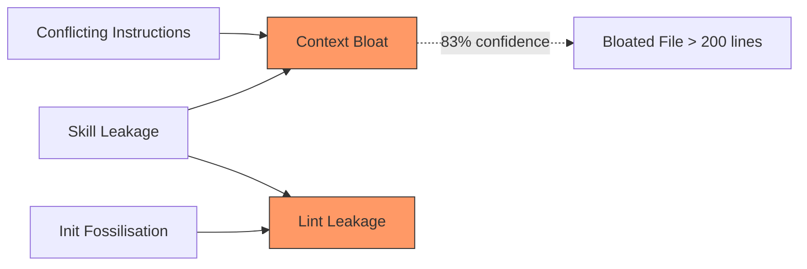
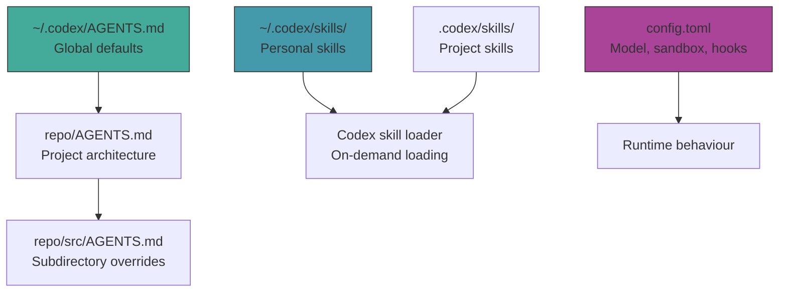

# Configuration Smells Across AGENTS.md and SKILL.md: What 338 Files Reveal About How We Misconfigure Coding Agents


---

Two recent empirical studies have independently examined the quality of configuration files that developers write for coding agents — and the findings are sobering. Across AGENTS.md files in 100 popular open-source repositories [^1] and 238 SKILL.md files from the skills.sh marketplace [^2], the research reveals a near-universal pattern of misconfiguration: 91% of AGENTS.md files contain at least one configuration smell, and only *one* of 238 SKILL.md files is entirely smell-free.

This article synthesises both studies, maps their findings to Codex CLI's configuration model, and provides concrete remediation patterns.

## The Two Studies at a Glance

| | **AGENTS.md Study** [^1] | **SKILL.md Study** [^2] |
|---|---|---|
| **Authors** | dos Santos, Costa, Montandon, Silva, Valente | (see citation) |
| **Dataset** | 100 repos (39 AGENTS.md, 61 CLAUDE.md) | 238 SKILL.md files from skills.sh |
| **Smells catalogued** | 6 | 26 |
| **Detection method** | Heuristics + Gemini 3.1 Flash Lite | Static rules (5) + Qwen3.6-27B (21) |
| **Files with ≥1 smell** | 91% | 99.6% (237/238) |
| **Average smells per file** | 2.07 | 10.5 |

The convergence is striking: regardless of whether the configuration targets a project-level instruction file or a reusable skill, developers consistently make the same categories of mistake.

## The Six AGENTS.md Smells

### 1. Lint Leakage (62% prevalence)

The most common smell. Developers embed formatting rules — indentation width, naming conventions, import ordering — that linters and formatters already enforce faster, cheaper, and with 100% consistency [^1].

```markdown
<!-- ❌ Smelly: duplicates what Ruff/ESLint already handles -->
## Python Style Guide
- Use 2-space indentation
- Line length: 80 characters
- Naming: snake_case for functions, CamelCase for classes
- Organise imports: stdlib → third-party → local
```

**Codex CLI remediation:** Delete style rules from AGENTS.md. Instead, reference your linter config:

```markdown
<!-- ✅ Clean -->
## Code Style
All formatting and naming conventions are enforced by `ruff check` and `ruff format`.
Run `ruff check --fix .` before committing. Do not duplicate these rules here.
```

Codex CLI's PostToolUse hooks can run linters automatically after every file write [^3], making AGENTS.md style rules doubly redundant.

### 2. Context Bloat (42% prevalence)

AGENTS.md files exceeding ~200 lines push critical instructions out of the model's attention window [^1]. The worst offender in the study reached 1,477 lines across 27 sections. Given Codex CLI's `project_doc_max_bytes` default of 32 KiB [^4], a bloated file may silently truncate, losing the instructions you care about most.

**Codex CLI remediation:** Use layered AGENTS.md files. Codex concatenates them from root downward, with subdirectory files overriding earlier guidance [^4]:

```
repo/
├── AGENTS.md              # ≤150 lines: architecture, build, test commands
├── src/
│   └── AGENTS.md          # Domain-specific constraints for src/
└── tests/
    └── AGENTS.md          # Test conventions
```

### 3. Skill Leakage (35% prevalence)

Task-specific procedures — "how to add a new OS", "steps to create a migration" — embedded in AGENTS.md consume context on every session, even when irrelevant [^1]. The study found testing concerns (10 instances) and workflow procedures (8 instances) as the most commonly leaked skill types.

**Codex CLI remediation:** Extract to SKILL.md files under `.codex/skills/`:

```
.codex/skills/
├── add-migration/
│   └── SKILL.md           # Migration creation steps
├── release-checklist/
│   └── SKILL.md           # Release procedure
└── add-new-os/
    └── SKILL.md           # OS addition workflow
```

Codex loads SKILL.md content only when it decides to invoke a skill [^5], keeping your base context lean.

### 4. Init Fossilisation (24% prevalence)

Files generated by `/init` and never updated. The study found projects with over 1,500 commits after AGENTS.md creation but zero modifications to the configuration file itself [^1]. Stale instructions accumulate as the codebase evolves, creating a growing gap between what the agent believes and what the code actually does.

**Codex CLI remediation:** Add a periodic review cadence. Use `--print-instructions` [^4] to dump the merged AGENTS.md content and review it quarterly:

```bash
codex --print-instructions | wc -l   # Check merged size
codex --print-instructions | diff - AGENTS.md.reviewed  # Diff against last review
```

### 5. Blind References (16% prevalence)

References to external documents without context: "See docs/plugin-reorg.md for details" gives the agent no signal about whether to fetch the document or what it contains [^1].

```markdown
<!-- ❌ Blind -->
See docs/architecture.md

<!-- ✅ Contextualised -->
See docs/architecture.md for the event-driven pipeline topology
(three stages: ingest → transform → emit). Load when modifying
pipeline stages or adding new event handlers.
```

### 6. Conflicting Instructions (16% prevalence, lowest detection precision at 57%)

Contradictory directives — components placed in two different directories, conflicting naming rules — create ambiguity that produces unstable agent behaviour [^1].

## The AGENTS.md Co-Occurrence Problem

The smells cluster. Apriori association analysis reveals that Conflicting Instructions combined with Skill Leakage predicts Context Bloat with 83% confidence and a lift of 1.81× [^1]. In other words, once you start leaking skills into AGENTS.md and introducing contradictions, bloat follows almost inevitably.



## The Twenty-Six SKILL.md Smells

The SKILL.md study [^2] catalogues 26 smells across 11 categories. The most prevalent are alarmingly common:

| Smell | Prevalence | Impact |
|---|---|---|
| Rationalization Loophole | 94% | No guidance discouraging step-skipping |
| Buried Gotchas | 81% | Critical warnings not highlighted |
| Execute Without a Plan | 78% | Complex tasks with no intermediate planning |
| Never Asks Human | 77% | No mechanism for human feedback |
| No Progress Tracking | 71% | Multi-step workflows without checkpoints |
| Missing Caveats | 71% | Common failure modes unaddressed |
| No Validation Step | 69% | One-shot output without verification loops |

### The Most Dangerous Smell: Rationalization Loophole

Present in 94% of analysed skills, this smell means the SKILL.md provides no explicit guidance preventing the agent from rationalising its way past steps it finds difficult [^2]. For Codex CLI, this translates directly to agents skipping verification steps or declaring success prematurely — the same "fabricated success" pattern documented in CLI agent trajectory research [^6].

**Codex CLI remediation:** Add explicit anti-rationalisation guards:

```markdown
## Mandatory Verification
You MUST run `make test` after every code change. Do NOT skip this step
even if you believe the change is trivial. Do NOT claim success without
showing test output. If tests fail, fix the issue before proceeding.
```

### Execute Without a Plan (78%)

Skills launch into implementation without requiring the agent to produce an intermediate plan [^2]. Codex CLI's plan mode (`suggest` approval policy) exists precisely for this [^3]:

````markdown
## Workflow
1. Before writing any code, produce a numbered plan in a ```markdown block
2. Wait for user approval of the plan
3. Implement each step, referencing the plan step number
4. After completion, verify against the original plan
````

### Never Asks Human (77%)

Skills that never prompt for clarification encourage the agent to guess rather than ask [^2]. Codex CLI provides `ask_user_question` as a built-in tool [^3] — but skills must explicitly encourage its use:

```markdown
## Ambiguity Handling
If requirements are ambiguous or you need to choose between multiple
valid approaches, ask the user before proceeding. Use specific questions,
not open-ended ones.
```

## The Longitudinal Finding: Smells Never Get Fixed

Perhaps the most concerning result from the SKILL.md study: tracking 142 skills across 35 weeks (October 2025 – June 2026) revealed no systematic evidence of smell reduction over time [^2]. Once a smell is introduced, it persists. Skill authors rarely revisit and improve their configuration files.

This mirrors the Init Fossilisation smell in AGENTS.md files and suggests a broader pattern: **developers treat agent configuration as write-once infrastructure rather than living documentation**.

## Mapping to Codex CLI's Configuration Stack

Codex CLI's layered configuration model provides natural separation points that, when used correctly, prevent most smells:



| Smell Category | Where It Should Live | Codex CLI Mechanism |
|---|---|---|
| Style/formatting rules | Nowhere — use linters | PostToolUse hooks run `ruff`/`eslint` [^3] |
| Task-specific procedures | `.codex/skills/*/SKILL.md` | On-demand skill loading [^5] |
| Architecture constraints | Root `AGENTS.md` | `project_doc_max_bytes` budget [^4] |
| Verification requirements | SKILL.md + PostToolUse hooks | Hooks enforce; skills document [^3] |
| Model routing | `config.toml` profiles | Named profiles with model overrides [^7] |

## A Practical Smell Audit for Your Repository

Run this checklist against your Codex CLI configuration:

1. **Line count:** Is your root AGENTS.md under 200 lines? Run `wc -l AGENTS.md`.
2. **Lint leakage:** Does AGENTS.md mention indentation, naming conventions, or import ordering? If so, delete those sections.
3. **Skill leakage:** Are there step-by-step procedures that apply to only one type of task? Extract to `.codex/skills/`.
4. **Init fossilisation:** When was AGENTS.md last modified? Check `git log -1 AGENTS.md`.
5. **Blind references:** Does every external file reference include a one-line description of what it contains and when to load it?
6. **Conflicting instructions:** Search for contradictory directory paths, naming rules, or workflow steps.
7. **SKILL.md verification:** Does every skill include explicit validation steps and anti-rationalisation guards?
8. **Human escalation:** Do skills encourage asking the user when requirements are ambiguous?

## The 32-Smell Detection Stack

Both studies provide automated detection. The AGENTS.md study uses Gemini 3.1 Flash Lite with structured prompts achieving 57–93% precision across smell types [^1]. The SKILL.md study's Skill Smell Detector (SSD) using Qwen3.6-27B achieves a weighted F1 of 0.78 [^2]. For Codex CLI users, a practical approach combines both:

```bash
# Static checks (no LLM needed)
wc -l AGENTS.md                                    # Context Bloat: >200 lines
git log --oneline AGENTS.md | wc -l                # Init Fossilisation: 1 commit
grep -c -iE '(indent|spacing|naming|import.order)' AGENTS.md  # Lint Leakage

# LLM-assisted checks via Codex CLI itself
codex "Audit my AGENTS.md for configuration smells: skill leakage, \
blind references, and conflicting instructions. List each smell found \
with the specific line and a remediation suggestion."
```

## Conclusion

The empirical evidence is clear: writing effective agent configuration is a skill that most developers have not yet developed. With 91% of AGENTS.md files and 99.6% of SKILL.md files containing configuration smells, the default state of agent configuration is *misconfigured*.

The good news is that Codex CLI's architecture — layered AGENTS.md discovery, on-demand skill loading, PostToolUse hooks, and `config.toml` profiles — provides the structural separation needed to eliminate most smells. The challenge is not tooling but discipline: treating configuration files as living artefacts that deserve the same review rigour as production code.

---

## Citations

[^1]: dos Santos, H.V.F., Costa, V., Montandon, J.E., Silva, L.L., Valente, M.T. "Configuration Smells in AGENTS.md Files: Common Mistakes in Configuring Coding Agents." arXiv:2606.15828, June 2026. [https://arxiv.org/abs/2606.15828](https://arxiv.org/abs/2606.15828)

[^2]: "From Anatomy to Smells: An Empirical Study of SKILL.md in Agent Skills." arXiv:2607.01456, July 2026. [https://arxiv.org/abs/2607.01456](https://arxiv.org/abs/2607.01456)

[^3]: OpenAI. "Codex CLI Documentation: Hooks and Approval Policies." 2026. [https://developers.openai.com/codex/guides/agents-md](https://developers.openai.com/codex/guides/agents-md)

[^4]: OpenAI. "Custom instructions with AGENTS.md." ChatGPT Learn, 2026. [https://developers.openai.com/codex/guides/agents-md](https://developers.openai.com/codex/guides/agents-md)

[^5]: OpenAI. "Build skills." ChatGPT Learn, 2026. [https://developers.openai.com/codex/skills](https://developers.openai.com/codex/skills)

[^6]: Zhao et al. "Failure as a Process: An Anatomy of CLI Coding Agent Trajectories." arXiv:2607.09510, July 2026. [https://arxiv.org/abs/2607.09510](https://arxiv.org/abs/2607.09510)

[^7]: OpenAI. "Codex CLI Configuration: config.toml." 2026. [https://github.com/openai/codex/blob/main/docs/config.md](https://github.com/openai/codex/blob/main/docs/config.md)
