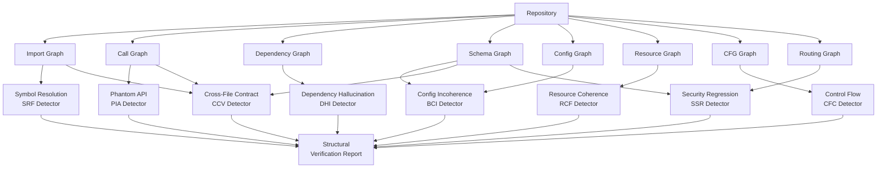

# The Patchwork Problem: Why LLM-Generated Code Compiles, Passes Tests, and Still Breaks — and How to Wire Structural Verification into Codex CLI


---

Your agent writes a FastAPI endpoint. It compiles. The tests pass. mypy is happy. Three days later, production crashes because the endpoint references a Pydantic model field that does not exist anywhere in the repository. Mothukuri and Parizi call this the **patchwork problem**: code that is locally correct but globally incoherent[^1]. Their July 2026 study formalises the failure class, builds an eight-category taxonomy, and demonstrates that **97 per cent of these structural failures evade type checking, test suites, and SAST entirely**[^1].

This article unpacks the taxonomy, maps each failure category to Codex CLI's verification stack, and shows how to wire graph-based structural checks into your workflow using PostToolUse hooks, AGENTS.md constraints, and CI gates with `codex exec`.

## The Taxonomy: Eight Ways Code Stitches Itself Together Badly

The researchers analysed 336 code generations across GPT-4o and Claude 3.5 Sonnet, spanning ten production repositories in Python (Django, FastAPI) and TypeScript (Express, Next.js)[^1]. They identified eight categories of structural failure, each defined as a violation of consistency invariants at repository scale, verifiable via static graph analysis without execution:

| Category | Code | Description | Baseline Detection |
|----------|------|-------------|-------------------|
| Symbol Resolution Failures | SRF | Referenced names unresolvable in module graphs | 0/2 |
| Phantom Internal API | PIA | Internal function calls with incorrect signatures | 0/3 |
| Dependency Hallucination | DHI | Imports referencing packages absent from manifests | 0/3 |
| Build/Configuration Incoherence | BCI | Code assumes configurations inconsistent with repo state | 0/12 |
| Resource Coherence Failures | RCF | Code fails to provide declared resources (schemas, return types) | 2/29 |
| Control Flow Coherence | CFC | CFG anomalies: unreachable blocks, dead code | N/A |
| Cross-File Contract Violations | CCV | Producer and consumer modules with interface mismatches | 0/18 |
| Security Structural Regressions | SSR | Application wiring violates security contracts across routes | N/A |

The total finding count across the evaluation: **67 structural failures, of which 65 evaded every baseline tool**[^1]. Only two Resource Coherence findings (return-type violations) were independently caught by type checkers.

## Why Standard CI Pipelines Miss These

The paper's core provocation is that the tools most teams rely on — `mypy --strict`, `tsc --strict`, pytest, ESLint, Bandit, Semgrep — are individually sound but collectively blind to cross-cutting invariants[^1]. Consider the most common failure categories:

**Configuration Incoherence (BCI):** The agent writes code accessing `NEXT_PUBLIC_SUPABASE_URL` via `process.env`, but no `.env` file, Docker Compose service, or configuration manifest declares that variable[^1]. No type checker flags this. No test catches it unless you happen to have an integration test that exercises that exact code path with a missing variable.

**Dependency Hallucination (DHI):** The agent imports `@vercel/analytics/next` — a plausible package name — but it never appears in `package.json`[^1]. The project installs fine (the import is never resolved at install time in many bundler configurations), and unit tests that mock the module pass.

**Cross-File Contract Violations (CCV):** Module A exports a function returning `{ status: string, data: T }`. Module B imports it and destructures `{ code, payload }`. Both files individually type-check if they each have their own type annotations[^1]. The mismatch only surfaces at runtime.

The key insight: **the failure is not in any single file but in the graph of relationships between files**. Existing tools analyse files or, at best, project-wide types. They do not enforce configuration-to-code, manifest-to-import, or schema-to-consumer invariants.

## Model Divergence: Different Models, Different Failure Profiles

A striking result: failure patterns are statistically independent between models (χ² = 25.1, p = 2.73 × 10⁻⁷)[^1]. GPT-4o produced all 18 Cross-File Contract Violations and all import-related failures. Claude 3.5 Sonnet produced 22 of 29 Resource Coherence Failures[^1]. Switching models does not reduce risk — it changes risk shape.

For Codex CLI users who route between models via `config.toml` profiles (say, Luna for investigation, Terra for implementation), this is a practical concern. Your verification strategy cannot assume a single failure distribution.

## Task Complexity Is the Multiplier

Failure incidence scales sharply with task scope[^1]:

- **L1 (single-file):** 16.1 per cent incidence
- **L2 (multi-file):** 13.4 per cent incidence
- **L3 (cross-cutting):** 44.6 per cent incidence

Cross-cutting tasks — those spanning configuration, routing, and schema boundaries — are nearly three times more likely to produce structural failures than contained tasks. This is precisely the territory where Codex CLI's multi-file `apply_patch` operations and subagent delegation operate.

## The Graph-Based Verification Framework

The paper's framework constructs eight graph representations of the repository and checks consistency invariants across them[^1]:



Performance is practical: **median per-file analysis takes 47 milliseconds**[^1]. Graph construction dominates at 99.8 per cent of per-file time. The largest repository in their evaluation (435 files, 70K LOC) completed in 233 seconds[^1].

## External Validation: 81.4 per cent of Real AI-Generated Repositories Affected

The researchers validated against 43 real-world AI-generated repositories, analysing 1,581 files and detecting **1,152 structural findings** across **81.4 per cent of repositories**[^1]. The breakdown: 474 Dependency Hallucination, 270 Resource Coherence, 177 Phantom Internal API, 148 Configuration Incoherence, and 62 Symbol Resolution findings[^1].

This is not a lab curiosity. If you ship AI-generated code without structural verification, you are statistically likely to ship patchwork failures.

## Mapping the Taxonomy to Codex CLI's Verification Stack

Codex CLI v0.144.2 provides four integration surfaces for structural verification[^2][^3][^4]:

### 1. PostToolUse Hooks: Real-Time Structural Gates

PostToolUse fires after every `apply_patch`, Bash command, and MCP tool call[^3]. Wire a structural checker as a PostToolUse hook to catch failures before they compound:

```toml
# config.toml
[hooks.post_tool_use]
command = "./scripts/structural-check.sh"
match_tools = ["apply_patch"]
```

The hook script receives tool event JSON on stdin and can run targeted checks against changed files:

```bash
#!/usr/bin/env bash
# structural-check.sh — lightweight patchwork detector
set -euo pipefail

CHANGED_FILES=$(echo "$1" | jq -r '.files_changed[]' 2>/dev/null)

# Check 1: Dependency hallucination — imports vs manifest
for f in $CHANGED_FILES; do
  case "$f" in
    *.py)
      python3 scripts/check_imports_vs_requirements.py "$f" || exit 1
      ;;
    *.ts|*.tsx)
      node scripts/check_imports_vs_package_json.js "$f" || exit 1
      ;;
  esac
done

# Check 2: Config coherence — env vars referenced vs declared
python3 scripts/check_env_coherence.py $CHANGED_FILES || exit 1
```

A non-zero exit code from a PostToolUse hook injects the error output into the agent's context, prompting self-correction before the next tool call[^3].

### 2. AGENTS.md: Encoding Structural Constraints

AGENTS.md directives shape agent behaviour before generation occurs[^4]. Encode the highest-incidence failure categories as explicit constraints:

```markdown
## Structural Integrity Rules

- Never import a package without first verifying it exists in package.json
  or requirements.txt. If adding a new dependency, add it to the manifest
  in the same patch.
- Never reference an environment variable without confirming it is declared
  in .env.example or the docker-compose service definition.
- When modifying a function's return type or adding fields to a schema,
  grep for all consumers and update them in the same commit.
- Cross-file interface changes require updating both producer and consumer
  in a single apply_patch call.
```

The research on AGENTS.md effectiveness shows hand-authored, specific directives reduce agent errors by 29 per cent in median runtime and 17 per cent in output token consumption[^5]. "Write clean code" changes nothing; "verify imports against the manifest before committing" changes behaviour.

### 3. codex exec in CI: Automated Structural Verification

For CI/CD pipelines, `codex exec` runs the agent headless with deterministic output[^2]. Combine it with the paper's detector categories in a GitHub Actions workflow:

```yaml
# .github/workflows/structural-verify.yml
name: Structural Verification
on: [pull_request]

jobs:
  patchwork-check:
    runs-on: ubuntu-latest
    steps:
      - uses: actions/checkout@v4
      - name: Check dependency coherence
        run: |
          # Verify all imports resolve to declared dependencies
          python3 scripts/check_dependency_hallucination.py \
            --manifest package.json requirements.txt \
            --source src/
      - name: Check config coherence
        run: |
          # Verify all env var references have declarations
          python3 scripts/check_env_coherence.py \
            --env-files .env.example docker-compose.yml \
            --source src/
      - name: Check cross-file contracts
        run: |
          # Verify producer-consumer interface consistency
          python3 scripts/check_cross_file_contracts.py \
            --source src/
```

### 4. Multi-Model Profiles: Failure-Aware Routing

Given the statistical independence of failure profiles between models, configure model-specific PostToolUse hooks:

```toml
# profiles/structural-safe.config.toml
model = "gpt-5.6-terra"

[hooks.post_tool_use]
command = "./scripts/structural-check-full.sh"
match_tools = ["apply_patch", "bash"]

# For cross-cutting tasks, use the full graph checker
# For single-file tasks, use the lightweight import checker
```

Route cross-cutting tasks (L3 complexity, 44.6 per cent failure incidence) through the full structural verification profile, whilst allowing simpler tasks through a lighter-weight gate.

## Building Practical Detectors

The two highest-impact detectors to implement first, based on the paper's finding distribution:

**Dependency Hallucination Detector (474 findings in external validation):**

```python
# check_dependency_hallucination.py
import ast
import json
import sys
from pathlib import Path

def get_declared_deps(manifest: Path) -> set[str]:
    """Extract declared dependencies from package manifest."""
    if manifest.name == "package.json":
        data = json.loads(manifest.read_text())
        deps = set(data.get("dependencies", {}).keys())
        deps |= set(data.get("devDependencies", {}).keys())
        return deps
    # requirements.txt / pyproject.toml handling omitted for brevity
    return set()

def get_imports(source: Path) -> set[str]:
    """Extract top-level import names from Python source."""
    tree = ast.parse(source.read_text())
    imports = set()
    for node in ast.walk(tree):
        if isinstance(node, ast.Import):
            for alias in node.names:
                imports.add(alias.name.split(".")[0])
        elif isinstance(node, ast.ImportFrom):
            if node.module and node.level == 0:
                imports.add(node.module.split(".")[0])
    return imports
```

**Configuration Coherence Detector (148 findings in external validation):**

Check every `os.environ`, `process.env`, or `os.getenv` reference against `.env.example`, `docker-compose.yml`, and configuration schemas. Flag any variable accessed but never declared.

## The Prompt Sensitivity Paradox

An unintuitive finding: **more context does not uniformly reduce structural failures**[^1]. With retrieved context (P3 prompts), failure count was 24 — higher than with oracle context (P4, 18 findings) but also higher than with minimal context (P1, 8 findings). The explanation: richer context gives the model more surface area to reference incorrectly. It knows enough to name the right packages but not enough to verify they exist.

This has direct implications for Codex CLI's `tool_output_token_limit` setting. Increasing context budgets without corresponding verification increases the attack surface for patchwork failures.

## What This Means for Your Workflow

The patchwork problem is not a model problem — it is a verification gap. Standard CI catches roughly 3 per cent of structural failures in LLM-generated code[^1]. The remaining 97 per cent pass every gate you have and break in production.

Three immediate actions:

1. **Add a dependency hallucination check** to your PostToolUse hooks. This single detector addresses the highest-volume failure category (474/1,152 findings in external validation)[^1].

2. **Encode cross-file contract rules in AGENTS.md.** Tell the agent to update all consumers when changing a producer's interface. The 44.6 per cent failure rate on cross-cutting tasks drops when the agent is constrained to handle both sides of an interface change in a single patch.

3. **Run structural verification in CI alongside type checking.** The paper's framework achieves 97 per cent precision at 47ms median per-file cost[^1]. There is no performance excuse for skipping it.

The patchwork problem is structural, measurable, and fixable. The tools exist. The question is whether your pipeline uses them.

## Citations

[^1]: Mothukuri, V. and Parizi, R.M. (2026) 'The Patchwork Problem in LLM-Generated Code', arXiv:2607.08981. Available at: https://arxiv.org/abs/2607.08981

[^2]: OpenAI (2026) 'Non-interactive mode — Codex CLI', ChatGPT Learn. Available at: https://developers.openai.com/codex/noninteractive

[^3]: OpenAI (2026) 'Hooks — Codex CLI', ChatGPT Learn. Available at: https://developers.openai.com/codex/hooks

[^4]: OpenAI (2026) 'Custom instructions with AGENTS.md — Codex CLI', ChatGPT Learn. Available at: https://developers.openai.com/codex/guides/agents-md

[^5]: Cai, G. et al. (2026) 'Rule Taxonomy and Evolution in AI IDEs: A Mining and Survey Study', arXiv:2606.12231. Available at: https://arxiv.org/abs/2606.12231
