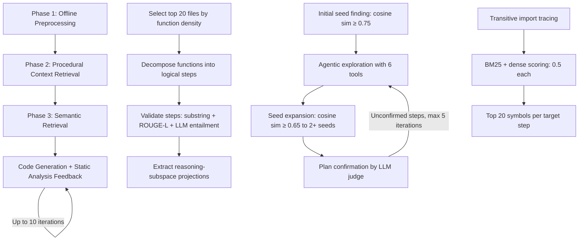
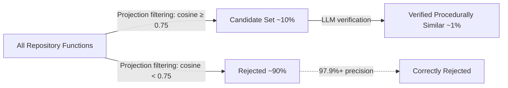

# Beyond Lexical Matching: How Procedural Similarity Retrieval Outperforms Traditional Context Selection — and What It Means for Codex CLI's Repository Strategy


---

Every coding agent faces the same bottleneck: deciding which repository files to feed into the context window before generating code. Get it wrong and the model hallucinates imports, invents method signatures, or produces code that compiles in isolation but breaks every cross-file contract in the project. ProjAgent, published on 9 July 2026 by Chen, Imani, and Ahmed [^1], demonstrates that the retrieval signal most agents rely on — lexical and semantic similarity — systematically misses functions that share computational logic across naming and domain boundaries. Their fix, *procedural similarity*, lifts Pass@1 on the REPOCOD benchmark from 34.52% (previous state of the art) to 41.14%, a 6.62 percentage-point gain that comes entirely from better context selection [^1].

This article unpacks how procedural similarity works, why it matters for any tool that must choose what to show the model, and how Codex CLI's existing retrieval and context-management primitives map onto — and diverge from — ProjAgent's architecture.

## The Retrieval Problem in Repository-Level Generation

REPOCOD comprises 980 coding problems drawn from 11 real-world Python repositories, with over 58% of tasks requiring file-level or repository-level context [^2]. The benchmark's average canonical solution is 331.6 tokens long with a cyclomatic complexity of 9.00 — substantially harder than function-level benchmarks like HumanEval [^2].

Traditional retrieval approaches score poorly on these tasks:

| Retrieval Method | Pass@1 |
|---|---|
| Same-File Retrieval | 14.98% |
| Sparse Retrieval (BM25) | 26.58% |
| Dense Retrieval | 28.83% |
| SpecAgent (previous SOTA) | 34.52% |
| **ProjAgent** | **41.14%** |

*Table: REPOCOD Pass@1 results using Qwen2.5-Coder-14B-Instruct as backbone [^1]*

The gap between dense retrieval (28.83%) and ProjAgent (41.14%) is striking: a 12.31 percentage-point improvement from adding a single retrieval dimension [^1].

## What Is Procedural Similarity?

Consider two functions: `BlackBody.evaluate` in `astropy/modeling`, which validates input ranges before computing a physical quantity, and `FLRW.m_nu` in `astropy/cosmology`, which validates cosmological parameters before computing neutrino masses. They share a guard-clause-then-compute pattern but have low lexical overlap (BM25 = 0.38) and weak semantic similarity (0.59), with no direct import dependencies [^1].

Procedural similarity captures this shared computational logic. ProjAgent operationalises it through *reasoning-subspace projections* derived from LLM hidden states. Using singular value decomposition on the unembedding layer, the system decomposes hidden-state space into semantic and reasoning-related subspaces [^1]. The reasoning projection is computed as:

```
proj_R(h_l) = V_R^T · h_l
```

where `h_l` represents hidden states from response tokens at the final layer. A PCA-based debiasing step removes anisotropy — the tendency for vectors to cluster along common directions regardless of content — substantially improving the discriminative ability of cosine similarity comparisons [^1].

## The Three-Phase Agent Workflow

ProjAgent's architecture separates retrieval into three sequential phases:



### Phase 1: Offline Preprocessing

The system selects the top 20 repository files ranked by target function density and functional richness, then decomposes each function into logical steps with natural language descriptions and code snippets [^1]. Step validation uses a three-stage pipeline: substring matching against normalised docstrings, a ROUGE-L threshold of 0.7, and LLM entailment judgement. Code snippets are validated through line existence verification and embedding similarity (threshold > 0.75 using `google/embedding-gemma-300m`) [^1].

### Phase 2: Procedural Context Retrieval

This is where the agentic workflow operates. Initial seed finding promotes candidates with cosine similarity ≥ 0.75 in the reasoning subspace, then an LLM verifies procedural equivalence [^1]. The agent navigates the repository using six tools — `ls`, `execute_bash`, `read_func`, `read_lines`, `search_func`, and `propose_func` — with a context-compaction strategy that compresses exploration history via LLM-based summarisation [^1].

Seed expansion retrieves context steps with cosine similarity ≥ 0.65 to at least two seed steps. A plan confirmation stage uses an LLM judge to determine whether retrieved context suffices for implementing each target step, with unconfirmed steps receiving refined search queries for up to five iterations [^1].

### Phase 3: Semantic Retrieval

Procedural context provides implementation guidance; semantic context supplies the accessible symbols that make generated code actually executable. ProjAgent traces transitive imports, scores each symbol using a 50/50 blend of BM25 and dense retrieval (`all-mpnet-base-v2`), and selects the top 20 symbols per target step [^1].

## The Static Analysis Feedback Loop

After generation, a conservative four-stage semantic consistency checker runs for up to 10 iterations [^1]:

1. **Method call verification** — methods accessible from class hierarchy, correct argument count
2. **Field access verification** — fields defined in class hierarchy
3. **Variable-method inference** — receiver type inference, method existence validation
4. **Standalone function verification** — function accessibility and argument count

The ablation study reveals that removing the feedback loop only costs 0.85% Pass@1 (from 41.14% to 40.29%), because Python's dynamic typing limits what static analysis can catch deterministically [^1]. The lesson: conservative verification adds modest but consistent value; aggressive verification would introduce false positives.

## Ablation: Where the Value Actually Lives

The ablation study on the Astropy repository (85 target functions) is revealing [^1]:

| Variant | Pass@1 | Drop |
|---|---|---|
| Full ProjAgent | 41.14% | — |
| Without procedural retrieval | 25.76% | −15.38% |
| Without semantic retrieval | 32.29% | −8.85% |
| Without feedback loop | 40.29% | −0.85% |

Procedural retrieval accounts for the largest single contribution. Without it, performance drops to roughly the level of standalone dense retrieval. The two retrieval dimensions are complementary: procedural context tells the model *how* to implement something; semantic context tells it *what symbols are available* to implement it with [^1].

## Mapping to Codex CLI's Context Strategy

Codex CLI does not implement procedural similarity retrieval, but several of its existing primitives address overlapping problems.

### File References and Context Scoping

Codex CLI's `#file:path` references and `.codexignore` patterns [^3] give developers explicit control over what enters the context window. This is the manual equivalent of ProjAgent's Phase 3 semantic retrieval — the developer identifies which files contain relevant symbols. ProjAgent's contribution is automating this step and adding the procedural dimension that manual selection cannot easily replicate.

### MCP Tool Search and Deferred Loading

Since v0.142.2, Codex CLI defaults to MCP tool search with deferred loading [^4], where tool definitions are fetched on demand rather than injected wholesale into the prompt. This mirrors ProjAgent's observation that flooding the context with irrelevant information degrades performance — the same principle that motivates selective retrieval over whole-repository ingestion.

### AGENTS.md as Procedural Knowledge

ProjAgent's offline preprocessing decomposes functions into logical steps. Codex CLI's `AGENTS.md` files [^5] serve an analogous role: they encode project-specific procedural knowledge — coding patterns, architectural constraints, testing conventions — that the model should follow. The difference is that `AGENTS.md` is hand-authored whilst ProjAgent's decomposition is automated.

### PostToolUse Hooks as Feedback Loops

ProjAgent's static analysis feedback loop maps directly onto Codex CLI's `PostToolUse` hooks [^5]. A PostToolUse hook could run the same four-stage semantic consistency check after every code-writing action:

```toml
# config.toml
[hooks.post_tool_use.structural_check]
command = "python scripts/semantic_verify.py $CHANGED_FILES"
on_failure = "report"  # or "block" for stricter enforcement
```

The conservative approach — reporting rather than blocking — aligns with ProjAgent's finding that aggressive verification introduces false positives, particularly in dynamically typed languages [^1].

### Context Budget Management

Codex CLI's `project_doc_max_bytes` and `tool_output_token_limit` settings [^5] constrain how much context enters the model. ProjAgent's context-compaction strategy — compressing exploration history via LLM summarisation — addresses the same problem from the retrieval side. The two approaches are complementary: ProjAgent selects better context; Codex CLI's budget controls ensure whatever is selected fits within the window.

## The Precision Problem

ProjAgent's evaluation of its projection mechanism reveals a structural limitation. The promoted group (pairs flagged as procedurally similar) achieves only 3.6–6.7% precision across all configurations [^1]. The leftover group (pairs flagged as dissimilar) achieves ≥ 97.9% precision [^1]. In other words, the projection is excellent at ruling out irrelevant functions but poor as a standalone classifier for identifying relevant ones.

This is why ProjAgent uses a two-stage design: projection similarity for candidate filtering, followed by LLM verification for false-positive elimination [^1]. The inter-rater agreement between human annotators was κ = 0.86 (almost perfect), and agreement with Claude-generated labels was κ = 0.82 [^1].



For Codex CLI users, the implication is clear: any automated retrieval system should be designed as a funnel — cheap filtering first, expensive verification second — rather than attempting single-pass classification.

## Limitations and Open Questions

ProjAgent's evaluation is limited to Python repositories and a single backbone model (Qwen2.5-Coder-14B-Instruct) [^1]. Whether procedural similarity transfers to statically typed languages — where the static analysis feedback loop would presumably be more effective — remains untested. The authors note that effectiveness may vary across LLMs with different hidden-state properties [^1].

⚠️ The full-search setting (all functions decomposed offline) yields only a 3.96% improvement over budget-constrained search on the Astropy subset [^1], suggesting that the marginal value of exhaustive preprocessing may not justify the computational cost at scale.

The approach also raises questions about Codex CLI's architecture: could a PreToolUse hook implement lightweight procedural similarity filtering before the model decides which files to read? The six-tool agentic exploration workflow maps naturally onto Codex CLI's tool-use pattern, but the offline preprocessing step — extracting reasoning-subspace projections — would require infrastructure that does not currently exist in the CLI's pipeline.

## Practical Takeaways

1. **Retrieval is the bottleneck.** ProjAgent's 12.31% improvement over dense retrieval comes entirely from better context selection, not better generation. Codex CLI users should invest time in `AGENTS.md` files that encode procedural patterns, not just naming conventions.

2. **Two retrieval dimensions beat one.** Procedural context (how to implement) and semantic context (what symbols to use) are complementary. When manually constructing `#file:` references, include both pattern exemplars and API surface files.

3. **Conservative verification wins.** The feedback loop's modest 0.85% contribution reflects the right trade-off for dynamic languages. PostToolUse hooks should report structural anomalies rather than block on them.

4. **Filter cheaply, verify expensively.** The projection mechanism's 97.9% rejection precision at 3.6% promotion precision demonstrates that cheap statistical filtering followed by expensive LLM verification is the correct architecture for context selection at scale.

## Citations

[^1]: Chen, Q., Imani, A., & Ahmed, I. (2026). "ProjAgent: Procedural Similarity Retrieval for Repository-Level Code Generation." arXiv:2607.08691. [https://arxiv.org/abs/2607.08691](https://arxiv.org/abs/2607.08691)

[^2]: Liang, S., Hu, Y., Jiang, N., & Tan, L. (2024). "Can Language Models Replace Programmers? REPOCOD Says 'Not Yet'." arXiv:2410.21647. [https://arxiv.org/abs/2410.21647](https://arxiv.org/abs/2410.21647)

[^3]: OpenAI. (2026). "Codex CLI Documentation: Context Scoping." [https://developers.openai.com/codex/overview](https://developers.openai.com/codex/overview)

[^4]: OpenAI. (2026). "Codex CLI Changelog: v0.142.2 — MCP tool search default." [https://developers.openai.com/codex/changelog](https://developers.openai.com/codex/changelog)

[^5]: OpenAI. (2026). "Codex CLI Configuration Reference: AGENTS.md, hooks, and context budgets." [https://developers.openai.com/codex/configuration](https://developers.openai.com/codex/configuration)
