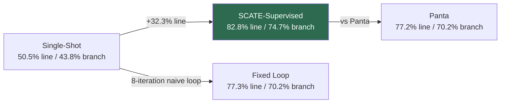
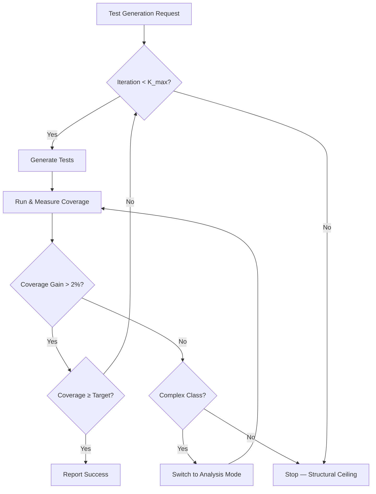

# Lazy Test Generation and the Supervision Gap: What SCATE's Contextual Bandit Approach Reveals About Coding Agent Coverage — and How to Wire Iterative Test Loops into Codex CLI


---

## The Problem Nobody Talks About

Ask any coding agent to generate tests and it will cheerfully report success. What it will not report is that it stopped early, ignored complex branches, and left your mutation score in the gutter. Gu, Nashid, and Mesbah formalise this failure mode as **lazy generation** in their July 2026 paper *SCATE: Learning to Supervise Coding Agents for Cost-Effective Test Generation* [^1]. Their findings are uncomfortable: a single-shot Gemini CLI prompt achieves just 50.5% line coverage and 43.8% branch coverage on complex Java classes, with the agent declaring victory at every turn [^1].

This is not a model problem. It is a supervision problem. And it maps directly to how most developers use Codex CLI for test generation today — fire a prompt, accept the output, move on.

## What SCATE Actually Does

SCATE reframes agent test supervision as a **contextual bandit** problem [^1]. Rather than letting the agent decide when it has finished, an external supervisor observes coverage metrics after each iteration and selects from three macro-level actions:

| Action | When Selected | Effect |
|--------|---------------|--------|
| **Default** | Early iterations, moderate complexity | Standard zero-shot test generation prompt |
| **Analysis** | High complexity (WMC ≥ 163.9) [^1] | Invokes MCP-based program analysis for control flow, path identification, dependency resolution |
| **Stop** | Diminishing returns detected | Terminates to prevent resource exhaustion |

The supervisor's context vector combines seven features — three static (Lines of Code, Weighted Methods per Class, Response for a Class) and three dynamic (current line coverage, branch coverage, missed complexity), all log-scaled for numerical stability [^1].

The reward function balances coverage gains against cost:

```
R_t = g_t · m_t − ω · Cost_t
```

where `g_t` is relative coverage gain, `m_t` is a complexity multiplier `(1 + ln(1 + c_t))`, and `Cost_t` is API token cost in USD [^1]. A failure penalty κ = 0.5 applies when coverage does not improve, and the Stop action always returns zero reward [^1].

## The Numbers That Matter

SCATE was evaluated on 120 complex classes from Defects4J (selection threshold: WMC ≥ 35 or RFC ≥ 55), split into 40 training and 80 evaluation classes [^1].



Key results with Gemini CLI (gemini-3.1-flash-lite) [^1]:

- **Line coverage**: 82.8% vs 50.5% single-shot (+32.3 percentage points)
- **Branch coverage**: 74.7% vs 43.8% single-shot (+30.9 percentage points)
- **Mutation score**: 64.7%
- **Cost**: \$0.693 per class, 15.1 minutes average
- **Max iterations**: K_max = 10, average trajectory length 7.9

With Claude Code (claude-4-5-haiku), coverage rose to 90.3% line and 84.9% branch at \$1.143 per class [^1].

Crucially, SCATE outperformed both a naive 8-iteration fixed loop (77.3% line) and the non-agentic Panta baseline (77.2% line) [^1], demonstrating that intelligent action selection — not merely more iterations — drives coverage gains.

## The Lazy Generation Anatomy

The paper's iteration analysis reveals a sharp coverage plateau [^1]:

| Iteration | Average Coverage Gain |
|-----------|----------------------|
| 1 | +43.8% |
| 2 | +11.9% |
| 3–10 | Diminishing, class-dependent |

By iteration 10, 40% of classes receive Stop actions [^1]. The Default action dominates early rounds; Analysis is reserved for structurally complex classes. Simple classes (LOC ~469, WMC ~98) reach 85.9% line coverage without Analysis, whilst complex classes (LOC ~755, WMC ~163) plateau at 76.6% even with analysis deployed [^1].

This pattern — rapid initial gains followed by expensive diminishing returns — is exactly what unsupervised agents fail to recognise. They either stop too early (lazy generation) or continue burning tokens on classes that have hit structural coverage ceilings.

## Mapping SCATE to Codex CLI

Codex CLI does not ship a contextual bandit supervisor, but its hook system provides the primitives to build iterative, coverage-aware test loops. Here is how the SCATE architecture maps to Codex CLI's component model.

### PostToolUse Coverage Gate

The PostToolUse hook fires after every Bash tool call, receiving the full stdout/stderr/exit-code payload [^2]. A coverage-checking hook can parse JaCoCo, Istanbul, or coverage.py output and decide whether to continue:

```toml
# ~/.codex/config.toml

[[hooks.PostToolUse]]
matcher = "^Bash$"

[[hooks.PostToolUse.hooks]]
type = "command"
command = "/usr/local/bin/coverage-gate.sh"
timeout = 60
statusMessage = "Checking coverage thresholds"
```

The gate script extracts coverage from the test run and returns structured JSON:

```bash
#!/bin/bash
# coverage-gate.sh — reads PostToolUse JSON from stdin
INPUT=$(cat)
TOOL_RESPONSE=$(echo "$INPUT" | jq -r '.tool_response')

# Extract coverage from pytest-cov or JaCoCo output
LINE_COV=$(echo "$TOOL_RESPONSE" | grep -oP 'TOTAL\s+\d+\s+\d+\s+\K\d+')

if [ -z "$LINE_COV" ] || [ "$LINE_COV" -lt 80 ]; then
  echo '{"decision":"block","systemMessage":"Coverage at '"${LINE_COV:-unknown}"'% — below 80% threshold. Generate additional tests targeting uncovered branches."}'
else
  echo '{"decision":"approve"}'
fi
```

When the hook returns `decision: block`, Codex CLI replaces the tool output with the `systemMessage`, prompting the agent to generate additional tests — effectively implementing SCATE's iterative loop without external orchestration [^2].

### AGENTS.md Test Protocol

SCATE's three-action routing maps to AGENTS.md directives that encode when to escalate from simple generation to analysis-augmented generation:

```markdown
<!-- .codex/AGENTS.md -->
## Test Generation Protocol

1. **First pass**: Generate tests using standard patterns. Run the test
   suite and report coverage.
2. **If branch coverage < 70%**: Analyse the class under test for
   complex control flow, mocking requirements, and untested exception
   paths before generating additional tests.
3. **Stop condition**: Cease generation when either (a) branch coverage
   ≥ 85%, (b) two consecutive iterations produce < 2% coverage gain,
   or (c) iteration count reaches 8.
4. **Never** report "tests complete" without including the coverage
   percentages in your response.
```

This explicit stop condition addresses lazy generation directly. Without it, the agent's default behaviour is to declare success after a single generation pass [^1].

### Rollout Budget as Cost Ceiling

SCATE's reward function penalises API cost. Codex CLI's rollout token budget serves the same function, capping the total tokens an agent session can consume [^3]:

```toml
[features.rollout_budget]
enabled = true
limit_tokens = 200000
reminder_interval_tokens = 20000
```

For test generation workflows, a budget of 200K tokens is sufficient for approximately 8–10 iterations on a complex class at current Codex CLI token rates [^3]. The reminder interval triggers a system-level nudge that the agent can incorporate into its generation strategy.

### Multi-Attempt with `codex exec`

For CI integration, `codex exec` enables non-interactive test generation with structured output [^4]:

```bash
codex exec \
  --model o4-mini \
  --approval-mode full-auto \
  --sandbox-mode workspace-write \
  "Generate tests for src/main/java/com/example/OrderService.java. \
   Run them with 'mvn test -pl order-service'. \
   Continue generating until branch coverage exceeds 80% or \
   you have completed 8 iterations. \
   Report final coverage percentages."
```

Pairing this with a PostToolUse coverage gate creates an automated, bounded test generation pipeline suitable for nightly CI runs.

## The Structural Coverage Ceiling

SCATE's most sobering finding is that some classes hit structural coverage limits regardless of supervision strategy. Complex classes with WMC ≥ 163 plateau at 76.6% line coverage even with program analysis [^1]. This is not agent laziness — it is genuine untestability caused by deep dependency chains, environmental coupling, or unreachable error paths.



This suggests that Codex CLI test workflows should include a **testability pre-screening** step — checking WMC and RFC before committing to iterative generation. Classes above the structural ceiling are better served by refactoring recommendations than by additional test iterations.

## Practical Recommendations

**For individual developers:**

1. Add a PostToolUse coverage gate to your Codex CLI hooks. Even a simple threshold check prevents the agent from declaring premature victory.
2. Encode explicit stop conditions in AGENTS.md. Without them, the agent has no incentive to iterate.
3. Set a rollout token budget. Iterative test generation without a cost ceiling is an open-ended API bill.

**For CI pipelines:**

1. Use `codex exec` with structured prompts that specify coverage targets and iteration limits.
2. Wire PostToolUse hooks to your existing coverage reporting (JaCoCo, Istanbul, coverage.py).
3. Accept that some classes will not reach target coverage. A PostToolUse hook that detects two consecutive zero-gain iterations should trigger an early stop, not an infinite loop.

**For teams adopting SCATE's approach:**

1. The contextual bandit formulation is straightforward to replicate with a custom MCP server that tracks coverage state and returns action recommendations via tool calls.
2. SCATE's seven-feature context vector is extractable from standard static analysis tools (e.g., CK Metrics for Java) and coverage reports.
3. The training set requirement (40 classes) is modest — most production codebases provide sufficient training data from existing test suites.

## What This Means for Coding Agent Design

SCATE demonstrates that the gap between agent-reported and actual test quality is a supervision problem, not a capability problem. The same Gemini CLI that achieves 50.5% line coverage unsupervised reaches 82.8% under SCATE's contextual bandit — a 64% relative improvement from better orchestration alone [^1].

Codex CLI's hook architecture provides the low-level primitives for this kind of supervision. What it lacks is the higher-level orchestration logic — the bandit policy, the testability pre-screening, the action routing. That gap is precisely where AGENTS.md directives, PostToolUse gates, and custom MCP servers converge to create genuinely effective test generation workflows.

The lazy generation problem is not going away. As models get better at generating plausible-looking test suites, the temptation to accept their first output grows. The antidote is measurement — coverage gates that refuse to let the agent stop until the numbers say it can.

---

## Citations

[^1]: Gu, S., Nashid, N., & Mesbah, A. (2026). "SCATE: Learning to Supervise Coding Agents for Cost-Effective Test Generation." *arXiv:2607.08983*. [https://arxiv.org/abs/2607.08983](https://arxiv.org/abs/2607.08983)

[^2]: OpenAI. (2026). "Hooks — Codex CLI." *ChatGPT Learn*. [https://developers.openai.com/codex/hooks](https://developers.openai.com/codex/hooks)

[^3]: OpenAI. (2026). "Codex Changelog — Rollout Token Budget Configuration." *GitHub PR #28746*. [https://github.com/openai/codex/pull/28746](https://github.com/openai/codex/pull/28746)

[^4]: OpenAI. (2026). "Codex CLI." *ChatGPT Learn*. [https://developers.openai.com/codex/cli](https://developers.openai.com/codex/cli)
