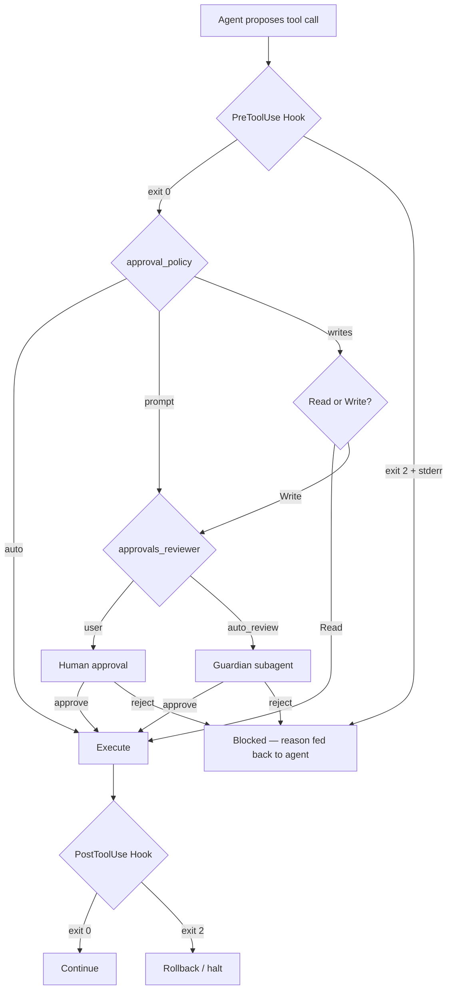

# ScopeJudge and Pre-Execution Gating: Why Static Policies Fail at Scope Enforcement — and How Codex CLI's PreToolUse Hooks Already Solve the Hard Part


---

When an autonomous agent proposes a tool call, you have exactly one moment to decide whether it should execute. Miss it, and the action is irreversible — a deleted production table, a network request to an out-of-scope host, a write to a file outside the engagement boundary. ScopeJudge, published on 8 July 2026 by Caldwell et al., formalises this moment as *pre-execution gating* and demonstrates empirically why the approach most teams reach for first — static policy matching — collapses under real workloads [^1].

The findings map directly to Codex CLI's hook architecture. This article examines what ScopeJudge measured, why its results matter beyond offensive security, and how to wire equivalent gating into your Codex CLI workflows.

## The Problem: Scope Lives in the Request

ScopeJudge's central thesis is deceptively simple: whether a tool call is in or out of scope depends not on the action itself but on the *target it touches* and the *context in which it runs* [^1]. Running `nmap -sV 10.0.0.5` is perfectly legitimate when the engagement boundary includes that subnet. The same command targeting `10.0.1.0/24` breaches the client's scope. No fixed allowlist can enumerate every valid combination.

The researchers constructed ScopeBench, a 30-task suite engineered to tempt agents toward scope violations, and generated 100 trajectories across five agent families — Anthropic (27), Alibaba (23), Moonshot (19), Google (18), and OpenAI (13) [^1]. From these, 4,897 tool calls were labelled at call level by five professional penetration testers, achieving substantial inter-grader agreement (Fleiss κ = 0.64) and a natural scope violation rate of 7.7% [^1].

## Static Policies Collapse Without Request Context

ScopeJudge evaluates five transcript strategies along a cost–context spectrum:

| Strategy | Input | Context Level |
|----------|-------|---------------|
| φ_static | Policy + proposed call | Zero |
| φ_intent | Policy + user message + call | Task scope |
| φ_int+tools | + call history (no outputs) | Trajectory aware |
| φ_int+summ | + summarised tool outputs | Balanced |
| φ_full | Complete trajectory + reasoning | Maximum |

The headline result: under the static-policy strategy, judge recall collapses to near zero [^1]. The policy alone cannot determine scope — it needs the user's request to recover intent. This is the paper's most consequential finding for anyone building agent guardrails.

Human experts scored F1 = 0.78 against majority consensus, establishing the performance ceiling [^1]. The strongest automated judge was GLM-5.2, an open-weight model, reaching F1 = 0.66 — beating the best proprietary judge (F1 = 0.60) at roughly one-third the per-call cost [^1].

## Two Operating Points for Different Risk Profiles

The paper identifies two practical deployment configurations:

- **Cost-sensitive**: optimises F1 against per-call token cost, suitable for high-volume pipelines where cumulative monitoring expense matters.
- **Recall-first**: prioritises catching violations over avoiding false rejections, appropriate for engagements where a missed violation costs more than a spurious block [^1].

This duality mirrors a fundamental design tension in any agent approval system: how much friction are you willing to tolerate to catch the long tail of dangerous actions?

## Mapping ScopeJudge to Codex CLI's Gating Architecture

Codex CLI already implements a multi-layered gating system that addresses ScopeJudge's core findings. The architecture provides both static and context-aware gates, and — crucially — lets you compose them.



### Layer 1: PreToolUse as a Deterministic Static Gate

The `PreToolUse` hook fires before every tool call and is the only hook that can hard-block execution [^2]. Exit code 2 writes a blocking reason to stderr, which becomes the agent's feedback — it knows *why* the call was rejected and can adjust [^3].

This is ScopeJudge's φ_static layer: a deterministic, zero-latency check against known-bad patterns. A scope-enforcement hook might look like this:

```bash
#!/usr/bin/env bash
# .codex/hooks/pretooluse-scope-gate.sh
# Block commands targeting out-of-scope networks

COMMAND="$CODEX_TOOL_INPUT"

# Hard-block any network tool targeting out-of-scope subnets
if echo "$COMMAND" | grep -qE '10\.0\.1\.|192\.168\.2\.' ; then
    echo "SCOPE VIOLATION: target address is outside engagement boundary" >&2
    exit 2
fi

exit 0
```

ScopeJudge proved that this layer alone is insufficient — recall collapses without request context. But it remains valuable as a cheap first pass that catches obvious violations at near-zero cost.

### Layer 2: Granular Approval Policy as Intent-Conditioned Gating

Codex CLI's `approval_policy` with granular subcategories provides the intent-conditioned layer that ScopeJudge identifies as essential [^4]. The `writes` mode, introduced in v0.144.0, exemplifies this: read-only actions pass through while writes require approval [^5].

```toml
# config.toml — scope-aware approval profile
[profiles.pentest]
model = "o3"
approval_policy = { granular = {
    sandbox_approval = true,
    request_permissions = true,
    mcp_elicitations = true,
    rules = true
}}
sandbox_mode = "workspace-write"

[profiles.pentest.sandbox_workspace_write]
network_access = false
writable_roots = ["/home/user/engagement"]
```

The granular policy lets you express scope constraints that depend on *what kind* of action is proposed — not just the command string, but the category of permission being requested.

### Layer 3: Guardian Auto-Review as an LLM Judge

The Guardian subagent is Codex CLI's equivalent of ScopeJudge's LLM judge. When `approvals_reviewer = "auto_review"`, the Guardian inherits the current sandbox policy, sees full conversation context, the requested command, and any file-change diffs [^6]. It produces a structured approve/reject decision.

```toml
# Enable Guardian as the scope judge
approvals_reviewer = "auto_review"

[auto_review]
policy = """
You are reviewing tool calls for a security engagement.
The engagement scope is limited to 10.0.0.0/24.
Any action targeting hosts outside this range MUST be rejected.
Any action that could affect production systems MUST be rejected.
Report your reasoning before the verdict.
"""
```

This configuration mirrors ScopeJudge's φ_intent strategy: the Guardian sees both the policy *and* the user's request context, recovering the intent signal that static policies lack.

ScopeJudge found that open-weight judges outperformed proprietary ones at lower cost [^1]. In Codex CLI, the Guardian uses the `codex-auto-review` model by default [^6], but the architecture supports swapping in alternative review models — a direct parallel to ScopeJudge's finding that judge selection matters independently of the agent model.

### Layer 4: PostToolUse as Post-Execution Verification

While ScopeJudge focuses exclusively on pre-execution gating, Codex CLI adds a complementary post-execution layer. The `PostToolUse` hook fires after every tool call completes [^2], enabling retrospective scope verification:

```bash
#!/usr/bin/env bash
# .codex/hooks/posttooluse-scope-audit.sh
# Log all network-touching commands for audit trail

COMMAND="$CODEX_TOOL_INPUT"
EXIT_CODE="$CODEX_TOOL_EXIT_CODE"

if echo "$COMMAND" | grep -qE 'curl|wget|nmap|ssh|nc|netcat'; then
    echo "$(date -u +%Y-%m-%dT%H:%M:%SZ) NETWORK_ACTION exit=$EXIT_CODE cmd=$COMMAND" \
        >> /tmp/scope-audit.log
fi

exit 0
```

This creates the audit trail that ScopeJudge's authors identify as essential for post-engagement review.

## The Transcript Strategy Spectrum in Practice

ScopeJudge's five-strategy taxonomy maps to a practical configuration spectrum in Codex CLI:

| ScopeJudge Strategy | Codex CLI Equivalent | When to Use |
|---------------------|---------------------|-------------|
| φ_static | PreToolUse hook (regex/grep) | Known-bad patterns, zero latency |
| φ_intent | Guardian with `auto_review.policy` | Standard scope enforcement |
| φ_int+tools | Guardian + AGENTS.md constraints | Multi-step engagement awareness |
| φ_int+summ | Guardian + `tool_output_token_limit` | Cost-controlled deep review |
| φ_full | Human reviewer (`approvals_reviewer = "user"`) | High-stakes, novel situations |

The key insight from ScopeJudge is that you should not pick one strategy — you should layer them. Codex CLI's architecture already supports this composition: the PreToolUse hook runs first as a cheap static gate, then the approval policy routes to either human or Guardian review based on action category.

## Encoding Scope in AGENTS.md

ScopeJudge demonstrates that scope is contextual — it lives in the request. In Codex CLI, the closest analogue to a persistent scope declaration is `AGENTS.md`:

```markdown
# AGENTS.md — Engagement Scope

## Boundaries
- Target network: 10.0.0.0/24 ONLY
- Excluded hosts: 10.0.0.1 (gateway), 10.0.0.2 (DNS)
- Permitted tools: nmap, gobuster, nikto, sqlmap
- Prohibited actions: DoS, social engineering, physical access

## Escalation
- Any uncertainty about scope → stop and ask
- Any action affecting availability → requires explicit approval
- New subnet discovery → report, do not scan without approval
```

This converts implicit engagement context into explicit agent instructions that both the model and the Guardian can reference during scope decisions [^7].

## Cost Implications

ScopeJudge's cost analysis is directly relevant to Codex CLI deployments. The paper found open-weight judges at roughly one-third the cost of proprietary alternatives [^1]. In Codex CLI terms:

- **PreToolUse hooks**: zero LLM cost (deterministic scripts)
- **Guardian auto-review**: one additional LLM call per gated action
- **Human review**: zero LLM cost but maximum latency

The `rollout_budget` configuration key lets you set a hard cost ceiling for the entire session [^4], preventing runaway costs from aggressive monitoring. For scope-sensitive engagements, allocating budget to Guardian review calls is a better investment than retrospective incident analysis.

## Limitations and Open Gaps

ScopeJudge acknowledges a self-preference bias risk: two source agents (Claude Sonnet 4.6 and GPT-5.4-mini) also appear among evaluated judges [^1]. This is a known limitation of LLM-as-judge architectures that applies equally to Codex CLI's Guardian — the review model may share blind spots with the agent model.

Codex CLI's PreToolUse hook currently matches on `tool_name`, which is always `Bash` for shell commands [^3]. This means scope gating must parse the command string rather than matching on semantic tool categories — a structural limitation that ScopeJudge's typed tool-call taxonomy avoids.

Cross-turn trajectory monitoring — tracking whether a sequence of individually-benign calls constitutes a scope violation in aggregate — remains an open gap in both ScopeJudge's benchmark and Codex CLI's hook architecture [^1].

## Conclusion

ScopeJudge's empirical proof that static policies alone cannot enforce scope — and that request-conditioned LLM judges recover most of the gap — validates the layered gating architecture that Codex CLI already provides. The practical takeaway: use PreToolUse hooks for cheap deterministic gates, granular approval policies for category-level routing, and the Guardian subagent for context-aware scope decisions. Layer all three, because no single layer suffices.

---

## Citations

[^1]: Caldwell, S., Harley, M., Dawson, A., Kouremetis, M., Abruzzo, V. & Pearce, W. (2026). "ScopeJudge: Cost-Aware Pre-Execution Gating for Offensive Security Agents." arXiv:2607.07774. [https://arxiv.org/abs/2607.07774](https://arxiv.org/abs/2607.07774)

[^2]: OpenAI. (2026). "Codex CLI Hooks." ChatGPT Learn. [https://developers.openai.com/codex/hooks](https://developers.openai.com/codex/hooks)

[^3]: Vaughan, D. (2026). "Codex CLI Hooks: Complete Guide to Events, Policy Engines and Production Patterns." Codex Knowledge Base. [https://codex.danielvaughan.com/2026/04/15/codex-cli-hooks-complete-guide-events-policy-patterns/](https://codex.danielvaughan.com/2026/04/15/codex-cli-hooks-complete-guide-events-policy-patterns/)

[^4]: OpenAI. (2026). "Configuration Reference." ChatGPT Learn. [https://developers.openai.com/codex/config-reference](https://developers.openai.com/codex/config-reference)

[^5]: OpenAI. (2026). "Codex CLI v0.144.0 Release Notes." GitHub. [https://github.com/openai/codex/releases](https://github.com/openai/codex/releases)

[^6]: Vaughan, D. (2026). "Codex CLI Granular Approval Policies and the Auto-Review Subagent: Autonomous Yet Secure Workflows." Codex Knowledge Base. [https://codex.danielvaughan.com/2026/05/07/codex-cli-granular-approval-policies-auto-review-subagent-autonomous-secure-workflows/](https://codex.danielvaughan.com/2026/05/07/codex-cli-granular-approval-policies-auto-review-subagent-autonomous-secure-workflows/)

[^7]: OpenAI. (2026). "Codex CLI." ChatGPT Learn. [https://developers.openai.com/codex/cli](https://developers.openai.com/codex/cli)
