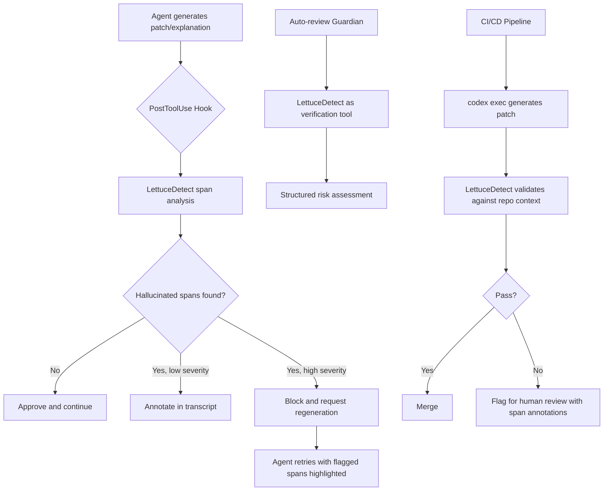

# Span-Level Hallucination Detection for Code and Tool Output: Wiring LettuceDetect into Your Codex CLI Verification Stack


---

## The Problem: Your Agent's Output Looks Correct Until It Isn't

Every senior developer working with coding agents has experienced the same failure mode: generated code that passes syntax checks, reads plausibly, and references real-looking method names — but fabricates an API call, inverts a condition, or misreports a tool observation. Traditional hallucination detectors flag entire answers as faithful or not. That binary verdict is useless when a 200-line patch contains one fabricated attribute access buried in otherwise correct code.

Kovács et al. published "Beyond Document Grounding: Span-Level Hallucination Detection over Code, Tool Output, and Documents" on 1 July 2026[^1], introducing **LettuceDetect** — a fine-tuned Qwen3.5-2B model that identifies the *exact character spans* within generated text that lack evidentiary support from the grounding context. The paper's code-agent evaluation directly maps to how Codex CLI generates patches, reports tool observations, and synthesises explanations from repository context.

This article dissects the research, explains why span-level detection matters for agentic coding workflows, and demonstrates how to wire LettuceDetect into Codex CLI's PostToolUse hooks, auto-review pipeline, and CI gates.

---

## What LettuceDetect Actually Does

### Task Formulation

The detector operates on triplets of `(request, context, answer)` where context can be source code, command/tool output, or structured documents[^1]. It identifies spans falling into three hallucination categories:

- **Contradiction** — conflicts with provided evidence (wrong values, inverted conditions, incorrect field references)
- **Fabricated Reference** — invented methods, attributes, or identifiers absent from context
- **Unsupported Addition** — claims or behaviours the evidence never mentions

Thirteen subcategories refine classification further: entity, temporal, numerical, value, relational, identifier, section, attribute, claim, behaviour, elaboration, subjective, and unspecified[^1].

### Dataset Scale

The benchmark comprises 74,285 examples across five grounding source types[^1]:

| Source | Examples | Hallucinated | Modality |
|--------|----------|--------------|----------|
| Code (SWE-bench) | 18,524 | 9,268 | Source code |
| Tool Output | 11,365 | 5,682 | Command/tool output |
| ACL Papers | 5,355 | 2,677 | Markdown |
| READMEs | 13,803 | 6,900 | Markdown |
| Wikipedia | 25,238 | 12,618 | Markdown |

The complete training set reaches 145,250 examples incorporating converted RAGTruth and PsiloQA datasets[^1].

### Results That Matter

The fine-tuned LettuceDetect-Qwen-2B achieves[^1]:

- **0.689 span-F1** on the unified test set
- **0.602 span-F1** on code-agent examples (the hardest source)
- **0.719 span-F1** on tool output
- **0.835 example-F1** on code (detecting *whether* an answer contains any hallucination)

For comparison, zero-shot LLM judges reach only 0.21 span-F1 on code, and the prior natural-language specialist LettuceDetect-large scores 0.17[^1]. Generic faithfulness detectors like HHEM-2.1 and Granite-Guardian show high recall (0.73–1.0) but catastrophic precision (~0.50), incorrectly flagging legitimate patch code as fabricated[^1].

---

## Why Zero-Shot Judges Fail on Code

The paper identifies characteristic failure modes that directly affect Codex CLI users[^1]:

1. **Generic prompts mark clean patch code as fabricated** — precision drops to ~0.11 when a generic "is this grounded?" prompt encounters newly-written code
2. **Context truncation causes false positives** — LLMs treat truncated evidence as proof of fabrication, flagging real cross-file method calls
3. **Non-verbatim generation breaks token matching** — edit-style answers ("in file X, replace Y with Z") never appear verbatim in context

This explains why bolting a general-purpose LLM-as-judge onto your Codex CLI workflow produces noise rather than signal. Task-specific training on code and tool output is non-negotiable for useful detection.

---

## Mapping to Codex CLI's Verification Architecture

Codex CLI already provides a layered defence stack. LettuceDetect slots into multiple layers:



### Layer 1: PostToolUse Hooks for Real-Time Detection

Codex CLI's PostToolUse hooks fire after every tool execution[^2]. A hook wrapping LettuceDetect can intercept generated patches before they reach the filesystem:

```toml
# config.toml — inline PostToolUse hook for hallucination detection
[[hooks.PostToolUse]]
matchers = ["apply_patch"]

[[hooks.PostToolUse.hooks]]
type = "command"
command = "python3 /opt/lettucedetect/verify_patch.py --context-dir . --max-tokens 16384"
timeout = 30000
statusMessage = "Verifying patch grounding..."
```

The verification script receives the patch content via stdin and the repository context from the working directory. When LettuceDetect identifies spans with confidence above a threshold, the hook returns a non-zero exit code, blocking the patch and surfacing the flagged spans in the agent's context[^2][^3].

### Layer 2: Auto-Review Guardian Integration

Codex CLI's auto-review Guardian subagent already performs structured risk assessment before executing sensitive operations[^4]. The Guardian can invoke LettuceDetect as a verification tool within its assessment:

```toml
# config.toml — Guardian enhanced with hallucination detection
[guardian]
model = "codex-auto-review1"
tools = ["lettucedetect_verify"]

[guardian.tools.lettucedetect_verify]
type = "mcp"
server = "lettucedetect-mcp"
```

This approach leverages the Guardian's existing four-tier risk classification (low/medium/high/critical) whilst adding span-level evidence to its assessment[^4]. The Guardian sees both the full conversation context *and* the LettuceDetect output, enabling informed escalation decisions.

### Layer 3: CI/CD Pipeline Gates

For headless `codex exec` workflows, LettuceDetect integrates as a post-generation validation step:

```bash
#!/bin/bash
# ci/verify-agent-output.sh
# Run after codex exec generates a patch

PATCH_FILE="$1"
REPO_ROOT="$(git rev-parse --show-toplevel)"

# Extract grounding context (modified files + imports)
python3 -m lettucedetect.context_builder \
  --repo "$REPO_ROOT" \
  --patch "$PATCH_FILE" \
  --max-context 32768 \
  --output context.json

# Run span-level verification
python3 -m lettucedetect.verify \
  --context context.json \
  --answer "$PATCH_FILE" \
  --threshold 0.7 \
  --output-format json \
  > verification_result.json

# Gate on results
HALLUCINATED_SPANS=$(jq '.spans | length' verification_result.json)
if [ "$HALLUCINATED_SPANS" -gt 0 ]; then
  echo "::warning::$HALLUCINATED_SPANS potentially hallucinated spans detected"
  jq -r '.spans[] | "  - \(.category): \(.text[:80])... (confidence: \(.score))"' verification_result.json
  exit 1
fi
```

This integrates with `openai/codex-action@v1` GitHub Actions for automated PR validation[^5].

---

## The Context Engineering Challenge

LettuceDetect's 32,768-token context window[^1] creates a practical constraint: you must select the *right* grounding context. The paper's own pipeline resolves cross-file dependencies by appending imported module definitions and querying external API documentation[^1].

For Codex CLI workflows, this maps to:

```toml
# AGENTS.md — grounding context guidance
## Verification Context Rules

When generating patches, always include:
1. The full file being modified (not just the diff hunk)
2. Definitions of any imported methods referenced in the patch
3. Relevant test files that exercise the modified behaviour
4. API documentation for third-party calls (fetch via MCP if needed)
```

Codex CLI's `tool_output_token_limit` configuration controls how much tool output enters the context window[^3]. For verification workflows, you want generous limits on repository-reading tools but tight limits on exploratory searches:

```toml
# config.toml — context budget for verification
[tools]
tool_output_token_limit = 16384  # generous for file reads

[tools.web_search]
tool_output_token_limit = 2048   # tight for searches
```

---

## Practical Deployment Considerations

### Model Size and Latency

LettuceDetect-Qwen-2B runs at 2 billion parameters[^1] — deployable on a single GPU or even quantised for CPU inference. At 32K context length, expect ~2–4 seconds per verification on an A10G, acceptable for PostToolUse hooks given the 30-second default timeout[^2].

For teams without dedicated GPU infrastructure, the 307M-parameter LettuceDetect-mmBERT-base variant achieves 0.642 overall span-F1 (versus 0.689 for the generative model)[^1] and runs comfortably on CPU.

### False Positive Management

The code-agent example-F1 of 0.835 means roughly 16.5 per cent of clean code examples may be incorrectly flagged[^1]. For PostToolUse hooks, this suggests using a confidence threshold above 0.8 for blocking and logging all detections above 0.6 for human review:

```python
# verify_patch.py — threshold configuration
BLOCK_THRESHOLD = 0.8    # Block patch if any span exceeds this
LOG_THRESHOLD = 0.6      # Log for review if any span exceeds this
MAX_SPANS_BEFORE_BLOCK = 3  # Block if more than N spans above LOG_THRESHOLD
```

### Injection Categories Most Relevant to Codex CLI

The paper's code-specific hallucination categories map directly to common Codex CLI failure modes:

| Hallucination Type | Codex CLI Manifestation | Detection Priority |
|---|---|---|
| Fabricated identifier | Non-existent method called on `self` | Critical |
| Value contradiction | Inverted boolean condition | Critical |
| Attribute fabrication | Wrong field name on a struct/class | High |
| Unsupported behaviour | Feature claimed but not in codebase | Medium |
| Elaboration | Over-explained in commit message | Low |

---

## AGENTS.md Pattern for Hallucination-Aware Workflows

Encoding verification expectations in your project's AGENTS.md ensures consistent behaviour across sessions:

```markdown
## Code Generation Constraints

- Before applying any patch, verify all referenced methods exist in the current codebase
- When calling third-party APIs, confirm the method signature against documentation
- If uncertain whether a method exists, use grep/find to verify before referencing it
- Never invent convenience methods — use only what the repository provides

## Verification Protocol

- After generating a patch, re-read the modified file to confirm coherence
- Run the project's test suite against any modified module
- If PostToolUse verification flags a span, do not retry with the same approach — investigate the flagged identifier/value first
```

This complements automated detection by encoding the *intent* that drives correct generation, reducing the need for post-hoc detection in the first place[^6].

---

## Limitations and Honest Assessment

Several constraints deserve acknowledgement:

- **Synthetic labels**: Most training labels derive from synthetic injection; only the code test set (2,038 examples) received human review[^1]
- **Final-answer only**: The benchmark measures final-answer verification, not full agent trajectory hallucinations[^1]
- **Code-agent remains hardest**: 0.602 span-F1 means ~40 per cent of hallucinated spans in code go undetected
- **Context dependency**: Detection quality degrades if the grounding context is incomplete or truncated

⚠️ LettuceDetect should be treated as one layer in a defence-in-depth stack, not a standalone guarantee. It complements — not replaces — Codex CLI's sandbox isolation, approval policies, and test-suite gates.

---

## Getting Started

1. **Install**: The model and code are available at [github.com/KRLabsOrg/LettuceDetect](https://github.com/KRLabsOrg/LettuceDetect) and [HuggingFace](https://huggingface.co/KRLabsOrg)[^1]
2. **Deploy as MCP server**: Wrap the detector in a lightweight MCP server for Guardian integration
3. **Configure PostToolUse hook**: Use the `config.toml` pattern above with appropriate thresholds
4. **Monitor false positives**: Log all detections for the first week before enabling blocking mode
5. **Iterate on context selection**: The biggest accuracy gains come from providing better grounding context, not tuning thresholds

---

## Citations

[^1]: Kovács, Á., He, B., Liu, X., Boros, I., Tóth, S., & Recski, G. (2026). "Beyond Document Grounding: Span-Level Hallucination Detection over Code, Tool Output, and Documents." arXiv:2607.00895. [https://arxiv.org/abs/2607.00895](https://arxiv.org/abs/2607.00895)

[^2]: OpenAI. (2026). "Hooks — Codex CLI Documentation." [https://developers.openai.com/codex/hooks](https://developers.openai.com/codex/hooks)

[^3]: OpenAI. (2026). "Configuration Reference — Codex CLI Documentation." [https://developers.openai.com/codex/config-reference](https://developers.openai.com/codex/config-reference)

[^4]: OpenAI. (2026). "Codex CLI Guardian Approval: Configuring Auto-Review Policies." Codex Knowledge Base. [https://codex.danielvaughan.com/2026/04/20/codex-cli-guardian-approval-configuring-auto-review-policies/](https://codex.danielvaughan.com/2026/04/20/codex-cli-guardian-approval-configuring-auto-review-policies/)

[^5]: OpenAI. (2026). "openai/codex-action — GitHub Actions for Codex CLI." [https://github.com/openai/codex-action](https://github.com/openai/codex-action)

[^6]: Cai, Z., et al. (2026). "Rule Taxonomy in AI IDEs: Mining, Evolution, and Compliance of Developer Rules." arXiv:2606.12231. [https://arxiv.org/abs/2606.12231](https://arxiv.org/abs/2606.12231)
