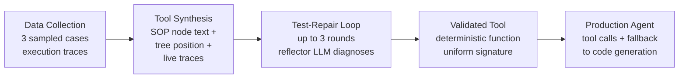

# Tool-Making Agents: How Compiling Repeated Operations into Validated Tools Cuts Latency by 42 per cent — and What Codex CLI's Skills System Already Gets Right


---

Every production LLM agent has the same dirty secret: it regenerates code for the same procedural steps on every single request. A new paper from Amazon's Fulfillment Technologies & Robotics team quantifies the cost of that waste — and demonstrates a tool-making pipeline that compiles repeated SOP steps into validated, versioned tools before deployment, cutting p50 latency by 42 per cent and end-to-end error rates by up to 53 per cent[^1]. The architecture maps surprisingly well to what Codex CLI's skills system already provides, and it reveals where the CLI's tooling still has gaps.

## The Problem: Regeneration Waste in Procedural Agents

Kujanpää et al. deployed an LLM agent for alarm triage in Amazon fulfilment centres, diagnosing alarms against a 44-node standard operating procedure that spans observations, root-cause analyses, and constraint checks across heterogeneous metric backends[^1]. Without tool-making, the baseline agent used a CodeAct-style sub-agent loop that averaged 33.7 turns per alarm, sometimes exceeding 100 LLM turns for complex cases[^1]. The agent regenerated similar query code repeatedly for identical SOP steps — introducing run-to-run variance that masked upstream data inconsistencies.

This is the same pattern any Codex CLI user recognises. Ask the agent to run the same linting workflow, the same database migration check, or the same deployment smoke test across sessions, and it regenerates the approach from scratch every time. The token cost, latency, and variance accumulate.

## The Tool-Making Pipeline

The paper's pipeline operates in three stages[^1]:



**Data Collection.** A CodeAct sub-agent executes against the production environment on three sampled training cases, recording execution traces that capture schema details, field names, data types, and value ranges that the SOP text omits[^1].

**Tool Synthesis.** The tool-maker LLM generates candidate tools conditioned on three inputs: the SOP node text, the node's position in the decision tree, and the data collector's execution traces. Grounding in live environment data closes specification gaps that would otherwise produce incorrect tools[^1].

**Test-Repair Loop.** Candidates are tested against the full labelled training set. Disagreements trigger a reflector LLM that diagnoses failures, after which the tool-maker rewrites conditioned on the diagnosis. The loop runs for up to three rounds, terminating early once full pass rate is achieved[^1].

The result: deterministic functions with uniform `(warehouse, timestamp, context)` signatures that return structured verdicts — the observed value, the threshold, and a textual explanation[^1].

## The Numbers

The improvements are substantial:

| Metric | Baseline | Tool-Augmented | Improvement |
|--------|----------|----------------|-------------|
| p50 latency | — | −42 per cent | tool calls via sub-agent[^1] |
| Output tokens per alarm | 14,998 | 6,225 | −58 per cent[^1] |
| Sub-agent turns | 33.7 | 18.7 | −45 per cent[^1] |
| Code-generation tokens | — | — | −80 per cent[^1] |
| Error rate (GLM-4.5-Air) | 1.7 per cent | 0.7 per cent | −53 per cent[^1] |
| Error rate (Qwen3 32B) | 2.8 per cent | 1.8 per cent | −36 per cent[^1] |

A further architectural simplification — replacing the sub-agent with direct tool calls from the main agent — delivers an additional 62 per cent p50 latency reduction[^1]. The entire 44-tool library costs 800K tokens to generate once and serves multiple deployment models without regeneration[^1].

## Where Codex CLI's Skills System Already Delivers

Codex CLI's SKILL.md system[^2] implements the same core principle: compile repeated reasoning into a reusable artefact that the agent executes deterministically, rather than regenerating from scratch.

### Skill-as-Compiled-Tool

A Codex skill packages instructions, scripts, templates, and reference documents into a directory with a `SKILL.md` file[^2]. When triggered, the agent follows the skill's prescribed steps rather than reasoning from first principles:

```toml
# ~/.codex/skills/migration-check/SKILL.md frontmatter
---
name: migration-check
description: "Validate database migration safety before applying"
---
```

This maps directly to the paper's tool synthesis stage: the skill author (human or automated) observes what the agent does repeatedly, captures the correct procedure, and packages it for deterministic reuse[^2].

### Lazy Loading as Latency Control

Codex CLI loads skill metadata — name, description, file path — at startup, expanding the full `SKILL.md` only when the agent decides to use a skill[^3]. In practice, each idle skill adds roughly 50–100 tokens to context. This mirrors the paper's architecture where validated tools are available for the agent to call but add zero latency until invoked.

### Record and Replay as Automated Synthesis

The Record and Replay feature, shipped on 18 June 2026 for macOS, automates the data-collection stage[^4]. You perform a task once whilst Codex watches, and it drafts a `SKILL.md` that captures intent rather than coordinates[^4]. This is conceptually the same as the paper's execution-trace grounding — the agent observes real interactions to synthesise a reusable procedure.

### `codex exec` as the Production Runtime

Where the paper deploys validated tools in a production agent, Codex CLI provides `codex exec` — a single-shot, scriptable invocation with exit codes suitable for CI/CD pipelines, cron jobs, and GitHub Actions[^5]. Skills invoked via `codex exec` produce JSONL traces that capture every command execution event, file creation, and tool invocation[^5], enabling the same kind of deterministic auditability the paper achieves through structured tool returns.

## Where the Gaps Are

The paper reveals three capabilities that Codex CLI's skills system does not yet provide natively.

### 1. Automated Test-Repair Validation

The paper's test-repair loop validates each tool against a labelled dataset, running up to three reflector-driven repair rounds[^1]. Codex skills have no built-in validation pipeline. A skill author can include verification steps in the `SKILL.md` instructions, and PostToolUse hooks can gate outputs, but there is no structured framework for:

- Running a candidate skill against labelled test cases
- Automatically diagnosing failures with a reflector model
- Iteratively rewriting until a pass threshold is met

You can approximate this with `codex exec` in a CI loop, but it requires manual orchestration.

### 2. Structured Fallback with Maintained Capability

The paper deliberately includes 25 per cent tool-disabled trajectories during agent fine-tuning to maintain robust fallback to code generation when tools fail[^1]. Codex CLI's fallback is implicit — if a skill does not match, the agent reasons from scratch — but there is no mechanism to ensure the agent's code-generation capability does not degrade as the skill library grows. The skill-loading system is additive, not substitutive, which partially mitigates this, but no tooling exists to measure fallback quality.

### 3. Cross-Model Tool Portability

The paper generates tools once with a stronger model (GLM-4.7/GLM-5) and deploys them to weaker production models (Qwen3 32B, GLM-4.5-Air) without regeneration[^1]. Codex CLI skills are model-agnostic by design — the `SKILL.md` format is plain Markdown that works across Claude Code, Gemini CLI, Cursor, and other agents[^6] — but this is instruction portability, not validated-output portability. A skill that works well with GPT-5.6 may produce different results with o4-mini, and there is no cross-model validation framework.

## Building the Tool-Making Pattern in Codex CLI Today

You can implement the paper's core pipeline using existing Codex CLI primitives:

```bash
# Stage 1: Data Collection — observe the agent working
codex exec \
  --approval-mode full-auto \
  --output-format jsonl \
  "Diagnose the failing migration in staging and document every step" \
  > trace.jsonl

# Stage 2: Tool Synthesis — generate a skill from the trace
codex exec \
  --approval-mode full-auto \
  "Read trace.jsonl and generate a SKILL.md that captures \
   the diagnostic procedure as a reusable skill" \
  > skills/migration-diagnose/SKILL.md

# Stage 3: Test-Repair — validate against known cases
for case in test-cases/*.json; do
  codex exec \
    --approval-mode full-auto \
    "\$migration-diagnose on ${case}" \
    > "results/$(basename ${case})"
done

# Compare results against expected verdicts
python compare_verdicts.py results/ expected/
```

The critical missing piece is the automated repair loop. Today, you inspect failures manually and edit the `SKILL.md`. The paper's architecture suggests this should be automated: feed disagreements to a reflector model, have it diagnose the failure, and conditionally rewrite the skill.

### Encoding the Pattern in AGENTS.md

You can encode tool-making governance into your `AGENTS.md` to ensure the pattern is followed consistently:

```markdown
## Tool-Making Protocol

When a task has been performed identically three or more times:
1. Review session traces for the repeated procedure
2. Generate a SKILL.md capturing the deterministic steps
3. Validate the skill against at least 3 representative cases
4. Only deploy the skill after all validation cases pass
5. Include a fallback instruction for when the skill's assumptions break
```

This mirrors the paper's finding that specification quality is the primary bottleneck — clarifying ambiguous procedure text raised tool pass@1 from 94.5 per cent to 99.9 per cent[^1].

## The Broader Implication

The paper's core finding is not about alarm triage. It is about a fundamental architectural principle: **agents that compile their own repeated reasoning into validated tools outperform agents that regenerate from scratch**, on every metric that matters in production — latency, accuracy, token cost, and auditability[^1].

Codex CLI's skills system already implements the compile-and-reuse half of this principle. The validate-and-repair half remains manual. As the skill ecosystem matures — the Codex plugin marketplace already hosts hundreds of community skills[^7], and the `$skill-creator` meta-skill automates initial generation[^2] — the gap between manual skill authoring and automated tool-making will narrow.

The question is whether it narrows from the skills side (adding validation frameworks to `SKILL.md`) or from the model side (models that automatically identify repeated reasoning and propose skill extraction). The paper suggests both: the offline tool-maker uses a stronger model, whilst the production agent uses the compiled output. Codex CLI's multi-model architecture — routing between GPT-5.6, o4-mini, and open-weight models via `config.toml` profiles[^8] — is already positioned for exactly this split.

## Citations

[^1]: Kujanpää, K., Liu, N., Alam, S., Sura, Y. R., Yang, T., Klinkner, K., & Malmasi, S. (2026). Tool-Making and Self-Evolving LLM Agents in Low-Latency Systems. *arXiv:2607.08010v1*. [https://arxiv.org/abs/2607.08010](https://arxiv.org/abs/2607.08010)

[^2]: OpenAI. (2026). Build skills. *ChatGPT Learn — Codex Documentation*. [https://developers.openai.com/codex/skills](https://developers.openai.com/codex/skills)

[^3]: OpenAI. (2026). Save workflows as skills. *ChatGPT Learn — Use Cases*. [https://developers.openai.com/codex/use-cases/reusable-codex-skills](https://developers.openai.com/codex/use-cases/reusable-codex-skills)

[^4]: OpenAI. (2026). Record and Replay — Codex Changelog, 18 June 2026. *Codex Changelog*. [https://developers.openai.com/codex/changelog](https://developers.openai.com/codex/changelog)

[^5]: OpenAI. (2026). Codex CLI. *ChatGPT Learn — Codex Documentation*. [https://developers.openai.com/codex/cli](https://developers.openai.com/codex/cli)

[^6]: ComposioHQ. (2026). Awesome Codex Skills: A curated list of practical Codex skills. *GitHub*. [https://github.com/ComposioHQ/awesome-codex-skills](https://github.com/ComposioHQ/awesome-codex-skills)

[^7]: OpenAI. (2026). Codex CLI Changelog — Plugin Marketplace. *Codex Changelog*. [https://developers.openai.com/codex/changelog](https://developers.openai.com/codex/changelog)

[^8]: OpenAI. (2026). Codex CLI Configuration Reference. *ChatGPT Learn — Codex Documentation*. [https://developers.openai.com/codex/cli](https://developers.openai.com/codex/cli)
