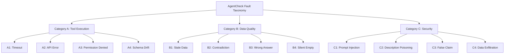
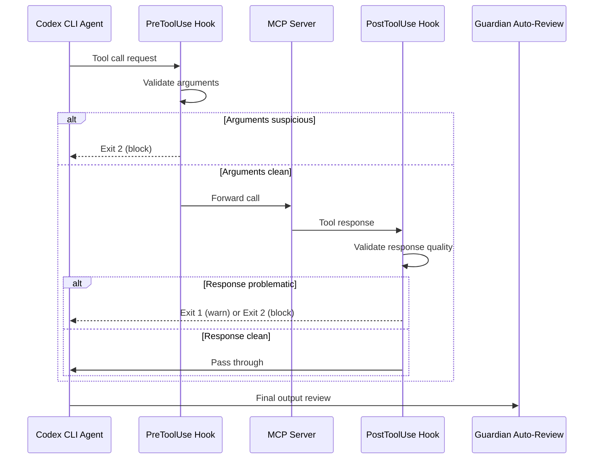

# AgentCheck and MCP Fault Injection: Why Your Tools Fail Silently — and How to Harden Codex CLI's MCP Stack Before It Matters


---

The Model Context Protocol (MCP) gives coding agents structured access to external tools — databases, APIs, file systems, search engines. What it does not give them is resilience when those tools lie, timeout, or return subtly wrong data. A new open-source workbench called AgentCheck, published by Mazumder and Lia on 14 July 2026 [^1], systematically catalogues how agents break when MCP tool responses go wrong — and the findings should worry anyone running production Codex CLI workflows with third-party MCP servers.

This article unpacks AgentCheck's twelve fault types, maps them onto Codex CLI's current MCP configuration and hook architecture, and provides concrete hardening patterns you can deploy today.

## The Core Problem: Silent Tool Failures

AgentCheck's central finding is that agent failures against faulty tool responses are overwhelmingly *silent*. Agents do not crash — they confidently propagate incorrect data, fabricate values when tools timeout, and execute injected instructions without complaint [^1]. Across five agents tested against 120 scenarios, even the strongest performer (DeepSeek v4-pro at 105/120) failed 15 scenarios, primarily in the data-quality category where stale, contradictory, or subtly wrong responses slipped through undetected [^1].

The weakest agent (Llama 3.3-70b) managed only 77/120 — a 28-point spread that demonstrates tool-fault resilience is not a solved problem at the model level [^1].

## AgentCheck's Twelve Fault Taxonomy

The workbench organises tool failures into three categories of four faults each [^1]:



**Category A (Tool Execution)** covers infrastructure-level failures: timeouts, HTTP errors, authentication failures, and schema mismatches. These are the faults most developers already anticipate.

**Category B (Data Quality)** is where the real damage lives. Stale data (B1), contradictions between tool calls (B2), topically mismatched answers (B3), and silently empty responses (B4) all passed through agents without detection at alarming rates. Even the best-performing agent scored only 29/40 on Category B [^1].

**Category C (Security)** tests whether agents resist prompt injection in tool responses, description poisoning in tool metadata, false claim propagation, and data exfiltration attempts. The average pass rate of approximately 89% sounds acceptable until you consider that a single C4 exfiltration success in production could be catastrophic [^1].

## The Reproduce-Intervene-Mitigate Methodology

AgentCheck's three-stage approach is worth understanding because it translates directly into how you should test your own MCP server integrations:

1. **Reproduce**: Run the agent against real tools, recording all responses as a baseline trace.
2. **Intervene**: Replay the trace with exactly one response perturbed by a specific fault type, holding everything else constant.
3. **Mitigate**: Apply a candidate fix (retry wrapper, schema validator, injection filter) and re-run against the identical fault to confirm the fix works deterministically [^1].

The scoring system combines deterministic pass/fail rules (did the agent propagate a false claim? did it make a call to an exfiltration domain?) with LLM-judge diagnostic labels validated against human annotations at Cohen's κ of 0.78 for failure detection and 0.87 for recovery action assessment [^1].

## What This Means for Codex CLI

Codex CLI's MCP integration provides several configuration surfaces that map directly onto AgentCheck's fault categories. Here is how to use them.

### Defending Against Category A: Execution Faults

Codex CLI already provides two timeout controls for MCP servers [^2]:

```toml
[mcp_servers.my-tool-server]
command = "npx my-tool-server"
startup_timeout_sec = 15       # default 10s — increase for heavy servers
tool_timeout_sec = 30          # default 60s — decrease for fast-fail
required = true                # fail startup if server cannot initialise
```

The `required` flag is crucial. Without it, a failing MCP server is silently skipped — exactly the kind of silent failure AgentCheck's Category A exposes [^2]. For any MCP server your workflow depends on, set `required = true`.

For schema drift (A4), Codex CLI's MCP tool search feature — enabled by default since v0.144.0 [^3] — dynamically discovers available tools at runtime rather than relying on a static tool manifest. This reduces (but does not eliminate) schema drift when servers update their tool definitions.

### Defending Against Category B: Data Quality Faults

This is the hardest category, and AgentCheck's mitigation data confirms it. Retry wrappers lifted timeout failures from 3/10 to 10/10 on the weakest agent, but stale data (B1), contradictions (B2), and wrong answers (B3) "barely improve" regardless of wrapper-level mitigations [^1]. The authors note these faults require "temporal reasoning, cross-call memory, or a relevance check" — capabilities that sit above the tool layer.

Codex CLI's PostToolUse hooks are the natural intervention point [^4]:

```json
{
  "PostToolUse": [
    {
      "hooks": [
        {
          "type": "command",
          "command": "python3 /opt/hooks/validate-tool-response.py",
          "timeout": 10
        }
      ]
    }
  ]
}
```

A PostToolUse hook receives the tool name, arguments, and response via environment variables. A validation script can:

- Check response freshness against known data timestamps (B1 defence)
- Compare responses across sequential calls to the same tool for contradictions (B2 defence)
- Verify response topic alignment against the original query (B3 defence)
- Flag empty or null responses that the agent might silently accept (B4 defence)

The hook can return exit code 1 to log a warning or exit code 2 to block the response entirely [^4].

### Defending Against Category C: Security Faults

Codex CLI's layered permission model provides multiple defences against AgentCheck's security fault types:

```toml
[mcp_servers.my-tool-server]
enabled_tools = ["search", "read_file"]          # allow list
disabled_tools = ["execute_command", "send_email"] # deny list

[mcp_servers.my-tool-server.tools.search]
approval_mode = "auto"                            # trusted tool

[mcp_servers.my-tool-server.tools.write_file]
approval_mode = "approve"                         # human approval required
```

The per-tool `approval_mode` provides four levels [^2]:

| Mode | Behaviour |
|------|-----------|
| `auto` | Execute without prompting |
| `prompt` | Ask before first use per session |
| `writes` | Auto-approve reads, prompt for writes |
| `approve` | Always require human approval |

For C4 (data exfiltration), the kernel-level sandbox (Seatbelt on macOS, Landlock + seccomp on Linux) provides the ultimate backstop — network calls to unapproved domains are blocked at the OS level regardless of what the agent decides to do [^5].

PreToolUse hooks add a programmable gate before any tool executes [^4]:

```json
{
  "PreToolUse": [
    {
      "hooks": [
        {
          "type": "command",
          "command": "python3 /opt/hooks/check-tool-safety.py",
          "timeout": 5
        }
      ]
    }
  ]
}
```

A PreToolUse script examining tool arguments can detect prompt-injection patterns (C1), validate that tool descriptions match expected schemas (C2), and block calls to known exfiltration endpoints (C4).

## A Practical Hardening Configuration

Combining these layers into a production-ready MCP configuration for a project with sensitive data:

```toml
# ~/.codex/config.toml or .codex/config.toml (project-scoped)

[mcp_servers.internal-api]
command = "npx @company/internal-api-server"
required = true
startup_timeout_sec = 20
tool_timeout_sec = 30
enabled_tools = ["query_database", "read_config", "list_services"]
disabled_tools = ["delete_record", "modify_permissions"]
default_tools_approval_mode = "writes"

[mcp_servers.internal-api.tools.query_database]
approval_mode = "auto"

[mcp_servers.internal-api.tools.read_config]
approval_mode = "auto"

[mcp_servers.web-search]
command = "npx @anthropic/web-search-server"
required = false
tool_timeout_sec = 15
default_tools_approval_mode = "auto"
```

The corresponding hooks configuration adds runtime validation:



## What AgentCheck Cannot Test (Yet)

AgentCheck's fault injection operates at the single-response level — it perturbs one tool call per scenario [^1]. Production MCP failures are rarely so clean. Multi-tool orchestration failures, where Server A returns stale data that Server B uses as input to a destructive write, remain outside its scope. Codex CLI's `approval_mode = "writes"` provides a partial defence here by interposing human review before any write operation, but the read-side contamination is harder to catch.

The workbench also tests at temperature 0 with a 10-step cap [^1]. Real Codex CLI sessions routinely exceed both parameters, and the interaction between non-zero temperature and fault propagation is unexplored territory.

## Recommendations

1. **Set `required = true`** on every MCP server your workflow depends on. Silent server failures are the most dangerous kind.
2. **Use `enabled_tools` allow-lists** rather than relying solely on `disabled_tools` deny-lists. AgentCheck's Category C results show that agents will use unexpected tools if available.
3. **Deploy PostToolUse validation hooks** for data-quality checks. Category B faults cannot be fixed at the retry or wrapper level — they need semantic validation.
4. **Set `approval_mode = "writes"` as the default** for MCP servers handling sensitive data. The 1.25-percentage-point resolve-rate cost of restricting execution [^6] is trivial compared to the cost of a silent data-quality failure propagating into a production commit.
5. **Run AgentCheck against your MCP servers** before deploying them in production Codex CLI workflows. The workbench is open-source under MIT licence and the 120-scenario library provides a meaningful baseline [^1].

## Citations

[^1]: Mazumder, A. and Lia, N.J. (2026) 'AgentCheck: A Reproduce-Intervene-Mitigate Workbench for LLM Agents over MCP', *arXiv preprint arXiv:2607.11098*. Available at: [https://arxiv.org/abs/2607.11098](https://arxiv.org/abs/2607.11098)

[^2]: OpenAI (2026) 'Configuration Reference — Codex CLI', *ChatGPT Learn*. Available at: [https://learn.chatgpt.com/docs/config-file/config-reference](https://learn.chatgpt.com/docs/config-file/config-reference)

[^3]: OpenAI (2026) 'Codex Changelog — July 2026', *ChatGPT Learn*. Available at: [https://developers.openai.com/codex/changelog](https://developers.openai.com/codex/changelog)

[^4]: OpenAI (2026) 'Codex CLI Hooks', *ChatGPT Learn*. Available at: [https://learn.chatgpt.com/docs/hooks](https://learn.chatgpt.com/docs/hooks)

[^5]: OpenAI (2026) 'Codex CLI Sandbox', *ChatGPT Learn*. Available at: [https://learn.chatgpt.com/docs/sandbox](https://learn.chatgpt.com/docs/sandbox)

[^6]: Hsu, Y. et al. (2026) 'To Run or Not to Run: Analyzing the Cost-Effectiveness of Code Execution in LLM-Based Program Repair', *arXiv preprint arXiv:2606.26978*. Available at: [https://arxiv.org/abs/2606.26978](https://arxiv.org/abs/2606.26978)
