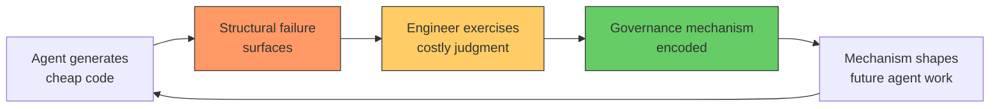
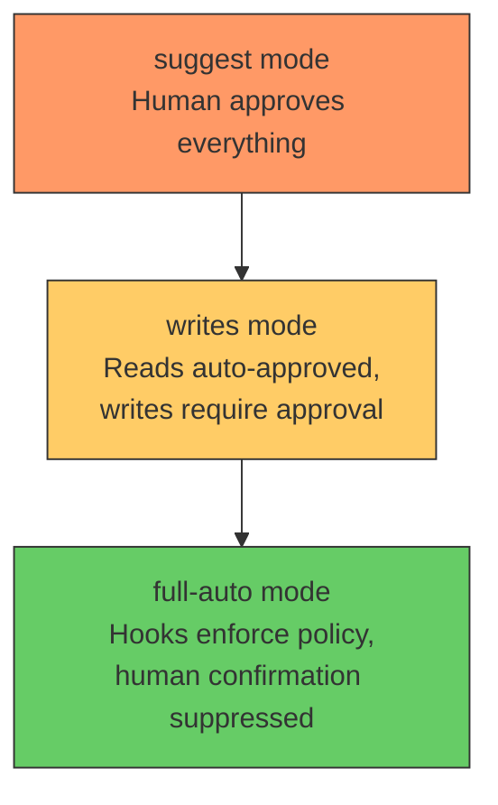
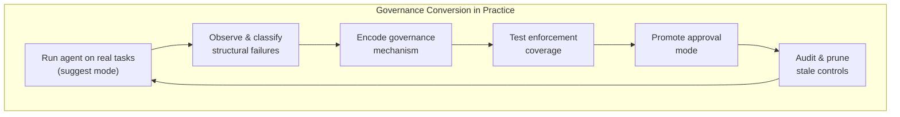

# Cheap Code, Costly Judgment: Governance Conversion in Agentic Software Engineering — and How Codex CLI's Hook Architecture Makes It Mechanical


---

## The Bottleneck Has Moved

For decades, the central constraint in software engineering was implementation effort. Producing a few hundred lines of clean, tested code occupied a skilled developer for a full day, and nearly every engineering practice — code review, sprint planning, architectural governance — was designed around that scarcity [^1]. Frontier coding agents have inverted this. A single engineer can now produce 420 KLOC of production code and 1.16 MLOC of supporting artefacts in twelve weeks [^2]. Code is cheap. The question is no longer *whether* an agent can generate useful output, but whether the resulting system remains inspectable, correctable, and maintainable.

Davis et al.'s "Cheap Code, Costly Judgment" (arXiv:2607.01087, July 2026) offers the first empirically grounded process model for how engineering teams actually solve this problem [^2]. Their governance conversion theory, distilled from 88 contemporaneous field notes across a real production build, describes a cycle that every Codex CLI user will recognise — and one that Codex's hook architecture already partially mechanises.

## The Governance Conversion Cycle

The core insight is deceptively simple. Agentic velocity does not eliminate governance; it *relocates* it. Controls are not designed up front from known obligations. Instead, they are discovered from failures that become visible only during agentic work [^2].



The cycle repeats. Each iteration converts a human judgment call into a durable, machine-actionable control. The system accumulates governance mechanically rather than bureaucratically. This stands in contrast to conventional governance models — ISO 27001, SOC 2 — which derive controls from predetermined compliance obligations rather than from observed failure [^2].

## Structural Failure Classes

The study surfaces recurring failure classes that any developer running coding agents at scale will have encountered. These are not bugs in the traditional sense; they are structural properties of cheap-code production:

| Failure Class | Description | Governance Response |
|---|---|---|
| **Hallucinated validation** | Agent writes tests that pass without testing genuine behaviour [^3] | Verifier separation — read-only test commands as ground truth |
| **Budget-pressure shortcuts** | Agent makes confident guesses instead of reading files as token limits approach [^3] | Budget preflight — stop degraded attempts before execution |
| **Context bloat** | Retry attempts exponentially increase token costs with diminishing returns [^3] | Context distillation — structured summaries replace raw failure dumps |
| **Fake-passing tests** | Agent produces tests that exercise the wrong code paths but report green [^3] | Independent assertion pipelines outside agent scope |
| **Terminal failure** | Malformed tasks or corrupted repository state where retrying cannot help [^3] | Early termination signals and scope-boundary enforcement |

The critical finding: treating all failures as "retry" is catastrophically expensive. Each failure class requires a different remediation strategy, and most failures are detectable *before* the next attempt runs [^3]. Preventive governance is cheaper than reactive recovery by orders of magnitude.

## Mapping Governance Conversion to Codex CLI

Codex CLI's architecture already provides the mechanical substrate for encoding governance conversions. The hook system, approval modes, and AGENTS.md directives correspond directly to the mechanisms Davis et al. describe.

### Hook-Based Failure Detection

Codex CLI supports five hook event types firing at different points in the agent loop: `SessionStart`, `UserPromptSubmit`, `PreToolUse`, `PostToolUse`, and `Stop` [^4]. Each maps to a governance intervention point:

```toml
# ~/.codex/config.toml
[features]
codex_hooks = true
```

```json
{
  "hooks": [
    {
      "event": "PreToolUse",
      "command": "node ~/.governance/budget-preflight.mjs",
      "timeout_ms": 5000
    },
    {
      "event": "PostToolUse",
      "command": "node ~/.governance/output-validator.mjs",
      "timeout_ms": 10000
    }
  ]
}
```

A `PreToolUse` hook can inspect the proposed tool call and return `permissionDecision: "deny"` with a reason [^5]. This is the mechanical equivalent of the budget-preflight governance mechanism — the engineer's judgment about when an attempt is degraded gets encoded once and enforced on every subsequent agent turn.

### The Deny-Only Constraint

A crucial implementation detail: Codex's hook engine currently parses but rejects `updatedInput` (PreToolUse) and `updatedMCPToolOutput` (PostToolUse) [^5]. You can observe and deny; you cannot redact or rewrite. This is actually a governance feature, not a limitation. It forces a clean separation between detection and remediation, preventing hooks from silently mutating agent behaviour in ways that would themselves require governance.

### AGENTS.md as Encoded Judgment

The governance conversion model explains how controls emerge from failures. In Codex CLI, `AGENTS.md` is where those controls accumulate [^6]:

```markdown
# AGENTS.md

## Patch Scope Constraints
- Never modify files under `migrations/` or `ci/`
- Test files must not import production dependencies directly
- Maximum 3 files changed per commit

## Verification Requirements
- Run `make test` after every code change
- Run `make lint` before committing
- If tests fail twice on the same approach, stop and report
```

Each rule in `AGENTS.md` is a fossilised governance conversion — a failure that surfaced during agentic work, was diagnosed by an engineer, and was encoded as a constraint for future runs. The file grows organically as the project encounters new failure classes [^6].

### Approval Mode as Graduated Trust

Codex CLI v0.144.0 introduced a `writes` approval mode that permits declared read-only actions and asks before writes [^7]. This maps directly to the governance conversion model's graduated trust pattern:



The progression from `suggest` through `writes` to `full-auto` mirrors the governance conversion cycle: as the engineer discovers which operations are safe through experience, trust is encoded into the permission model. Critically, `--full-auto` keeps hooks running — the human confirmation prompt is suppressed, but audit and policy enforcement remain active [^5].

## The Coverage Gap Problem

Davis et al.'s model assumes that governance mechanisms, once encoded, are reliably enforced. In practice, Codex CLI's hook coverage has real holes. Hooks reliably fire for shell (Bash) tool calls but not for `apply_patch` file edits or most MCP tool calls [^5]. For agents that lean on `apply_patch` or rich MCP toolsets, hook coverage has material gaps.

This means the governance conversion cycle currently requires a hybrid approach:

1. **Hook layer** — mechanical enforcement for shell commands and tool calls where hooks fire reliably
2. **AGENTS.md layer** — instruction-based enforcement for `apply_patch` and MCP operations where hooks do not reach [^5]
3. **Guardian auto-review** — a secondary LLM judge that reviews agent output as a catch-all [^8]

The redundancy is intentional. Simon Willison's agentic engineering patterns guide argues that governance must become machine-actionable enough to shape agent work, rather than resting on human review [^1]. Codex CLI's layered approach — deterministic hooks where possible, instruction-based constraints where necessary, LLM-based review as a backstop — reflects this principle.

## Practical Governance Conversion Workflow

For teams adopting agentic workflows, the governance conversion cycle suggests a concrete process:

1. **Run the agent in `suggest` mode** on real tasks. Observe failures. Record them in field notes, as Davis et al. did with their 88-note corpus.

2. **Classify each failure** against the structural categories. Is it hallucinated validation? Budget pressure? Context bloat? Terminal failure?

3. **Encode the governance response** in the appropriate layer:
   - Shell-level failures → `PreToolUse`/`PostToolUse` hooks
   - Scope violations → `AGENTS.md` constraints
   - Quality regressions → Guardian auto-review rules

4. **Escalate the approval mode** as governance coverage grows. Move from `suggest` to `writes` to `full-auto` as confidence accumulates.

5. **Audit the conversion** periodically. Review `AGENTS.md` for stale constraints. Check hook logs for false denials. The governance conversion cycle is evolutionary, not static.



## The Judgment Tax

Davis et al.'s most provocative claim is that governance is not overhead — it is the engineering [^2]. In a world where code generation is abundant, the scarce resource is the judgment required to convert observed failures into durable controls. The engineer who spends a day writing a `PreToolUse` hook that prevents budget-pressure shortcuts across all future sessions is producing more lasting value than the agent that generated 10,000 lines of code in the same period.

This reframes the economics of coding agents. The return on agentic velocity is not measured in lines of code produced. It is measured in governance mechanisms accumulated — the growing body of encoded judgment that makes each subsequent agent run safer, cheaper, and more predictable.

For Codex CLI users, this means treating `AGENTS.md`, hook scripts, and approval policies not as configuration burden but as the primary engineering output of agentic work. The code is cheap. The governance is the product.

---

## Citations

[^1]: Willison, S. (2026). "Writing code is cheap now." *Agentic Engineering Patterns*. [https://simonwillison.net/guides/agentic-engineering-patterns/code-is-cheap/](https://simonwillison.net/guides/agentic-engineering-patterns/code-is-cheap/)

[^2]: Davis, J.C., Amusuo, P.C., Singla, T., Çakar, B., & Davis, K.A. (2026). "Cheap Code, Costly Judgment: A Case Study on Governable Agentic Software Engineering." *arXiv:2607.01087*. [https://arxiv.org/abs/2607.01087](https://arxiv.org/abs/2607.01087)

[^3]: "12 Failure Classes and 30 Billion Tokens Spent: What We Learned About Trusting AI Coding Agents." *Dev|Journal*. [https://earezki.com/ai-news/2026-06-30-what-12-failure-classes-and-30-billion-tokens-spent-taught-us-about-trusting-ai-coding-agents/](https://earezki.com/ai-news/2026-06-30-what-12-failure-classes-and-30-billion-tokens-spent-taught-us-about-trusting-ai-coding-agents/)

[^4]: OpenAI. (2026). "Hooks." *Codex CLI Documentation*. [https://developers.openai.com/codex/hooks](https://developers.openai.com/codex/hooks)

[^5]: "Codex CLI hook governance: what works today (and what doesn't)." *Agentic Control Plane*. [https://agenticcontrolplane.com/blog/codex-cli-hooks-reference](https://agenticcontrolplane.com/blog/codex-cli-hooks-reference)

[^6]: OpenAI. (2026). "Custom instructions with AGENTS.md." *Codex CLI Documentation*. [https://developers.openai.com/codex/guides/agents-md](https://developers.openai.com/codex/guides/agents-md)

[^7]: OpenAI. (2026). "Codex CLI Changelog — v0.144.0." *OpenAI Developers*. [https://developers.openai.com/codex/changelog](https://developers.openai.com/codex/changelog)

[^8]: OpenAI. (2026). "Codex CLI Changelog — v0.144.2." *OpenAI Developers*. [https://developers.openai.com/codex/changelog](https://developers.openai.com/codex/changelog)
