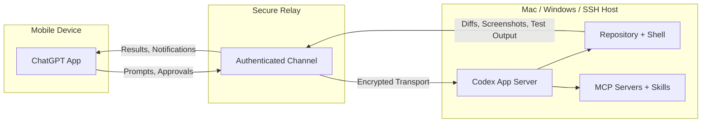
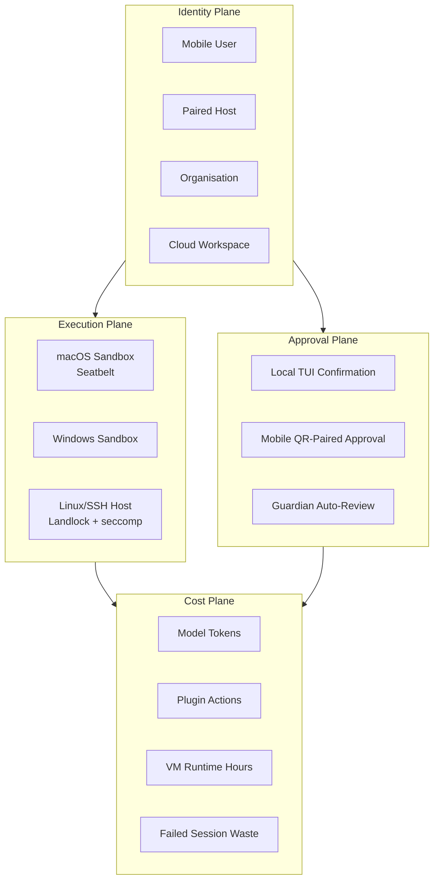

# Codex Remote GA: Mobile Approvals, QR Pairing, and the Four-Plane Governance Model for Enterprise Agent Workflows


## Introduction

On 25 June 2026, OpenAI promoted Codex Remote to general availability across every paid ChatGPT plan — Plus, Pro, Business, Enterprise, and Education[^1]. The feature lets developers start, monitor, and approve Codex sessions on a Mac or Windows host from the ChatGPT mobile app on iOS or Android[^2]. What looks like a convenience feature — "approve a file write from the sofa" — is, in practice, a governance surface that splits intent, execution, and approval across three distinct devices and networks.

This article examines Codex Remote's architecture, the QR-pairing security model, the DigitalOcean cloud-host plugin, and the four-plane governance framework that enterprise teams should adopt before enabling remote access at scale.

## The Architecture: Relay, Not Tunnel

Codex Remote does not expose the host machine's ports to the internet. Instead, it routes traffic through a secure relay layer that keeps trusted machines reachable across authorised ChatGPT devices without requiring VPN configuration or open firewall rules[^2].



The phone is a **control surface**, not an execution environment. All computational work — shell commands, file edits, MCP tool calls, browser automation — runs on the host[^3]. The mobile app receives diffs, screenshots, terminal output, and test results, and sends back prompts, follow-up instructions, and approval decisions.

### What stays on the host

Repository files, credentials, shell sessions, MCP servers, skills, and sandbox settings never leave the host machine[^2]. The relay transmits only the conversational artefacts needed for the mobile control surface.

### What crosses the relay

Prompts, approval/rejection signals, screenshots, rendered diffs, and test summaries traverse the relay. This is the same data that the desktop TUI already shows — the relay simply extends the display surface to a paired phone.

## QR Pairing: One Device, One Host

Codex Remote replaced its earlier connection model with authenticated one-to-one QR pairing as of the GA release[^1]. The pairing flow works as follows:

1. On the host, open the Codex App sidebar and select **Set up Codex mobile**. A single-use QR code appears.
2. On the phone, open the ChatGPT mobile app and scan the QR code.
3. The app verifies that both devices share the same ChatGPT account and workspace.
4. Any configured MFA, SSO, or passkey challenge completes before the link activates[^2].

Connections established since 8 June 2026 survived the GA rollout without re-pairing; older inactive connections required a fresh QR scan[^1].

### Trust boundary

The ChatGPT account login is the effective trust perimeter. Account compromise grants full host access, including shell command execution[^3]. This makes workspace-level SSO and MFA configuration — available on Business and Enterprise plans — a hard prerequisite for any team deploying Codex Remote beyond personal use.

## The DigitalOcean Plugin: Disposable Cloud Hosts

The GA release shipped alongside a DigitalOcean plugin that provisions a Droplet, configures SSH access, and connects it to the Codex App as a remote workspace[^1]. This converts manual host preparation into a disposable cloud-host lane[^4]:

```bash
# No doctl CLI required — the plugin handles provisioning
# From the Codex App, select the DigitalOcean plugin
# Choose a Codex-ready image, region, and size
# SSH keys are generated and configured automatically
# Billing is hourly until the Droplet is explicitly deleted
```

You can also connect an existing Droplet by ID. The plugin's value is operational: it removes the SSH key ceremony that previously made cloud hosts impractical for ad-hoc agent sessions.

### SSH host detection

The Codex desktop app auto-detects SSH hosts from `~/.ssh/config`[^5]. As of the 6 July iOS update, private-key and credential-less SSH connections are supported from mobile[^6]. This means a developer can pair their phone, provision a DigitalOcean Droplet from the desktop app, then monitor and approve agent actions on that Droplet from their phone — all without touching a terminal.

## Mobile Capabilities in Practice

From the paired mobile app, a developer can[^2]:

- **Start new tasks** in projects on the host, or continue existing ones
- **Send follow-up instructions** and answer the agent's questions
- **Approve or reject** commands and other actions
- **Review outputs** — diffs, test results, terminal output, screenshots
- **Receive notifications** when tasks complete or need attention
- **Switch between hosts** if multiple machines are paired

The approval surface is the critical element. When Codex operates in `suggest` or `auto-edit` mode, destructive operations — shell commands, file writes outside the sandbox — require explicit approval. Codex Remote extends that approval gate to the phone, making it possible to supervise long-running agent sessions without sitting at the host machine.

## The Four-Plane Governance Model

Codex Remote introduces a split-brain operating model: intent originates on a phone, code executes on a desktop or cloud VM, the model call routes through a gateway, and approval happens in a different device session[^4]. Without structured governance, cost attribution and security review become opaque.

The emerging best practice is a four-plane governance model[^4]:



### Identity plane

Mobile user, paired host, organisation, and cloud workspace must correlate before model spending is authorised. Enterprise workspace admins must enable Remote Control access before users can connect from phones[^2].

### Execution plane

Mac, Windows, and Linux hosts require different sandbox, network, and secret policies[^4]. A DigitalOcean Droplet running as a disposable build agent needs tighter network isolation than a developer's personal MacBook.

### Approval plane

Mobile approvals are first-class governance events, not equivalent to a local terminal confirmation[^4]. Teams should configure Codex hooks to log approval decisions with device metadata — which host, which phone, which user — for audit trails.

### Cost plane

Model tokens, plugin actions, VM time, and failed sessions must reconcile to the same user or project ledger[^4]. The DigitalOcean plugin's hourly billing makes this especially important: an unattended Droplet with an active Codex session continues accumulating charges until explicitly deleted.

## Configuration for Enterprise Teams

### Enabling remote access

Workspace admins control remote access at the organisation level. The configuration hierarchy is:

1. **Workspace policy** — admin enables or disables Remote Control for the organisation
2. **Host settings** — each host enables `Allow connections` in Settings → Connections[^2]
3. **User pairing** — individual QR pairing per device, subject to workspace MFA/SSO

### Hooks for remote governance

Codex hooks — GA since mid-2026 — provide the extension points for remote-specific governance[^7]:

```toml
# config.toml — example hook configuration for remote sessions
[hooks]
# Log all approvals with device metadata
on_approval = "scripts/log-approval.sh"

# Block destructive operations when approved from mobile
on_pre_tool_use = "scripts/check-remote-restrictions.sh"
```

A `PreToolUse` hook can inspect whether the current session is remote-controlled and enforce stricter policies — for example, blocking `rm -rf` or `git push --force` when approval comes from a mobile device rather than the local TUI.

### Keep-awake and session continuity

The host machine must remain awake, online, and signed in for remote control to function[^2]. The Codex App exposes a **Keep computer awake** toggle in connection settings. For cloud hosts accessed via SSH, this constraint does not apply — the VM stays available independently.

Thread handoff between local and remote hosts uses Git worktrees, with the user reviewing the destination and branch before transfer[^2].

## Operational Risks

### Unattended agent sessions

An agent with active credentials continues executing after the user puts their phone away. If approval mode is set to `full-auto` and the host has network access, the agent can make API calls, push commits, and provision resources unsupervised. Teams should pair remote access with `suggest` mode and `rollout_budget` limits as a minimum.

### Ghost hosts

Removed devices can create server-side associations that block re-pairing[^3]. The fix is to clear the device from Settings → Connections on the host before attempting a new QR scan.

### Proxy and network edge cases

HTTP proxy misconfiguration can prevent host detection, leaving the mobile app stuck on "Waiting for desktop"[^3]. Codex v0.144+ honours system proxy, PAC, and WPAD settings when `respect_system_proxy` is enabled in configuration[^8].

## What This Changes

Codex Remote GA transforms the approval gate from a synchronous, desk-bound interaction into an asynchronous, location-independent governance decision. For solo developers, this is convenience. For enterprise teams, it is a routing control-plane decision that touches identity, execution, approval, and cost simultaneously.

The practical implication: before enabling Codex Remote across an organisation, define your provisioning permissions, allowed VM images, host lifespan policies, and user attribution rules. The four-plane model provides the framework; your `config.toml`, hooks, and workspace policies provide the implementation.

## Citations

[^1]: OpenAI, "Codex Changelog — June 25, 2026: Codex Remote reaches general availability," [https://developers.openai.com/codex/changelog](https://developers.openai.com/codex/changelog)

[^2]: OpenAI, "Remote connections — Codex documentation," [https://learn.chatgpt.com/docs/remote-connections](https://learn.chatgpt.com/docs/remote-connections)

[^3]: MCP Directory, "Codex Remote: Control Codex From Your Phone," [https://mcp.directory/blog/codex-remote-guide-2026](https://mcp.directory/blog/codex-remote-guide-2026)

[^4]: TheRouter.ai, "Codex Remote GA turns mobile approvals into a routing control plane decision," [https://therouter.ai/news/codex-remote-ga-mobile-approval-routing/](https://therouter.ai/news/codex-remote-ga-mobile-approval-routing/)

[^5]: OpenAI, "Codex Changelog — July 9, 2026: Codex joins ChatGPT desktop app," [https://developers.openai.com/codex/changelog](https://developers.openai.com/codex/changelog)

[^6]: OpenAI, "ChatGPT for iOS 1.2026.181 — July 6, 2026: Connection shortcut and SSH private key support," [https://developers.openai.com/codex/changelog](https://developers.openai.com/codex/changelog)

[^7]: TechTimes, "OpenAI Codex Remote Goes Live for All Plans: Phone Control Now Secured by QR Relay," [https://www.techtimes.com/articles/319201/20260627/openai-codex-remote-goes-live-all-plans-phone-control-now-secured-qr-relay.htm](https://www.techtimes.com/articles/319201/20260627/openai-codex-remote-goes-live-all-plans-phone-control-now-secured-qr-relay.htm)

[^8]: OpenAI, "Codex CLI Releases — v0.144," [https://github.com/openai/codex/releases](https://github.com/openai/codex/releases)
