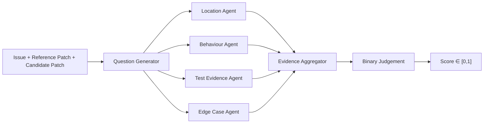
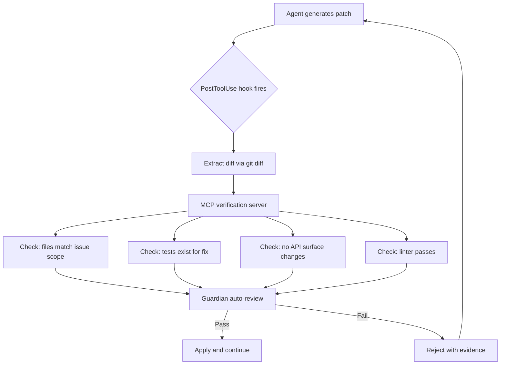

# Dockerless Patch Verification: Why Environment-Free Judgement Outperforms Open-Source Verifiers by 14 AUC Points — and What It Means for Codex CLI's Sandbox Strategy


---

Every coding agent eventually has to answer a deceptively hard question: *is this patch correct?* The standard answer — spin up a Docker container, install dependencies, run the test suite — works, but it scales poorly. Per-repository environments cost minutes of setup, gigabytes of images, and brittle dependency chains. Zeng et al.'s *Dockerless* paper, published June 2026, argues that a well-trained agentic verifier can skip execution entirely and still match environment-based post-training performance [^1]. The implications for Codex CLI developers — who already operate inside a kernel-level sandbox without Docker — are significant.

## The Core Problem: Execution-Based Verification Does Not Scale

Standard patch verification in coding-agent research pipelines relies on building per-repository Docker images, installing exact dependency versions, and executing unit tests against candidate patches. Projects like SWE-Gym and Multi-SWE-RL maintain thousands of these images [^1]. The overhead is substantial:

- **Environment setup** dominates wall-clock time: building or pulling a Docker image, installing packages, and configuring test harnesses can exceed the time the agent spends generating the patch itself.
- **Language coverage** is limited: most execution-based pipelines target Python repositories, leaving compiled languages (Rust, C, Go) underserved because their build toolchains are harder to containerise reliably.
- **Reinforcement learning** amplifies the cost: RL training loops require thousands of rollouts, each needing a fresh environment for reward computation.

Dockerless demonstrates that an agentic verifier — one that explores repositories using read-only shell commands rather than executing tests — can eliminate these costs whilst retaining competitive accuracy [^1].

## How Dockerless Works

The architecture is a two-stage pipeline built on a Qwen3.5-9B backbone [^1].

### Stage 1: Question Generation and Evidence Gathering

Given an issue description, a reference patch, and a candidate patch, the verifier generates 2–4 verification questions across four categories:

- **Location** — Does the fix apply to the correct files and functions?
- **Behaviour** — Does the patched code implement the intended logic?
- **Test evidence** — Do existing tests or assertions corroborate the fix?
- **Edge cases** — Could the patch break adjacent functionality?

Parallel sub-agents then explore the repository using read-only shell tools (`find`, `grep`, `rg`) to answer each question with evidence-backed responses [^1].

### Stage 2: Binary Judgement

The verifier aggregates collected question-answer pairs and produces a binary verdict. The logit values of the "0" and "1" tokens are converted to a continuous score via softmax, yielding a value in [0, 1] [^1].



### Training Pipeline

The training uses rejection sampling on 3,700 execution-labelled issues from SWE-Gym and Multi-SWE-RL [^1]:

1. A teacher model generates question–answer–judge trajectories.
2. Only trajectories whose verdicts match ground-truth test outcomes are retained.
3. The negative-to-positive sample ratio is capped at 4:1 to handle class imbalance.
4. Standard next-token cross-entropy loss trains a shared backbone across all stages.

For post-training, the pipeline collects 16,000 rollouts in a minimal Linux environment, scores final patches via Dockerless, and trains supervised fine-tuning (SFT) on the top 4,000 globally-ranked trajectories. Reinforcement learning uses GRPO with Dockerless as the reward source, averaging rewards across two independent evaluations per rollout [^1].

## The Numbers

The results are striking:

| Benchmark | Dockerless | Best Open-Source Verifier | Delta |
|-----------|-----------|--------------------------|-------|
| SWE-bench Verified (AUC) | 81.0 | 66.7 (DeepSWE) | +14.3 |
| Multi-SWE-bench Flash (AUC) | 72.1 | 62.9 | +9.2 |

Dockerless also outperforms four frontier LLM judges used zero-shot: GPT-5.4 (75.9 AUC), GLM-5 (73.2), Kimi-K2.5 (70.7), and DeepSeek-V3.2 [^1].

When used as a reward signal for RL post-training, the fully environment-free pipeline produces a model that achieves 62.0 per cent resolve rate on SWE-bench Verified, 50.0 per cent on Multilingual, and 35.2 per cent on Pro — matching environment-based post-training and surpassing the Qwen3.5-9B baseline by 2.4, 8.7, and 2.9 points respectively [^1].

### The SFT Data Quality Effect

A telling ablation: training on all 16,000 unfiltered trajectories yields 58.8 per cent (below the 59.6 per cent baseline). Dockerless-filtered 4,000 trajectories reach 60.6 per cent, matching the environment-based 4,000-trajectory selection. Random 4,000 selection manages only 58.2 per cent [^1]. The verifier's value is not just in judging patches at inference time — it curates better training data.

### Where Environment-Free Falls Short

Compiled languages expose the gap. Rust shows a +7.0-point advantage for environment-based verification; C shows +13.3 points [^1]. Compiler diagnostics — type errors, lifetime violations, linker failures — are simply not available without a build toolchain. Python, Go, JavaScript, Java, and PHP remain within ±2.5 points of environment-based performance [^1].

## What This Means for Codex CLI

Codex CLI's sandbox architecture already operates without Docker. On macOS, Apple's Seatbelt framework enforces kernel-level restrictions; on Linux, Landlock and seccomp filter filesystem and syscall access [^2]. The sandbox is designed for isolation, not for providing per-repository execution environments. This means Codex CLI developers face exactly the verification challenge Dockerless addresses.

### Mapping Dockerless Patterns to Codex CLI Features

**PostToolUse hooks as verification gates.** Codex CLI's hook system fires after shell tool calls, providing `stdout`, `stderr`, and exit codes for audit [^3]. A PostToolUse hook could invoke a lightweight verifier — or even a Dockerless-style question-generation step — against the diff produced by the agent before allowing the session to proceed.

```toml
# config.toml — example verification gate
[hooks.post_tool_use]
command = "scripts/verify-patch.sh"
timeout_ms = 30000
```

**⚠️ Note:** As of v0.144.3, PostToolUse hooks fire reliably for Bash/shell tool calls but not for `apply_patch` file edits [^4]. To ensure verification coverage, instruct the agent via AGENTS.md to apply changes through shell commands (`sed`, `git apply`) rather than the built-in patch tool, or await the fix tracked in openai/codex#16732 [^4].

**AGENTS.md as scope encoding.** Dockerless's question-generation stage maps naturally to AGENTS.md instructions that define what "correct" means for a given repository. Rather than encoding verification logic in a trained model, teams can specify verification criteria declaratively:

```markdown
## Patch Verification Rules

- Every bug fix MUST include a test that reproduces the original failure.
- Changes to `src/core/` MUST NOT modify the public API surface.
- All patches MUST pass `ruff check` and `mypy --strict` before completion.
```

**MCP tool servers as evidence-gathering agents.** Dockerless's parallel sub-agents use `find`, `grep`, and `rg` to explore repositories. In Codex CLI, an MCP tool server could expose structured code-analysis tools — AST queries, dependency graphs, test coverage lookups — providing richer evidence than raw grep output [^5]. With tool search enabled by default since v0.143.0, the verifier MCP server would only load when the agent encounters a verification step [^5].

**Guardian auto-review as an LLM judge layer.** Codex CLI's Guardian feature provides an auto-review subagent that can inspect proposed changes before they are applied [^6]. This is architecturally similar to Dockerless's judgement stage — a second model reviewing evidence and producing a verdict. Guardian already operates within the approval policy framework, meaning verification failures can block the agent without requiring manual intervention [^6].

### A Practical Verification Pipeline

Combining these features produces a Codex CLI verification pipeline that mirrors Dockerless's architecture:



### The Compiled-Language Gap

Dockerless's weakness with Rust and C is instructive for Codex CLI teams. For compiled languages, environment-free verification is insufficient — you need the compiler. Codex CLI's sandbox allows build tool execution within the sandboxed workspace, so teams working in compiled languages should wire compiler invocation into their PostToolUse hooks rather than relying on static analysis alone:

```bash
#!/bin/bash
# verify-patch.sh — compiled-language verification gate
LANG=$(detect-language)
case "$LANG" in
  rust)   cargo check --message-format=short 2>&1 ;;
  c|cpp)  make -j$(nproc) 2>&1 | head -50 ;;
  *)      echo "PASS: interpreted language, static checks sufficient" ;;
esac
```

## The Broader Shift: From Execution to Judgement

Dockerless represents a broader trend in coding-agent research: replacing expensive execution with cheaper judgement. The 7.2 per cent wall-clock overhead for Dockerless reward computation — compared to the ~2,308 seconds average rollout time [^1] — suggests that verification is not the bottleneck. The agent's thinking time dominates.

For Codex CLI developers, this reframes the verification question. Rather than asking "how do I run the full test suite after every change?", ask "what evidence would convince me this patch is correct, and can I gather that evidence without executing anything?"

The answer, for interpreted languages at least, is increasingly yes.

## Key Takeaways

1. **Environment-free verification is viable.** Dockerless achieves 81.0 AUC on SWE-bench Verified, outperforming all open-source verifiers and frontier LLM judges [^1].
2. **Verification improves training data.** Dockerless-filtered SFT trajectories match environment-based selection quality, demonstrating that a good verifier is also a good data curator [^1].
3. **Compiled languages still need compilers.** Rust and C show 7–13 point gaps without execution environments [^1]. Wire compiler checks into PostToolUse hooks for these languages.
4. **Codex CLI's existing architecture is already environment-free.** The kernel-level sandbox, PostToolUse hooks, Guardian auto-review, and MCP tool servers provide all the building blocks for a Dockerless-style verification pipeline [^2][^3][^6].
5. **The bottleneck is rollout time, not verification time.** At 7.2 per cent of wall-clock overhead, verification is cheap [^1]. Add it liberally.

---

## Citations

[^1]: Zeng, W., Shi, Y., Gu, X., et al. "Dockerless: Environment-Free Program Verifier for Coding Agents." arXiv:2606.28436, June 2026. [https://arxiv.org/abs/2606.28436](https://arxiv.org/abs/2606.28436)

[^2]: OpenAI. "Sandbox — Codex CLI Concepts." OpenAI Developers, 2026. [https://developers.openai.com/codex/concepts/sandboxing](https://developers.openai.com/codex/concepts/sandboxing)

[^3]: OpenAI. "Agent Approvals & Security — Codex CLI." OpenAI Developers, 2026. [https://developers.openai.com/codex/agent-approvals-security](https://developers.openai.com/codex/agent-approvals-security)

[^4]: GitHub Issue #16732. "ApplyPatchHandler doesn't emit PreToolUse/PostToolUse hook event." openai/codex, 2026. [https://github.com/openai/codex/issues/16732](https://github.com/openai/codex/issues/16732)

[^5]: OpenAI. "Codex CLI — MCP Tool Search." OpenAI Developers, 2026. [https://developers.openai.com/codex/cli](https://developers.openai.com/codex/cli)

[^6]: OpenAI. "Codex CLI Releases — v0.144.2." GitHub, July 2026. [https://github.com/openai/codex/releases](https://github.com/openai/codex/releases)
