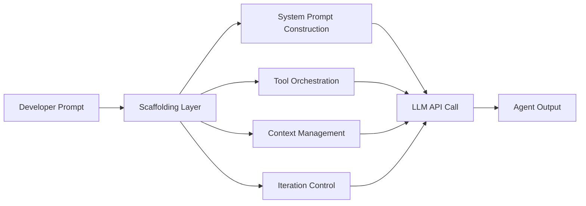
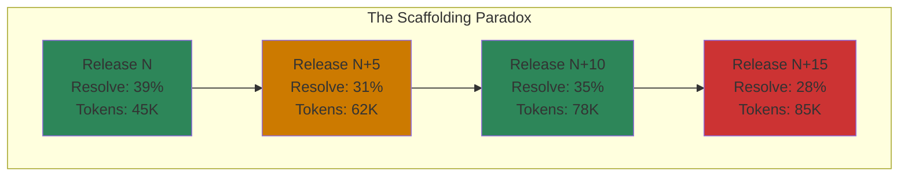

# Don't Blame the LLM: How Scaffolding Evolution Shapes Coding Agent Quality — and What It Means for Your Codex CLI Upgrades


---

Every senior developer running Codex CLI has experienced it: you update to the latest version, run a task that worked yesterday, and the agent fumbles. The instinct — almost always — is to blame the model. "OpenAI must have degraded the API." A controlled longitudinal study published on 4 July 2026 by Ben Sghaier, Li, Adams, and Hassan demonstrates that this instinct is wrong far more often than anyone assumed [^1]. The culprit is the *scaffolding* — the middleware layer between you and the LLM that orchestrates prompts, tools, context windows, and reasoning loops.

Their findings carry direct implications for how you manage Codex CLI upgrades, pin versions, and build your own quality gates.

## What Is Agentic Scaffolding?

A coding agent is not a model. It is a *system harness* — a composite of an LLM, a scaffolding layer, and an execution environment [^2]. The scaffolding handles:

- **System prompt construction** — what the model sees before your task
- **Tool orchestration** — which tools are available, how outputs are parsed
- **Context management** — what fits in the window, what gets compacted
- **Iteration control** — retry logic, reasoning loops, stop conditions

When you run `codex "fix the failing test"`, the model receives a carefully constructed prompt built by the scaffolding, not your raw instruction. Change the scaffolding, and you change the agent's behaviour — even if the underlying model is identical.



## The Hyper-Churn Reality

The study's first finding is sobering: agent scaffoldings release at velocities 13–28× higher than traditional open-source projects [^1]. The numbers across five major scaffoldings tell the story:

| Scaffolding | Releases/Week | Median Interval | Commits/Day | Total Issues |
|---|---|---|---|---|
| OpenCode | 18.0 | 0.12 days | 34.2 | 8,621 |
| **Codex CLI** | **12.4** | **0.19 days** | **13.0** | **5,574** |
| Gemini CLI | 10.3 | 0.20 days | 21.0 | 9,951 |
| Qwen Code | 10.0 | 0.59 days | 19.9 | — |
| OpenHands CLI | 1.5 | 5.06 days | — | — |

For comparison, VS Code releases 0.8 times per week; GitHub CLI manages 0.6 [^1]. Codex CLI has shipped 518 releases over 293 days, merging 3,840 PRs with a median review time of 0.13 days [^1]. This is not a criticism — it is the competitive reality of a space where scaffolding improvements can move benchmark scores by margins comparable to a model generation upgrade [^2].

But velocity has a cost.

## Quality Does Not Monotonically Improve

The researchers fixed the underlying LLM and evaluated 35 sequential releases of Qwen Code CLI against 50 stratified SWE-bench Verified tasks. The results are striking:

- **Resolve rate range:** 23.0 per cent to 39.0 per cent (mean 30.5 per cent) [^1]
- **No statistically significant upward trend:** Spearman ρ = 0.208, p = 0.231 [^1]
- **Token consumption nearly doubled** over the release window (Spearman ρ = 0.535, p < 0.01) [^1]
- **Tool calls more than doubled** without corresponding resolve improvements (Spearman ρ = 0.489, p < 0.01) [^1]

Early versions of the scaffolding sometimes outperformed their more sophisticated successors [^1]. More features did not mean better outcomes — they meant more tokens burned for the same or worse results.



## Where Regressions Hide

Not all scaffolding components carry equal risk. The study maps quality shifts to specific architectural zones [^1]:

**High-risk modifications:**
- **LLM Provider Layer** — the abstraction that translates between the scaffolding and the model API. Changes here are most frequently associated with quality degradation.
- **Context Management** — governs what information flows to the model. Reworking compaction or context selection directly impacts resolve rates.

**Lower-risk modifications:**
- **Extensibility Layer** — plugin and extension mechanisms consistently associate with neutral or safe outcomes.
- **Security Layer** — sandbox and permission changes carry lower regression risk.

This maps directly to Codex CLI's architecture. The recent v0.144.2 release rolled back a Guardian auto-review prompting regression [^3] — a textbook LLM Provider Layer change that passed all automated checks but degraded agent behaviour. The root cause was not the model; it was a prompt construction change in the scaffolding.

## The CI/CD Blind Spot

The study's most important finding for practitioners: every quality regression they documented passed all existing automated checks [^1]. Unit tests, integration tests, and linting caught nothing because they test *code correctness*, not *agentic behaviour*.

> "The quality regressions we document are emergent behavioral effects of the interaction between the scaffolding and the LLM, and they are not catchable by conventional unit or integration tests." [^1]

This means your standard CI/CD pipeline is structurally blind to the class of regressions most likely to affect your day-to-day experience with Codex CLI.

## Practical Implications for Codex CLI Users

### 1. Pin Your Scaffolding Version

When a Codex CLI session works reliably on a critical project, pin the version:

```bash
# Install a specific version
npm install -g @openai/codex@0.144.2

# Verify before upgrading
codex --version
```

The study shows that upgrading brings unpredictable quality changes [^1]. Treat scaffolding upgrades like dependency upgrades in production code — test before you trust.

### 2. Use `codex doctor` as a Regression Signal

Codex CLI v0.144+ ships `codex doctor` with richer diagnostics [^3]:

```bash
# Human-readable diagnostics
codex doctor

# Machine-readable for CI
codex doctor --json
```

Whilst `codex doctor` checks environment health rather than agentic quality, it surfaces configuration drift that may correlate with behaviour changes — particularly around provider settings, proxy configuration, and sandbox state.

### 3. Build Your Own Agentic Quality Gate

The paper advocates for "Agentic Quality Assurance" — automated regression testing that evaluates non-functional quality beyond code correctness [^1]. For Codex CLI, this means:

```bash
#!/bin/bash
# agentic-smoke-test.sh — run after every codex upgrade
TASKS=(
  "Add a health-check endpoint to src/api/server.ts"
  "Write a unit test for the parseConfig function"
  "Fix the type error in src/utils/validator.ts"
)

for task in "${TASKS[@]}"; do
  codex exec --quiet "$task" 2>/dev/null
  # Check: did it complete? How many tokens? Did it loop?
done
```

### 4. Monitor Token Consumption as a Quality Proxy

The study demonstrates that token consumption and tool calls trend upward across releases without proportional quality gains [^1]. If your Codex CLI sessions are consuming noticeably more tokens after an upgrade, that is a signal — not of a better agent thinking harder, but potentially of a scaffolding regression causing unnecessary iteration.

Codex CLI's `tool_output_token_limit` and `model_auto_compact_token_limit` in `config.toml` provide guardrails [^4]:

```toml
[model]
model_auto_compact_token_limit = 80000

[tools]
tool_output_token_limit = 25000
```

### 5. Separate Scaffolding from Model in Your Mental Model

When a task fails after an upgrade, your diagnostic process should be:

1. **Check the scaffolding version** — did you upgrade Codex CLI recently?
2. **Check the model** — has OpenAI rotated the model endpoint?
3. **Check your configuration** — did AGENTS.md, config.toml, or sandbox settings change?

The study shows that practitioners overwhelmingly blame the model when the scaffolding is at fault [^1]. Inverting this assumption will save you hours of misguided debugging.

## The Codex CLI Release Velocity in Context

Codex CLI's 12.4 releases per week places it second only to OpenCode in the study's analysis [^1]. With 518 releases across 293 days and 3,840 merged PRs, the project maintains a median PR review time of just 0.13 days [^1].

This velocity is what enables rapid feature delivery — system proxy support, remote control GA, plugin enhancements, and Guardian policy improvements all shipped within weeks of each other in June–July 2026 [^3]. But it also means that the scaffolding you relied on last Tuesday may behave differently from the one you installed this morning.

The companion taxonomy paper by the same research group identifies 12 architectural dimensions across three layers — control architecture, tool and environment interface, and resource management — that differ fundamentally across scaffoldings [^2]. Different scaffolding architectures differ in ways that affect cost, reliability, and failure modes, even when wrapping the same model.

## The Path Forward

The study calls for a new engineering discipline: treating agentic scaffolding as quality-critical software that requires evaluation beyond functional correctness [^1]. For Codex CLI users, this translates to three practices:

1. **Report and control for scaffolding version alongside model version** when diagnosing failures
2. **Prioritise efficiency metrics** (token consumption, tool calls) alongside effectiveness (resolve rate)
3. **Treat high-risk architectural zones** (LLM provider changes, context management reworks) as signals to delay upgrading until the release stabilises

The model is rarely to blame. The scaffolding almost always is.

---

## Citations

[^1]: O. Ben Sghaier, H. Li, B. Adams, and A. E. Hassan, "Don't Blame the Large Language Model: How Scaffolding Evolution Shapes Coding Agent Quality," *ACM Transactions on Software Engineering and Methodology*, arXiv:2607.03691, July 2026. [https://arxiv.org/abs/2607.03691](https://arxiv.org/abs/2607.03691)

[^2]: O. Ben Sghaier, H. Li, B. Adams, and A. E. Hassan, "Inside the Scaffold: A Source-Code Taxonomy of Coding Agent Architectures," arXiv:2604.03515, April 2026. [https://arxiv.org/abs/2604.03515](https://arxiv.org/abs/2604.03515)

[^3]: OpenAI, "Codex CLI Releases," GitHub, accessed 14 July 2026. [https://github.com/openai/codex/releases](https://github.com/openai/codex/releases)

[^4]: OpenAI, "Codex CLI Configuration Reference," Codex documentation, accessed 14 July 2026. [https://developers.openai.com/codex/changelog](https://developers.openai.com/codex/changelog)

[^5]: M. Galster et al., "Position: Coding Benchmarks Are Misaligned with Agentic Software Engineering," arXiv:2606.17799, June 2026. [https://arxiv.org/abs/2606.17799](https://arxiv.org/abs/2606.17799)
