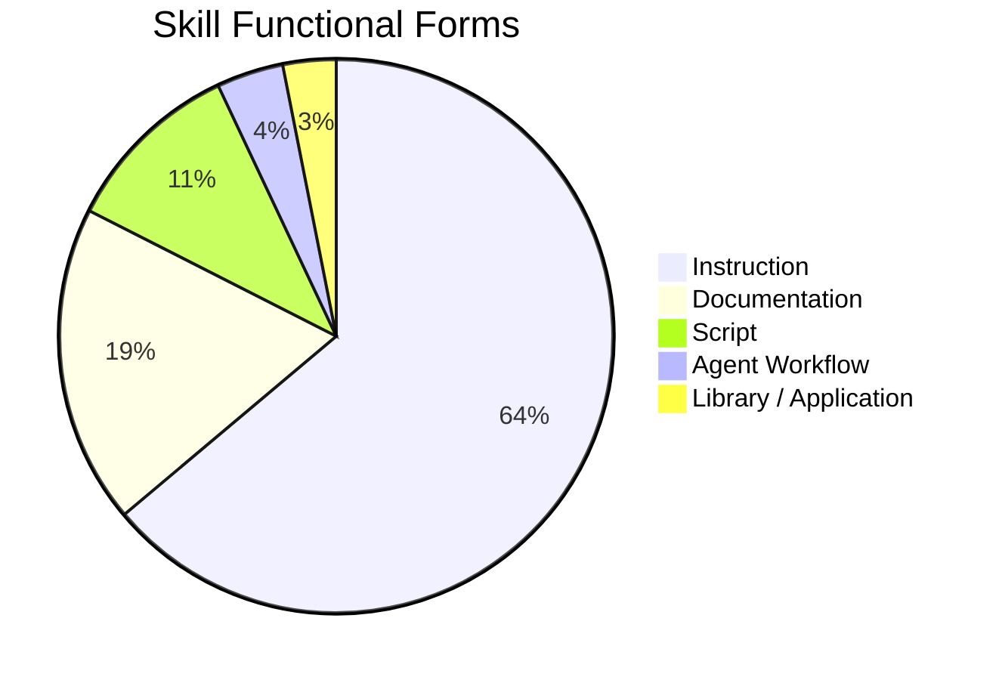
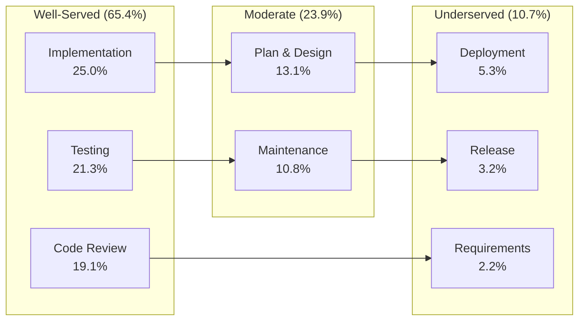

# Inside the Skill Market: What 11,497 SE Skills Reveal About the Gaps in Our Agent Workflows — and How to Fill Them with Codex CLI


---

## The Explosion Nobody Mapped

Since the Agent Skills specification launched in December 2025 [^1], every major coding agent — Codex CLI, Claude Code, Gemini CLI, Cursor, GitHub Copilot — has adopted SKILL.md as the dominant mechanism for packaging reusable developer workflows [^2]. Thousands of skills now sit across public marketplaces and repositories, yet nobody had systematically measured what those skills actually *do*, which software engineering activities they cover, and — critically — which activities they ignore entirely.

Cao et al. changed that with "Inside the Skill Market: From Software Engineering Activities to Reusable Agent Skills" (arXiv:2607.09065), published on 10 July 2026 [^3]. Their study analyses **11,497 unique SE-related skills** drawn from four public marketplaces, maps them against an eight-stage software development lifecycle, and exposes a striking coverage imbalance: two-thirds of all skills target just three code-centric activities, leaving requirements, deployment, and maintenance severely underserved.

This article unpacks the paper's key findings, maps its taxonomy onto Codex CLI's skill architecture, and provides practical patterns for filling the lifecycle gaps the study identifies.

---

## The Dataset: 775,790 to 11,497

The researchers cast a wide net before filtering aggressively:

| Stage | Count |
|---|---|
| Initial collection across four marketplaces | 775,790 |
| After intra-market deduplication | 29,416 |
| After cross-marketplace deduplication | 25,139 |
| After rule-based relevance filtering | 15,895 |
| After LLM-based relevance filtering | 18,348 |
| Intersection of both filters | 13,564 |
| Final dataset (after removing deleted repos) | 11,497 |

Cross-marketplace overlap was remarkably low — only **722 skills (6.3 per cent)** appeared across more than one platform [^3]. The skill ecosystem is heavily siloed; developers publishing on one marketplace rarely cross-list.

---

## What Skills Actually Are: Five Functional Forms

The study classifies skills into five functional asset forms [^3]:



The dominance of instruction-only skills (63.8 per cent) is the paper's most provocative finding from a practitioner standpoint. Nearly two-thirds of skills are pure natural-language prompts with no executable code — meaning the agent has no deterministic fallback when the LLM misinterprets the instruction. Only **10.5 per cent** contain scripts, and a mere **3.9 per cent** define multi-step agent workflows [^3].

For Codex CLI users, this maps directly to the skill architecture: a SKILL.md with only prose instructions versus one that includes a `scripts/` directory with executable helpers [^4]. The official guidance is clear — "prioritize instructions over scripts unless deterministic behavior is required" [^4] — but the study suggests the community has over-indexed on instructions at the expense of verifiability.

---

## The Lifecycle Imbalance: 65.4 per cent in Three Stages

The paper maps all 11,497 skills against an eight-stage SE lifecycle taxonomy. The distribution is sharply skewed [^3]:

| Lifecycle Stage | Skills | Share |
|---|---|---|
| Implementation | 2,875 | 25.0 per cent |
| Testing | 2,446 | 21.3 per cent |
| Code Review | 2,198 | 19.1 per cent |
| Plan & Design | 1,511 | 13.1 per cent |
| Maintenance & Operations | 1,240 | 10.8 per cent |
| Deployment | 609 | 5.3 per cent |
| Release | 363 | 3.2 per cent |
| Requirements | 255 | 2.2 per cent |

Three code-centric stages — Implementation, Testing, and Code Review — account for **65.4 per cent** of all skills. Requirements engineering sits at just 2.2 per cent, and Release at 3.2 per cent. The implication is clear: the community builds skills for activities LLMs already handle reasonably well, whilst neglecting the high-context, cross-system activities where structured skill guidance would add the most value.



---

## Activity-Level Analysis: The Top Three Dominate

At finer granularity, the study identifies a 20-activity taxonomy. The top three activities alone — Code Review, Test Automation, and Security Auditing — account for **35.5 per cent** of all task assignments [^3]:

- **Code Review**: 2,877 skills
- **Test Automation**: 2,343 skills
- **Security Auditing**: 1,970 skills

Meanwhile, Dependency Management (346 skills), LLM Agent Development (270 skills), and Data Engineering (176 skills) remain thinly covered. The long tail suggests that the skill ecosystem serves generalists writing boilerplate review and test skills, whilst domain-specific expertise — the kind that would genuinely differentiate an agent's output — remains scarce.

---

## Structural Quality: What Skills Contain

The paper also audits structural completeness across six elements [^3]:

| Element | Presence |
|---|---|
| Frontmatter (name, description) | 97.8 per cent |
| Commands | 79.3 per cent |
| Verification steps | 73.7 per cent |
| Workflow structure | 60.1 per cent |
| Usage guidance | 51.3 per cent |
| Examples | 50.1 per cent |

Nearly half of all skills lack concrete examples, and 40 per cent have no defined workflow structure. Skills without verification steps (26.3 per cent) give the agent no mechanism to confirm success — a pattern the configuration-smells literature has separately identified as a quality risk [^5].

Token length analysis reveals most skills are compact: the average is **2,078 tokens**, with 90 per cent under 4,150 tokens [^3]. This fits within Codex CLI's progressive-disclosure budget — approximately 2 per cent of the model's context window for the initial skill list, with full SKILL.md content loaded only on selection [^4].

---

## Security: The 19.6 per cent Problem

Perhaps the most alarming finding concerns skill safety. On ClawHub, **19.6 per cent of skills** were flagged as suspicious by *both* VirusTotal and SkillSpector [^3]. Additionally:

- Only **23 per cent** of skills passed instruction-scope checks cleanly (53 per cent received notes, 24 per cent raised concerns)
- Only **33 per cent** handled credentials without concern
- **68 per cent** passed install-mechanism checks

On SkillNet, cost awareness scored **0.2 per cent "Good"**, and executability scored just **0.5 per cent "Good"** [^3]. The ecosystem's quality controls remain immature — skills are easy to publish but difficult to vet.

---

## Mapping Findings to Codex CLI's Skill Architecture

Codex CLI's skill system directly addresses several issues the paper identifies, whilst leaving others to the developer.

### Progressive Disclosure Solves the Context Problem

Codex loads skills in two phases: an initial scan that includes only names and descriptions (capped at ~8,000 characters), followed by full SKILL.md loading on selection [^4]. This means the 2,078-token average skill fits comfortably, but developers should still front-load trigger words in descriptions — Codex may truncate if many skills are installed.

### The Six-Level Precedence Stack

Codex CLI scans skill directories in precedence order [^4]:

```toml
# Precedence (highest to lowest):
# 1. $CWD/.agents/skills        — folder-specific
# 2. $CWD/../.agents/skills     — parent folder
# 3. $REPO_ROOT/.agents/skills  — repository-wide
# 4. $HOME/.agents/skills       — personal cross-project
# 5. /etc/codex/skills           — system-level
# 6. Bundled with Codex          — built-in
```

This layered approach lets teams share deployment and release skills at the repo level whilst keeping personal code-review preferences at the user level — directly addressing the lifecycle-imbalance problem by making it natural to install stage-specific skills at the appropriate scope.

### Filling the Gaps: Skills for Underserved Stages

Based on the paper's findings, here are practical SKILL.md patterns for the three most underserved lifecycle stages.

**Requirements Gathering Skill (2.2 per cent coverage):**

```markdown
---
name: requirements-extractor
description: >
  Extract structured requirements from issue descriptions,
  Slack threads, or meeting notes. Use when starting a new
  feature or triaging a backlog item. Do NOT use for
  implementation or code review.
---

## Instructions

1. Read the provided input (issue, thread, or transcript)
2. Extract functional requirements as testable statements
3. Identify non-functional constraints (performance, security)
4. Flag ambiguous requirements with ⚠️
5. Output structured YAML to `requirements/<feature>.yaml`

## Verification

- Every requirement has an acceptance criterion
- No requirement is both functional and non-functional
- Ambiguous items are explicitly flagged
```

**Release Checklist Skill (3.2 per cent coverage):**

```markdown
---
name: release-checklist
description: >
  Run pre-release validation: changelog, version bump,
  dependency audit, licence check. Use before tagging a
  release. Do NOT use for deployment or CI configuration.
---

## Instructions

1. Verify CHANGELOG.md has an entry for this version
2. Confirm version in package.json / pyproject.toml matches
3. Run `npm audit` or equivalent dependency check
4. Verify no LICENCE file changes since last release
5. Generate release notes from conventional commits

## Scripts

scripts/check-version-consistency.sh
scripts/generate-release-notes.sh
```

**Deployment Validation Skill (5.3 per cent coverage):**

```markdown
---
name: deploy-validator
description: >
  Validate deployment readiness: health checks, rollback
  plan, environment parity. Use after CI passes, before
  production deploy. Do NOT use for local development.
---

## Instructions

1. Verify health-check endpoint returns 200
2. Confirm rollback procedure is documented
3. Diff environment variables against staging
4. Check database migration is reversible
5. Validate resource limits match capacity plan
```

### Disabling Suspect Skills

The paper's security findings make Codex CLI's `config.toml` disable mechanism essential [^4]:

```toml
[[skills.config]]
path = "/home/user/.agents/skills/suspect-skill/SKILL.md"
enabled = false
```

Until marketplace vetting improves, treat third-party skills as untrusted code. Review SKILL.md content before installation, particularly checking for credential access patterns and unbounded install mechanisms.

---

## Evolution and Maintenance: The Stale Skill Problem

The study found that most skills "stopped being updated after their initial release" [^3]. On ClawHub, **969 skills** had only a single version ever published, whilst only **12 skills** exceeded 20 versions [^3]. Growth spiked in January 2026 (2,042 skill updates) but the overall pattern suggests a write-once culture.

This echoes the configuration-smells research from dos Santos et al. [^5], which found "Init Fossilisation" in 24 per cent of AGENTS.md files — configuration written at project inception and never updated. The same pattern appears in skills: developers create them for an immediate need and rarely maintain them as dependencies, APIs, and best practices evolve.

For Codex CLI users, the practical takeaway is version-pinning discipline. If you install a third-party skill via `$skill-installer`, track when you last reviewed its content. A skill written for GPT-5.2-Codex [^6] may encode assumptions that no longer hold when the default model updates.

---

## What This Means for the Codex CLI Ecosystem

The Skill Market paper provides the first empirical baseline for where the agent-skills ecosystem stands. Three implications matter most for Codex CLI practitioners:

1. **Write skills for the gaps, not the peaks.** The community has saturated Implementation, Testing, and Code Review. The highest-value contributions now lie in Requirements, Release, and Deployment skills — precisely the stages where structured guidance prevents the costliest errors.

2. **Add scripts and verification.** With 63.8 per cent of skills being instruction-only and 26.3 per cent lacking verification steps, skills that include executable scripts and explicit success criteria will outperform the median by design.

3. **Treat marketplace skills as untrusted.** A 19.6 per cent suspicious-flagging rate across dual scanners means nearly one in five publicly available skills warrants scrutiny. Use Codex CLI's disable mechanism, review SKILL.md content, and prefer skills from the official OpenAI curated set [^7] or your own team's repository.

The skill ecosystem is growing fast — 775,790 entries across four marketplaces in under a year — but growth without quality and lifecycle balance produces noise, not capability. The developers who build skills for the underserved stages, with executable verification and proper maintenance, will define what "agent-assisted software engineering" actually means in practice.

---

## Citations

[^1]: Agent Skills Specification, agentskills.io, [https://agentskills.io/specification](https://agentskills.io/specification)
[^2]: "12 Best OpenAI Codex CLI Skills in 2026 (Installed and Tested)", Agensi, [https://www.agensi.io/learn/best-codex-cli-skills-2026](https://www.agensi.io/learn/best-codex-cli-skills-2026)
[^3]: Cao, J., Yan, X., Chen, S., Lu, Y., Liu, Z., & Cheung, S.-C. (2026). "Inside the Skill Market: From Software Engineering Activities to Reusable Agent Skills." arXiv:2607.09065, [https://arxiv.org/abs/2607.09065](https://arxiv.org/abs/2607.09065)
[^4]: "Build skills," OpenAI Codex Documentation, [https://learn.chatgpt.com/docs/build-skills](https://learn.chatgpt.com/docs/build-skills)
[^5]: dos Santos, R. et al. (2026). "Configuration Smells in AGENTS.md." arXiv:2606.15828, [https://arxiv.org/abs/2606.15828](https://arxiv.org/abs/2606.15828)
[^6]: "Codex CLI Changelog," OpenAI, [https://developers.openai.com/codex/changelog](https://developers.openai.com/codex/changelog)
[^7]: "Codex Skills," OpenAI GitHub, [https://github.com/openai/skills](https://github.com/openai/skills)
