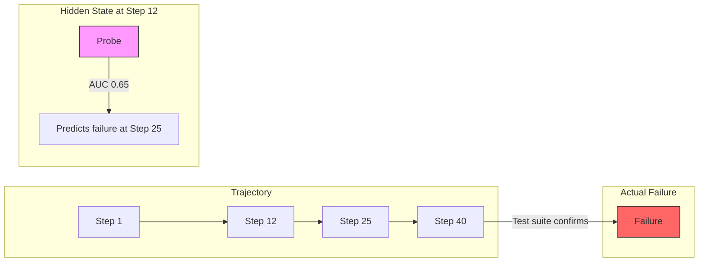

# Latent Programming Horizons: What LLM Hidden States Reveal About Code Correctness — and Why Codex CLI's Hook Architecture Is Already Wired for Early Intervention


---

Your coding agent spends forty steps editing files, running tests, and reasoning about failures. Somewhere around step twelve, the model already knows the patch will break. It does not tell you. It does not stop. It keeps burning tokens until the test suite confirms what its own hidden states encoded half a trajectory ago.

That is the central finding of *Latent Programming Horizons in Coding Agents* by Silva, Tu, and Monperrus (arXiv:2607.05188, July 2026)[^1] — and it has immediate implications for how practitioners configure Codex CLI today.

## The Probe Experiment

The researchers recorded **22,714 agent trajectories** across two models — Poolside's **Laguna-XS.2** (33B total, 3B active)[^2] and Alibaba's **Qwen3.6-35B-A3B** (35B total, 3B active)[^3] — solving tasks from SWE-bench Verified (500 tasks) and SWE-bench Pro (731 tasks)[^1]. From these trajectories they extracted **79,480 code edits** and recorded **22.4 million hidden-state vectors** at the residual stream of each model.

They then trained simple logistic-regression probes — no deep networks, no fine-tuning — on these hidden states to predict four properties of the evolving codebase:

| Property | Best AUC | Model / Benchmark |
|---|---|---|
| Well-formedness (parses) | 0.78 | Laguna-XS.2 |
| Full correctness (all tests pass) | **0.83** | Qwen3.6-35B-A3B |
| Partial correctness (fewer failures) | **0.84** | Qwen3.6-35B-A3B |
| Regression introduced | 0.75 | Both models on Pro |

A linear classifier on the model's own intermediate representations can tell you, with 0.83 AUC, whether the current code passes its test suite — without running the tests[^1].

## The 25-Step Horizon

The more surprising result: these probes predict the future. Trained to classify the outcome of an edit that has not happened yet, the Full Correctness probe maintained above-chance performance **up to roughly 25 steps ahead**, declining from ~0.80 AUC at k=0 to ~0.58 around k=25[^1]. Even at k=50 steps, performance remained above a random baseline.



The authors call this the **latent programming horizon** — the distance into the future at which the model's internal representations still carry useful signal about eventual outcomes. The model is, in effect, simulating the trajectory's end state long before it materialises.

## Layer Geometry

Not all layers carry equal signal. The probes showed an **inverted-U pattern**: weakest at layer 1, peaking across intermediate layers (11–31), and slightly weaker at the final layer (40)[^1]. This mirrors findings in the companion paper by the same group studying pre-generation correctness, where a linear probe on prompt-final hidden states reached **0.931 AUC** for predicting first-attempt correctness before a single token of code was generated (arXiv:2606.14530)[^4].

The implication is architectural: the signal lives in the middle of the network, where abstract program representations form before being collapsed into token predictions.

## Cross-Benchmark Transfer

Probes trained on SWE-bench Verified and tested on SWE-bench Pro (and vice versa) showed AUC drops of only **0.04–0.09 units**[^1]. This is not dataset memorisation — it is a genuine, transferable encoding of program properties in the model's latent space.

## What This Means for Codex CLI Practitioners

The research is not yet productised. You cannot attach a probe to `o4-mini` and watch it light up mid-trajectory. But the findings expose a fundamental inefficiency in current agent workflows — and Codex CLI's hook architecture already provides the intervention points to address it.

### 1. PostToolUse Hooks as Early-Intervention Gates

Every time Codex CLI executes a tool — running tests, writing files, applying patches — the `PostToolUse` hook fires[^5]. Today, practitioners use these hooks for output truncation and security scanning. The latent-horizons research suggests a more ambitious use: **trajectory-aware verification**.

```toml
# ~/.codex/config.toml — trajectory health check after every tool call
[hooks.PostToolUse]
command = "scripts/trajectory-health.sh"
timeout_ms = 5000
```

A `trajectory-health.sh` script can track the ratio of failing-to-passing tests across consecutive tool calls. If the ratio worsens for three consecutive edits — a pattern the probe data suggests the model already "knows" about internally — the hook exits with code 1 to surface a warning, or code 2 to block further execution[^5].

```bash
#!/usr/bin/env bash
# trajectory-health.sh — detect worsening test trajectories
FAIL_HISTORY=".codex/fail_history.json"

current_failures=$(jq '.test_results.failures' "$CODEX_TOOL_OUTPUT" 2>/dev/null || echo "-1")
previous_failures=$(jq -r '.[-1] // 0' "$FAIL_HISTORY" 2>/dev/null || echo "0")

# Append current to history
jq --argjson f "$current_failures" '. + [$f]' "$FAIL_HISTORY" > "${FAIL_HISTORY}.tmp" \
  && mv "${FAIL_HISTORY}.tmp" "$FAIL_HISTORY"

# Check for 3 consecutive increases
worsening=$(jq '[.[-3:] | to_entries[] | select(.value > 0)] |
  if length >= 3 then
    (.[0].value < .[1].value) and (.[1].value < .[2].value)
  else false end' "$FAIL_HISTORY" 2>/dev/null)

if [ "$worsening" = "true" ]; then
  echo "WARNING: Test failures increasing for 3 consecutive edits. Trajectory may be diverging." >&2
  exit 1
fi
```

### 2. rollout_budget as a Coarse Horizon Limiter

The research shows models burn tokens well past the point where their own hidden states encode failure. The `rollout_token_budget` configuration key provides a blunt but effective ceiling[^6]:

```toml
[harness]
rollout_token_budget = 50000
```

With a median trajectory of 36,000 tokens and the probe signal degrading beyond 25 steps[^1], a 50,000-token budget lets the agent complete most solvable tasks whilst cutting off the long tail of futile retries.

### 3. model_auto_compact_token_limit and Context Decay

The latent horizon decays because the model's working memory fills with noise from failed attempts. The `model_auto_compact_token_limit` key controls when Codex CLI compresses conversation history[^7]:

```toml
[model]
model_auto_compact_token_limit = 30000
```

Setting this lower than the default forces earlier compaction, which — counterintuitively — may preserve the model's internal correctness signal by preventing context pollution from failed trajectories. The ChainSWE research showed that raw history carry-over outperforms summarisation for sequential tasks[^8], but the latent-horizons data suggests the advantage depends on *what* is being carried: successful edit context helps, failed-attempt noise hurts.

### 4. Guardian Auto-Review as an External Probe

Codex CLI's Guardian auto-review subagent[^9] acts as an external equivalent of the internal probe: a second model pass that evaluates the patch before it lands. The latent-horizons research validates this architecture — if the generating model's own hidden states encode correctness, a separate review pass can surface that signal explicitly.

```toml
[review]
auto_review = true
auto_review_model = "codex-auto-review"
```

The v0.144.2 Guardian policy rollback[^10] demonstrated what happens when this external verification layer regresses — a real-world example of the probe signal disappearing when the scaffolding changes underneath.

### 5. AGENTS.md Scope Constraints as Overshoot Prevention

The probes revealed that regression detection (AUC 0.75) lags behind correctness detection (AUC 0.83)[^1]. The model knows when code is wrong more reliably than it knows when a fix has introduced new breakage. This asymmetry maps directly to AGENTS.md patch-scope constraints:

```markdown
<!-- AGENTS.md -->
## Patch Constraints
- Touch only files directly related to the issue
- Do not refactor adjacent code
- If tests pass, stop. Do not optimise further.
```

The "if tests pass, stop" directive is crude but effective: it prevents the agent from continuing to edit past the correctness horizon into the regression zone where its own internal signal is weakest.

## The Broader Signal

Two independent research groups have now demonstrated that LLM hidden states carry structured information about code correctness:

1. **Pre-generation**: 0.931 AUC for first-attempt correctness prediction before any code is written[^4]
2. **Mid-trajectory**: 0.83 AUC for current correctness, with useful signal 25 steps ahead[^1]
3. **Repair geometry**: Statistically detectable contrastive directions between successful and failed repairs, though confounded by repair context covariates[^4]

The gap between what the model knows internally and what it communicates to the user is not a bug — it is a research frontier. Until that gap closes, Codex CLI's hook-and-budget architecture provides the scaffolding to build external approximations of the internal signal: PostToolUse trajectory checks, token budgets that respect the horizon, and Guardian review that makes the implicit explicit.

The model already knows your patch will fail. The question is whether your toolchain is configured to listen.

## Citations

[^1]: Silva, A., Tu, H., & Monperrus, M. (2026). "Latent Programming Horizons in Coding Agents." arXiv:2607.05188. [https://arxiv.org/abs/2607.05188](https://arxiv.org/abs/2607.05188)

[^2]: Poolside AI. (2026). "Laguna XS.2." Hugging Face model card. [https://huggingface.co/poolside/Laguna-XS.2](https://huggingface.co/poolside/Laguna-XS.2)

[^3]: Qwen Team. (2026). "Qwen3.6-35B-A3B." Hugging Face model card. [https://huggingface.co/Qwen/Qwen3.6-35B-A3B](https://huggingface.co/Qwen/Qwen3.6-35B-A3B)

[^4]: Silva, A. et al. (2026). "Code Correctness Signals in LLM Hidden States: Pre-Generation Probing and Repair Geometry." arXiv:2606.14530. [https://arxiv.org/abs/2606.14530](https://arxiv.org/abs/2606.14530)

[^5]: OpenAI. (2026). "Agent Approvals & Security — Hooks." Codex CLI documentation. [https://developers.openai.com/codex/agent-approvals-security](https://developers.openai.com/codex/agent-approvals-security)

[^6]: OpenAI. (2026). "Configuration Reference — rollout_token_budget." Codex CLI documentation. [https://developers.openai.com/codex/config-reference](https://developers.openai.com/codex/config-reference)

[^7]: OpenAI. (2026). "Configuration Reference — model_auto_compact_token_limit." Codex CLI documentation. [https://developers.openai.com/codex/config-reference](https://developers.openai.com/codex/config-reference)

[^8]: Jin, Y. et al. (2026). "ChainSWE: Benchmarking Coding Agents on Multi-Bug Software Maintenance." arXiv:2607.02606. [https://arxiv.org/abs/2607.02606](https://arxiv.org/abs/2607.02606)

[^9]: OpenAI. (2026). "Codex CLI v0.144.0 release notes." GitHub releases. [https://github.com/openai/codex/releases](https://github.com/openai/codex/releases)

[^10]: OpenAI. (2026). "Codex CLI v0.144.2 — Guardian policy rollback." GitHub releases. [https://github.com/openai/codex/releases](https://github.com/openai/codex/releases)
