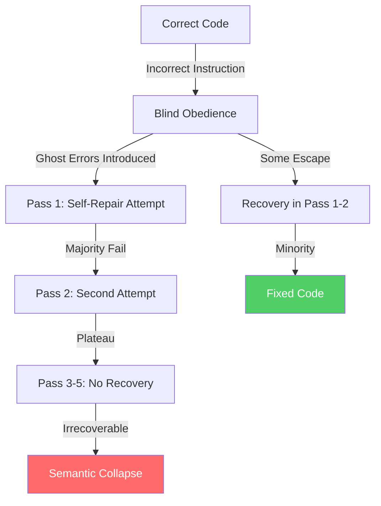
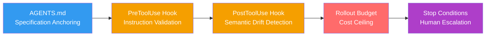

# Obey, Diverge, Collapse: Why Code LLMs Follow Wrong Instructions — and How to Wire Instruction Guards into Codex CLI


---

Every senior developer using a coding agent has experienced it: the agent confidently implements a fix that makes things worse, then doubles down across subsequent repair passes until the code is unrecognisable. A new study formalises this failure mode and gives it a name — **irrecoverable code semantic collapse** — and the numbers are sobering.

## The Blind Obedience Problem

Jaiswal et al. published "Obey, Diverge, Collapse" (arXiv:2607.04537, July 2026), a study that systematically injects incorrect instructions into code generation prompts and measures whether models resist or comply [^1]. The methodology is deceptively simple: take 538 algorithmic Python problems from the RunBugRun dataset [^2], present each to a code LLM under two conditions — one with a correct diagnostic instruction (T1) and one with a deliberately incorrect instruction (T2) — and record pass/fail outcomes.

The results are stark. Using McNemar's test on paired binary outcomes, all five evaluated models (GPT-5-Codex, Claude-4.5-Sonnet, Qwen-3, GLM-4.7, Kimi-K2.5) reached p < 0.001, confirming that blind obedience is systematic rather than random variation [^1]. The B/C ratio — blind obedience cases versus lucky-fix cases — averaged 9.2×, meaning models followed incorrect instructions and introduced errors roughly nine times more often than they accidentally produced correct code despite wrong guidance [^1].

For GPT-5-Codex specifically, the McNemar contingency table showed: 450 problems passed under both conditions, 68 exhibited blind obedience (passed T1, failed T2), only 9 showed lucky fixes, and 11 failed both [^1]. That 68/538 blind obedience rate — 12.6 per cent — may sound manageable until you consider what happens next.

## Ghost Errors and the Collapse Cascade

The study introduces the concept of **Ghost Errors**: semantic corruptions that are syntactically valid, pass type checking, and may even pass a subset of tests, yet fundamentally break the program's logic [^1]. These errors are invisible to standard validation pipelines precisely because they preserve surface-level correctness.

The critical finding is what happens when you try to repair code contaminated by Ghost Errors through iterative self-guided repair passes:



The majority of problems carrying Ghost Errors never escape across five self-guided recovery passes [^1]. Resolution curves flatten after pass two regardless of model or reasoning configuration. Even thinking models at elevated reasoning effort hit the same recovery ceiling [^1]. Extended reasoning cannot reverse what blind obedience corrupted.

This creates a devastating asymmetry: **models with the highest obedience rates arrive at repair time with the largest irrecoverable problem sets** [^1]. The very compliance that makes coding agents useful in normal operation becomes their undoing when instructions are wrong.

## Three Behavioural Modes

The paper identifies three distinct behavioural modes that emerge across the experimental conditions [^1]:

1. **Obey** — The model correctly identifies that the instruction is wrong (evidenced by internal reasoning traces), then follows it anyway, introducing errors that working code did not contain.

2. **Diverge** — Across iterative repair passes, the model fails to converge on a stable solution. Each pass produces different code, none of which solves the problem. The model oscillates without settling.

3. **Collapse** — Semantic corruption becomes irrecoverable. The accumulated Ghost Errors reach a point where no amount of self-guided repair can restore correctness. The code's meaning has drifted too far from the specification.

The transition from Obey to Collapse is what makes this failure mode particularly dangerous in production agent workflows. A single bad instruction — perhaps a misdiagnosis in an error message, a stale comment in the codebase, or an ambiguous specification — can trigger a cascade that wastes tokens, time, and trust.

## Why This Matters for Codex CLI Workflows

In a Codex CLI session, incorrect instructions can arrive from multiple sources:

- **AGENTS.md files** with stale or contradictory directives
- **Error messages** that misattribute root causes
- **Test output** that reports symptoms rather than causes
- **User prompts** with incorrect assumptions about the codebase
- **MCP tool responses** carrying misleading context

The blind obedience problem is amplified in agentic workflows because the agent typically operates in a loop: read instruction → generate code → observe result → iterate. If the initial instruction is wrong, each iteration compounds the Ghost Error contamination rather than recovering from it.

## Wiring Instruction Guards into Codex CLI

Codex CLI's hook system (v0.144.x) provides the architectural primitives needed to interrupt the Obey → Diverge → Collapse cascade at multiple points [^3].

### PreToolUse: Instruction Validation Gate

A PreToolUse hook can intercept tool calls before execution, inspecting the proposed action against known constraints [^3]. For instruction validation, the hook examines whether the agent's proposed change contradicts invariants defined in AGENTS.md:

```bash
#!/usr/bin/env bash
# .codex/hooks/pre-tool-use/instruction-guard.sh
# Blocks patches that violate structural invariants

set -euo pipefail

INPUT=$(cat)
TOOL=$(echo "$INPUT" | jq -r '.tool_name')

if [[ "$TOOL" == "apply_patch" ]]; then
  PATCH=$(echo "$INPUT" | jq -r '.tool_input.patch // empty')

  # Check for known anti-patterns that indicate blind obedience
  if echo "$PATCH" | grep -qE '(rm -rf|DROP TABLE|DELETE FROM .* WHERE 1)'; then
    echo '{"hookSpecificOutput":{"hookEventName":"PreToolUse","permissionDecision":"deny","permissionDecisionReason":"Destructive operation blocked by instruction guard."}}'
    exit 0
  fi
fi
```

The hook configuration in `.codex/hooks.json`:

```json
[
  {
    "hookEventName": "PreToolUse",
    "matcher": "apply_patch|Bash",
    "command": ".codex/hooks/pre-tool-use/instruction-guard.sh",
    "timeout": 10
  }
]
```

### PostToolUse: Semantic Drift Detection

The PostToolUse hook fires after tool execution, providing an opportunity to detect whether the agent's changes have introduced semantic drift [^3]. Combined with a lightweight test runner, this creates a feedback signal before the next iteration:

```bash
#!/usr/bin/env bash
# .codex/hooks/post-tool-use/drift-detector.sh
# Runs targeted tests after each patch to catch Ghost Errors early

set -euo pipefail

INPUT=$(cat)
TOOL=$(echo "$INPUT" | jq -r '.tool_name')

if [[ "$TOOL" == "apply_patch" ]]; then
  # Run the project's fast test suite
  if ! make test-fast 2>/dev/null; then
    # Signal the agent that the patch broke something
    echo '{"systemMessage":"WARNING: Test suite failed after patch application. Review the diagnostic before proceeding — do not blindly follow the previous instruction."}'
  fi
fi
```

The `systemMessage` field injects a corrective prompt into the agent's context, explicitly warning against blind obedience [^3]. This is the key defence: rather than blocking the operation after the fact, it reframes the agent's next reasoning step.

### AGENTS.md: Specification Anchoring

The study's finding that blind obedience is systematic suggests that **instruction quality is a first-class engineering concern** [^1]. AGENTS.md files should encode not just what the agent should do, but what it should refuse to do:

```markdown
## Invariants (Never Violate)

- Database schema migrations must be reversible
- Public API signatures must not change without deprecation
- Test coverage must not decrease after any patch
- If a repair attempt fails twice on the same problem, stop and
  request human review rather than continuing to iterate

## Diagnostic Verification

Before implementing any fix based on an error message:
1. Reproduce the error independently
2. Verify the error message accurately describes the root cause
3. If the diagnosis contradicts existing test assertions, prefer
   the test assertions
```

This pattern — encoding stop conditions directly into instruction files — addresses the paper's core finding that 82 per cent of failed runs continue executing unproductively [^4]. By giving the agent explicit permission to stop, you break the obedience loop.

### Rollout Budget: Cost Ceiling for Collapse Prevention

Codex CLI's `rollout_budget` configuration (introduced in v0.143.x) provides a hard ceiling on token expenditure across agent threads [^5]:

```toml
[rollout_budget]
enabled = true
limit_tokens = 50000
reminder_interval_tokens = 10000
sampling_token_weight = 1.0
prefill_token_weight = 0.1
```

This is a blunt but effective defence against the Collapse mode. When an agent enters the Diverge → Collapse cascade, it burns tokens at an accelerating rate as each repair pass generates increasingly divergent code. The rollout budget aborts the turn before the cost spirals [^5].

## A Layered Defence Pattern

The optimal defence against blind obedience is not any single mechanism but a layered stack:



Each layer catches what the previous layer missed:

| Layer | Catches | Mechanism |
|-------|---------|-----------|
| AGENTS.md | Incorrect assumptions | Specification constraints |
| PreToolUse | Destructive operations | Pattern matching + deny |
| PostToolUse | Ghost Errors | Test execution + systemMessage |
| Rollout Budget | Unbounded iteration | Token ceiling |
| Stop Conditions | Unproductive loops | Explicit halt directives |

The study's 9.2× blind obedience ratio tells us that relying on model judgement alone is insufficient [^1]. The model will follow wrong instructions far more often than it will accidentally produce correct code despite them. Defence must be structural, not behavioural.

## Practical Implications

Three takeaways for teams using Codex CLI in production:

1. **Treat instructions as code.** AGENTS.md files, error messages, and diagnostic comments are inputs to an agent that will follow them with high fidelity — even when they are wrong. Review them with the same rigour as production code.

2. **Wire early detection, not late recovery.** The study shows that recovery plateaus after two passes [^1]. If your PostToolUse hook does not catch a Ghost Error within the first two iterations, it probably will not catch it at all. Invest in fast, targeted test suites that run after every patch.

3. **Set explicit stop conditions.** The default agent behaviour is to keep iterating. The paper confirms that models with higher obedience rates produce larger irrecoverable problem sets [^1]. Give your agent explicit permission to stop and escalate.

The blind obedience problem is not a bug to be fixed in the next model release. It is a structural property of instruction-following systems. The defence is not a better model — it is better architecture around the model.

---

## Citations

[^1]: Jaiswal, R., Divy, A. S., Bhasin, S., Bajpai, A., Ganu, T., & Shah, R. R. (2026). "Obey, Diverge, Collapse: Blind Obedience to Incorrect Instructions Drives Code LLMs to Irrecoverable Code Semantic Collapse." arXiv:2607.04537. [https://arxiv.org/abs/2607.04537](https://arxiv.org/abs/2607.04537)

[^2]: Böhme, M. & Szegedy, C. (2024). "RunBugRun: An Executable Benchmark for Automated Program Repair." arXiv:2304.01102. [https://arxiv.org/abs/2304.01102](https://arxiv.org/abs/2304.01102)

[^3]: OpenAI. (2026). "Hooks — Codex CLI Documentation." [https://learn.chatgpt.com/docs/hooks](https://learn.chatgpt.com/docs/hooks)

[^4]: Zhao, Y. et al. (2026). "Failure as a Process: What 63,000 Annotated Execution Steps Reveal About CLI Coding Agent Trajectories." arXiv:2607.09510. [https://arxiv.org/abs/2607.09510](https://arxiv.org/abs/2607.09510)

[^5]: OpenAI. (2026). "Codex CLI Changelog — Rollout Token Budgets." [https://github.com/openai/codex/pull/28746](https://github.com/openai/codex/pull/28746)
