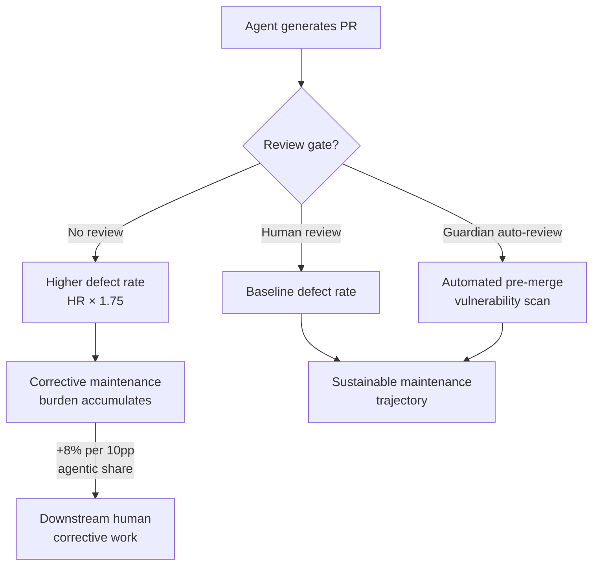
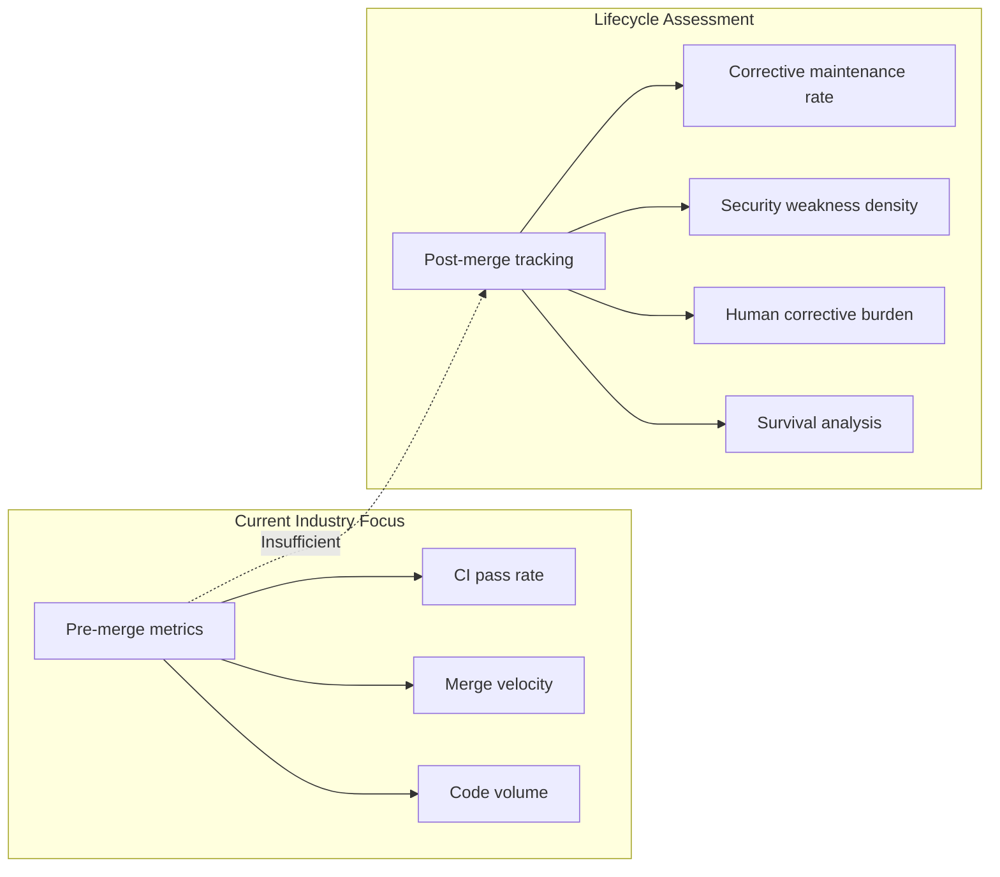

# The Post-Merge Fate of Agentic Code: Why Merged AI Contributions Need 49% More Corrective Maintenance — and How Codex CLI's Review and Verification Stack Shifts the Burden Left


---

The industry fixation on merge rates — how quickly and reliably a coding agent can produce a pull request that passes CI — has always felt incomplete. Merge is not the finish line; it is the starting pistol. What happens to agentic code after it lands in the main branch? Xia and Miller's longitudinal study across 182 repositories and thirteen months of commit history gives us the first rigorous answer, and the numbers should give every engineering leader pause [^1].

## The Study: Tracking Code Fate Across 182 Repositories

The researchers tracked line-level lifecycles for contributions from fifteen distinct AI agents — including Claude Code, Codex, GitHub Copilot, Cursor, Devin, Aider, OpenHands, Cline, and Roo Code — against human baselines across repositories spanning 10 to 45,401 stars [^1]. The observation window ran from May 2025 to May 2026, capturing the full arc of the current agentic coding wave.

Their methodology combined survival analysis (Kaplan-Meier and Cox proportional hazards), Fine-Gray competing-risks regression, panel models with generalised linear mixed models, and meta-regression — all with repository-level clustering and rigorous proportional-hazards verification [^1].

The intent classification pipeline, validated at Cohen's κ = 0.94 on a 100-commit random sample, distinguishes corrective maintenance (bug fixes, security patches) from adaptive, perfective, and management maintenance [^1].

## The Headline Numbers

### Overall Maintenance: Deceptively Similar

At the aggregate level, agentic lines show no statistically significant difference in overall termination rates (HR = 1.11, 95% CI: 0.85–1.45, p = 0.45) [^1]. Agentic code actually survives slightly longer on average: 75.8% survival rate versus 65.6% for human code [^1].

This is the number that will appear in vendor pitch decks. It is also deeply misleading.

### Corrective Maintenance: The Real Story

When the researchers decomposed maintenance by intent, the picture changed sharply. The overall maintenance composition differs significantly between agentic and human code (Rao-Scott χ² = 910.6, p < 0.001) [^1]:

- **Corrective maintenance** risk is 46% higher for agentic code (sHR = 1.46, 95% CI: 1.02–2.08) [^1]
- **Bug-fix termination** rate is 51% higher (HR = 1.51) [^1]
- **Management maintenance** risk is 61% lower (sHR = 0.39, 95% CI: 0.25–0.60), likely because agentic code receives fewer refactoring passes [^1]

Nearly 50% of agentic bug fixes are performed by other agentic commits — agents fixing their own defects in subsequent sessions [^1].

### Security: Elevated Weakness Rates

Static analysis with Semgrep, OSV-Scanner, and SonarQube revealed that agentic code introduces:

- Security weaknesses at **1.14× the human rate** per source line [^1]
- High-severity security findings at **1.51× the human rate** (RR = 1.51, 95% CI: 1.33–1.70) [^1]
- Dependency vulnerabilities at **1.10× the human rate** [^1]
- High-severity dependency findings at **1.15× the human rate** (RR = 1.15, 95% CI: 1.08–1.23) [^1]

### The Cumulative Burden

At the repository level, a 10 percentage-point increase in lagged agentic code share associates with approximately 8.0–8.6% higher odds of corrective maintenance in the following month (OR = 1.08, 95% CI: 1.05–1.12, p < 0.001) [^1]. This includes human-performed corrective commits — agentic code does not merely create work for itself; it creates work for the humans around it [^1].

## The No-Review Multiplier

The meta-regression surfaces one project characteristic that stands above the rest: **no-review merge rate**. Each 10 percentage-point increase in a project's no-review merge rate associates with approximately 6% higher agentic maintenance burden (F(6,170) = 2.86, p < 0.05), with a hazard ratio multiplier of 1.75 (95% CI: 1.01–3.04) [^1].

This finding matters because it tells us where the leverage is. The problem is not that agents write unreviewable code. The problem is that velocity-optimised workflows skip the review that would catch agentic defects before they compound.



## The Generation-Review Asymmetry

The paper identifies a structural imbalance that every team adopting coding agents will recognise: **generation velocity has decoupled from human effort constraints, but review remains human-bounded** [^1]. An agent can produce a well-formed pull request in minutes. The review that would catch the 1.51× elevated high-severity vulnerability rate still takes a human the same time it always did.

This asymmetry is not a temporary tooling gap. It is an architectural property of any workflow where AI generates and humans verify.

## Where Codex CLI's Defence Stack Applies

Codex CLI's architecture addresses several failure modes surfaced by this research. The key insight from the data is that post-merge defects correlate most strongly with absent review — so the defence must operate before merge, not after.

### Guardian Auto-Review as Pre-Merge Gate

When configured with `approvals_reviewer = "auto_review"`, Codex CLI routes every tool-call approval through a Guardian subagent that evaluates risk, sees the full conversation context, and returns a structured assessment with discrete risk, authorisation, and rationale fields [^2]. In auto-review mode, sessions stop for human approval roughly 200× less often whilst still catching actions humans would want blocked [^2].

For projects where the no-review multiplier drives elevated maintenance burden, Guardian auto-review provides an automated quality gate that operates at generation speed rather than human-review speed [^2].

### PostToolUse Hooks as Inline Static Analysis

The paper's security findings were produced by Semgrep, OSV-Scanner, and SonarQube running post-hoc. Codex CLI's PostToolUse hooks allow those same tools to run inline — immediately after every file write, before the agent continues its session [^3]:

```toml
# config.toml — inline security scanning
[hooks.post_tool_use]
command = "semgrep scan --config=auto --severity ERROR --quiet"
on_failure = "block"
```

This catches the 1.14× elevated weakness rate at generation time rather than in post-merge triage. The `on_failure = "block"` directive prevents the session from continuing until the finding is resolved [^3].

### Codex Security Plugin for Diff-Scoped Review

The Codex Security plugin adds semantic, LLM-based reasoning alongside deterministic SAST and SCA coverage [^4]. In CI pipelines, `codex exec --plugin security` runs diff-scoped review, combining Semgrep-style pattern matching with LLM-powered vulnerability reasoning [^4]. This shifts the security scanning from the paper's post-hoc analysis into the pre-merge workflow.

### AGENTS.md as Corrective-Maintenance Constraint

The paper finds that nearly 50% of agentic bug fixes are performed by subsequent agentic commits [^1]. Without scope constraints, these corrective passes can introduce additional defects — the overshoot pattern documented in prior ChainSWE research [^5]. AGENTS.md can encode explicit constraints:

```markdown
## Post-Merge Fix Protocol

- When fixing a bug introduced by a previous agentic commit, limit changes
  to the minimum patch required. Do not refactor surrounding code.
- Run the full test suite after every corrective change.
- If a fix requires changes to more than 3 files, escalate to human review.
```

### Writes Approval Mode for High-Risk Repositories

For repositories where the no-review merge rate has historically driven elevated maintenance burden, Codex CLI's `approval_mode = "on_write"` configuration forces explicit human approval for every file modification [^6]. This trades velocity for the review gate that the paper's meta-regression identifies as the strongest predictor of sustainable agentic adoption.

## The Lifecycle Assessment Imperative

The paper's most important contribution is methodological: **evaluating coding agents at merge time is insufficient**. Sustainable adoption requires lifecycle-spanning assessment that tracks corrective maintenance rates, security weakness introduction, and cumulative burden on downstream human contributors [^1].



For Codex CLI users, this translates to a concrete operational principle: **instrument your post-merge outcomes, not just your merge rates**. Track the corrective maintenance ratio on agentic versus human contributions in your own repositories. If the ratio exceeds the study's 1.46 baseline, tighten your review gates — whether through Guardian auto-review policies, stricter PostToolUse hooks, or explicit writes approval mode.

## Practical Recommendations

1. **Enable Guardian auto-review** on all repositories where human review coverage is below 80%. The no-review multiplier is the strongest predictor of elevated agentic maintenance burden [^1][^2].

2. **Wire PostToolUse security hooks** with Semgrep or your preferred SAST tool. Catching the 1.51× high-severity vulnerability rate at generation time eliminates the most expensive post-merge corrections [^1][^3].

3. **Measure post-merge corrective rates** by contributor type. If agentic corrective maintenance exceeds 1.5× human baseline, your review infrastructure is insufficient for your adoption velocity.

4. **Constrain agentic self-repair scope** via AGENTS.md. The finding that 50% of agentic fixes come from subsequent agentic commits suggests a feedback loop that benefits from explicit patch-scope boundaries [^1].

5. **Use `codex exec --plugin security`** in CI pipelines to add diff-scoped semantic security review before merge [^4].

The paper's title borrows from Shakespeare's Friar Laurence — a warning about haste. The data confirms it: agentic code's violent generation delights do indeed have violent maintenance ends, unless review infrastructure scales to match.

---

## Citations

[^1]: Xia, C.S. and Miller, C. (2026) 'Do These Violent Delights Have Violent Ends? Measuring the Post-Merge Fate of Agentic Code', arXiv:2607.09902v1 [cs.SE], 10 July. Available at: [https://arxiv.org/abs/2607.09902](https://arxiv.org/abs/2607.09902)

[^2]: OpenAI (2026) 'Auto-review of agent actions without synchronous human oversight', Codex Documentation. Available at: [https://developers.openai.com/codex/concepts/sandboxing/auto-review](https://developers.openai.com/codex/concepts/sandboxing/auto-review)

[^3]: OpenAI (2026) 'Hooks', Codex CLI Documentation. Available at: [https://developers.openai.com/codex/hooks](https://developers.openai.com/codex/hooks)

[^4]: Vaughan, D. (2026) 'Codex Security Plugin: Local Vulnerability Scanning, Diff Review, and Automated Remediation from the CLI', Codex Knowledge Base, 3 June. Available at: [https://codex.danielvaughan.com/2026/06/03/codex-security-plugin-local-vulnerability-scanning-diff-review-remediation-cli/](https://codex.danielvaughan.com/2026/06/03/codex-security-plugin-local-vulnerability-scanning-diff-review-remediation-cli/)

[^5]: Jin, Y. et al. (2026) 'ChainSWE: Sequential Dependent Bug Fixing Benchmark', arXiv:2607.02606 [cs.SE], 1 July. Available at: [https://arxiv.org/abs/2607.02606](https://arxiv.org/abs/2607.02606)

[^6]: OpenAI (2026) 'Codex CLI Features', Codex Documentation. Available at: [https://developers.openai.com/codex/cli/features](https://developers.openai.com/codex/cli/features)
