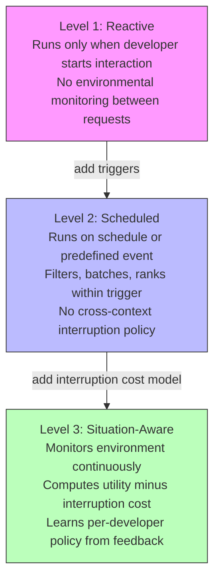
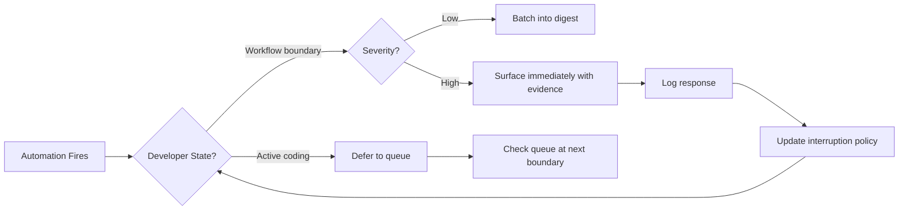

# Proactivity, Not Just Autonomy: Why Your Coding Agent's Insight Policy Matters More Than Its Tool Count — and How to Wire It into Codex CLI


---

## The Autonomy Mirage

Every coding agent launch in 2026 leads with the same headline: more tools, longer horizons, deeper autonomy. Yet a position paper from Bui and Evangelopoulos argues that the field has been optimising the wrong axis entirely [^1]. Their claim: **proactivity — the policy that decides *what matters next* and *when to surface it* — is the dimension that separates a useful collaborator from an expensive clipboard**.

The distinction is not academic. A five-day field study of 15 developers interacting with a proactive IDE assistant found that interventions timed at workflow boundaries (post-commit, post-merge) achieved 52% engagement, whilst mid-task interruptions were dismissed 62% of the time [^2]. Well-timed suggestions cut interpretation time from 101.4 seconds to 45.4 seconds — a 55-second cognitive saving per intervention [^2]. At scale, that is the difference between a tool developers leave running and one they mute within a week.

This article unpacks the emerging proactivity framework, maps it against Codex CLI's current feature set, and shows where the gaps are.

---

## The Three-Level Proactivity Taxonomy

Bui and Evangelopoulos propose a clean three-level model [^1]:



**Level 1 — Reactive.** The agent runs only when the developer starts an interaction. Between requests, there is no environmental monitoring or action candidate generation [^1]. This is vanilla `codex "fix the failing test"` — powerful but inert.

**Level 2 — Scheduled.** The agent runs on a schedule or predefined event. It may filter, batch, rank, or summarise within that trigger, but does not learn a cross-context, per-developer interruption policy [^1]. Codex Automations and `/goal` live here.

**Level 3 — Situation-Aware.** The agent monitors the environment continuously, computes utility and interruption cost over the full action space — including the explicit option of staying silent — and updates its policy from developer responses [^1]. No shipping coding agent reaches this level today.

### Where Contemporary Agents Cluster

The paper audits Cursor, GitHub Copilot, Jules, Claude Code Routines, and Cursor Automations against five observability criteria (O1–O5) [^1]:

| Criterion | Description | Industry Status |
|-----------|-------------|-----------------|
| O1 | Observes developer state, determines timing | All fail |
| O2 | Explicit "stay silent" option exists | Only LangChain ambient agents pass |
| O3 | Developer responses update future policy | Cursor Automations partial; rest fail |
| O4 | Cross-context observation (≥3 event categories) | Generally partial |
| O5 | Messages display without opening separate tools | All pass |

The verdict: every audited system clusters at Level 2 [^1]. The insight policy — *when to speak and when to stay silent* — remains unimplemented.

---

## The Simulation-Reality Gap

Before dismissing proactivity as a nice-to-have, consider the empirical evidence. Li et al. collected actual IDE interaction traces from 1,246 industry developers over three days and compared them against LLM-simulated traces [^3]. Their findings:

- Simulated traces differ substantially from real behaviour in diversity, temporal structure, and exploratory patterns [^3]
- Current proactive intent prediction approaches "remain far from reliable under real IDE traces" [^3]
- Simulated data cannot replace real data but provides useful complementary pre-training [^3]

They released ProCodeBench, a real-world benchmark for proactive intent prediction, confirming that simulation-based evaluation overestimates real-world performance [^3]. Any proactivity implementation that has only been tested against synthetic developer traces should be treated with scepticism.

---

## Interruption Cost Is Not Zero

The cognitive load research makes the stakes concrete. Lepine et al. studied 34 financial professionals completing complex tasks with AI assistants, generating 1,178 participant-subtask observations [^4]. Key findings:

- **Extraneous load** (irrelevant information, context switches) shows the largest negative association with performance — roughly three times that of intrinsic load [^4]
- **Model-initiated task switching** is the strongest predictor of performance decline [^4]
- Less experienced professionals face larger performance penalties but gain greater marginal benefits from AI assistance [^4]

For coding agents, the implication is direct: every unsolicited notification, every auto-generated summary that appears mid-debug, every CI status that pops during a flow state imposes measurable cognitive cost. The Kuo et al. field study quantified this precisely — the 55-second interpretation time gap between well-timed and poorly-timed suggestions compounds across a working day into lost hours [^2].

---

## Three Metrics That Matter

The proactivity framework proposes three evaluation metrics that no current agent measures [^1]:

### Insight Decision Quality (IDQ)

Measures whether the agent selected the correct action at the correct time, scoring both shown insights and deliberate silence. A system that surfaces every finding gets punished for false interruptions; a system that stays silent when action is needed gets punished for missed opportunities [^1].

### Context Grounding Score (CGS)

Evaluates whether shown insights cite appropriate evidence. Calculated as the harmonic mean of evidence precision and recall, weighted by factual accuracy [^1]. A vague "you might want to look at this" scores poorly; a grounded "test `test_auth_flow` regressed after commit `a3f2b1c`, failing on line 47 with `KeyError: 'session_id'`" scores well.

### Learning Lift (LL)

Compares an adapted policy against a frozen one on subsequent decision points [^1]. If the agent learns nothing from developer dismissals and acceptances, Learning Lift is zero — the feedback loop is decorative.

---

## Codex CLI's Proactivity Surface

Codex CLI sits firmly at Level 2 today, but its feature set provides more proactivity hooks than most competing tools. Here is how each maps to the framework:

### Automations and Scheduled Tasks

Codex Automations support time-based intervals (daily, weekly, custom) via RFC 5545 RRULE syntax, enabling patterns like `FREQ=MONTHLY;BYMONTHDAY=1;BYHOUR=9` [^5]. Tasks run in the background against local projects or isolated Git worktrees [^5].

```toml
# config.toml — Example automation trigger patterns
# These configure the environment; scheduling is via the Codex app

[model]
default = "gpt-5.5"

[sandbox]
permission_profile = "ci-monitor"
network = "proxy-only"
```

This is textbook Level 2: predefined triggers, batch processing within each run, no cross-context policy learning.

### The `/goal` Command as Persistent Objective

The `/goal` command sets a high-level objective that Codex pursues autonomously across multiple tool calls [^6]. Combined with `rollout_token_budget`, it creates bounded persistent execution — an important building block, but still reactive within each session.

```bash
# Set a goal with bounded execution
codex --model gpt-5.5 "/goal Finish the auth migration and keep tests green"
```

### Guardian Auto-Review as Scheduled Gate

Guardian auto-review (`codex-auto-review`) operates as a post-generation review pass [^7]. In proactivity terms, it is a Level 2 scheduled gate: it fires after every generation, applies a fixed review policy, and does not adapt its review depth based on developer response patterns.

### The `/app` Handoff and Remote Approval

Codex CLI v0.143 introduced `/app` handoff to Codex Desktop [^8], and Codex Remote GA provides mobile approval via QR-paired devices [^9]. These are *notification channels* — they satisfy criterion O5 (messages display without opening separate tools) but not O1 (timing based on developer state).

---

## Wiring Proactivity Hooks into Codex CLI

The gap between Level 2 and Level 3 is not a feature request — it is an architectural pattern. Here is how to approximate situation-awareness using existing Codex CLI primitives:

### Pattern 1: Interruption-Cost-Aware Automations

Instead of firing automations on a fixed schedule, gate them on developer activity signals:

```bash
#!/bin/bash
# automation-gate.sh — Only surface results when developer is between tasks
# Check git log for recent commits (proxy for workflow boundary)
LAST_COMMIT_AGO=$(git log -1 --format="%cr" 2>/dev/null)

# Check if tests are currently running (proxy for active work)
if pgrep -f "pytest\|jest\|cargo test" > /dev/null; then
    echo "DEFER: Tests running, developer likely in active debug"
    exit 0
fi

# Surface the automation result
codex exec "Summarise overnight CI failures for ${REPO}"
```

### Pattern 2: Silence as a First-Class Output

Configure AGENTS.md to encode explicit silence conditions:

```markdown
## Proactive Reporting Policy

When reviewing CI results or dependency updates:
- If all checks pass and no security advisories exist, produce NO output
- If findings exist but severity < HIGH, batch into a daily digest
- If severity >= HIGH, report immediately with evidence citations
- Never interrupt during active test execution or debugging sessions
```

### Pattern 3: Feedback-Driven Policy via PostToolUse Hooks

Use PostToolUse hooks to log developer responses and adjust future behaviour:

```bash
#!/bin/bash
# posttooluse-feedback.sh — Log whether developer acted on suggestion
TOOL_NAME="$1"
RESULT="$2"
TIMESTAMP=$(date -u +%Y-%m-%dT%H:%M:%SZ)

# Append to feedback log for future policy adaptation
echo "${TIMESTAMP},${TOOL_NAME},${RESULT}" >> ~/.codex/proactivity-feedback.csv

# Check dismissal rate for this tool category
DISMISS_RATE=$(awk -F, -v tool="$TOOL_NAME" \
  '$2==tool && $3=="dismissed" {d++} $2==tool {t++} END {print d/t}' \
  ~/.codex/proactivity-feedback.csv)

if (( $(echo "$DISMISS_RATE > 0.7" | bc -l) )); then
    echo "⚠️ High dismissal rate for ${TOOL_NAME} — consider reducing frequency"
fi
```



---

## The Road from Level 2 to Level 3

Five concrete steps move a Codex CLI workflow toward situation-awareness, following the paper's recommendations [^1]:

1. **Log both shown and withheld insights.** Use PostToolUse hooks to record what the automation found *and* what it chose not to surface. Without this, evaluating silence is impossible.

2. **Implement a learnable interruption cost model.** Combine observable signals — IDE focus time, git commit recency, test runner activity, calendar status via MCP — without exposing sensitive telemetry.

3. **Design accountable interfaces.** Every proactive message should show its evidence trail, offer a "not now" deferral, and feed the response back into the policy. The `/app` handoff channel already supports this for remote approval.

4. **Use replayable event traces.** Codex CLI's JSONL logging and OpenTelemetry integration provide the audit trail [^7]. Align repository events, CI signals, and IDE interactions into a single timeline.

5. **Measure IDQ, CGS, and Learning Lift** rather than task completion alone. A proactive agent that completes every task but interrupts at the wrong time will be muted — and a muted agent completes nothing.

---

## What This Means for Your Team

The proactivity-autonomy distinction has immediate practical consequences:

- **Stop counting tools.** The number of MCP servers connected to your Codex instance is less important than whether the agent knows when to use them unprompted and when to stay silent.
- **Audit your automation timing.** If your scheduled tasks fire on fixed intervals regardless of developer state, you are imposing cognitive costs that the 55-second interpretation gap compounds across every team member [^2].
- **Treat dismissals as training data.** Every time a developer ignores an automation result, that is a signal about interruption cost. Log it. The agent that learns from dismissals outperforms the agent that ignores them — that is what Learning Lift measures [^1].
- **Encode silence in AGENTS.md.** Most AGENTS.md files tell the agent what to do. Almost none tell it when to stay quiet. The proactivity framework suggests this is the more important instruction [^1].

The gap between Level 2 and Level 3 is where the next generation of developer experience improvements will come from — not from more autonomy, but from better judgment about when to exercise it.

---

## Citations

[^1]: Bui, N.D.Q. and Evangelopoulos, G. (2026) 'Agentic Coding Needs Proactivity, Not Just Autonomy', *arXiv:2605.06717*. Available at: [https://arxiv.org/abs/2605.06717](https://arxiv.org/abs/2605.06717)

[^2]: Kuo, N., Sergeyuk, A., Chen, V. and Izadi, M. (2026) 'Developer Interaction Patterns with Proactive AI: A Five-Day Field Study', *Proceedings of the 31st International Conference on Intelligent User Interfaces (IUI '26)*, Paphos, Cyprus, March 23–26. *arXiv:2601.10253*. Available at: [https://arxiv.org/abs/2601.10253](https://arxiv.org/abs/2601.10253)

[^3]: Li, L., Jia, R., Yang, G.-Y. and Li, J. (2026) 'An Empirical Study of Proactive Coding Assistants in Real-World Software Development', *arXiv:2605.05700*. Available at: [https://arxiv.org/abs/2605.05700](https://arxiv.org/abs/2605.05700)

[^4]: Lepine, B., Kim, J., Mishkin, P. and Beane, M. (2025) 'Precision Proactivity: Measuring Cognitive Load in Real-World AI-Assisted Work', *arXiv:2505.10742v3*. Available at: [https://arxiv.org/abs/2505.10742](https://arxiv.org/abs/2505.10742)

[^5]: OpenAI (2026) 'Scheduled Tasks', *Codex Developer Documentation*. Available at: [https://developers.openai.com/codex/app/automations](https://developers.openai.com/codex/app/automations)

[^6]: OpenAI (2026) 'Developer Commands — /goal', *Codex CLI Reference*. Available at: [https://developers.openai.com/codex/cli/reference](https://developers.openai.com/codex/cli/reference)

[^7]: OpenAI (2026) 'Codex Changelog', *OpenAI Developers*. Available at: [https://developers.openai.com/codex/changelog](https://developers.openai.com/codex/changelog)

[^8]: OpenAI (2026) 'Codex CLI v0.143.0 Release Notes', *GitHub Releases*. Available at: [https://github.com/openai/codex/releases](https://github.com/openai/codex/releases)

[^9]: OpenAI (2026) 'Codex Remote — General Availability', *Codex Changelog*. Available at: [https://developers.openai.com/codex/changelog](https://developers.openai.com/codex/changelog)
