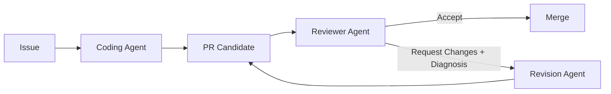
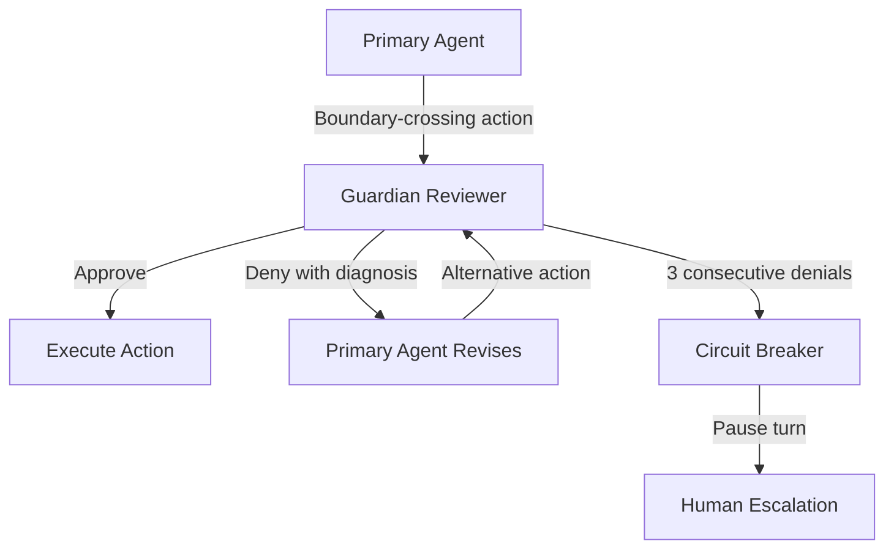

# SWE-Review and the Closed-Loop Imperative: Why Generate-Review-Revise Outperforms One-Shot PR Generation — and How Codex CLI's Guardian Auto-Review Already Closes the Gap


---

Every coding agent ships pull requests. Remarkably few check whether those pull requests actually resolve the issue they claim to fix. Wang et al.'s SWE-Review framework (arXiv:2607.06065, July 2026) [^1] quantifies the cost of that open loop and demonstrates that a systematic generate-review-revise cycle can lift resolve rates by up to 29.4 percentage points — all without changing the underlying coding model. The finding lands at a moment when Codex CLI's own Guardian auto-review subsystem and GitHub-integrated automated reviews are maturing into precisely this kind of closed-loop architecture.

## The Open-Loop Problem

Most agentic coding pipelines operate in fire-and-forget mode. An agent reads an issue, explores the repository, generates a patch, and submits a pull request. If the patch is wrong, the pipeline has no internal mechanism to detect the failure or to produce a structured diagnosis that a revision pass could consume.

SWE-Review formalises this gap. Given a repository, an issue, and an AI-generated PR, a **reviewer agent** explores the codebase, produces a binary accept/request-changes decision, and — critically — emits a structured diagnosis guiding the next revision attempt [^1].



The loop continues until the reviewer accepts or a budget is exhausted. This is not a novel concept in human software engineering — it is how every competent team already works. The contribution is proving that the same pattern yields large, measurable gains when both sides are LLM agents.

## SWE-Review-Bench: Measuring Review Quality

The authors construct SWE-Review-Bench from 1,384 candidate PRs derived from 500 SWE-bench Verified issues [^1]. Three generators span a quality spectrum:

| Generator | Instances | Baseline Resolve Rate |
|-----------|-----------|----------------------|
| GLM-5 | 500 | 72.2 per cent |
| Qwen3-Coder-30B-A3B | 462 | 50.9 per cent |
| Qwen3-30B-A3B | 422 | 27.5 per cent |

This stratification matters. A reviewer that only improves already-strong PRs would be a curiosity; one that lifts weak generators by double-digit points is an engineering multiplier.

## The Numbers: Generate-Review-Revise in Action

The headline results are striking [^1]:

| Coding Model | Baseline RR | Post-Loop RR | Improvement |
|-------------|-------------|-------------|-------------|
| Qwen3-30B-A3B | 27.5 per cent | 56.9 per cent | **+29.4 pp** |
| Qwen3-Coder-30B-A3B | 50.9 per cent | 68.8 per cent | **+17.9 pp** |
| GLM-5 | 72.2 per cent | 75.4 per cent | **+3.2 pp** |

The pattern is consistent: weaker generators benefit disproportionately. A 27.5 per cent baseline more than doubles. Even the strongest generator, already at 72.2 per cent, gains 3.2 points — meaningful at the frontier where every point is hard-won.

### Agentic Review vs. Single-Turn Review

The paper also compares agentic review (where the reviewer can explore the repository) against single-turn fixed-context review (where the reviewer sees only the diff and surrounding context). On Qwen3-30B-A3B PRs [^1]:

- **Decision Accuracy**: 89.4 per cent (agentic) vs. roughly 65–70 per cent (single-turn)
- **Resolve Rate after Revision (RRR)**: 52.6 per cent (agentic) vs. 44.1 per cent (single-turn)

The gap widens on harder instances, reaching approximately 20 percentage points on the most difficult tertile. Repository exploration is not a luxury — it is what separates a useful reviewer from a coin flip.

## Test-Time Scaling: Reviews as Efficient Compute Allocation

One of the paper's most practical findings concerns test-time scaling. Given a fixed compute budget (say, 5 candidate samples), how should you spend it?

Using Qwen3-30B-A3B with an 8B reviewer model [^1]:

- **Reviewer-gated iterative revision**: 38.4 per cent resolve rate (2.44 average samples consumed)
- **Baseline (5 independent samples)**: lower resolve rate at full sample cost

At a larger budget (K=16 samples), reviewer-guided selection reaches 32.3 per cent compared with 25.6 per cent for SWE-Lego-Verifier and 18.8 per cent for a Critic baseline — whilst consuming only 8.9 average samples, a **44 per cent reduction** in compute [^1].

For Qwen3-Coder-30B-A3B, the reviewer achieves 48.1 per cent vs. 44.4 per cent for the verifier at K=16, consuming just 6.0 samples — a **62.5 per cent reduction** [^1].

The implication is clear: a reviewer that can reject bad candidates early and guide revisions is strictly more efficient than brute-force sampling and verification.

## SWE-Review-Traj: Training Open Reviewers

The authors curate SWE-Review-Traj, a dataset of 8,914 decision-correct trajectories (filtered from 14,156 initial trajectories) [^1]. Fine-tuning Qwen3-8B on this data produces dramatic improvements:

- **Completion Rate**: 4.1 per cent → 84.2 per cent
- **Decision Accuracy**: 49.0 per cent → 68.7 per cent

Mixed training combining issue-resolution and review trajectories unlocks a self-contained single-model loop: at the 3k+3k scale, the fine-tuned 8B model achieves 34.8 per cent resolve rate on sample 1, scaling to 44.0 per cent at sample 5, with a cumulative oracle of 47.2 per cent [^1].

## Mapping to Codex CLI's Guardian Auto-Review

Codex CLI's Guardian auto-review subsystem is, structurally, a generate-review-revise loop operating at the action level rather than the PR level [^2] [^3].

### The Guardian as Reviewer Agent

The Guardian deploys a purpose-built `codex-auto-review` model [^4] as a separate agent that evaluates each boundary-crossing action: shell execution, file writes outside writable roots, blocked network requests, and MCP tool calls flagged by annotations [^2]. It examines a compact transcript plus the exact approval request and performs limited read-only checks for additional context.



This architecture mirrors SWE-Review's findings:

1. **Structured denial**: explicit denials include instructions to avoid workarounds, analogous to SWE-Review's structured diagnosis output [^2]
2. **Implicit revision loop**: when the Guardian rejects an action, the primary agent frequently finds a safer alternative — the same self-correction dynamic SWE-Review measures formally [^2]
3. **Circuit breaker as budget**: 3 consecutive or 10 rolling denials within 50 reviews triggers a pause, preventing infinite rejection loops [^2] — functionally equivalent to SWE-Review's sample budget ceiling

### PR-Level Review via GitHub Integration

At a higher level, Codex integrates directly with GitHub for pull request review [^5]. Triggering a review requires only a `@codex review` comment, or enabling automatic reviews to evaluate every new PR without a mention.

The review follows AGENTS.md guidelines hierarchically — the closest `AGENTS.md` to each changed file applies, with deeper files providing more specific scrutiny [^5]. Codex flags only P0 and P1 issues, then supports an immediate fix loop: `@codex fix the P1 issue` [^5].

This two-tier architecture — action-level Guardian review plus PR-level automated review — already approximates the generate-review-revise loop SWE-Review advocates, but with structural advantages:

| SWE-Review | Codex CLI |
|-----------|-----------|
| Post-hoc PR review | Real-time action-level + PR-level review |
| Reviewer explores repo after generation | Guardian has live transcript context |
| External revision agent | Same agent self-corrects in-session |
| Fixed sample budget | Circuit breaker + `rollout_budget` token ceiling [^6] |

## Practical Configuration for Closed-Loop Review

### Action-Level: Guardian Policy

The Guardian policy is configurable via `[auto_review].policy` in local configuration or `guardian_policy_config` for enterprise deployments [^2]. The open-source policy template lives in the Codex repository and can be customised to match project-specific risk profiles.

### PR-Level: AGENTS.md Review Guidelines

```markdown
## Review guidelines

- Reject PRs that introduce new dependencies without a security audit
- Flag any changes to authentication middleware
- Verify database migrations are reversible
- Check that new API endpoints have corresponding test coverage
```

Place this at repository root for broad rules; add directory-specific `AGENTS.md` files for package-level scrutiny [^5].

### Budget Control: rollout_budget

SWE-Review demonstrates that review-guided revision is more compute-efficient than brute-force sampling. Codex CLI's `rollout_budget` configuration enforces this principle structurally [^6]:

```toml
[features.rollout_budget]
enabled = true
limit_tokens = 100000
reminder_interval_tokens = 10000
sampling_token_weight = 1.0
prefill_token_weight = 0.1
```

This prevents the generate-review-revise loop from consuming unbounded tokens, forcing the agent to converge or escalate within a fixed budget.

### Combining Both Tiers with codex exec

For CI pipelines, `codex exec` enables headless review-then-fix workflows [^7]:

```bash
# Review a PR
codex exec --full-auto "Review PR #42 for security regressions"

# Fix identified issues
codex exec --full-auto "Fix the P1 issues identified in the review of PR #42"
```

The `openai/codex-action@v1` GitHub Action automates this loop on every PR [^7], bringing SWE-Review's generate-review-revise pattern into production CI/CD.

## What SWE-Review Reveals About the Guardian's Limitations

SWE-Review's agentic reviewer outperforms single-turn review by 20 percentage points on hard instances because it can explore the repository [^1]. The Guardian, by contrast, operates on a "compact transcript plus the exact approval request" with "limited read-only checks" [^2]. It does not perform deep repository exploration before each decision.

This suggests two directions for the Guardian:

1. **Deeper context on denial**: when the Guardian denies an action, providing repository-aware context (not just "this looks risky") would improve the primary agent's revision quality — SWE-Review's structured diagnosis is the template
2. **PR-level review feeding back to session-level constraints**: SWE-Review shows that review trajectories improve issue-resolution models through mixed training [^1]. Codex could feed automated PR review findings back into AGENTS.md constraints, closing the loop between post-hoc review and upfront guidance

⚠️ The Guardian's v0.144.2 policy rollback [^8] — restoring the previous prompt after a regression — highlights the fragility of reviewer prompting. SWE-Review's fine-tuned 8B reviewer achieved 68.7 per cent decision accuracy; it remains unclear whether the `codex-auto-review` model exceeds this threshold, as OpenAI has not published comparable benchmarks.

## Key Takeaways

1. **The open-loop tax is real**: one-shot PR generation leaves 29.4 percentage points of resolve rate on the table for weaker models [^1]
2. **Agentic review beats fixed-context review**: repository exploration pushes decision accuracy from roughly 65–70 per cent to 89.4 per cent [^1]
3. **Review-guided revision is compute-efficient**: 44–62.5 per cent fewer samples consumed compared with brute-force verification [^1]
4. **Codex CLI already has the primitives**: Guardian auto-review (action-level), `@codex review` (PR-level), `rollout_budget` (cost ceiling), and AGENTS.md (review guidelines) compose into a closed-loop system [^2] [^5] [^6]
5. **The gap is depth**: SWE-Review's agentic reviewer explores the repository before each decision; the Guardian currently does not

The generate-review-revise pattern is not optional overhead. SWE-Review proves it is the single highest-leverage intervention available to any team using coding agents — and Codex CLI ships with the building blocks to implement it today.

## Citations

[^1]: Wang, R., Chen, J., Wang, S., Tao, C., Yang, S., Jiang, Y., Yap, K-H., Shang, L., Li, X., & Bai, H. (2026). "SWE-Review: Closing the Loop on Issue Resolution with Agentic Code Review." arXiv:2607.06065. [https://arxiv.org/abs/2607.06065](https://arxiv.org/abs/2607.06065)

[^2]: OpenAI. (2026). "Auto-review — Codex Documentation." [https://learn.chatgpt.com/docs/sandboxing/auto-review](https://learn.chatgpt.com/docs/sandboxing/auto-review)

[^3]: OpenAI. (2026). "Codex CLI Guardian Approval: Configuring Auto-Review Policies." Alignment Research. [https://alignment.openai.com/auto-review/](https://alignment.openai.com/auto-review/)

[^4]: OpenAI. (2026). "Use codex-auto-review for guardian reviews." GitHub PR #18169. [https://github.com/openai/codex/pull/23767](https://github.com/openai/codex/pull/23767)

[^5]: OpenAI. (2026). "Codex code review in GitHub." [https://learn.chatgpt.com/docs/third-party/github](https://learn.chatgpt.com/docs/third-party/github)

[^6]: OpenAI. (2026). "Codex CLI rollout token budget configuration." GitHub PRs #28494, #28746. [https://github.com/openai/codex/pull/28746](https://github.com/openai/codex/pull/28746)

[^7]: OpenAI. (2026). "Codex CLI — Headless Execution." [https://learn.chatgpt.com/docs/cli](https://learn.chatgpt.com/docs/cli)

[^8]: OpenAI. (2026). "Codex CLI v0.144.2 Release — Guardian auto-review policy rollback." [https://github.com/openai/codex/releases/tag/rust-v0.144.2](https://github.com/openai/codex/releases/tag/rust-v0.144.2)
