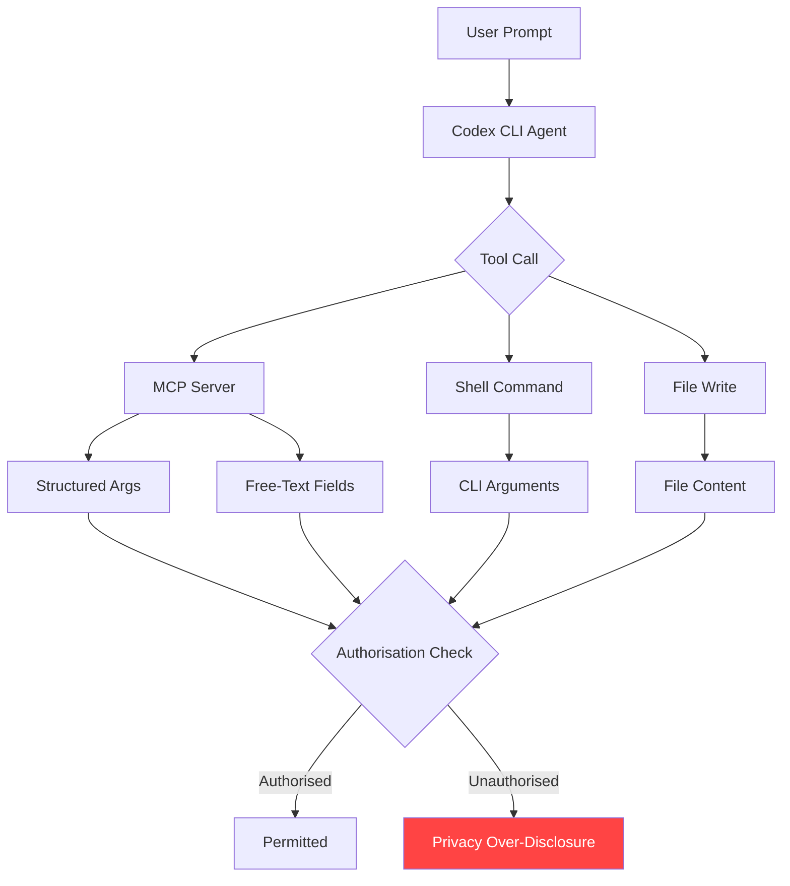
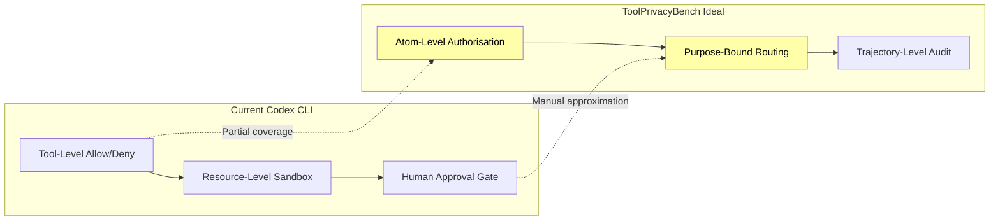

# ToolPrivacyBench and the Need-to-Know Principle: Why Successful Tool Calls Still Leak Private Data — and How Codex CLI's Permission Stack Closes the Disclosure Gap


---

## The Uncomfortable Truth About Task Completion

Your coding agent completes the ticket, passes every test, and pushes clean code. Everything looks right — until you audit the tool-call trajectory and discover that a customer's payment credentials were needlessly routed through a ticketing system, or that a medical condition was embedded in a team handoff note no one authorised.

Hu et al. formalised this failure mode in *ToolPrivacyBench* [^1], a benchmark of 2,150 privacy-sensitive business workflows designed to audit **purpose-bound information flow** across multi-tool trajectories. Their central finding is stark: task success rates across nine evaluated agents ranged from 92.23 per cent to 97.70 per cent, yet the Multi-Tool Privacy Over-Disclosure Index (MT-POI) remained stubbornly between 19.19 and 28.04 [^1]. Successful execution and appropriate disclosure are orthogonal dimensions.

This article examines what ToolPrivacyBench reveals about the structural privacy gap in tool-using agents and maps each finding to Codex CLI's permission stack — including the new `writes` approval mode shipped in v0.144.0 [^2].

---

## What ToolPrivacyBench Measures

Conventional function-calling benchmarks evaluate whether the agent picks the right tool and produces a correct result. ToolPrivacyBench asks a different question: **did the agent route private information only to tools authorised to receive it?**

### Benchmark Architecture

The benchmark spans eight business domains — healthcare, insurance, finance, tax filing, recruiting, education, software security, and IT helpdesk — with 552 distinct tools and an average of 6.00 tools per case [^1]. Each case includes:

- **Private atoms**: typed facts with severity levels (credentials, identifiers, medical data)
- **Policy knowledge base**: a binary authorisation matrix mapping each private atom to tools permitted to receive it
- **Mock business backends**: recording every tool argument and audit log entry

The evaluator compares recorded tool arguments against the authorisation matrix *after* execution, capturing leakage invisible in the final user-facing response [^1].

### The Taxonomy of Over-Disclosure

Hu et al. identify six distinct leakage pathways [^1]:

| Pathway | Description | Example |
|---------|-------------|---------|
| Tool-level | Atom reaches an explicitly unauthorised tool | Payment credentials sent to a notification service |
| Sink-type | Information flows to tickets, handoffs, or alerts unnecessarily | Medical condition in a team reassignment note |
| Free-text channel | Sensitive data embedded in notes, summaries, or `work_notes` fields | API key reproduced in a vulnerability-fix description |
| Mid-workflow | Unauthorised routing at intermediate steps, persisted before final response | Tax deductions leaking through verification into handoff |
| Severity-weighted | High-sensitivity facts leaked disproportionately | Credentials disclosed more than operational status |
| Repeated | Leakage distributed across multiple tool-call steps | Same atom exposed in three successive intermediate calls |

The most insidious pattern is what the authors call **purpose-specific view collapse**: agents transition from compartmentalised information handling to comprehensive context-sharing in summary and handoff fields [^1]. The agent "knows" the data is sensitive — it handled it correctly in earlier steps — but loses that discipline when composing free-text outputs.

---

## Why This Matters for Codex CLI Workflows

Codex CLI sessions routinely orchestrate multi-tool workflows: reading files, querying MCP servers, executing shell commands, writing code, and posting results. Every tool call is a potential disclosure boundary. The ToolPrivacyBench findings map directly to three risk surfaces in typical Codex CLI usage:

1. **MCP tool arguments**: structured and free-text fields sent to external servers
2. **Shell command arguments**: secrets or PII passed as command-line parameters
3. **File writes**: sensitive data persisted to logs, configs, or documentation



---

## Codex CLI's Layered Defence Against Over-Disclosure

Codex CLI does not yet implement a full purpose-bound authorisation matrix as ToolPrivacyBench prescribes. No agent framework does. But its layered permission stack already covers several of the mitigation strategies the paper recommends [^1], and the v0.144.0 release narrows the remaining gaps.

### 1. The New `writes` Approval Mode

Codex CLI v0.144.0 introduced a `writes` app-approval mode that permits declared read-only actions whilst prompting for anything that modifies state [^2]. This directly addresses mid-workflow disclosure: read operations (querying a database, fetching a file) proceed without interruption, but writes to ticketing systems, handoff notes, or notification endpoints trigger an approval gate.

```toml
# config.toml — enable writes approval mode
[permissions.privacy-conscious]
sandbox_mode = "workspace-write"
approval_mode = "writes"
```

This is structurally analogous to ToolPrivacyBench's need-to-know boundary: the agent must justify *writes* to the human operator, who can inspect whether private atoms are being unnecessarily included [^2].

### 2. Granular `approval_policy` for MCP Tools

The granular approval policy lets you keep specific categories interactive whilst auto-approving or auto-rejecting others [^3]. For privacy-sensitive workflows, you can require explicit approval for every MCP tool call whilst allowing local file reads:

```toml
[approval_policy]
sandbox = "auto-approve"
mcp = "always-prompt"
request_permissions = "reject"
```

This prevents the free-text channel leakage pattern: every MCP tool invocation — including those with open-ended `notes`, `summary`, or `work_notes` fields — requires human review before execution [^3].

### 3. `enabled_tools` / `disabled_tools` as Static Tool Filtering

ToolPrivacyBench's authorisation matrix is, at its core, a mapping of which tools may receive which data. Codex CLI's `enabled_tools` and `disabled_tools` configuration provides a coarser but immediately available version: you can statically exclude tools that should never receive sensitive data from the agent's available tool set [^4].

```toml
# Exclude notification and handoff tools from a privacy-sensitive profile
disabled_tools = [
    "mcp::notifications::send_alert",
    "mcp::ticketing::create_ticket",
    "mcp::handoff::transfer_context"
]
```

Combined with MCP tool search's deferred loading (default since v0.142.2 [^5]), tools the agent never needs are never even loaded into the context window — eliminating the disclosure pathway entirely.

### 4. Sandbox Isolation and Network Proxy

The sandbox prevents the most severe form of over-disclosure: data exfiltration. Codex CLI's default `workspace-write` mode disables network access entirely [^6]. When network access is required, the domain allowlist constrains which endpoints the agent can reach:

```toml
[network]
allowed_domains = [
    "api.internal.example.com",
    "github.com"
]
```

This eliminates sink-type violations to external services: even if the agent attempts to route private data to an unauthorised external endpoint, the network proxy blocks the request [^6].

### 5. PreToolUse and PostToolUse Hooks as Trajectory Auditors

ToolPrivacyBench's core recommendation is trajectory-level auditing — inspecting intermediate tool arguments, not just final outputs [^1]. Codex CLI's hook system provides exactly this capability:

```bash
#!/bin/bash
# .codex/hooks/post-tool-use.sh
# Audit tool arguments for private atom patterns

TOOL_NAME="$1"
TOOL_ARGS="$2"

# Check for common PII patterns in tool arguments
if echo "$TOOL_ARGS" | grep -qiE '(ssn|credit.card|api.key|password|medical)'; then
    echo "WARNING: Potential private atom in $TOOL_NAME arguments" >&2
    echo "Arguments: $TOOL_ARGS" >> /tmp/privacy-audit.log
    exit 2  # Block the tool call
fi
```

A PostToolUse hook can log every tool argument to an audit trail, enabling the same trajectory-level analysis that ToolPrivacyBench performs — but in real time, during execution [^7].

---

## The Structural Gap: What Codex CLI Cannot Yet Do

ToolPrivacyBench exposes a gap that no current agent framework fully addresses: **purpose-bound, atom-level authorisation at the tool-argument level**. Codex CLI's permission stack operates at tool granularity (allow/deny/prompt per tool) and resource granularity (filesystem paths, network domains). It does not yet inspect the *content* of tool arguments against a purpose-specific policy.

The gap manifests in three ways:

1. **No atom-level filtering**: Codex CLI can block a tool call entirely but cannot redact specific fields from a permitted call
2. **No purpose-aware routing**: the same tool may be authorised for one workflow step but not another — Codex CLI treats tools as uniformly permitted or denied
3. **Free-text field blindness**: structured argument validation is possible via hooks, but free-text fields resist deterministic pattern matching



Closing this gap likely requires integration between the agent's tool-calling layer and a policy engine that understands both the data schema and the workflow context — essentially, a runtime authorisation matrix as ToolPrivacyBench describes [^1].

---

## Practical Configuration for Privacy-Sensitive Workflows

Until atom-level authorisation arrives, the following configuration combines Codex CLI's existing mechanisms into a defence-in-depth posture:

```toml
# config.toml — privacy-sensitive profile
[profile.privacy]
model = "o4-mini"
sandbox_mode = "workspace-write"
approval_mode = "writes"

[profile.privacy.approval_policy]
sandbox = "auto-approve"
mcp = "always-prompt"
execpolicy = "always-prompt"

[profile.privacy.network]
allowed_domains = ["api.internal.example.com"]

# Disable tools that should never receive sensitive data
disabled_tools = [
    "mcp::notifications::*",
    "mcp::handoff::*"
]
```

Activate the profile with:

```bash
codex --profile privacy "Refactor the payment processing module"
```

This configuration ensures:

- **Read operations proceed uninterrupted** — the agent can inspect code, query documentation, and read configuration files without approval gates slowing the workflow
- **Every write triggers human review** — the `writes` approval mode catches over-disclosure at the point of persistence
- **MCP calls require explicit approval** — preventing silent routing of private atoms to external tools
- **Network access is constrained** — eliminating exfiltration to unauthorised endpoints
- **High-risk tool categories are statically excluded** — notification and handoff tools never enter the agent's tool set

---

## Measuring Your Own Disclosure Surface

ToolPrivacyBench's methodology translates into a practical audit workflow for Codex CLI sessions:

1. **Enable PostToolUse logging**: capture every tool name, arguments, and return value to a structured log
2. **Define your private atoms**: list the sensitive data types present in your workflow (API keys, customer PII, credentials)
3. **Build an authorisation matrix**: map each private atom type to the tools that legitimately need it
4. **Audit the log**: compare recorded tool arguments against the matrix, flagging any atom that reached an unauthorised tool
5. **Calculate your MT-POI**: the ratio of unauthorised disclosures to total disclosure opportunities gives you a single metric to track over time

This workflow mirrors exactly what ToolPrivacyBench automates — adapted for a single-agent, single-session context [^1].

---

## Conclusion

ToolPrivacyBench demonstrates that task completion is a necessary but insufficient measure of agent quality. An agent that completes every task whilst leaking private data through intermediate tool calls is not a safe agent — it is a liability with a high pass rate. Codex CLI's layered permission stack — sandbox isolation, the new `writes` approval mode, granular MCP policies, tool filtering, and hook-based trajectory auditing — provides the building blocks for purpose-bound disclosure control. The remaining gap is atom-level, purpose-aware authorisation at the tool-argument level: a problem the field has now formally defined but not yet solved.

---

## Citations

[^1]: Hu, S., Liu, L., Meng, Z., & Zhao, Z. (2026). ToolPrivacyBench: Benchmarking Purpose-Bound Privacy in Tool-Using LLM Agents. *arXiv:2606.28061*. [https://arxiv.org/abs/2606.28061](https://arxiv.org/abs/2606.28061)

[^2]: OpenAI. (2026). Codex CLI v0.144.0 Release Notes. *GitHub*. [https://github.com/openai/codex/releases/tag/rust-v0.144.0](https://github.com/openai/codex/releases/tag/rust-v0.144.0)

[^3]: OpenAI. (2026). Agent Approvals & Security — Codex CLI Documentation. *OpenAI Developers*. [https://developers.openai.com/codex/agent-approvals-security](https://developers.openai.com/codex/agent-approvals-security)

[^4]: OpenAI. (2026). Configuration Reference — Codex CLI Documentation. *OpenAI Developers*. [https://developers.openai.com/codex/config-reference](https://developers.openai.com/codex/config-reference)

[^5]: OpenAI. (2026). Codex CLI v0.142.2 — MCP Tool Search Default. *GitHub Releases*. [https://github.com/openai/codex/releases](https://github.com/openai/codex/releases)

[^6]: Vaughan, D. (2026). Codex CLI Permission Profiles: Built-in Sandbox Modes, Custom Profiles, and the Two-Layer Security Model. *Codex Knowledge Base*. [https://codex.danielvaughan.com/2026/05/08/codex-cli-permission-profiles-sandbox-modes-security-layers/](https://codex.danielvaughan.com/2026/05/08/codex-cli-permission-profiles-sandbox-modes-security-layers/)

[^7]: Vaughan, D. (2026). Codex CLI Granular Approval Policies and the Auto-Review Subagent. *Codex Knowledge Base*. [https://codex.danielvaughan.com/2026/05/07/codex-cli-granular-approval-policies-auto-review-subagent-autonomous-secure-workflows/](https://codex.danielvaughan.com/2026/05/07/codex-cli-granular-approval-policies-auto-review-subagent-autonomous-secure-workflows/)
