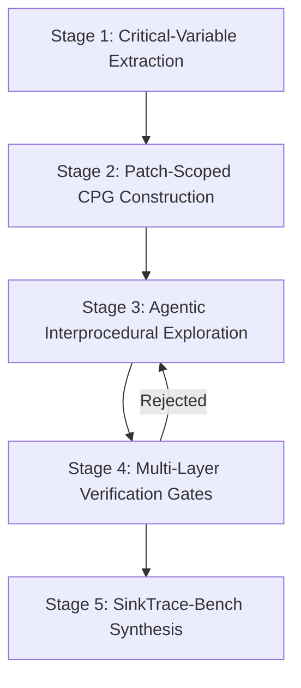
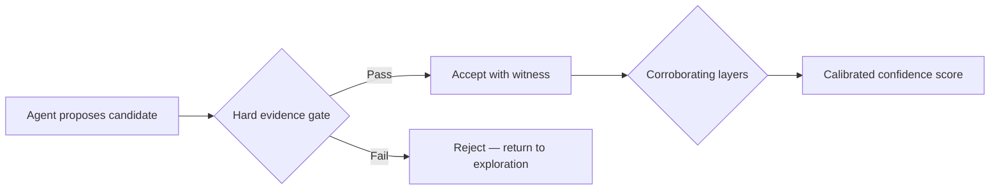

# AutoTrace and Evidence-Gated Trigger Localization: Why Finding the Vulnerability Is Not Enough — You Need the Causal Chain, and Codex CLI Can Walk It


---

Static analysers find vulnerable functions. They rarely tell you which statement actually fires the exploit. Zibaeirad, Vieira, and Zimmermann's AutoTrace paper, published 15 July 2026, introduces an agentic pipeline that walks interprocedural call chains — guided by code property graphs and hard evidence gates — to locate the exact triggering statement [^1]. The results are striking: 75.0% VulnHit on the InterPVD benchmark, outperforming both traditional static tools (CodeQL at 8.6%, Fortify at 13.0%) and deep-learning detectors that collapse on cross-function cases [^1]. AutoTrace ships as an MCP server and VS Code extension, making it directly consumable by Codex CLI's tool pipeline [^1].

This article unpacks AutoTrace's architecture, examines its evidence-gating discipline, benchmarks its SinkTrace-Bench dataset against frontier models, and maps the entire pattern to Codex CLI's hook and subagent configuration.

## The Gap: Detection Is Not Localization

Most vulnerability scanners answer a binary question: is this code vulnerable? That answer is necessary but insufficient. When a CVE advisory arrives, a senior engineer needs the *trigger* — the exact statement where attacker-controlled data reaches a dangerous operation. In interprocedural vulnerabilities, the triggering statement often lies several call layers outside the patched function [^1].

Static tools cluster at 2.5–13.0% VulnHit on InterPVD because they lose precision through project-specific wrappers and indirect calls [^1]. Deep-learning detectors fare better intra-procedurally (LineVul at 39.3%) but drop 11.2 percentage points on interprocedural cases (28.1%), precisely where the threat is greatest [^1].

## AutoTrace's Five-Stage Pipeline

AutoTrace combines LLM reasoning with deterministic verification across five stages:



### Stage 1 — Critical-Variable Extraction

An LLM agent identifies variables constrained by the patch diff. Accuracy on exact CWE classification reaches 43.2%, but fuzzy recall for variable identification hits 82.7% [^1]. The high recall matters more than precise CWE labelling: the pipeline needs candidate variables to trace, not a taxonomy lecture.

### Stage 2 — Patch-Scoped Code Property Graph

Rather than building a whole-repository CPG (which would be prohibitively expensive), AutoTrace constructs graphs on-demand from changed files using Joern [^2]. This patch-scoped approach keeps the analysis tractable while retaining the interprocedural edges needed for tracing.

### Stage 3 — Agentic Best-First Exploration

The agent explores the call graph using a priority queue, examining one function per iteration with local slicing. The scoring function balances semantic relevance against call-graph depth [^1]:

```
score = (p_agent × 100) − (|d| × 10)
```

Where `p_agent` is the model's confidence that the current function contains the trigger, and `|d|` is the call-graph depth. This penalises deep exploration when shallow candidates remain plausible — a practical heuristic that prevents the agent from disappearing down rabbit holes.

### Stage 4 — Multi-Layer Verification Gates

This is AutoTrace's defining contribution. The system enforces a strict separation between *proposing* and *accepting* triggers:

| Layer | Type | Function |
|-------|------|----------|
| Layer 1 | Hard gate | Dataflow path from critical variable to sink |
| Layer 1b | Hard gate (fallback) | Loop-bound and control-dependent triggers |
| Layer 2 | Corroborating | Protective guard assessment |
| Layer 3 | Corroborating | Patch differential effect |
| Layer 4 | Hard gate | Contextual consistency — trigger sits in claimed control structure |

Agents propose candidates; deterministic gates decide acceptance. Corroborating layers (2–3) calibrate confidence but never reject outright [^1]. Among 360 candidates reaching the synthesis agent, 100% pass Layer 4 contextual checks; 55.6% carry direct dataflow witnesses, and 33.1% rely on control-dependency fallbacks [^1].

The paper's core principle bears repeating: *"no trigger rests on unverified model judgment"* [^1].

### Stage 5 — SinkTrace-Bench Construction

Each verified trigger generates a vulnerable/safe pair from pre- and post-fix snapshots. The resulting dataset — 1,542 samples across 771 matched pairs, 540 CVEs, 45 projects, and 16 CWE classes — costs just \$0.65 per CVE using Gemini-3-Flash [^1]. Manual audit confirms 100% label agreement and 83.8% root-cause accuracy [^1].

## Frontier Models Cannot Separate Matched Pairs

The most sobering finding is how frontier models perform on SinkTrace-Bench. Given a vulnerable sample and its near-identical safe counterpart (differing by a median of three lines), models default to calling everything vulnerable:

| Model | Accuracy | True Negative Rate | True Positive Rate |
|-------|----------|--------------------|--------------------|
| Gemini-3-Flash | 59.0% | 30.5% | 87.5% |
| GLM-5.2 | 57.1% | 25.8% | 88.5% |
| Qwen3-Coder-Next | 52.7% | 16.1% | 89.2% |
| MiniMax-M2.7 | 57.5% | 54.7% | 60.3% |

Models excel at spotting dangerous sinks (87–95% TPR) but collapse when asked whether the sink is actually reachable in the safe version (7–31% TNR) [^1]. Only MiniMax-M2.7 maintains balanced performance, suggesting that reasoning-capable architectures better separate causal reachability from surface pattern matching [^1].

This has direct implications for any team running agent-based vulnerability scanning: raw model judgment cannot distinguish "this code contains a dangerous function" from "this code is exploitable." Evidence-gated verification is not optional.

## Mapping AutoTrace to Codex CLI

AutoTrace is available as an MCP server and VS Code extension [^1], which means Codex CLI can consume it directly. Here is how to wire the pattern into a practical security workflow.

### MCP Server Configuration

Register AutoTrace as an MCP server in your project's `.codex/config.toml`:

```toml
[mcp_servers.autotrace]
command = "autotrace-mcp"
args = ["--joern-path", "/usr/local/bin/joern", "--model", "gemini-3-flash"]
startup_timeout_sec = 30
tool_timeout_sec = 300   # interprocedural tracing takes time
```

With the tool registered, Codex CLI can invoke trigger localization during security review tasks. The `tool_timeout_sec` value deserves attention: AutoTrace's median per-CVE time is 42 minutes, with a P90 tail near 13.8 hours on deeply nested vulnerabilities [^1]. For interactive use, scope queries to specific files or functions rather than full-repository sweeps.

### PreToolUse Hooks for CVE-Triggered Analysis

Wire a PreToolUse hook that detects when Codex is about to patch a file flagged by your vulnerability scanner, and injects trigger localization before the fix:

```json
{
  "hooks": [
    {
      "event": "PreToolUse",
      "tool": "apply_patch",
      "command": "bash .codex/hooks/check-vuln-trigger.sh $FILE_PATH",
      "policy": "warn"
    }
  ]
}
```

The hook script checks whether the target file has open CVE advisories and, if so, calls the AutoTrace MCP tool to locate the trigger before the agent begins patching. This prevents the common failure mode where agents patch the detection site rather than the root cause.

### PostToolUse Verification

After patching, a PostToolUse hook can re-run trigger localization to verify the fix actually eliminates the causal chain:

```json
{
  "hooks": [
    {
      "event": "PostToolUse",
      "tool": "apply_patch",
      "command": "bash .codex/hooks/verify-trigger-eliminated.sh $FILE_PATH",
      "policy": "block"
    }
  ]
}
```

Setting the policy to `block` ensures Codex cannot continue if the trigger persists after patching — mechanically enforcing AutoTrace's evidence-gating discipline at the harness level.

### AGENTS.md Security Protocol

Encode the evidence-first repair pattern in your project's `AGENTS.md`:

```markdown
## Vulnerability Repair Protocol

When fixing a CVE or security advisory:
1. Run trigger localization via the autotrace MCP tool BEFORE writing any fix
2. Identify the exact triggering statement and its interprocedural call chain
3. Patch the root cause, not the detection site
4. Verify the trigger is eliminated after patching
5. Never mark a vulnerability as fixed without dataflow evidence
```

This converts AutoTrace's "no trigger rests on unverified judgment" principle into a durable instruction that survives across agent sessions [^3].

### Subagent Delegation for Deep Vulnerabilities

For vulnerabilities spanning multiple call layers, delegate the exploration to a subagent with an extended token budget:

```toml
[profiles.security-deep]
model = "gpt-5.5"
rollout_token_budget = 500000
tool_timeout_sec = 600
```

The extended budget accommodates AutoTrace's median 23.2 LLM calls per CVE and the potentially large CPG context that interprocedural tracing requires [^1].

## The Evidence-Gating Pattern Beyond Security

AutoTrace's architecture — agents propose, deterministic gates accept — generalises beyond vulnerability localization. The pattern applies wherever LLM judgment needs verification:



In Codex CLI terms, this maps to:

- **PreToolUse hooks** as hard gates (block actions without evidence)
- **PostToolUse hooks** as corroborating layers (warn but do not reject)
- **Guardian auto-review** as the final consistency check [^4]
- **AGENTS.md** as the evidence-requirement specification

The leave-one-out ablation in AutoTrace confirms the value of each component: removing reflection/retry drops FuncHit by 32 percentage points, episodic memory by 16, and critical-variable refinement by 12 [^1]. Every layer of evidence collection contributes measurably.

## Limitations Worth Knowing

AutoTrace's operational profile has practical constraints:

- **Depth-dependent timeouts**: 141 of 744 CVEs (19%) time out or fail, predominantly due to Joern's 3-hour wall-clock limit on deep multi-file vulnerabilities [^1]
- **Field-sensitivity gaps**: Deeply nested dereferences and unresolved macros can produce empty slices despite complete call paths existing [^1]
- **Resource-leak edge cases**: CWE-401/772 (missing deallocation) lacks forward dataflow proof, so the verifier admits these on structural grounds alone, widening the hallucination surface [^1]
- **22.7% interprocedural coverage**: Nearly a quarter of SinkTrace-Bench spans multiple functions, with slices reaching up to 9 function frames [^1]

⚠️ The \$0.65 per CVE cost figure uses Gemini-3-Flash pricing as of July 2026; costs will vary with model selection and repository complexity.

## Practical Takeaways

1. **Trigger localization is the bottleneck**, not vulnerability detection. Static tools find issues; agents can now trace them to root causes.
2. **Evidence gates are non-negotiable**. AutoTrace's architecture proves that separating proposal from acceptance eliminates unverified model judgment. Apply the same discipline in your Codex CLI hooks.
3. **Frontier models cannot distinguish "dangerous sink present" from "dangerous sink reachable"**. TNR rates of 7–31% on matched pairs mean you cannot trust raw model output for vulnerability triage.
4. **MCP integration makes this accessible today**. AutoTrace's MCP server and VS Code extension slot directly into Codex CLI's tool pipeline — no custom integration required.
5. **Budget for depth**. Interprocedural tracing is expensive in time and tokens. Configure extended timeouts and dedicated security profiles for deep analysis.

## Citations

[^1]: A. Zibaeirad, M. Vieira, T. Zimmermann, "AutoTrace: From Patches to Triggers via Agentic Interprocedural Exploration," arXiv:2607.12058, July 2026. [https://arxiv.org/abs/2607.12058](https://arxiv.org/abs/2607.12058)

[^2]: Joern — Open-Source Code Analysis Platform. [https://joern.io](https://joern.io)

[^3]: OpenAI, "AGENTS.md — Codex CLI Configuration," Codex Documentation, 2026. [https://developers.openai.com/codex/agents-md](https://developers.openai.com/codex/agents-md)

[^4]: OpenAI, "Hooks — Codex CLI," Codex Documentation, 2026. [https://developers.openai.com/codex/hooks](https://developers.openai.com/codex/hooks)
