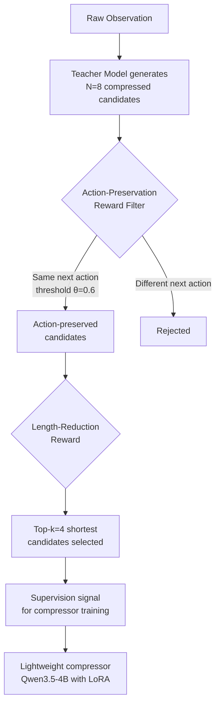
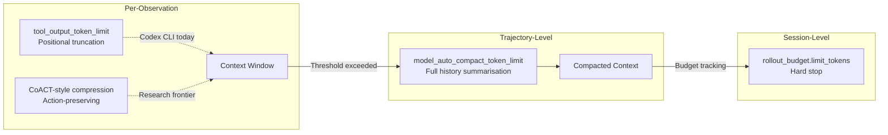

# CoACT and Observation Compression: Cutting Coding Agent Token Costs by a Third Without Losing Effectiveness — and What It Means for Codex CLI Context Management


---

Every iterative step a coding agent takes — reading a file, running a test, grepping a repository — returns an observation that goes straight into the context window. Over a typical SWE-bench task, those observations accumulate into millions of tokens, dominating both latency and cost. The question practitioners keep circling is: *how much of that observation text actually matters for the agent's next decision?*

A July 2026 paper from Chen, Zhu, Zhang, and Li — *CoACT: Action-Preserving Observation Compression for Coding Agents* (arXiv:2607.02911) [^1] — provides a rigorous answer. Their compression method reduces total token consumption by 33% on average across three agentic models, while maintaining — and in two cases *improving* — task-solving effectiveness on SWE-bench Verified. The key insight: compress observations such that the agent's next action stays the same.

This article unpacks the CoACT architecture, examines its results against existing compression baselines, and maps the research findings to Codex CLI's own context management stack.

## The Observation Accumulation Problem

Coding agents operate in multi-turn loops. Each turn invokes a tool (shell command, file read, search), receives an observation, and decides what to do next. The observations pile up:

- A `grep` across a large repository returns hundreds of lines, most irrelevant
- Running a test suite produces verbose stack traces where only the failure summary matters
- Reading a 500-line file when the agent only needs three functions

Chen et al. measured average total token consumption at 3.795 million tokens per task for Qwen3.5-35B-A3B on SWE-bench Verified [^1]. Even with faster models like Gemini3-Flash, consumption sits at 685,000 tokens per task [^1]. At current API pricing, this adds up fast across hundreds of daily agent invocations.

## How CoACT Works: Next-Action Preservation

The core principle is **next-action preservation (NAP)**: a compressed observation is valid if and only if it causes the agent to take the same next action as the uncompressed observation would [^1].



The training pipeline operates in two stages [^1]:

1. **Offline bootstrap** — The compressor trains on uncompressed agent trajectories. A teacher model (Gemini3-Flash) generates eight candidate compressions per observation. The action-preservation reward samples K=8 reference actions under the raw observation, then checks whether each compressed candidate induces the same greedy-decoded action. Candidates passing the θ=0.6 threshold are kept; from those, the top four shortest are selected as training supervision.

2. **Online alignment** — The compressor is retrained on trajectories where earlier observations are already compressed, closing the train-test distribution gap that plagues offline-only approaches.

The compressor itself is a Qwen3.5-4B model fine-tuned with LoRA (rank 64, alpha 128) [^1], making it lightweight enough to run alongside the primary agentic model without significant overhead.

## Results: Token Savings With Effectiveness Preserved

The results across three models on SWE-bench Verified are striking [^1]:

| Model | Pass@1 (Vanilla) | Pass@1 (CoACT) | Token Reduction | Step Reduction |
|-------|:-:|:-:|:-:|:-:|
| Qwen3.5-35B-A3B | 57.0% | 60.5% (+3.5pp) | 36% | 16% |
| Deepseek-v4-Pro | 76.5% | 75.0% (−1.5pp) | 19% | ~0% |
| Gemini3-Flash | 73.5% | 77.5% (+4.0pp) | 38% | 3% |

Two models actually *improved* with compression. The hypothesis: removing noise from observations lets the model focus on decision-relevant information, reducing distraction-induced errors [^1].

### How CoACT Compares to Existing Approaches

Prior compression methods suffer from a brutal efficiency-effectiveness trade-off [^1]:

- **LLMLingua-2**: Achieved token reduction but dropped Qwen's pass@1 from 57.0% to 50.0% and *increased* steps by 111% — the model, confused by garbled context, thrashed through more iterations [^1]
- **LongCodeZip**: Preserved effectiveness but achieved only 17% token reduction — too conservative to justify the compression overhead [^1]
- **SWE-Pruner**: Caused 18–24% step increases from over-compression of structurally important content [^1]

CoACT's action-preservation constraint avoids these failure modes by ensuring the compression never changes what the agent would do next.

### Ablation: Both Rewards Matter

The ablation study reveals the contribution of each reward signal [^1]:

| Variant | Pass@1 | Total Tokens |
|---------|:-:|:-:|
| No reward (base compressor) | 58.0% | 2.793M |
| Without action-preservation | 50.0% | 2.607M |
| Without length-reduction | 61.0% | 2.930M |
| **CoACT (both rewards)** | **60.5%** | **2.428M** |

Removing action-preservation is catastrophic — a 10.5pp drop in effectiveness. Removing length-reduction preserves effectiveness but sacrifices efficiency. Both rewards are necessary for the optimal trade-off.

## Mapping to Codex CLI's Context Management Stack

Codex CLI already provides several mechanisms for managing observation-driven context pressure. CoACT's findings inform how to configure them more effectively.

### `tool_output_token_limit`: The Blunt Instrument

Codex CLI's `tool_output_token_limit` configuration key [^2] caps the token budget for storing individual tool outputs in conversation history. The default sits around 12,000 tokens [^3]. When output exceeds this limit, Codex truncates — preserving the beginning and end while cutting the middle [^4].

```toml
# ~/.codex/config.toml
tool_output_token_limit = 8000   # Lower for log-heavy workflows
```

This is naive truncation — exactly the approach CoACT demonstrates is suboptimal. The truncation preserves positional extremes regardless of whether those extremes contain decision-relevant information. CoACT's finding that LLMLingua-2's uninformed compression *increased* agent steps by 111% [^1] suggests that poorly-targeted truncation can actively harm performance.

**Practical guidance**: Lower `tool_output_token_limit` for sessions involving verbose outputs (test suites, log analysis), but recognise this is a coarse control. The real leverage comes from ensuring observations are *semantically* compressed, not positionally truncated.

### `model_auto_compact_token_limit`: When Compaction Fires

When the context window fills beyond `model_auto_compact_token_limit` — defaulting to roughly 80% of the model's context window [^5] — Codex triggers automatic compaction, summarising the entire conversation history. This is a trajectory-level compression, distinct from CoACT's per-observation approach.

```toml
# Trigger compaction earlier to preserve headroom
model_auto_compact_token_limit = 150000
```

CoACT's results suggest these two compression levels are complementary. The paper shows that combining CoACT with AgentDiet (a trajectory-level compressor) reduced total cost from \$45.65 to \$25.88 [^1] — a 43% reduction beyond what either technique achieves alone.



### Rollout Token Budget: The Hard Ceiling

Codex CLI's rollout budget feature [^2] tracks cumulative token usage across an agent session and aborts when the budget is exhausted:

```toml
[features.rollout_budget]
enabled = true
limit_tokens = 500000
reminder_interval_tokens = 50000
```

CoACT's 33% average token reduction directly extends what a fixed budget can accomplish. A 500,000-token budget that previously covered roughly 0.13 SWE-bench tasks at Qwen's 3.795M consumption rate would cover 0.21 tasks at the compressed 2.428M rate [^1] — a 62% increase in effective capacity.

### AGENTS.md: Encoding Observation Discipline

CoACT demonstrates that what you *remove* from observations matters as much as what you keep. This maps to AGENTS.md instructions that constrain tool usage patterns:

```markdown
## Tool Output Discipline

- When reading files, use line-range parameters to fetch only relevant sections
- Pipe grep results through `head -n 50` to cap observation length
- For test runs, use `--quiet` or `--summary` flags to suppress passing test output
- Never run `find` without `-maxdepth` on large repositories
```

These instructions achieve a manual form of observation compression — reducing observation size at the source rather than post-hoc. CoACT's finding that Gemini3-Flash improved by 4pp with compression [^1] suggests that even frontier models benefit from cleaner observations.

### PostToolUse Hooks: Observation Filtering at Runtime

Codex CLI's hook system [^6] provides a programmatic insertion point for observation filtering:

```toml
# .codex/hooks/post_tool_use.sh
# Triggered after every tool call — filter noisy observations
if echo "$TOOL_NAME" | grep -q "shell"; then
    # Strip ANSI codes, collapse blank lines, cap length
    echo "$TOOL_OUTPUT" | sed 's/\x1b\[[0-9;]*m//g' | \
        tr -s '\n' | head -c 8000
fi
```

This is conceptually aligned with CoACT's per-observation compression, though without the action-preservation guarantee. A production-grade implementation would need to verify that filtered observations don't change the agent's downstream behaviour — precisely the validation CoACT's NAP criterion provides.

## Cross-Model Transfer: Compression Generalises

A concern with learned compression is whether a compressor trained for one model transfers to others. CoACT's cross-model evaluation shows small gaps — pass@1 ranges from 74.5% to 75.0% when applying a single trained compressor across different agent models [^1]. This is encouraging for Codex CLI users who switch between models via named profiles: a single observation compression strategy can work across GPT-5.6 Sol, Terra, and Luna tiers without per-model tuning.

## The Compaction Spiral Implication

One of Codex CLI's known failure modes is the **compaction spiral** [^5]: when context fills, compaction fires, which itself consumes tokens, which triggers another compaction. CoACT's per-observation approach attacks this problem upstream — by keeping observations small from the start, the context fills more slowly, delaying or preventing the compaction threshold from being reached.

On the Qwen model, CoACT reduced average steps from 92.6 to 77.5 [^1] — 16% fewer tool invocations. Fewer steps means fewer observations, which compounds the token savings and further delays compaction pressure.

## Limitations and Open Questions

CoACT's NAP criterion assumes that next-action preservation is a reliable proxy for task success [^1]. This holds well on SWE-bench — where tasks are relatively self-contained — but may not generalise to long-horizon tasks where distant observations influence later decisions through accumulated context.

The compressor adds inference overhead. Running Qwen3.5-4B on every observation introduces latency, though the LoRA fine-tuning keeps the model small. For Codex CLI's architecture, where tool calls go through the Responses API, adding a client-side compression step before context submission would require changes to the harness layer.

The training data comes from 50 SWE-smith instances yielding 4,866 examples [^1] — a relatively small dataset. Whether this generalises to the diversity of real-world Codex CLI usage (infrastructure-as-code, data pipelines, frontend development) remains unvalidated.

## What This Means for Practitioners

The immediate takeaway: **observation management is an underexploited lever for token cost reduction**. Most Codex CLI users focus on model selection and reasoning effort as cost controls. CoACT demonstrates that *what goes into the context* matters as much as *which model processes it*.

Concrete steps you can take today:

1. **Audit your observation sizes** — Enable `codex exec --json` and examine `tool_output` token counts per turn. Identify which tools produce the largest observations.

2. **Lower `tool_output_token_limit`** — If your p95 useful observation is 6,000 tokens, there's no reason to store 12,000.

3. **Add output discipline to AGENTS.md** — Constrain tool invocations to produce smaller, more focused outputs.

4. **Use PostToolUse hooks for structured filtering** — Strip ANSI codes, collapse whitespace, remove boilerplate headers from test output.

5. **Set rollout budgets** — With reduced per-observation cost, your budget goes further. Track the improvement empirically.

The CoACT research points toward a future where observation compression is built into the agent harness itself — a learned, action-preserving filter between every tool call and the context window. Until that arrives in Codex CLI natively, the manual and configuration-based approaches outlined above capture much of the benefit.

## Citations

[^1]: Chen, H., Zhu, Y., Zhang, Y., & Li, J. (2026). CoACT: Action-Preserving Observation Compression for Coding Agents. *arXiv:2607.02911*. [https://arxiv.org/abs/2607.02911](https://arxiv.org/abs/2607.02911)

[^2]: OpenAI. (2026). Configuration Reference — Codex CLI. [https://developers.openai.com/codex/config-reference](https://developers.openai.com/codex/config-reference)

[^3]: OpenAI Community. (2026). Configurable tool output truncation limits via config.toml. GitHub Issue #5913. [https://github.com/openai/codex/issues/5913](https://github.com/openai/codex/issues/5913)

[^4]: OpenAI. (2026). Replace line-based tool output truncation with token-based limits. GitHub Issue #6426. [https://github.com/openai/codex/issues/6426](https://github.com/openai/codex/issues/6426)

[^5]: OpenAI. (2026). Advanced Configuration — Codex CLI. [https://developers.openai.com/codex/config-advanced](https://developers.openai.com/codex/config-advanced)

[^6]: OpenAI. (2026). Codex CLI Hooks — ChatGPT Learn. [https://developers.openai.com/codex/cli/hooks](https://developers.openai.com/codex/cli/hooks)
