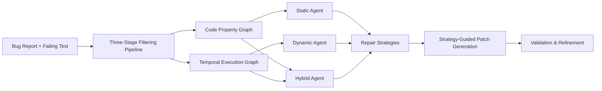
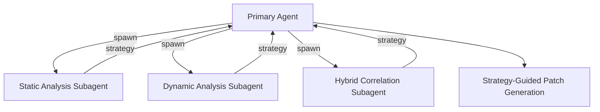

# CT-Repair and Multi-Perspective Evidence: Why Throwing More Patches at Bugs Does Not Work — and How to Wire Evidence-Guided Repair into Codex CLI


---

Most coding agents treat bug repair as a generation problem: read the failing test, produce a patch, hope it sticks. When it doesn't, generate another. CT-Repair, published on arXiv on 14 July 2026 [^1], demonstrates that a fundamentally different strategy — structured evidence gathering across static, dynamic, and hybrid perspectives before generating any patch — repairs 99 more bugs than the best single perspective and outperforms RepairAgent by 30 bugs on Defects4J v3.0 [^1]. The research has immediate implications for how practitioners configure Codex CLI's hook pipeline and subagent architecture for repair workflows.

## The Problem with Patch-Sampling Loops

The prevailing approach to LLM-based automated program repair scales by sampling: generate N candidate patches, run the test suite against each, keep the first that passes. RepairAgent (ICSE 2025) introduced autonomous tool selection, repairing 164 bugs on Defects4J v1.2/v2.0 with a fixed prompt-and-retry loop [^2]. On the larger Defects4J v3.0 benchmark (854 bugs), RepairAgent reaches approximately 358 bugs [^1]. ReinFix improved on this by retrieving historical bug-fix ingredients, reaching 241 bugs across both earlier Defects4J versions [^3].

Both approaches share a structural limitation: raw execution traces are too large and repetitive to serve as effective model context, and repeated sampling produces redundant implementations without advancing root-cause analysis [^1]. CT-Repair's contribution is demonstrating that the bottleneck is not generation capacity but evidence quality.

## How CT-Repair Works

CT-Repair introduces two structured representations that convert raw code and execution data into queryable evidence:

### Code Property Graphs (CPG)

A Code Property Graph unifies the abstract syntax tree, control-flow graph, and data-dependency graph into a single queryable structure [^1]. Rather than dumping source files into the context window, the static agent queries the CPG for reachable definitions, tainted data flows, and structural patterns surrounding the fault location. This reduces the candidate method scope by an average of 94.85% [^1].

### Temporal Execution Graphs (TEG)

A Temporal Execution Graph captures runtime behaviour as a time-ordered graph of method invocations, variable mutations, and exception propagation [^1]. The dynamic agent queries the TEG rather than reading raw stack traces. A behaviour filtering stage further reduces runtime records by 55.97% whilst maintaining analytical effectiveness [^1].

### Three-Agent Architecture

CT-Repair deploys three finite-state-machine-guided agents, each analysing the bug from a different perspective [^1]:



1. **Static agent** — queries the CPG for structural patterns, data-flow anomalies, and type mismatches without executing the code.
2. **Dynamic agent** — queries the TEG for runtime divergence between passing and failing test executions.
3. **Hybrid agent** — correlates static structure with dynamic behaviour to identify faults that neither perspective alone can localise.

Each agent produces validated repair strategies rather than raw patches. The generation stage then uses these strategies as grounding evidence, avoiding the redundant-patch problem [^1].

## Benchmark Results

Evaluated on 854 Java bugs from Defects4J v3.0 [^1]:

| Configuration | Bugs Repaired | Delta vs RepairAgent |
|---|---|---|
| CT-Repair (mixed model) | 489 | +131 |
| CT-Repair (GPT-5.4-mini only) | 388 | +30 |
| Best single perspective | 390 | — |
| Multi-perspective (all three) | 489 | +99 vs best single |
| RepairAgent (on v3.0) | ~358 | baseline |
| ReinFix | ~369 | — |

The 99-bug gap between the best single perspective and the combined multi-perspective approach is the paper's core finding: static-only and dynamic-only analyses each miss fault classes that the other catches, and the hybrid perspective captures interaction faults invisible to either [^1].

## Why This Matters for Codex CLI

Codex CLI's default repair workflow — `codex exec "fix the failing test in src/Foo.java"` — operates as a single-perspective agent. It reads test output, inspects source, and generates a patch. This is roughly analogous to CT-Repair's static agent alone, which repaired 99 fewer bugs than the full multi-perspective pipeline [^1].

The research suggests three concrete improvements to Codex CLI repair workflows.

### 1. Evidence-Gathering Hooks Before Patch Generation

Codex CLI's PreToolUse hooks can intercept the repair workflow to gather structured evidence before any `apply_patch` call [^4]:

```json
{
  "hooks": {
    "PreToolUse": [
      {
        "matcher": "apply_patch",
        "hooks": [{
          "type": "command",
          "command": "python3 .codex/hooks/gather-repair-evidence.py",
          "timeout": 60
        }]
      }
    ]
  }
}
```

The hook script can run static analysis (call graphs, data-flow queries) and inject the results as `additionalContext` visible to the model, approximating CT-Repair's CPG evidence without the full graph infrastructure [^4].

### 2. Multi-Perspective Subagent Decomposition

CT-Repair's three-agent architecture maps naturally to Codex CLI's subagent delegation [^5]. Rather than a single agent attempting repair, the primary agent spawns three specialised subagents:



Each subagent operates in a scoped context:

- **Static subagent**: runs with `codex exec` instructions targeting call-graph analysis, type checking, and data-flow inspection via language-server MCP tools.
- **Dynamic subagent**: executes the failing test under a debugger or tracing framework, capturing runtime state divergence.
- **Hybrid subagent**: receives outputs from both, correlating static structure with dynamic behaviour.

The delegation mode configuration in Codex CLI v0.143+ controls whether subagents are spawned proactively or only on explicit request [^6]. For repair workflows, explicit-request mode prevents runaway subagent spawning on simple bugs.

### 3. PostToolUse Validation with Test Execution

CT-Repair's three-stage filtering pipeline ensures evidence quality before generation [^1]. Codex CLI's PostToolUse hooks provide an analogous validation gate after patch application [^4]:

```bash
#!/bin/bash
# .codex/hooks/post-patch-validate.sh
# Run targeted test suite after any apply_patch call

PATCH_FILE=$(echo "$CODEX_HOOK_INPUT" | jq -r '.tool_input.patch // empty')
if [ -n "$PATCH_FILE" ]; then
    # Run only the failing test, not the full suite
    TEST_RESULT=$(mvn test -pl :affected-module -Dtest=FailingTest 2>&1)
    EXIT_CODE=$?

    if [ $EXIT_CODE -ne 0 ]; then
        echo "{\"decision\": \"block\", \"reason\": \"Patch did not fix the failing test. Test output: $(echo $TEST_RESULT | tail -20)\"}"
    fi
fi
```

This prevents the model from declaring success on a patch that hasn't actually been validated — the "fabricated success report" failure mode documented in operational safety research [^7].

## AGENTS.md Configuration for Evidence-Guided Repair

The repair workflow benefits from explicit AGENTS.md instructions that encode the multi-perspective methodology [^8]:

```markdown
## Bug Repair Protocol

When fixing a failing test:

1. **Do not generate a patch immediately.** First gather evidence:
   - Run the failing test and capture the full stack trace
   - Identify the fault location via the stack trace
   - Query the call graph: which methods call the fault location?
   - Query data flow: which inputs reach the fault location?
   - Run the passing tests that exercise the same code path

2. **Formulate a repair strategy** before writing code:
   - State the root cause in one sentence
   - Identify which code paths are affected
   - Predict whether the fix requires single-file or multi-file changes

3. **Generate the minimal patch** that addresses the root cause.

4. **Validate** by running the failing test and all tests in the affected module.
```

This approximates CT-Repair's strategy-guided generation within Codex CLI's existing instruction surface. The key insight from CT-Repair is that step 1 and step 2 — evidence gathering and strategy formulation — are where the 99-bug improvement comes from, not step 3 [^1].

## Practical Limitations

Several caveats apply when adapting CT-Repair's findings to Codex CLI workflows:

- **Language scope**: CT-Repair was evaluated on Java with mature CPG tooling (e.g., Joern). Equivalent graph infrastructure for TypeScript, Python, or Go is less mature. ⚠️
- **Token cost**: the multi-perspective approach requires more context. CT-Repair's filtering pipeline specifically addresses this, but Codex CLI's `rollout_budget` and `model_auto_compact_token_limit` settings need tuning for repair workflows to avoid context exhaustion [^6].
- **Subagent overhead**: spawning three subagents per bug adds wall-clock time and API cost. For trivial single-line fixes, this is overkill. A triage step — assessing bug complexity before choosing single-agent vs multi-agent repair — is essential.
- **Defects4J specificity**: the benchmark contains well-localised bugs with reproducible test cases. Production bugs often lack clean reproduction steps, reducing the effectiveness of the dynamic perspective. ⚠️

## What This Means for Your Repair Pipeline

CT-Repair's core lesson is architectural, not algorithmic: **structured evidence from multiple analytical perspectives produces better repairs than more patch attempts from a single perspective**. For Codex CLI practitioners, this translates to three actionable changes:

1. Add PreToolUse hooks that gather static analysis evidence before patch generation.
2. Use subagent delegation to parallelise static, dynamic, and hybrid analysis for complex bugs.
3. Encode the "evidence first, strategy second, patch third" methodology in AGENTS.md.

The 94.85% reduction in candidate method scope and 55.97% reduction in runtime records [^1] also serve as a reminder that context engineering — what you exclude from the model's window — matters as much as what you include.

---

## Citations

[^1]: Huang, Z., Xu, L., and Zhang, H. (2026). "CT-Repair: Multi-Perspective Agentic Program Repair via Code Property Graphs and Temporal Execution Graphs." arXiv:2607.12605. [https://arxiv.org/abs/2607.12605](https://arxiv.org/abs/2607.12605)

[^2]: Bouzenia, I. et al. (2025). "RepairAgent: An Autonomous, LLM-Based Agent for Program Repair." ICSE 2025. [https://arxiv.org/abs/2403.17134](https://arxiv.org/abs/2403.17134)

[^3]: ReinFix repair ingredient search approach. Results referenced via CT-Repair comparison tables. [https://arxiv.org/abs/2506.23100](https://arxiv.org/abs/2506.23100)

[^4]: OpenAI. "Codex CLI Hooks." ChatGPT Learn documentation. [https://developers.openai.com/codex/hooks](https://developers.openai.com/codex/hooks)

[^5]: OpenAI. "Codex CLI Subagents." ChatGPT Learn documentation. [https://developers.openai.com/codex/subagents](https://developers.openai.com/codex/subagents)

[^6]: OpenAI. "Codex CLI Changelog." [https://developers.openai.com/codex/changelog](https://developers.openai.com/codex/changelog)

[^7]: Al Hasan, A. and Biswas, S. (2026). "What Breaks When LLMs Code? Characterizing Operational Safety Failures of Agentic Code Assistants." arXiv:2605.30777. [https://arxiv.org/abs/2605.30777](https://arxiv.org/abs/2605.30777)

[^8]: OpenAI. "AGENTS.md — Codex CLI." ChatGPT Learn documentation. [https://developers.openai.com/codex/agents-md](https://developers.openai.com/codex/agents-md)
