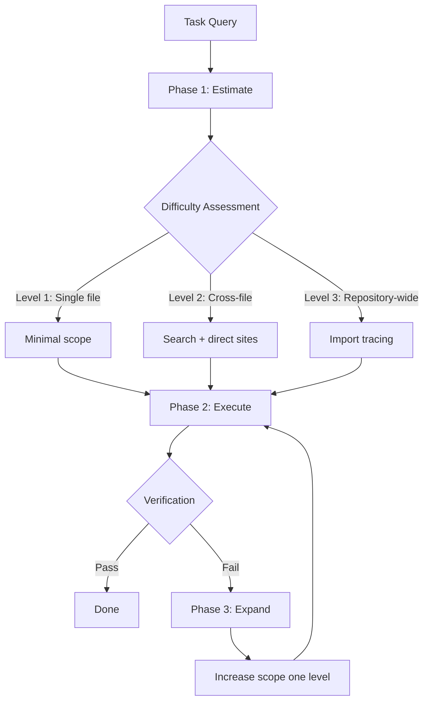
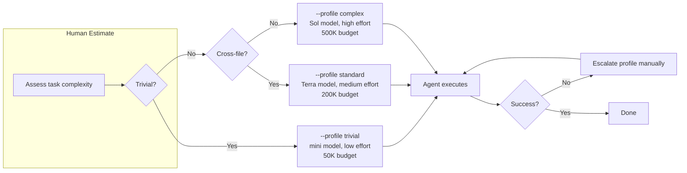

# Do AI Agents Know When a Task Is Simple? What E3's Complexity-Aware Execution Means for Codex CLI Cost Control


---

Your coding agent just spent 4,421 tokens reading every file in the repository to change one HTML icon. The fix required 248 tokens. That is not a retrieval failure or a hallucination — it is a *meta-judgement* failure: the agent could not tell that the task was trivial before committing resources. Yin and Feng's new paper formalises this problem and proposes a solution that maps directly onto Codex CLI's existing configuration surface [^1].

## The Cognitive Redundancy Problem

Most agentic coding tools — Codex CLI included — default to a conservative "maximum-context-first" strategy. When uncertain about scope, the agent reads broadly, reasons about architecture, and only then makes a localised edit. This is safe but wasteful.

Yin and Feng introduce the **Agent Cognitive Redundancy Ratio (ACRR)** to quantify the waste [^1]:

```
ACRR(τ) = [C_act(τ) - C_min(τ)] / C_min(τ)
```

Where `C_act` is the realised cost and `C_min` is the oracle-defined minimum-sufficient trajectory cost. An ACRR of 0 is optimal; an ACRR of 22.1 means spending twenty-three times the necessary effort.

The critical finding: **redundancy peaks on the simplest tasks**. On single-file edits (Level 1), the maximum-context-first policy hits an ACRR of 22.1. On repository-wide changes (Level 3), ACRR drops to 5.4 [^1]. The denominator shrinks while the numerator stays roughly constant — the agent reads the entire repository regardless of whether the task touches one line or thirty files.

## E3: Estimate, Execute, Expand

The paper proposes **E3**, a three-phase framework that teaches agents to right-size their effort [^1]:



### Phase 1 — Estimate

The agent maps the task query and environment to an initial operating point covering estimated difficulty, scope, risk, and confidence. This uses lexical analysis plus one optional cheap probe — deliberately optimistic, designed to underestimate complexity [^1].

### Phase 2 — Execute

The agent runs the minimum viable path sized to the estimate. Three scope levels govern how much context is gathered [^1]:

| Level | Scope | Context gathered |
|-------|-------|-----------------|
| 1 | Single file | Target file only |
| 2 | Cross-file | Cached search hits + direct call sites |
| 3 | Repository | Full import tracing |

Crucially, the agent *never* gathers context beyond the current scope requirement. Verification effort scales with assessed risk.

### Phase 3 — Expand

Triggered only when verification fails or confidence drops. Each expansion increases scope by one level, reusing previously gathered information. Bounded by a maximum number of expansions, after which it degrades gracefully to exhaustive search [^1].

## The Numbers

On MSE-Bench (121 tasks across three difficulty tiers), E3 matches the strongest baseline's 100% success rate whilst cutting costs dramatically [^1]:

| Policy | Success | Tokens | Files Inspected | Cost | ACRR |
|--------|---------|--------|-----------------|------|------|
| Max-Context-First | 100% | 4,421 | 8.46 | 122.85 | 12.90 |
| Fixed ReAct | 66.9% | 404 | 0.00 | 17.16 | 1.29 |
| Adaptive Retrieval | 100% | 410 | 1.99 | 22.08 | 1.21 |
| **E3** | **100%** | **403** | **0.66** | **18.55** | **0.55** |
| Oracle | 100% | — | — | 11.74 | 0.00 |

That is an **85% cost reduction** and **91% token reduction** versus maximum-context-first, with zero success rate loss [^1].

The ablation study confirms both phases matter [^1]:

- **Without Expand:** Success drops to 85.1% — all 18 deceptive Level-3 tasks fail, confirming expansion is the safety net that makes optimism viable.
- **Without Estimate:** Success stays at 100% but cost rises 20% overall and 36% on Level-3 tasks, proving estimation cuts cost through confidence.

On real-world validation with GPT-4o against an MIT-licensed Python library, E3 remained the leanest at 80,503 mean tokens versus 83,878 (ReAct) and 98,611 (thorough agent) [^1].

## Mapping E3 to Codex CLI

Codex CLI cannot run E3's framework natively — it is a research scaffold, not a shipping feature. But the three phases map cleanly onto Codex CLI's existing configuration surface.

### Phase 1 (Estimate) → Named Profiles and Reasoning Effort

Codex CLI's named profiles let you pre-encode difficulty estimates as configuration bundles [^2] [^3]:

```toml
# ~/.codex/trivial.config.toml
model = "gpt-5.6-mini"
model_reasoning_effort = "low"

# ~/.codex/standard.config.toml
model = "gpt-5.6-terra"
model_reasoning_effort = "medium"

# ~/.codex/complex.config.toml
model = "gpt-5.6-sol"
model_reasoning_effort = "high"
```

Activate with `--profile trivial` for single-file changes, `--profile complex` for cross-repository refactors [^2]. The E3 insight is that *you* are the estimator — and investing five seconds choosing a profile saves thousands of tokens.

### Phase 2 (Execute) → Scope Control via AGENTS.md and Tool Restrictions

E3's scope levels translate to restricting what the agent can see and do [^4] [^5]:

```markdown
<!-- AGENTS.md for single-file tasks -->
## Scope
- Only modify the file specified in the task description
- Do not read files outside the target directory
- Run only the directly relevant test file
```

For tighter mechanical control, use `enabled_tools` and `disabled_tools` in `config.toml` to restrict which MCP tools are available per profile [^6]:

```toml
# trivial.config.toml — restrict scope mechanically
[tools]
enabled_tools = ["shell", "apply_patch"]
disabled_tools = ["web_search", "file_search"]
```

### Phase 3 (Expand) → Rollout Budget as Expansion Ceiling

E3 bounds expansion with a maximum iteration count. Codex CLI's `rollout_token_budget` serves the same role — a hard ceiling that forces the agent to succeed within budget or stop [^7] [^8]:

```toml
# trivial.config.toml — tight budget forces minimal approach
rollout_token_budget = 50000

# complex.config.toml — generous budget permits expansion
rollout_token_budget = 500000
```

When the budget exhausts, the agent aborts the turn rather than spiralling into an expensive context-gathering loop [^7].

### The Composite Pattern

Combining all three mappings produces a tiered cost-control architecture:



This is E3 with a human in the estimation loop. The paper shows that even an 85.1%-accurate estimator — one that misclassifies every deceptive task — still achieves 100% success when paired with expansion [^1]. Your human judgement is almost certainly better than 85%.

## What About Automated Estimation?

The paper's estimator uses lexical analysis of the task description — essentially keyword matching on scope indicators. Codex CLI's hook architecture could automate this [^9]:

```bash
#!/bin/bash
# hooks/pre-session-estimate.sh
# Rough complexity estimation from task description

TASK="$1"
WORD_COUNT=$(echo "$TASK" | wc -w)
HAS_CROSS_FILE=$(echo "$TASK" | grep -ciE "refactor|rename across|all files|repository")

if [ "$WORD_COUNT" -lt 20 ] && [ "$HAS_CROSS_FILE" -eq 0 ]; then
    echo "PROFILE=trivial"
elif [ "$HAS_CROSS_FILE" -gt 0 ]; then
    echo "PROFILE=complex"
else
    echo "PROFILE=standard"
fi
```

⚠️ This is a sketch, not a production pattern. The paper itself found that paraphrased instructions reduce estimator accuracy from 85.1% to 66.9%, though E3 success remained at 100% with only an 8.7% cost increase [^1]. Automated estimation is viable but should always be paired with expansion.

## The Cost Arithmetic

Consider a typical workday: 30 coding agent invocations, of which 20 are trivial (fix a typo, add a log line, bump a version) and 10 are substantive.

**Without complexity-aware routing:**
All 30 invocations use the default model at medium reasoning effort. Assuming the paper's MCF cost ratios, the 20 trivial tasks consume roughly 66% of total spend on work that needed only 15% [^1].

**With profile-based routing (E3 principles):**
The 20 trivial tasks run on `gpt-5.6-mini` at low reasoning. The 10 substantive tasks run on `gpt-5.6-sol` at high reasoning. Based on Codex CLI's published pricing ratios, routed sessions save approximately 35% versus uniform model selection [^3] [^10].

The saving compounds with `service_tier = "flex"`, which drops rates by approximately 50% [^3], and prompt caching, which reduces effective input costs by 80–90% in long sessions [^10].

## Practical Recommendations

1. **Create three named profiles** (trivial, standard, complex) with ascending model tiers, reasoning effort, and token budgets. This takes five minutes and encodes E3's core insight permanently.

2. **Default to optimism.** Start with `--profile trivial`. If the agent fails or the change looks larger than expected, escalate. The paper proves this is cheaper than starting cautious [^1].

3. **Use `rollout_token_budget` as your expansion ceiling**, not just a cost guard. Set it low for trivial profiles (50K) and high for complex ones (500K). This mechanically prevents the cognitive redundancy the paper identifies [^7].

4. **Encode scope constraints in AGENTS.md** for recurring task types. If you frequently do version bumps or log-line additions, a scope-restricted AGENTS.md section eliminates unnecessary file reads [^4].

5. **Monitor ACRR informally.** After each session, compare actual token usage (visible in `codex doctor` diagnostics [^11]) against what the task plausibly required. If you consistently see 10× ratios on simple tasks, your default profile is too generous.

## Citations

[^1]: Yin, J. and Feng, X. (2026) "Do AI Agents Know When a Task Is Simple? Toward Complexity-Aware Reasoning and Execution." arXiv:2607.13034. [https://arxiv.org/abs/2607.13034](https://arxiv.org/abs/2607.13034)

[^2]: OpenAI (2026) "Codex CLI Configuration Reference." [https://developers.openai.com/codex/config-reference](https://developers.openai.com/codex/config-reference)

[^3]: Vaughan, D. (2026) "Reasoning Effort Tuning: Minimal to xhigh for Cost and Speed." Codex Knowledge Base. [https://codex.danielvaughan.com/2026/03/27/reasoning-effort-tuning/](https://codex.danielvaughan.com/2026/03/27/reasoning-effort-tuning/)

[^4]: OpenAI (2026) "AGENTS.md Documentation." [https://developers.openai.com/codex/agents-md](https://developers.openai.com/codex/agents-md)

[^5]: Vaughan, D. (2026) "Codex CLI Named Profiles: A Cookbook of Ready-to-Use Configuration Templates." Codex Knowledge Base. [https://codex.danielvaughan.com/2026/04/30/codex-cli-named-profiles-cookbook-configuration-templates/](https://codex.danielvaughan.com/2026/04/30/codex-cli-named-profiles-cookbook-configuration-templates/)

[^6]: Yang, Y., Yu, Z. and Desell, T. (2026) "When Does Restricting Your Agent's Tool Surface Actually Help?" arXiv:2607.10569. [https://arxiv.org/abs/2607.10569](https://arxiv.org/abs/2607.10569)

[^7]: OpenAI (2026) "Codex CLI Changelog — Rollout Token Budgets." [https://learn.chatgpt.com/docs/changelog](https://learn.chatgpt.com/docs/changelog)

[^8]: Vaughan, D. (2026) "Token Budget Overruns: 63 Production Incidents and How Codex CLI's Rollout Budget Prevents Them." Codex Knowledge Base. [https://codex.danielvaughan.com/2026/07/06/token-budget-overruns-63-production-incidents-codex-cli-rollout-budget-defence/](https://codex.danielvaughan.com/2026/07/06/token-budget-overruns-63-production-incidents-codex-cli-rollout-budget-defence/)

[^9]: OpenAI (2026) "Codex CLI Advanced Configuration — Hooks." [https://developers.openai.com/codex/config-advanced](https://developers.openai.com/codex/config-advanced)

[^10]: Vaughan, D. (2026) "Codex CLI Cost Management: Token Strategy, Model Routing and Quota Control." Codex Knowledge Base. [https://codex.danielvaughan.com/2026/03/28/codex-cli-cost-management-token-strategy/](https://codex.danielvaughan.com/2026/03/28/codex-cli-cost-management-token-strategy/)

[^11]: OpenAI (2026) "Codex CLI Changelog — codex doctor diagnostics." [https://learn.chatgpt.com/docs/changelog](https://learn.chatgpt.com/docs/changelog)
