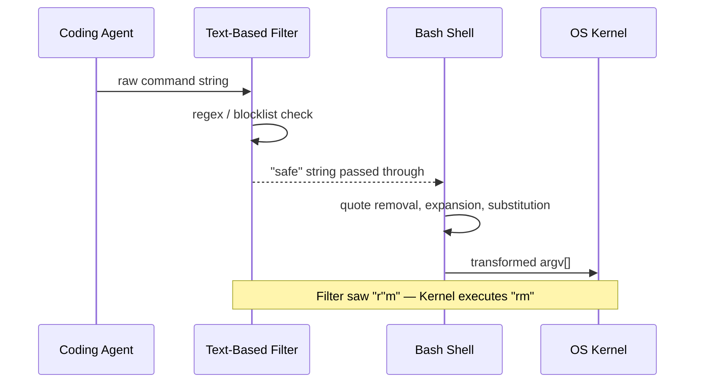
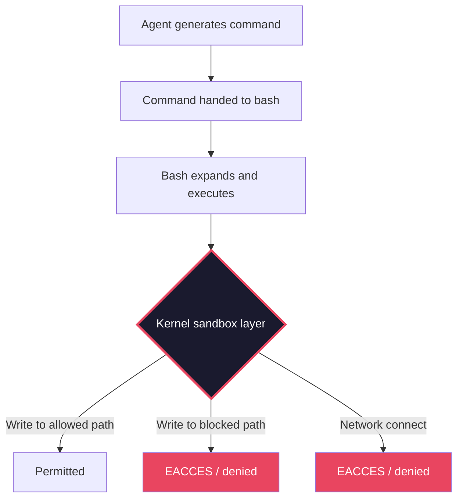

# GuardFall and the Shell Injection Illusion: Why Text-Based Command Filters Fail Every Coding Agent — and How Codex CLI's Kernel-Level Sandbox Renders the Entire Attack Class Irrelevant


---

On 30 June 2026 Adversa AI disclosed **GuardFall**, a shell-interpretation bypass that affected ten of eleven surveyed open-source coding agents — tools collectively representing roughly 548,000 GitHub stars [^1]. The vulnerability is not a novel zero-day. It is a decades-old class of shell quoting and expansion tricks that defeats any safety layer built on string-matching raw command text. What makes GuardFall significant is not the technique but the sheer breadth of the failure: the design convention of "inspect the string, then hand it to bash" turns out to be structurally broken, and nearly every open-source agent inherited the same flaw.

This article dissects the five bypass classes Adversa demonstrated, examines why application-layer filtering cannot close the gap, and maps the findings onto Codex CLI's kernel-level sandbox architecture — which sidesteps the entire attack surface by enforcing restrictions below the shell.

## The Mismatch: Filter vs Shell

Every GuardFall variant exploits the same root cause. An agent's safety layer inspects the **raw command string** for dangerous patterns — `rm -rf`, `curl | bash`, `chmod 777` — and either blocks or allows the command. But `bash` does not execute raw text. Before any command runs, the shell applies quote removal, variable expansion, command substitution, globbing, and field splitting [^2]. The string the filter inspected is not the string the kernel executes.



This is the same class of bug that web application firewalls have battled for two decades: a canonicalisation gap between the inspection layer and the execution layer [^3].

## The Five Bypass Classes

Adversa's research identified five distinct evasion categories, each exploiting a different bash expansion mechanism [^1]:

### 1. Quote Removal

Bash silently strips matched quotes before execution. Inserting empty quotes into a blocked command changes the string without changing the result:

```bash
# Filter sees "r''m" — no match for "rm"
r''m -rf /important-directory
```

The filter's pattern `rm` never matches. Bash strips the empty quotes and executes `rm -rf /important-directory` [^1].

### 2. `$IFS` Expansion

The Internal Field Separator variable defaults to space-tab-newline. Substituting `$IFS` for literal spaces produces a single token to the filter but multiple arguments to bash:

```bash
# Filter sees one "word": rm$IFS-rf$IFS/
rm$IFS-rf$IFS/target
```

After expansion, bash receives `rm`, `-rf`, `/target` as three separate arguments [^1].

### 3. Command Substitution

The `$(...)` or backtick syntax generates command names dynamically at runtime, invisible to static text matching:

```bash
# Filter sees "$(echo rm)" — no literal "rm" in the command
$(echo rm) -rf /target
```

Bash evaluates the subshell first, producing `rm`, then executes the outer command [^1].

### 4. Base64 Pipeline Encoding

Encoding destructive payloads in base64 and piping through a decoder renders the command opaque to any text-based filter:

```bash
# Each segment is individually benign
echo "cm0gLXJmIC90YXJnZXQ=" | base64 -d | bash
```

No blocked keyword appears in the raw string. The shell reconstructs and executes `rm -rf /target` at runtime [^1].

### 5. Alternative Destructive Argv Shapes

Standard Unix utilities can achieve destructive outcomes without invoking classically blocked commands:

```bash
# No "rm" anywhere — "find" with "-delete" is equally destructive
find /project -name "*.py" -delete

# Overwrite a disk — "dd" is rarely blocked
dd if=/dev/zero of=/dev/sda bs=1M

# Install a setuid backdoor
install -m 4755 payload /usr/bin/backdoor
```

These commands are legitimate tools used daily. No blocklist can categorically ban `find` or `dd` without breaking normal workflows [^1].

## Who Was Affected

Adversa tested eleven open-source agents. Ten were vulnerable [^1]:

| Agent | Stars (approx.) | Vulnerable |
|-------|-----------------|------------|
| OpenHands | 53,000 | Yes |
| Aider | 36,000 | Yes |
| Open Interpreter | 58,000 | Yes |
| Cline | 42,000 | Yes |
| Goose | 18,000 | Yes |
| SWE-agent | 19,000 | Yes |
| Roo-Code | 24,000 | Yes |
| Plandex | 12,000 | Yes |
| opencode | 8,000 | Yes |
| Hermes | 5,000 | Yes |
| **Continue** | **35,000** | **No** |

Continue survived because it implements **bash-aware tokenisation** — parsing the command through the same expansion rules bash uses — rather than matching against raw text [^1]. This is the correct approach at the application layer, but it is expensive to maintain: every bash release can change expansion semantics, and edge cases in quoting are notoriously difficult to enumerate [^4].

## Why Application-Layer Filtering Cannot Win

The fundamental problem is combinatorial. Bash's expansion rules compose arbitrarily. A command can combine quote removal with `$IFS` expansion with command substitution with brace expansion simultaneously. The number of equivalent representations of any single command is unbounded [^3].

Building a filter that correctly canonicalises all possible bash expansions means **reimplementing bash's parser**. At that point you are no longer filtering — you are interpreting. And if your interpreter disagrees with the actual bash binary on any edge case, the gap is exploitable.

This is why the security community reached the same conclusion about web application firewalls a decade ago: you cannot secure the execution layer by inspecting input at a higher abstraction level [^5].

## How Codex CLI Sidesteps the Entire Class

Codex CLI does not attempt to solve GuardFall at the application layer. Instead, it enforces security constraints **below the shell**, at the operating system kernel, using platform-native mandatory access control [^6][^7]:



### Linux: Landlock + seccomp-BPF

On Linux (kernel 5.13+), Codex uses a dedicated `codex-linux-sandbox` helper binary. Before executing any command, the helper [^6]:

1. **Applies Landlock rules** — granting read access broadly but restricting write operations to explicitly allowlisted directories (the workspace, `/tmp`, `/dev/null`). Landlock operates at the VFS layer; no amount of bash expansion can change which filesystem paths the kernel permits.

2. **Installs a seccomp-BPF filter** — blocking outbound network syscalls (`connect`, `accept`, `bind`, `listen`, `sendto`, `sendmsg`) while exempting `AF_UNIX` sockets for local IPC. This prevents data exfiltration regardless of how the network call was constructed.

3. **Calls `execvp`** — spawning the target command under the enforced restrictions.

The critical insight: Landlock and seccomp operate on **syscall arguments and filesystem paths**, not on command strings. A command constructed via `$IFS` expansion, base64 decoding, or command substitution still resolves to the same syscall with the same path argument — and the kernel enforces the same policy [^6].

### macOS: Seatbelt (sandbox-exec)

On macOS 12+, Codex uses Apple's Seatbelt framework via `sandbox-exec` with a compiled profile matching the selected sandbox mode. Seatbelt enforces restrictions on file operations, network access, process spawning, and Mach port communication at the kernel level [^7]. The same principle applies: bash can expand commands however it likes, but the Mach kernel enforces the policy on the resulting operations.

### Windows: AppContainer

On Windows, Codex uses AppContainer isolation with per-session security contexts, restricting filesystem and network access through the NT kernel's capability-based model [^7].

### The Three Sandbox Modes

Codex CLI's `sandbox_mode` setting in `config.toml` determines the enforcement level [^8]:

```toml
# Strictest — agent can only read, never write or connect
sandbox_mode = "read-only"

# Default — writes only within the workspace directory
sandbox_mode = "workspace-write"

# Escape hatch — full access (not recommended for untrusted repos)
sandbox_mode = "danger-full-access"
```

Even in `workspace-write` mode — the default — a GuardFall-style attack that constructs `rm -rf /` through shell expansion would be blocked by Landlock at the kernel level, because `/` is not in the write allowlist.

## Defence in Depth: Layers Above the Kernel

Codex CLI does not rely solely on the kernel sandbox. Multiple layers compose to create defence in depth [^8][^9]:

### Approval Policy

The `approval_policy` setting gates tool calls before they reach the shell:

```toml
# Prompt the user before any write operation
approval_policy = "on-request"

# Auto-approve reads, prompt on writes
approval_policy = "writes"
```

In `writes` mode (introduced in v0.144.0), read-only operations proceed automatically while any write triggers a human approval prompt — or delegation to the Guardian auto-review agent [^9].

### Guardian Auto-Review

When `approvals_reviewer = "guardian_subagent"` is set, a separate LLM instance evaluates each pending command against a safety policy checking for data exfiltration, credential probing, persistent security weakening, and destructive actions. The Guardian operates independently of the primary agent and has no access to the agent's prompt context [^10].

### PreToolUse Hooks

Custom hooks can inspect tool calls before execution, adding domain-specific constraints:

```toml
[[hooks]]
event = "PreToolUse"
tool = "shell"
command = "python3 /path/to/validate_command.py"
```

A PreToolUse hook could implement bash-aware tokenisation (like Continue's approach) as an additional validation layer — but with Codex CLI, this is a supplementary check rather than the primary defence [^8].

### Network Proxy Domain Allowlist

The `network_proxy` setting restricts outbound connections to explicitly permitted domains, preventing exfiltration even if a command somehow bypasses the seccomp filter:

```toml
[network_proxy]
allowed_domains = ["github.com", "registry.npmjs.org"]
```

## Practical Configuration for Untrusted Repositories

When cloning and working with repositories from unknown sources — the exact scenario where GuardFall payloads lurk in READMEs, Makefiles, and configuration files — use this hardened configuration:

```toml
# ~/.codex/untrusted.config.toml
# Activate with: codex --profile untrusted

sandbox_mode = "workspace-write"
approval_policy = "on-request"
approvals_reviewer = "guardian_subagent"

[network_proxy]
allowed_domains = []  # No network access

[auto_review]
enabled = true
```

Launch with `codex --profile untrusted` when evaluating unfamiliar code [^8].

## The Structural Lesson

GuardFall is not a bug report. It is a proof that the "inspect-then-execute" architecture for command safety is fundamentally broken. The fix is not better regex, longer blocklists, or more sophisticated string matching. The fix is **moving the enforcement boundary below the abstraction layer that introduces ambiguity**.

Codex CLI's kernel-level sandbox does exactly this. Landlock does not parse bash. Seatbelt does not interpret shell expansions. They enforce policy on the operations the kernel actually performs, regardless of how those operations were constructed in userspace.

For the ten affected open-source agents, the remediation path is clear: adopt containerisation, kernel-level MAC (Landlock, Seatbelt, AppContainer), or both. Text-based command filtering should be treated as a diagnostic signal — useful for logging and alerting — but never as a security boundary [^5].

## Citations

[^1]: Adversa AI, "AI Coding Agents Vulnerability: GuardFall Shell Injection," adversa.ai, June 30, 2026. [https://adversa.ai/blog/opensource-ai-coding-agents-shell-injection-vulnerability/](https://adversa.ai/blog/opensource-ai-coding-agents-shell-injection-vulnerability/)

[^2]: GNU Project, "Shell Expansions," *Bash Reference Manual*, 2026. [https://www.gnu.org/software/bash/manual/html_node/Shell-Expansions.html](https://www.gnu.org/software/bash/manual/html_node/Shell-Expansions.html)

[^3]: The Hacker News, "GuardFall Exposes Open-Source AI Coding Agents to Decades-Old Shell Injection Risks," June 2026. [https://thehackernews.com/2026/06/guardfall-exposes-open-source-ai-coding.html](https://thehackernews.com/2026/06/guardfall-exposes-open-source-ai-coding.html)

[^4]: Mallory, "GuardFall Shell Injection Bypass Affects Most Open-Source AI Coding Agents," July 2026. [https://www.mallory.ai/stories/019f1cce-b0d1-74aa-9190-6d9f06c5ca26](https://www.mallory.ai/stories/019f1cce-b0d1-74aa-9190-6d9f06c5ca26)

[^5]: Security Affairs, "GuardFall Flaw Hits 10 of 11 Popular Open-Source AI Agents," July 2026. [https://securityaffairs.com/194546/ai/guardfall-flaw-hits-10-of-11-popular-open-source-ai-agents.html](https://securityaffairs.com/194546/ai/guardfall-flaw-hits-10-of-11-popular-open-source-ai-agents.html)

[^6]: OpenAI, "Sandboxing Implementation," openai/codex, GitHub, 2026. [https://deepwiki.com/openai/codex/5.6-sandboxing-implementation](https://deepwiki.com/openai/codex/5.6-sandboxing-implementation)

[^7]: OpenAI, "Inside the Codex Sandbox: Platform-Specific Implementation on macOS, Linux and Windows," Codex Knowledge Base, April 2026. [https://codex.danielvaughan.com/2026/04/08/codex-sandbox-platform-implementation/](https://codex.danielvaughan.com/2026/04/08/codex-sandbox-platform-implementation/)

[^8]: OpenAI, "Agent Approvals & Security," ChatGPT Learn, 2026. [https://developers.openai.com/codex/agent-approvals-security](https://developers.openai.com/codex/agent-approvals-security)

[^9]: OpenAI, "Auto-Review of Agent Actions," ChatGPT Learn, 2026. [https://developers.openai.com/codex/concepts/sandboxing/auto-review](https://developers.openai.com/codex/concepts/sandboxing/auto-review)

[^10]: Pierce Freeman, "A Deep Dive on Agent Sandboxes," pierce.dev, 2026. [https://pierce.dev/notes/a-deep-dive-on-agent-sandboxes](https://pierce.dev/notes/a-deep-dive-on-agent-sandboxes)
