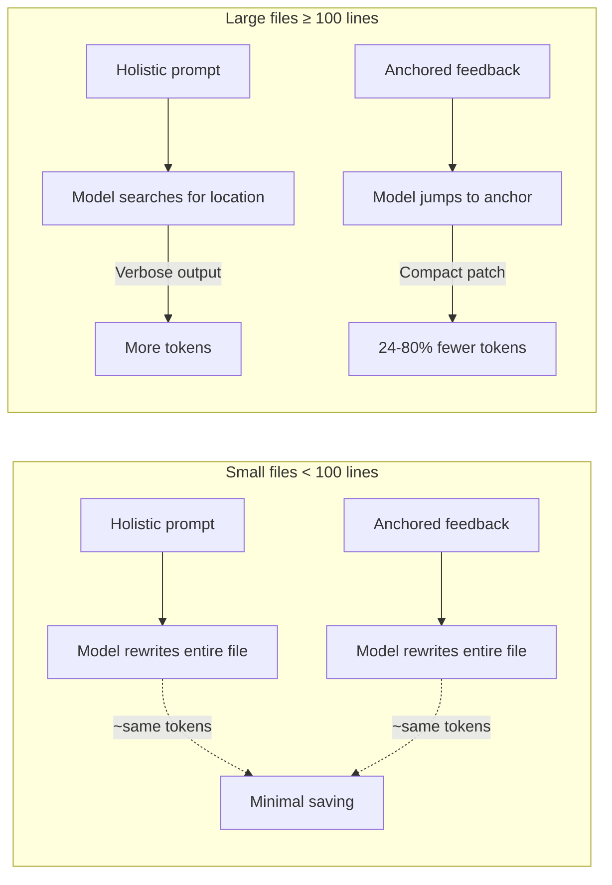
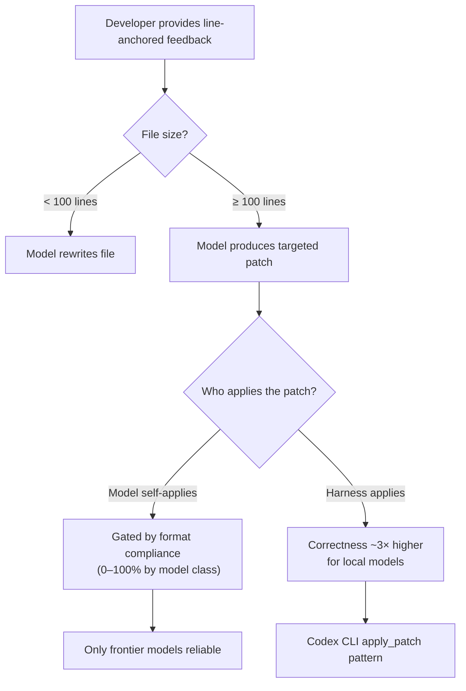

# Line-Anchored Feedback: How Structured Edit Feedback Cuts Tokens by 58 Per Cent and What It Means for Codex CLI's Apply-Patch Pipeline


---

When you ask a coding agent to fix five flaws scattered across a 400-line file, you face a choice: describe the changes in a plain paragraph, or anchor each requested fix to the exact lines it concerns. A controlled experiment published on 14 July 2026 shows that this formatting decision alone — holding the content identical — can halve the tokens the model generates and shift correctness by several percentage points in either direction, depending on the model [^1]. The findings map directly onto how Codex CLI ingests developer instructions, formats its V4A patches, and manages the token budgets that determine session cost.

## The Experiment: Content Held Constant, Format Varied

William Franz Lamberti's paper, *Line-Anchored Feedback Cuts Token Costs and Improves Correctness in AI Code Editing*, introduces FileMark — a VSCodium extension that lets developers attach inline comments to specific lines, then exports them as a structured `.feedback.md` artifact [^1]. The study compares this structured, line-anchored export (treatment) against a holistic plain-text prompt listing the same changes without anchoring (control).

Both arms derive from a single canonical `changes.json` source, with a content-parity assertion verified across all 6,552 control–treatment pairs [^1]. This design isolates the formatting effect with unusual rigour.

### Scale and Rigour

| Dimension | Value |
|-----------|-------|
| Total runs | 6,552 (main) + 3,276 (exploratory) |
| Models | 7 (Claude Opus, Claude Sonnet, 5 local) |
| Task tiers | 6 (from <10 to ≥1,000 lines) |
| Replicates per cell | 13 (power-sized for α=0.05, 0.80) |
| Validation | Execution-based; adjusted R² within 10⁻⁶ |

Statistical tests use rank-based paired methods (Wilcoxon signed-rank, McNemar's) with Holm–Bonferroni correction [^1].

## Token Savings: Dramatic on Frontier Models, File-Size Dependent

The headline numbers tell one story; the per-tier breakdown tells a more nuanced one.

### Pooled Token Reduction

| Model | Control tokens | FileMark tokens | Change |
|-------|---------------|-----------------|--------|
| Claude Sonnet | 1,282 | 545 | **−57.5%** |
| Claude Opus | 1,282 | 994 | **−22.5%** |
| qwen3-coder 30B | 2,629 | 2,147 | **−18.3%** |
| gemma3 27B | 1,747 | 1,543 | **−11.7%** |

All four models reach significance after Holm correction (p < 0.05) [^1]. Three smaller models show no saving or modest token increases — a pattern the paper attributes to different verbosity strategies at smaller parameter counts.

### The File-Size Cliff

The real story emerges when you split by file size:

| Tier (lines) | Sonnet Δ | Opus Δ |
|--------------|----------|--------|
| T1 (<10) | −8.8% | +11.8% |
| T2 (10–50) | −3.0% | +8.9% |
| T3 (50–100) | −5.2% | +6.2% |
| T4 (100–500) | **−80.3%** | **−38.4%** |
| T5 (500–1,000) | **−74.7%** | **−24.3%** |
| T6 (≥1,000) | **−76.5%** | **−37.0%** |

On small files, both formats saturate near ceiling — localisation is trivial, so anchoring provides little additional signal [^1]. Once files cross 100 lines and the contract shifts to SEARCH/REPLACE blocks, anchoring licenses compact, targeted edits. Sonnet's output tokens drop by 75–80%.



## Correctness: Gains for Local Models, a Trade-Off for Sonnet

Pooled binary correctness improves by +2.0 percentage points with anchoring (0.650 vs 0.630, McNemar p = 8.7 × 10⁻⁶) [^1]. But the aggregate hides model-specific effects:

- **Local coder models** gain 5–7 points (qwen3-coder +7.3pp, qwen2.5-coder +6.0pp, llama3.1 +5.1pp)
- **Claude Opus** remains perfect in both arms (1.000)
- **Claude Sonnet** drops 4.5 points (0.994 → 0.949) — terseness occasionally clips a validation check [^1]

The Sonnet result is the paper's most provocative finding: 57.5% token savings at a 4.5-point correctness cost is a quantified trade-off that organisations can evaluate against their per-token costs and quality thresholds.

### Silent Failure Elimination

A subtler benefit: anchoring converts silent failures into detectable ones. For qwen3-coder, the `runs_fail` rate (scripts that execute but produce wrong results) fell from 0.073 to 0.000 [^1]. In agentic workflows, a script that crashes is noticed; one that runs silently incorrectly is not.

## The Contract Compliance Boundary

The paper reveals a capability cliff orthogonal to feedback format. On files over 100 lines, models must produce valid SEARCH/REPLACE blocks rather than full rewrites. Compliance separates model classes sharply:

| Model | T4–T6 compliance |
|-------|-------------------|
| Claude Opus / Sonnet | 100% |
| qwen3-coder 30B | 33% |
| qwen2.5-coder 14B | 27–31% |
| llama3.1, gemma3, gemma4 | 0–1% |

Anchoring neither helps nor hurts compliance — the format capability is a model-level property [^1]. This directly parallels Codex CLI's V4A patch format, where the apply_patch tool uses a context-matching grammar that GPT-family models have been specifically trained to produce [^2].

## The Exploratory Result: Harness-Side Patch Application

When the paper's harness (not the model) applied edits by splicing corrected functions by name, local-model correctness on 100+ line files roughly tripled — from 0.097 to 0.279 pooled [^1]. The T4 score effect quadrupled from +0.048 to +0.191.

This is the paper's strongest practical implication for coding agents: if the harness owns the patching mechanics, models only need to produce the corrected function body, not a syntactically precise diff format. Codex CLI's apply_patch tool already implements exactly this pattern — the model produces V4A hunks, and the harness applies them via a three-strategy context-matching algorithm (exact match, match ignoring line endings, match ignoring all whitespace) [^2][^3].



## Mapping to Codex CLI Configuration

### 1. AGENTS.md: Encode Line-Anchored Feedback Style

The paper's core finding — that anchoring feedback to specific lines improves both efficiency and correctness — maps directly to how you structure instructions in AGENTS.md. When requesting edits, anchor each change request to a file path and line range rather than describing changes in prose:

```toml
# In AGENTS.md
## Edit Instructions
When requesting code changes, always specify:
- The file path
- The line range or function name
- The exact change required
Do not describe changes in general prose paragraphs.
```

This mirrors how Codex CLI's `/review` command already generates line-level comments on pull requests [^4].

### 2. tool_output_token_limit: Budget for the Sweet Spot

The paper identifies T4 (100–500 lines) as the optimal tier for line-anchored feedback [^1]. For sessions focused on editing files in this range, the default `tool_output_token_limit` of 12,000 tokens comfortably accommodates V4A patches. For T5–T6 files (500–1,000+ lines), consider raising it:

```toml
# config.toml
tool_output_token_limit = 16000  # accommodate larger V4A patches
```

### 3. Named Model Profiles: Match Model to File Size

The paper's per-tier data provides a rational basis for model selection. Frontier models excel across all tiers; local models deliver strong value on small files but collapse on large ones [^1]. Codex CLI's named profiles allow switching:

```toml
[profiles.small-edits]
model = "gpt-5.6-terra"  # cost-effective for T1–T3
rollout_token_budget = 8000

[profiles.large-edits]
model = "gpt-5.6-sol"    # format-compliant for T4–T6
rollout_token_budget = 32000
```

Invoke with `codex --profile large-edits "fix the auth middleware"`.

### 4. PostToolUse Hooks: Validate Patch Correctness

The paper's silent-failure-to-loud-failure conversion maps to Codex CLI's PostToolUse hooks. A hook that validates apply_patch output catches the failure mode the paper quantifies:

```bash
#!/bin/bash
# .codex/hooks/post-apply-patch.sh
# Run after apply_patch to verify the edit didn't break syntax
file="$CODEX_CHANGED_FILE"
if [[ "$file" == *.py ]]; then
    python3 -c "import ast; ast.parse(open('$file').read())" 2>&1
elif [[ "$file" == *.R ]]; then
    Rscript -e "parse('$file')" 2>&1
fi
```

This converts the paper's execution-based validation into a deterministic gate in the Codex CLI pipeline [^5].

### 5. Guardian Auto-Review as Quality Gate

The paper's Sonnet correctness dip (−4.5pp for 57.5% token savings) illustrates why automatic review matters. Codex CLI's Guardian auto-review subagent, restored in v0.144.2 after a prompting regression [^6], serves as the quality gate that catches the occasional validation failures that terseness introduces.

## The Broader Lesson: Feedback Format Is an Engineering Variable

This paper makes a contribution that extends well beyond its R-programming test bed. It demonstrates that **how you structure feedback to a model is an engineering variable with measurable cost and correctness effects**, independent of what you ask the model to do.

For Codex CLI practitioners, the implications are:

1. **Anchor edit requests to lines or functions** — in prompts, in AGENTS.md, in code review comments
2. **Let the harness own patching** — Codex CLI's apply_patch already implements this pattern; don't fight it by asking models to produce raw `sed` commands
3. **Budget tokens for your file-size tier** — the savings materialise above 100 lines; below that, format barely matters
4. **Accept the Sonnet trade-off consciously** — 57.5% fewer tokens at 4.5pp correctness cost is a deployment decision, not a bug
5. **Gate with deterministic validation** — PostToolUse hooks and Guardian auto-review catch the failures that terseness introduces

The V4A patch format, context-anchored editing, and harness-side application that Codex CLI already implements are not accidental design choices — they are precisely the architecture this paper's data validates.

## Citations

[^1]: Lamberti, W. F. (2026). *Line-Anchored Feedback Cuts Token Costs and Improves Correctness in AI Code Editing*. arXiv:2607.12713. [https://arxiv.org/abs/2607.12713](https://arxiv.org/abs/2607.12713)

[^2]: OpenAI. (2026). *Codex CLI apply_patch V4A format instructions*. GitHub. [https://github.com/openai/codex/blob/main/codex-rs/core/prompt_with_apply_patch_instructions.md](https://github.com/openai/codex/blob/main/codex-rs/core/prompt_with_apply_patch_instructions.md)

[^3]: Vaughan, D. (2026). *The V4A Diff Format: How Codex CLI's apply_patch Actually Edits Your Code*. Codex Knowledge Base. [https://codex.danielvaughan.com/2026/03/31/codex-cli-apply-patch-v4a-diff-format/](https://codex.danielvaughan.com/2026/03/31/codex-cli-apply-patch-v4a-diff-format/)

[^4]: OpenAI. (2026). *Codex CLI developer commands: /review*. ChatGPT Learn. [https://developers.openai.com/codex/cli/slash-commands](https://developers.openai.com/codex/cli/slash-commands)

[^5]: OpenAI. (2026). *Codex CLI configuration reference*. ChatGPT Learn. [https://developers.openai.com/codex/config-reference](https://developers.openai.com/codex/config-reference)

[^6]: OpenAI. (2026). *Codex CLI v0.144.2 changelog — Guardian auto-review policy restored*. ChatGPT Learn. [https://learn.chatgpt.com/docs/changelog](https://learn.chatgpt.com/docs/changelog)
