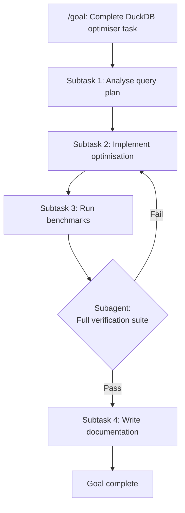

# Long-Horizon-Terminal-Bench and the Completion Cliff: Why 64 Per Cent of Agent Runs Make Real Progress but Only 4 Per Cent Finish — and How to Configure Codex CLI for Long-Horizon Survival


---

## The Problem Binary Benchmarks Hide

Most coding-agent benchmarks grade on a single bit: did the agent solve the task or not? That framing flatters short tasks and punishes long ones. A 90-minute debugging session that correctly identifies the root cause, writes a partial fix, and runs tests — but times out before the final commit — scores identically to an agent that crashes on line one.

Long-Horizon-Terminal-Bench (LHTB), published by Li et al. on 13 July 2026[^1], replaces that binary with **dense subtask-based grading**, and the results rewrite the narrative on agent capability. The headline finding: across 15 frontier models and 46 tasks, 64.6 per cent of runs make real partial progress, yet only 4.3 per cent cross the 0.95 reward threshold[^1]. The gap between "making progress" and "finishing" is the completion cliff, and it is the dominant failure mode of every terminal agent tested.

This article unpacks the benchmark, maps its failure modes to Codex CLI's configuration surface, and provides concrete `config.toml` patterns for surviving long-horizon tasks.

---

## What LHTB Measures

LHTB comprises 46 tasks spanning nine categories: interactive games (2048, Chess, Snake), software engineering (DuckDB query optimisation, LangChain migration, reverse engineering), scientific computing (N-body simulation, SEIR epidemic modelling), multimodal analysis (satellite flood detection, DICOM radiology audits), and research reproduction (ALP compression, protein search)[^1].

Each task decomposes into K weighted subtasks, each scored on a continuous \[0, 1\] scale. Subtask types include binary checks (test suites, service health), continuous metric matching (with linear degradation), and episode-aggregating measures (success rates across repeated trials)[^1]. The overall reward R is the weighted aggregate.

```mermaid
flowchart LR
    A[Task Definition] --> B[K Subtasks]
    B --> C1[Binary Check<br/>r ∈ {0,1}]
    B --> C2[Continuous Score<br/>r ∈ 0..1]
    B --> C3[Episode Aggregate<br/>mean success rate]
    C1 --> D[Weighted Aggregate R]
    C2 --> D
    C3 --> D
    D --> E{R ≥ 0.95?}
    E -->|Yes| F[Pass]
    E -->|No| G[Partial Credit]
```

The critical design decision: tasks demand **hundreds of episodes and 30–90+ minutes of wall-clock execution**[^1]. The mean across all models is 231 episodes, 9.9 million tokens, and 85.3 minutes per task[^1]. This is an order of magnitude harder than Terminal-Bench 2, which typically completes in 20–30 minutes with 20–30 episodes[^1].

---

## The Leaderboard That Matters

| Model | Pass@R≥0.95 | Pass@R=1.0 | Mean Tokens/Task | Mean Episodes | Cost/Task (USD) |
|-------|-------------|------------|-------------------|---------------|-----------------|
| GPT-5.5 | 15.2% (7/46) | 10.9% | 4.16M | 208 | ~\$12.50 |
| Kimi K2.7 Code | 6.5% (3/46) | — | 8.54M | 183 | — |
| DeepSeek V4 Pro | 6.5% (3/46) | — | 14.45M | 321 | — |
| MiniMax M3 | 6.5% (3/46) | — | 20.20M | 314 | — |
| Qwen3.7 Max | 4.3% | — | 6.13M | 218 | — |
| **Mean (all 15)** | **4.3%** | **1.7%** | **9.66M** | **228** | **\$2.47–\$27.57** |

*Source: Li et al., Table 2[^1]*

GPT-5.5 leads convincingly at 15.2 per cent pass rate, consuming the fewest tokens per task — suggesting that raw model capability reduces thrashing more than brute-force exploration[^1]. Ten of the 17 models achieve 0 per cent perfect completion (R=1.0)[^1].

---

## Three Failure Modes and Their Codex CLI Countermeasures

### 1. Timeout Dominance

79 per cent of unresolved runs expire during the 90-minute budget with mean reward between 0.10 and 0.35[^1]. Agents accumulate partial progress but cannot close out the task. The bottleneck is long-horizon completion, not local reasoning.

**Codex CLI mapping:** Goal mode (`/goal`) was designed precisely for this failure class. When enabled, Codex enters a persistent agentic loop that survives across turns and can be paused and resumed[^2]. The critical configuration:

```toml
[features]
goals = true

[features.rollout_budget]
enabled = true
limit_tokens = 8000000        # 8M token ceiling for long tasks
reminder_interval_tokens = 1000000  # remind at every 1M consumed
```

The `rollout_budget` feature, available since v0.142.0, tracks cumulative token consumption and injects budget reminders into the agent's context[^3]. Without it, Codex has no awareness of how much budget remains — mirroring LHTB's finding that agents time out because they lack horizon awareness.

### 2. False Finishes

14 runs across the benchmark achieved R ≥ 0.75 but terminated early despite unmet hidden verification steps, with 20+ minutes remaining[^1]. Kimi K2.7 stopped on a DuckDB optimiser task at R=0.92; GLM 5.2 stopped on an IB244 materials task at R=0.90[^1]. The agents believed they were done. They were wrong.

**Codex CLI mapping:** AGENTS.md is Codex CLI's mechanism for encoding subtask verification checkpoints. The layered discovery system reads `AGENTS.md` files from the repository root and every directory the agent touches[^4].

```markdown
<!-- AGENTS.md at repository root -->
## Completion Criteria

Before declaring a task complete, you MUST verify:

1. All test suites pass (`npm test` / `pytest` exit code 0)
2. Linter produces zero errors on changed files
3. Any generated output matches expected format (diff against reference)
4. Integration tests run end-to-end, not just unit tests

Do NOT stop after partial test success. Run the full verification suite.
```

PostToolUse hooks provide a mechanical backstop. A hook can run after every shell command to check whether completion criteria have actually been met:

```toml
[[hooks.post_tool_use]]
event = "post_tool_use"
tool_name = "shell"
command = "python .codex/verify_completion.py"
```

### 3. Context Decay and Thrashing

LHTB agents consume a mean of 9.9M tokens per task[^1]. At that scale, context decay is inevitable: early plans and observations are compacted away, forcing the agent to rediscover state. The result is thrashing — repeating failed approaches without memory of having tried them.

**Codex CLI mapping:** The `model_auto_compact_token_limit` threshold controls when Codex triggers history compaction[^3]. The default suits short sessions; for long-horizon tasks, tuning is essential:

```toml
model_auto_compact_token_limit = 160000
model_auto_compact_token_limit_scope = "body_after_prefix"
```

Setting the scope to `body_after_prefix` ensures that system prompts, AGENTS.md content, and tool definitions (the "prefix") are excluded from the threshold calculation[^3]. This preserves the agent's structural knowledge while compacting ephemeral tool output.

The `tool_output_token_limit` setting prevents any single tool call from flooding the context:

```toml
tool_output_token_limit = 16000
```

---

## A Configuration Template for Long-Horizon Tasks

Combining all the countermeasures into a single named profile:

```toml
[profiles.long-horizon]
model = "gpt-5.6-sol"
model_context_window = 200000
model_auto_compact_token_limit = 160000
model_auto_compact_token_limit_scope = "body_after_prefix"
tool_output_token_limit = 16000

[profiles.long-horizon.features]
goals = true

[profiles.long-horizon.features.rollout_budget]
enabled = true
limit_tokens = 10000000
reminder_interval_tokens = 2000000
prefill_token_weight = 1.0
sampling_token_weight = 1.0
```

Activate it with:

```bash
codex --profile long-horizon
```

GPT-5.6 Sol is the recommended model for long-horizon tasks given that GPT-5.5 led the LHTB leaderboard and Sol supersedes it with improved reasoning capabilities[^5]. For cost-sensitive runs, GPT-5.6 Terra offers a strong balance at roughly half the price per token[^5].

---

## The Subagent Decomposition Question

LHTB tasks are inherently sequential — each subtask depends on the output of the previous one. This makes naive parallelisation counterproductive, consistent with prior work showing that automatic multi-agent systems underperform single-agent baselines on tasks without natural decomposition boundaries[^6].

However, Codex CLI's subagent delegation (`max_threads`, `max_depth`) remains valuable for specific subtask types within a long-horizon task:

```toml
[agents]
max_threads = 3
max_depth = 1
```

The pattern: use the primary agent for sequential orchestration, but delegate isolated verification or research subtasks to subagents. For example, while the primary agent iterates on a fix, a subagent can run the full test suite in parallel without polluting the primary context.



---

## Dense Rewards as a Design Principle for AGENTS.md

LHTB's most actionable insight is not about models — it is about grading. Dense intermediate rewards reveal that most agents are making real progress, but binary evaluation masks it[^1]. Near-misses (0.75 ≤ R < 0.95) occur 2.4× more frequently than full passes[^1].

This principle translates directly to AGENTS.md authoring. Rather than specifying a single completion criterion, encode a sequence of verifiable milestones:

```markdown
## Task Milestones (verify in order)

1. [ ] Environment set up — all dependencies installed, service starts
2. [ ] Data pipeline operational — input parsed, transformations applied
3. [ ] Core logic implemented — unit tests for primary function pass
4. [ ] Integration verified — end-to-end test produces expected output
5. [ ] Performance validated — benchmark within 10% of reference
6. [ ] Documentation updated — README reflects changes

If you reach milestone 3 but cannot proceed, STOP and report progress.
Do not restart from scratch.
```

This mirrors LHTB's subtask decomposition and prevents the false-finish pattern: the agent cannot declare victory after milestone 3 if milestones 4–6 remain unchecked.

---

## Practical Implications

The LHTB data suggests three rules of thumb for Codex CLI practitioners:

1. **Budget 10M tokens for genuine long-horizon tasks.** The mean consumption is 9.9M tokens across all models[^1]. Under-budgeting guarantees a timeout.

2. **Use the strongest model you can afford.** GPT-5.5 achieved 3.5× the pass rate of the mean while consuming the fewest tokens[^1]. Token efficiency and task success are correlated; cheaper models thrash more and cost more in aggregate. ⚠️ Direct cost comparisons between GPT-5.5 and GPT-5.6 Sol on LHTB tasks are not yet available.

3. **Encode completion criteria mechanically.** 14 false finishes across the benchmark could have been prevented by automated verification gates[^1]. PostToolUse hooks and AGENTS.md milestone checklists are the Codex CLI equivalent.

---

## Citations

[^1]: Z. Li et al., "Long-Horizon-Terminal-Bench: Testing the Limits of Agents on Long-Horizon Terminal Tasks with Dense Reward-Based Grading," arXiv:2607.08964, July 2026. [https://arxiv.org/abs/2607.08964](https://arxiv.org/abs/2607.08964)

[^2]: OpenAI, "Developer Commands — /goal," Codex CLI Documentation, 2026. [https://developers.openai.com/codex/cli/slash-commands](https://developers.openai.com/codex/cli/slash-commands)

[^3]: OpenAI, "Configuration Reference," Codex CLI Documentation, 2026. [https://developers.openai.com/codex/config-reference](https://developers.openai.com/codex/config-reference)

[^4]: OpenAI, "Rules — AGENTS.md," Codex CLI Documentation, 2026. [https://developers.openai.com/codex/rules](https://developers.openai.com/codex/rules)

[^5]: OpenAI, "Previewing GPT-5.6 Sol: A Next-Generation Model," July 2026. [https://openai.com/index/previewing-gpt-5-6-sol/](https://openai.com/index/previewing-gpt-5-6-sol/)

[^6]: S. Jwalapuram et al., "The Illusion of Multi-Agent Advantage," arXiv:2606.13003, June 2026. [https://arxiv.org/abs/2606.13003](https://arxiv.org/abs/2606.13003)
