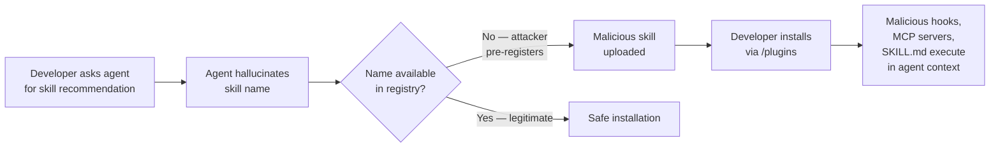
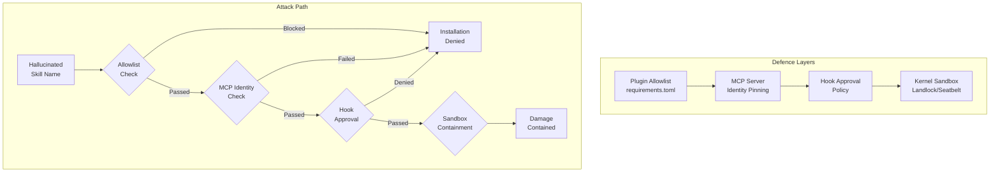

# Skills That Don't Exist: What 15,000 Prompts Reveal About Hallucinated Skill Recommendation — and How to Defend Your Codex CLI Plugin Stack


---

## The Recommendation You Trusted Was Invented

You ask your coding agent to recommend a plugin for a task. It confidently names one. You install it. The problem: that plugin never existed in any registry — until an attacker registered it yesterday.

This is **skill name hallucination**, and it is not a theoretical risk. Yuan et al. published the first large-scale measurement of the phenomenon on 14 July 2026 (arXiv:2607.12340), evaluating 15,000 prompts across 12 configurations — four standalone LLMs and eight agent harnesses [^1]. Their conservative methodology counted a name as hallucinated only if it was absent from every live registry and GitHub. The results are systemic: every single configuration hallucinated skill names. Average hallucination rates hit 36.0 per cent for standalone LLMs and 36.9 per cent for agents, rising to 43.1 per cent on authentic developer questions [^1].

In total, the systems generated 5,669 distinct fabricated skill names [^1]. These are not random noise — agents repeat the same fake names across prompts and models, giving attackers highly reliable hijack targets.

---

## From Package Hallucination to Skill Hallucination

The security community has tracked **slopsquatting** — the AI-age evolution of typosquatting — since Seth Larson coined the term at the Python Software Foundation [^2]. Across 576,000 code samples, roughly 19.7 per cent of recommended package names were hallucinations, with 127 names invented identically by five different models [^3]. The now-canonical example: `react-codeshift`, a plausible npm package hallucinated by conflating Facebook's `jscodeshift` with the React team's `react-codemod`, which spread through 237 repositories via AI-generated skill files [^4].

But Yuan et al.'s contribution shifts the focus upstream — from packages consumed within code to the **skills and plugins that configure the agent itself**. This is a more dangerous layer:



A hallucinated package might execute in a sandbox. A hallucinated skill, however, runs as agent configuration — it can inject hooks, add MCP servers, modify approval policies, and reshape the agent's entire behaviour. The blast radius is categorically larger.

---

## Why Skills Are Harder to Defend Than Packages

Three structural differences make skill hallucination more dangerous than package hallucination.

### 1. Skills Are Not Just Code — They Are Instructions

A Codex CLI plugin bundles SKILL.md files (natural-language instructions), MCP server configurations, app connectors, hooks, and scheduled task templates [^5]. A malicious skill does not need to contain executable code to be harmful — it can simply instruct the agent to disable safety constraints, exfiltrate context, or route requests through an attacker-controlled proxy.

### 2. Registries Rarely Verify Publishers

Open skill registries operate on a first-come-first-served model. As Yuan et al. note, "registries rarely verify publishers" [^1]. An adversary can monitor the hallucinated names an agent produces, pre-register malicious skills under those names, and wait. The 43 per cent consistency rate on real developer questions makes target selection trivial.

### 3. Skills Get Copy-Pasted Without Review

Research from Aikido Security documented that agent skill files "get copy-pasted without review since they look like documentation" [^4]. Unlike code dependencies that trigger `npm audit` or `pip-audit`, skill files bypass standard supply-chain verification tooling entirely.

---

## The Defence Paradox: Security vs. Usability

Yuan et al. tested four model-level defences against skill hallucination [^1]. The strongest — **retrieval grounding**, which anchors recommendations to a live registry index — reduced the hallucination rate from 40.8 per cent to 3.2 per cent. The cost was severe: even the best-defended system recommended the correct skill only about one time in six [^1].

This security-usability conflict is familiar to anyone who has configured Codex CLI's approval policies. The tightest setting (`suggest`) prevents all autonomous action but destroys throughput. The key insight from the research is that **prompt engineering and model tuning alone cannot solve skill hallucination** — structural, ecosystem-level changes are required [^1].

---

## Codex CLI's Existing Defence Stack

Codex CLI already provides several mechanisms that map to the defences Yuan et al. propose. None is a complete solution alone, but layered together they substantially reduce the attack surface.

### Enterprise Plugin Allowlist

For Business and Enterprise plans, administrators can configure a **plugin suggestion allowlist** — Codex will only prompt to install approved plugins [^6]. This is the single most effective control:

```toml
# requirements.toml (admin-enforced)
[plugins]
suggestion_allowlist = [
  "github-official",
  "context7",
  "firecrawl",
  "security-scanner"
]

# Unapproved plugins cannot be suggested or installed
installation_policy = "allowlist_only"
```

When an agent hallucinates a skill name, the allowlist prevents installation regardless of whether the name exists in a registry [^6].

### MCP Server Allowlist

Plugin-bundled MCP servers can be similarly restricted:

```toml
# requirements.toml
[mcp_servers]
allowlist = [
  { name = "context7", identity = "mcp.context7.com" },
  { name = "firecrawl", identity = "mcp.firecrawl.dev" }
]
# Servers not matching both name AND identity are disabled
```

This prevents a hallucinated plugin from registering rogue MCP endpoints, even if the plugin itself passes the allowlist [^7].

### Sandbox Isolation

Codex CLI's Landlock (Linux) and Seatbelt (macOS) sandbox constrains what any installed skill can access at the kernel level [^8]. Even if a hallucinated skill is installed, its hooks and scripts cannot:

- Access the network beyond allowed domains
- Read files outside the project directory
- Spawn processes outside the sandbox boundary

### Approval Policy Gating

The `approval_policy` setting controls whether plugins with hooks require explicit user consent:

```toml
# config.toml
[plugins]
hook_approval = "prompt"  # Always ask before running plugin hooks
```

Combined with the `/plugins` browser's detail view — which shows bundled hooks, MCP servers, and required permissions before installation — this provides a human review checkpoint [^5].

---

## A Practitioner's Hardening Checklist

Based on the research findings, here is a layered defence strategy for Codex CLI plugin management:

### For Individual Developers

1. **Never install a plugin based solely on agent recommendation.** Verify the name exists in the marketplace via `/plugins` before installing.
2. **Audit installed plugins regularly.** Run `/plugins` and review what is installed, paying attention to plugins you do not recognise.
3. **Set `hook_approval = "prompt"`** so hooks from newly installed plugins require explicit consent.
4. **Use `sandbox = "full"`** to contain any malicious payloads that slip through.

### For Enterprise Administrators

1. **Deploy a `requirements.toml` plugin allowlist.** This is the structural defence Yuan et al. advocate — it prevents hallucinated names from resolving to installations.
2. **Restrict marketplace sources.** Use managed configuration to control which plugin marketplace sources users can add, install from, or refresh [^6].
3. **Pin MCP server identities.** Require both name and identity matching for all MCP servers.
4. **Audit plugin installation logs.** Monitor for installation attempts against names not in the allowlist — these indicate either hallucinated recommendations or social engineering attempts.



---

## The Structural Gap: What Codex CLI Cannot Yet Do

Codex CLI's defence stack is strong but has a structural gap that mirrors the broader ecosystem problem Yuan et al. identify.

**No registry-side name reservation.** The researchers propose that registries should reserve plausible names proactively — the way npm reserves common typosquatting variants [^1]. The Codex plugin marketplace does not yet do this. Until it does, the window between hallucination and attacker registration remains open.

**No verified recommendation pipeline.** The `/plugins` browser lists available plugins, but the agent's free-text recommendation channel operates independently. When an agent suggests "install the codex-terraform-pro skill", nothing forces that suggestion through the marketplace verification path. A verified recommendation pipeline — where agent suggestions are validated against the marketplace index before being presented to the user — would close this gap.

**Recommendation telemetry is not surfaced.** Codex CLI does not currently log which skill names agents recommend versus which ones users actually install. This telemetry would be invaluable for identifying hallucinated names before they are weaponised.

---

## What Comes Next

Yuan et al.'s finding that every tested configuration hallucinates skill names is not a model quality problem — it is an architectural problem [^1]. The fix requires coordination between model providers, registry operators, and agent harness builders.

For Codex CLI practitioners, the immediate action is clear: deploy an allowlist if you have not already. It is the one control that structurally eliminates the attack vector regardless of model behaviour. For everything else — retrieval grounding, name reservation, verified pipelines — we wait for the ecosystem to catch up.

The 5,669 fabricated skill names from this study are a roadmap for attackers. They are also, if the registries act, a reservation list.

---

## Citations

[^1]: Yuan, W., Guo, W., Dong, F., Wang, H., & Liu, Y. (2026). "Skills That Don't Exist: A Large-Scale Study of Hallucinated Skill Recommendation in LLM Agents." arXiv:2607.12340. [https://arxiv.org/abs/2607.12340](https://arxiv.org/abs/2607.12340)

[^2]: Cloud Security Alliance. (2026). "Slopsquatting: AI Code Hallucinations Fuel Supply Chain Attacks." CSA Research Note. [https://labs.cloudsecurityalliance.org/research/csa-research-note-slopsquatting-ai-supply-chain-20260419-csa/](https://labs.cloudsecurityalliance.org/research/csa-research-note-slopsquatting-ai-supply-chain-20260419-csa/)

[^3]: Aikido Security. (2026). "Slopsquatting: The AI Package Hallucination Attack Already Happening." [https://www.aikido.dev/blog/slopsquatting-ai-package-hallucination-attacks](https://www.aikido.dev/blog/slopsquatting-ai-package-hallucination-attacks)

[^4]: Aikido Security. (2026). "Agent Skills Are Spreading Hallucinated npx Commands." [https://www.aikido.dev/blog/agent-skills-spreading-hallucinated-npx-commands](https://www.aikido.dev/blog/agent-skills-spreading-hallucinated-npx-commands)

[^5]: OpenAI. (2026). "Plugins." Codex Documentation. [https://developers.openai.com/codex/plugins](https://developers.openai.com/codex/plugins)

[^6]: OpenAI. (2026). "Managed Configuration." Codex Enterprise Documentation. [https://developers.openai.com/codex/enterprise/managed-configuration](https://developers.openai.com/codex/enterprise/managed-configuration)

[^7]: OpenAI. (2026). "Admin Rollout Guide." Codex Enterprise Documentation. [https://developers.openai.com/codex/enterprise/admin-setup](https://developers.openai.com/codex/enterprise/admin-setup)

[^8]: OpenAI. (2026). "Codex CLI." Codex Documentation. [https://developers.openai.com/codex/cli](https://developers.openai.com/codex/cli)
