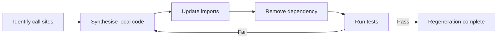
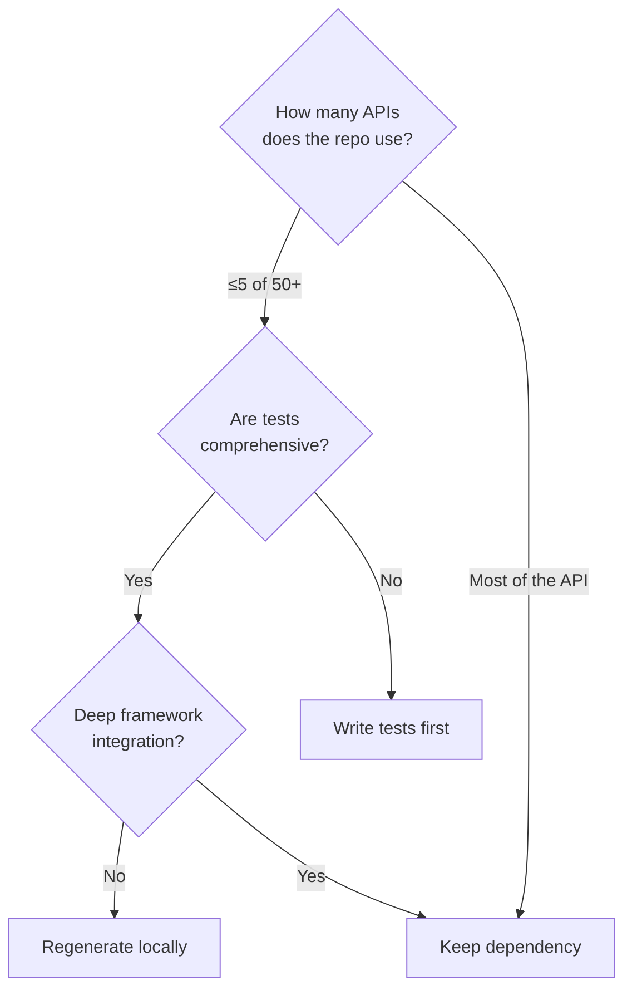

# Software Supply Chains Are Dead: What Use-Case-Oriented Regeneration Means for Codex CLI Dependency Strategy


---

The economics of software reuse are shifting beneath our feet. For three decades the orthodoxy has been clear: adopt an external dependency rather than write the code yourself. Singla and Davis's ESEM 2026 paper, *Software Supply Chains are Dead: Use-Case-Oriented Regeneration*, argues that this calculus has fundamentally inverted [^1]. Security costs have inflated the price of trusting external code, while generative AI has collapsed the cost of producing it locally. The result is a credible workflow for replacing narrow dependencies with repository-owned, AI-synthesised implementations — and Codex CLI is well positioned to execute it.

This article unpacks the research, maps it to current Codex CLI capabilities, and offers a practical configuration guide for teams experimenting with dependency regeneration.

## The Shifting Economics of Reuse

The traditional build-versus-buy equation rests on two assumptions: that implementation is expensive and that maintenance of external code is cheap. Both assumptions are now under pressure.

On the cost side, Sonatype's 2026 report catalogues more than 1.23 million known malicious open-source packages, with over 454,000 newly identified during 2025 alone [^2]. The first half of 2026 saw 37 supply-chain attack campaigns producing 497 indexed malicious packages — 4.5 times the volume of the entire prior year [^3]. npm absorbs nearly four in five of those packages [^3]. Every transitive dependency a project adopts inherits not just code but release practices, maintenance state, compatibility constraints, and vulnerabilities [^1].

On the generation side, frontier coding agents can now synthesise bounded functionality with high fidelity. The paper's motivating example — regenerating a MathML-to-OMML converter — produced 1.4 KLOC of implementation and 1.5 KLOC of tests that passed validation fixtures on the first attempt [^1].

## The Research: 180 Repository-Dependency Pairs

Singla and Davis evaluated use-case-oriented regeneration across 180 repository-dependency pairs spanning nine JavaScript and TypeScript dependencies, from small utilities (nanoid, change-case, chalk) to large frameworks (lodash, axios, express) [^1]. Each dependency was tested against 20 client repositories.

The workflow uses Claude Opus in an agentic process:

1. **Static call-site identification** — locate every first-party call into the dependency
2. **Localised code synthesis** — generate replacement code scoped to repository context
3. **Call-site update** — rewrite imports and invocations to target the local implementation
4. **Dependency removal** — strip the package declaration and lock-file entries
5. **Iterative validation** — run the repository's existing test suite, iterating on failures



### Key Results

| Metric | Value |
|--------|-------|
| Behavioural preservation | 99.8% (166/180 pairs passed all tests) |
| API surface reduction | 93.1% average reduction in exported interfaces |
| Failed regenerations | 14 pairs (7.8% failure rate) |

The 14 failures cluster around semantic edge cases: semver prerelease comparison logic, lodash deep-cloning behaviour tied to internal prototypes, `instanceof` checks against native constructors, and deep framework integrations such as express middleware arity conventions and axios interceptor chains [^1].

## Why This Matters for Codex CLI Teams

The regeneration workflow described in the paper is not a hypothetical. It maps directly onto capabilities that Codex CLI already exposes.

### Agentic Code Generation

Codex CLI's agent loop — powered by GPT-5.6 Sol for complex reasoning or Terra for standard work [^4] — can execute the full regeneration pipeline within a single session. The `codex exec` non-interactive mode makes this scriptable:

```bash
codex exec --sandbox workspace-write \
  "Identify all call sites into the 'chalk' dependency in this repository. \
   Generate local replacements that preserve observed behaviour. \
   Update all imports, remove chalk from package.json and the lock file, \
   then run the test suite to validate."
```

For structured CI integration, pair `--output-schema` with a validation report schema to produce machine-readable regeneration results [^5].

### Sandbox Containment

Regeneration is a write-heavy operation — the agent modifies source files, configuration, and lock files. Codex CLI's tiered sandbox model provides the right containment:

```toml
# .codex/config.toml — regeneration profile
[profile.regen]
model = "gpt-5.6-sol"
approval_policy = "unless-allow-listed"
sandbox = "workspace-write"
```

The `workspace-write` sandbox permits edits within the repository while preventing broader system access [^5]. For teams running regeneration in CI, `codex exec --sandbox workspace-write` enforces the same boundary without interactive approval [^5].

### Dependency Audit via AGENTS.md

Encode regeneration policy directly in your project instructions:

```markdown
<!-- AGENTS.md -->
## Dependency Policy

When adding a new npm dependency:
1. Check whether the required functionality can be synthesised locally
2. If the dependency exports >20 functions but the repository uses ≤3, prefer regeneration
3. Run `npm audit` and flag any dependency with known CVEs
4. For regenerated code, create a `src/vendor/` directory with clear provenance comments

## Regeneration Verification
- All regenerated code must pass the existing test suite
- Add a `// Regenerated from <package>@<version> on <date>` header comment
- Include at minimum the same test coverage as the original dependency's exercised paths
```

### Supply-Chain Hooks

Codex CLI's hook system provides deterministic guardrails for dependency operations. A `PreToolUse` hook can intercept `npm install` or `yarn add` commands and enforce a regeneration-first policy:

```toml
# .codex/config.toml
[[hooks]]
event = "PreToolUse"
tool = "shell"
command = "python3 .codex/hooks/check_new_dependency.py"
```

The hook script inspects the pending shell command for package installation patterns and can reject the operation, forcing the agent to attempt local synthesis first [^6].

### PostToolUse Validation

After regeneration, a `PostToolUse` hook can run differential testing between the original dependency's behaviour and the synthesised replacement:

```toml
[[hooks]]
event = "PostToolUse"
tool = "shell"
command = "python3 .codex/hooks/validate_regeneration.py"
```

This catches the failure modes the paper identified — semantic mismatches in edge-case inputs that standard test suites may not cover [^1].

## When Regeneration Makes Sense (and When It Does Not)

The paper is explicit about boundaries. Regeneration works best when:

- **Usage is narrow** — the repository exercises a small fraction of the dependency's API (the 93.1% API surface reduction confirms this is common) [^1]
- **Behaviour is stable** — the required functionality is unlikely to change upstream
- **Tests exist** — the repository has validation artefacts that can confirm behavioural preservation

Regeneration is risky when:

- **Deep framework integration** — express middleware, axios interceptors, and similar convention-heavy patterns resist synthesis [^1]
- **Identity-sensitive code** — `instanceof` checks, prototype chain inspection, and class identity comparisons break when code is regenerated outside the original package boundary [^1]
- **Rapid upstream evolution** — dependencies receiving frequent security patches or feature updates impose ongoing regeneration costs



## Provenance and Maintenance

The paper raises a critical gap: regenerated code requires provenance metadata and refresh practices [^1]. Without them, teams lose track of what was regenerated, from which version, and whether upstream fixes apply.

A practical approach for Codex CLI projects:

```bash
# Regeneration manifest — track what was replaced
cat > src/vendor/REGENERATION.md << 'EOF'
# Regenerated Dependencies

| Package | Version | Date | Call Sites | Tests |
|---------|---------|------|------------|-------|
| chalk | 5.4.1 | 2026-07-15 | 3 | 12 |
| nanoid | 5.1.0 | 2026-07-15 | 1 | 4 |
EOF
```

A scheduled Codex automation can periodically check upstream changelogs and flag regenerated modules where the original dependency has received security patches:

```bash
codex exec "Review src/vendor/REGENERATION.md. For each regenerated package, \
  check whether the upstream version has received security advisories since \
  the regeneration date. Report findings as a markdown table."
```

## The Bigger Picture

⚠️ The paper is a vision paper accepted at ESEM 2026's Emerging Results track — the evaluation, while promising, covers JavaScript/TypeScript utilities with strong test suites. Extrapolation to ecosystems with weaker testing cultures (parts of PyPI, for instance) or to system-level dependencies (native bindings, FFI) remains unvalidated.

That said, the direction is clear. The 1.23 million malicious packages in the wild [^2], the TanStack attack compromising 42 packages in six minutes [^7], and the RedHat namespace hijack affecting 32 packages [^8] make the supply-chain cost impossible to ignore. When a coding agent can synthesise a chalk replacement in seconds with 99.8% behavioural fidelity, the traditional equation tips.

For Codex CLI practitioners, the practical takeaway is incremental. Start with your narrowest, most security-sensitive dependencies — the ones where you import three functions from a package exporting two hundred. Use the regeneration workflow within a sandboxed session. Validate with existing tests. Track provenance. And treat regenerated code with the same review rigour you would apply to any agent-generated output.

The supply chain is not dead yet. But the paper makes a compelling case that for bounded, well-tested functionality, local regeneration is already cheaper and safer than external trust — and the tools to execute it are already in your terminal.

---

## Citations

[^1]: Singla, T. and Davis, J.C., "Software Supply Chains are Dead: Use-Case-Oriented Regeneration," arXiv:2607.13021, July 14, 2026. Accepted at ESEM 2026 Emerging Results, Vision, and Reflection Papers. [https://arxiv.org/abs/2607.13021](https://arxiv.org/abs/2607.13021)

[^2]: Sonatype, "2026 State of the Software Supply Chain Report — Open Source Malware," 2026. [https://www.sonatype.com/state-of-the-software-supply-chain/2026/open-source-malware](https://www.sonatype.com/state-of-the-software-supply-chain/2026/open-source-malware)

[^3]: Phoenix Security, "Supply Chain Attacks 2026: npm, PyPI, VS Code, AI Agents — 0 CVEs," 2026. [https://phoenix.security/accelerating-supply-chain-attacks-npm-pypi-vsx-ai-enabled-2026/](https://phoenix.security/accelerating-supply-chain-attacks-npm-pypi-vsx-ai-enabled-2026/)

[^4]: OpenAI, "Models — Codex," ChatGPT Learn, 2026. [https://developers.openai.com/codex/models](https://developers.openai.com/codex/models)

[^5]: OpenAI, "Non-interactive mode — Codex," ChatGPT Learn, 2026. [https://developers.openai.com/codex/noninteractive](https://developers.openai.com/codex/noninteractive)

[^6]: OpenAI, "Best practices — Codex," ChatGPT Learn, 2026. [https://developers.openai.com/codex/learn/best-practices](https://developers.openai.com/codex/learn/best-practices)

[^7]: SafeDep, "Mass Supply Chain Attack Hits TanStack, Mistral AI npm and PyPI Packages," May 2026. [https://safedep.io/mass-npm-supply-chain-attack-tanstack-mistral/](https://safedep.io/mass-npm-supply-chain-attack-tanstack-mistral/)

[^8]: NHS England Digital, "Supply Chain Attack Affecting Numerous npm and PyPI Packages," Cyber Alert CC-4781, June 2026. [https://digital.nhs.uk/cyber-alerts/2026/cc-4781](https://digital.nhs.uk/cyber-alerts/2026/cc-4781)
