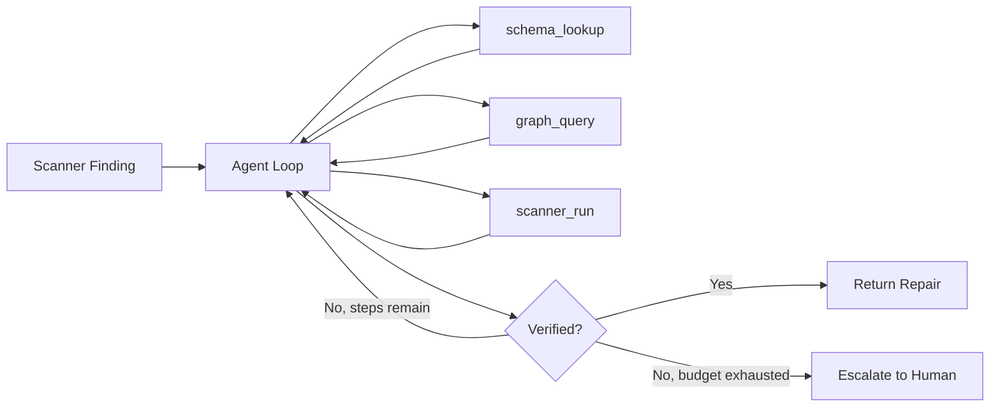
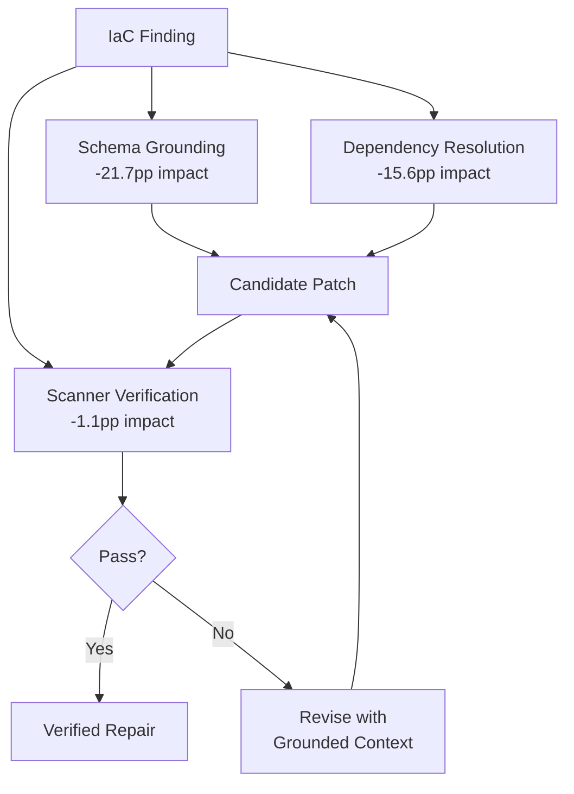

# TerraRepair and Tool-Grounded IaC Repair: Why Schema Lookup Matters More Than Scanner Feedback — and How to Wire Terraform Repair Agents into Codex CLI


---

Infrastructure-as-Code scanners catch misconfigurations before they reach production. But what happens after the scanner flags the problem? If you hand the finding to an LLM with a one-shot prompt, the fix rate is dismal — 26.6% for Checkov and 44.8% for Trivy [^1]. Worse, the model confidently claims success on fixes that a subsequent `terraform validate` rejects. TerraRepair, a new tool-grounded LLM agent accepted at ESEM 2026 [^1], demonstrates that grounding the agent in provider schemas, dependency graphs, and scanner re-execution lifts verified fix rates to 78.4% and 72.4% respectively — and that removing schema lookup alone drops performance by 21.7 percentage points [^1].

The lesson generalises well beyond Terraform. If you operate Codex CLI against any IaC codebase, the same grounding pattern — schema consultation, cross-resource dependency resolution, and closed-loop scanner verification — is already expressible through the MCP server stack and hook architecture you already have.

## The Problem: Claimed Fixes That Break on Validation

Low et al. (2024) established that direct GPT-4 prompting produces a claimed-vs-verified gap of 44.8–73.6 percentage points on Terraform security findings [^2]. The model patches the attribute the scanner complains about, but introduces unsupported nested blocks, assigns values to provider-computed fields, or omits required sibling attributes. The scanner stops complaining, but `terraform validate` fails — or, worse, the plan succeeds and the deployed resource silently drops the intended security control.

TerraRepair's core contribution is eliminating this gap. Across three runs on 713 findings from the TerraGoat and KaiMonkey vulnerable-by-design repositories, the claimed-vs-verified discrepancy shrank from that 44–73pp range to between −2.9 and +1.8 percentage points [^1].

## How TerraRepair Works

The agent operates as a bounded ReAct-style loop with a hard ceiling of 10 tool-call steps per finding [^1]. It receives the scanner's rule identifier, severity, resolution hint, resource identifier, cause lines, and the complete original HCL block. Three grounding tools are available:



- **`schema_lookup`** retrieves the installed Terraform provider schema for the target resource type, preventing unsupported attributes, invalid nested blocks, and assignments to provider-computed fields [^1].
- **`graph_query`** resolves cross-resource dependencies — KMS key ARNs, network identifiers, security group references — that a single-resource prompt cannot see [^1].
- **`scanner_run`** re-executes Checkov or Trivy on the candidate patch and returns whether the original finding persists [^1].

The model is gpt-4o-mini (2024-07-18 snapshot) at temperature 0.0 [^1]. Semantic correctness of scanner-verified repairs was audited by Claude Sonnet 4.5 and GPT-5.4 judges, yielding 78.9% correct (95% CI 72.2–84.4%) with Fleiss' κ = 0.54 inter-rater agreement [^1].

## Results Across Clouds

Fix rates hold up across AWS, Azure, and GCP, though with instructive variation:

| Dataset | Checkov Fix Rate | Trivy Fix Rate |
|---------|-----------------|----------------|
| TerraGoat AWS | 83.1% ± 2.6pp | 70.5% ± 2.8pp |
| TerraGoat Azure | 74.7% ± 1.2pp | 72.2% ± 2.2pp |
| TerraGoat GCP | 71.5% ± 6.4pp | 71.4% ± 2.0pp |
| KaiMonkey AWS | 67.7% ± 6.7pp | 76.4% ± 7.3pp |

All 26 new `terraform validate` errors occurred in Azure and GCP configurations, not AWS [^1]. Of these, 73.1% involved missing required attributes or unsupported provider-specific fields [^1] — precisely the failures that schema lookup prevents.

## The Ablation That Matters

The leave-one-out ablation on TerraGoat AWS Checkov reveals the relative contribution of each grounding tool [^1]:

| Removed Component | Δ Verified Fix Rate |
|-------------------|---------------------|
| `schema_lookup` | −21.7pp |
| `graph_query` | −15.6pp |
| `scanner_run` | −1.1pp |

Schema lookup contributes nearly twice as much as dependency resolution. Scanner feedback, despite being the most intuitive component, barely moves the needle on its own — the agent already has the scanner's initial finding in context. The critical insight: **preventing invalid constructs matters more than verifying correct ones**.

## When the Agent Escalates

TerraRepair escalates 25.4% (± 1.3pp) of findings to human operators [^1]. The escalation taxonomy is revealing:

- **Missing external context** (82.7%): absent KMS ARNs, certificates, logging targets, secrets, network identifiers that exist outside the scanned module [^1]
- **Max-step termination** (12.5%): the 10-step budget exhausted, often on heredoc-containing blocks or scanner feedback that did not identify the unsatisfied condition [^1]
- **Missing schema support** (3.9%): provider schema lacked nested-block detail [^1]
- **Unresolved Terraform variables/locals** (0.9%): cross-module references the graph query could not resolve [^1]

The 82.7% figure is the most important number in the paper for practitioners. It quantifies exactly how much IaC repair remains irreducibly deployment-specific — the agent cannot invent a KMS key ARN that does not yet exist.

## Mapping to Codex CLI

Codex CLI's architecture already supports this grounding pattern through its MCP server stack and hook system. Here is how to wire an equivalent IaC repair workflow:

### MCP Server Configuration for Terraform Tooling

The AWS Terraform MCP Server [^3] and the AWS Security Scanner MCP Server [^4] provide the scanner-run and schema-lookup capabilities TerraRepair uses. Configure them in `~/.codex/config.toml`:

```toml
[mcp_servers.terraform]
command = "uvx"
args = ["awslabs.terraform-mcp-server@latest"]
required = true
startup_timeout_sec = 30
tool_timeout_sec = 60

[mcp_servers.security-scanner]
command = "uvx"
args = ["awslabs.security-scanner-mcp-server@latest"]
required = true
startup_timeout_sec = 30
tool_timeout_sec = 60
```

TerraShark [^5], a community Terraform skill for Claude Code and Codex CLI, provides provider-schema grounding to prevent hallucinated attributes — directly paralleling TerraRepair's `schema_lookup` tool.

### PreToolUse Hooks for Schema Validation

Wire a PreToolUse hook that intercepts file writes to `.tf` files and validates them against the installed provider schema before the agent commits the patch:

```toml
[[hooks.pre_tool_use]]
event = "pre_tool_use"
tool = "write_file"
command = "bash -c 'if [[ \"$CODEX_TOOL_ARG_PATH\" == *.tf ]]; then terraform validate -json 2>/dev/null | jq -e \".valid\" > /dev/null || echo \"DENY: terraform validate failed\"; fi'"
```

### PostToolUse Hooks for Scanner Re-Verification

After any `.tf` file modification, re-run Checkov against the changed file to close the verification loop — the same pattern as TerraRepair's `scanner_run` tool:

```toml
[[hooks.post_tool_use]]
event = "post_tool_use"
tool = "write_file"
command = "bash -c 'if [[ \"$CODEX_TOOL_ARG_PATH\" == *.tf ]]; then checkov -f \"$CODEX_TOOL_ARG_PATH\" --quiet --compact 2>&1 | tail -5; fi'"
```

### AGENTS.md Constraints for IaC Repair

Encode TerraRepair's grounding discipline directly in your repository's `AGENTS.md`:

```markdown
## Terraform Repair Protocol

1. Before modifying any `.tf` resource block, run `terraform providers schema -json`
   for the target resource type and confirm every attribute you intend to set exists
   in the schema and is not marked `computed: true`.
2. For any attribute referencing an external resource (KMS key, VPC, subnet, security
   group), query the dependency graph or existing `.tf` files for the reference.
   If the reference does not exist in the codebase, STOP and report the missing
   dependency rather than inventing a placeholder.
3. After every patch, run `checkov -f <file>` and `terraform validate`.
   Do not claim success until both pass.
4. If a finding requires deployment-specific context (certificates, secrets, external
   ARNs), escalate with a structured note listing what is missing.
```

### Escalation via Approval Mode

For high-risk IaC repositories, set `approval_mode = "writes"` to ensure every `.tf` file modification requires human confirmation [^6] — mechanically enforcing TerraRepair's escalation pattern for cases where the agent lacks deployment context:

```toml
[profiles.iac-repair]
model = "o3"
approval_mode = "writes"
```

## The Broader Pattern: Grounding Beats Verification

TerraRepair's ablation result — schema lookup contributing −21.7pp versus scanner feedback's −1.1pp — reveals a general principle for tool-grounded agents. Prevention of invalid constructs (knowing what the provider schema allows before generating code) matters far more than post-hoc detection (re-running the scanner after generation). This inverts the common assumption that closed-loop verification is the most valuable component of an agentic repair pipeline.

For Codex CLI users, the implication is clear: invest in grounding tools (provider schemas, API documentation, type definitions) exposed through MCP servers, and treat scanner re-execution as a secondary safety net rather than the primary quality gate.



The 25.4% escalation rate is not a failure — it is a feature. TerraRepair's structured escalation, reporting exactly which external context is missing, converts an opaque "the fix didn't work" into actionable information. Wire the same pattern into your Codex CLI hooks: when the agent cannot resolve a dependency, force it to emit a structured report rather than hallucinating a placeholder ARN.

## Citations

[^1]: Mengistu, M.M., Di Rocco, J., Nguyen, P.T., and Di Ruscio, D. "TerraRepair: A Tool-Grounded LLM Agent for Infrastructure-as-Code Repair." arXiv:2607.11390, July 15, 2026. Accepted at ESEM 2026. [https://arxiv.org/abs/2607.11390](https://arxiv.org/abs/2607.11390)

[^2]: Low, T. et al. "Exploring the effectiveness of LLMs in automated fixing of cloud infrastructure misconfigurations." 2024. Referenced as baseline in TerraRepair. ⚠️ Exact citation details from TerraRepair's reference list; original paper not independently verified.

[^3]: AWS Labs. "AWS Terraform MCP Server." [https://hub.docker.com/mcp/server/aws-terraform/tools](https://hub.docker.com/mcp/server/aws-terraform/tools)

[^4]: AWS Samples. "Sample MCP Security Scanner — Checkov, Semgrep, Bandit integration." [https://github.com/aws-samples/sample-mcp-security-scanner](https://github.com/aws-samples/sample-mcp-security-scanner)

[^5]: Niessen, L. "TerraShark: Terraform Skill for Claude Code and Codex." [https://github.com/LukasNiessen/terrashark](https://github.com/LukasNiessen/terrashark)

[^6]: OpenAI. "Codex CLI Features — Approval Modes." [https://developers.openai.com/codex/cli/features](https://developers.openai.com/codex/cli/features)

[^7]: Bridgecrew/Palo Alto Networks. "Checkov — IaC Static Analysis." Checkov v3.2.526, April 2026. [https://www.checkov.io/](https://www.checkov.io/)

[^8]: Aqua Security. "Trivy — Comprehensive Security Scanner." Trivy v0.70.0, April 2026. [https://trivy.dev/](https://trivy.dev/)
