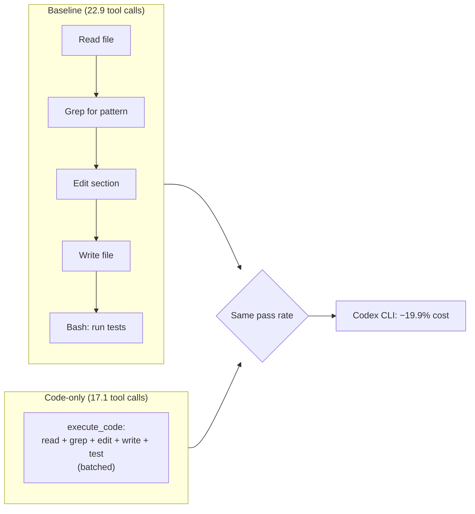

# When Does Restricting Your Agent's Tool Surface Actually Help? What the execute_code Ablation Means for Codex CLI Cost Control


---

Conventional wisdom says more tools make agents smarter. Give them file editors, shell access, grep, glob, and a constellation of MCP servers, and they will find the right path. A controlled ablation study published on 12 July 2026 suggests a more nuanced truth: the cheapest tool surface depends on what you are asking the agent to do — and on the agent itself [^1].

The paper, *When Does Restricting a Coding Agent to execute_code Help?*, tested both Claude Code and OpenAI Codex CLI across computation and code-modification tasks while holding models and prompts constant. Pass rates barely moved. Costs swung by up to 25 per cent. The implications for how you configure Codex CLI's MCP tool stack are immediate and practical.

## The Experiment: Three Arms, Two Agents, Two Task Regimes

Yang, Yu, and Desell designed a crossed ablation: three tool configurations tested against two agents (Claude Code and Codex CLI v0.144.x) across two task regimes (synthetic computation artefacts and SWE-bench Mini modification tasks) [^1].

The three arms:

| Arm | Available tools |
|---|---|
| **Baseline** | Full default surface — file primitives (Read, Edit, Write, Glob, Grep), shell, structured apply_patch |
| **Bash-only** | Native shell plus read-only browsing; no file-editing primitives |
| **Code-only** | Single MCP `execute_code` tool (persistent Python+Bash REPL); all native built-ins disabled |

Each instance ran in a per-arm subprocess with a fresh config directory and fuse-overlayfs virtual environment overlays. Git history was stripped to prevent upstream reference recovery. Tasks were the unit of inference, collapsed across three seeds per task [^1].

## The Headline: Pass Rates Are Invariant; Costs Are Not

Across all four cells (2 agents × 2 regimes), maximum pass-rate difference was three percentage points — none statistically significant. Agreement matrices showed 91–99 per cent unanimous-pass instances [^1].

The cost picture is starkly different:

| Regime | Agent | Cost Δ (code-only vs baseline) | Significant? |
|---|---|---|---|
| Computation | Claude Code | **−24.6%** | p = 7.37 × 10⁻¹⁴ |
| Computation | Codex CLI | −6.7% | Directional only |
| Modification | Claude Code | +14.4% | Not significant |
| Modification | Codex CLI | **−19.9%** | p = 2.02 × 10⁻⁹ |

The paper's central finding: "Tool surface changes the path and the cost, not the answer" [^1].

## Why the Costs Diverge: Two Mechanisms

### Edit Friction on Claude Code

When Claude Code is restricted to `execute_code` for modification tasks (SWE-bench), it must write entire file contents through the REPL rather than issuing surgical Edit calls. Output tokens scale with edit volume — Spearman ρ = 0.488 (p = 2.59 × 10⁻⁷) between change in edit characters and change in output tokens. High-patch instances consumed 6,378 output tokens versus 2,650 for low-patch instances [^1]. The agent pays a per-line verbosity tax, plus roughly 3,993 tokens of fixed-cost regime overhead.

### Tool-Call Batching on Codex CLI

Codex CLI tells a different story. Under `execute_code` restriction, it batches operations into fewer, denser tool calls — 17.1 calls versus 22.9 at baseline. The p99 output ceiling collapses from 40,154 characters to 16,736 characters. LLM-call count stays flat (18.0 versus 18.2). The agent programmatically constrains output via query tightening and result slicing, saving roughly 25 per cent on input tokens [^1].



## What This Means for Codex CLI Configuration

### Computation Workloads: Restrict Aggressively

If your Codex CLI tasks are primarily computational — data processing, script generation, analysis pipelines, build automation — the evidence supports restricting the tool surface. You can configure this through MCP and `enabled_tools` in `config.toml`:

```toml
[mcp_servers.code_runner]
command = "npx"
args = ["-y", "@anthropic/execute-code-mcp"]
enabled_tools = ["execute_code"]
default_tools_approval_mode = "auto"
tool_timeout_sec = 120
```

Combined with Codex CLI's `disabled_tools` key for native tools, you can approximate the paper's code-only arm [^2]:

```toml
# In a named profile for computation tasks
[profiles.compute]
disabled_tools = ["Read", "Edit", "Write", "Glob", "Grep"]
```

### Modification Workloads: Keep Your Primitives

For repository modification — bug fixes, feature implementation, refactoring — the data is agent-dependent. On Codex CLI, code-only still saves roughly 20 per cent. But the paper cautions that this depends on Codex's specific batching behaviour, which may shift between versions [^1]. For modification workloads on agents without strong batching, retaining Edit and Write primitives avoids the edit-friction tax.

### The Bash-Only Trap

A surprising finding: bash-only is not a monotone waypoint between baseline and code-only. On SWE-bench with Codex CLI, bash-only was the *costliest* arm — 4.83 per cent above baseline (p = 0.005) [^1]. Developers who instinctively reach for "just use bash" may be paying more than either extreme.

## Practical Configuration Patterns

### Profile-Based Tool Surface Switching

Codex CLI's named profiles let you switch tool surfaces without editing global config [^3]:

```toml
[profiles.compute]
model = "gpt-5.6-terra"
disabled_tools = ["Read", "Edit", "Write", "Glob", "Grep"]

[profiles.modify]
model = "gpt-5.6-sol"
# Full tool surface — no restrictions

[profiles.review]
model = "gpt-5.6-luna"
disabled_tools = ["Edit", "Write"]
# Read-only surface for code review
```

Invoke with `codex --profile compute "process the dataset"`.

### MCP Server Scoping

The `enabled_tools` key on MCP servers is your primary lever for tool surface control [^2]. Rather than exposing every tool a server provides:

```toml
[mcp_servers.github]
command = "npx"
args = ["-y", "@modelcontextprotocol/server-github"]
env = { "GITHUB_PERSONAL_ACCESS_TOKEN" = "${GITHUB_TOKEN}" }
enabled_tools = ["get_file_contents", "list_issues", "create_issue"]
# Excludes delete_repository, push, and 40+ other tools
```

This follows the paper's core insight: fewer tools does not mean lower capability, but it can mean lower cost [^1].

### Cost Monitoring

The paper uses cache-adjusted cost as the primary metric — not raw token counts. Codex CLI's `/usage` command and the traces dashboard both report cache-hit rates [^4]. If you are running ablation-style experiments on your own workloads, monitor:

- **Cache-adjusted cost**, not just input/output tokens
- **Tool-call count** as a proxy for batching efficiency
- **p99 output tokens** to detect ceiling collapse (the Codex CLI batching effect)

## Caveats and Open Questions

The study tested on SWE-bench Mini (100 tasks) and a 93-task synthetic suite. Production workloads have different distributions. The paper acknowledges that "the most economical tool surface depends on both task regime and agent design characteristics rather than either factor independently" [^1].

⚠️ The `disabled_tools` key for native Codex CLI tools (as opposed to MCP `enabled_tools`) has limited documentation. Verify behaviour with `codex doctor` before deploying to production workflows.

The paper also notes that Codex CLI's batching behaviour is an implementation detail that may change between releases — the scaffolding evolution problem documented in earlier research [^5]. Pin your Codex CLI version when running cost-sensitive workloads.

## The Broader Principle

This research formalises something experienced Codex CLI users already sense: the default tool surface is designed for generality, not for your specific workload. The MCP architecture and `config.toml` give you the knobs to specialise. The paper provides the first controlled evidence that turning those knobs can save 20–25 per cent on costs without touching pass rates.

The practical takeaway is not "always restrict tools" or "always use every tool." It is: **profile your workload, measure cache-adjusted cost, and configure accordingly.**

---

## Citations

[^1]: Yang, H., Yu, Q., & Desell, T. (2026). "When Does Restricting a Coding Agent to execute_code Help?" *arXiv:2607.10569*. Accepted at Agentic Software Engineering (SE 3.0) Workshop, KDD 2026. [https://arxiv.org/abs/2607.10569](https://arxiv.org/abs/2607.10569)

[^2]: OpenAI. (2026). "Model Context Protocol — Codex CLI." *ChatGPT Learn*. [https://learn.chatgpt.com/docs/extend/mcp?surface=cli](https://learn.chatgpt.com/docs/extend/mcp?surface=cli)

[^3]: OpenAI. (2026). "Configuration Reference — Codex CLI." *ChatGPT Learn*. [https://developers.openai.com/codex/config-reference](https://developers.openai.com/codex/config-reference)

[^4]: OpenAI. (2026). "Developer Commands — Codex CLI." *ChatGPT Learn*. [https://developers.openai.com/codex/cli/reference](https://developers.openai.com/codex/cli/reference)

[^5]: Ben Sghaier, O. et al. (2026). "Don't Blame the LLM: Scaffolding Evolution Shapes Coding Agent Quality." *arXiv:2607.03691*. [https://arxiv.org/abs/2607.03691](https://arxiv.org/abs/2607.03691)
