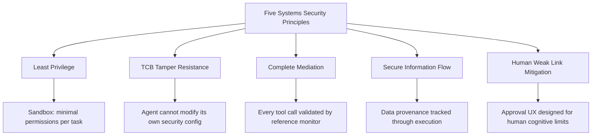
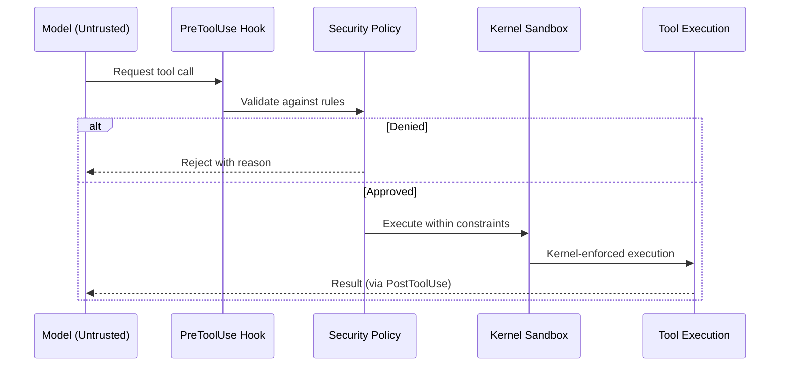

# Agent Security Is a Systems Problem: Why Treating the Model as Untrusted Changes Everything — and How Codex CLI Already Implements the Architecture


---

Most discussions about securing coding agents begin and end with the model: fine-tune it harder, add a guardrail prompt, train it to refuse. A position paper from researchers at Google, UC San Diego, University of Wisconsin–Madison, Cornell, Meta FAIR, and Gray Swan AI argues that this entire framing is wrong [^1]. The model is not the security boundary — it is the _untrusted component_. Security invariants must be enforced at the system level, using decades-old principles from operating systems and distributed systems research. This article examines those principles, maps them to eleven real-world agent attacks the paper analyses, and shows how Codex CLI's layered architecture already instantiates the core recommendations — while highlighting the gaps that remain open.

## The Core Thesis: Models Are Untrusted Components

The paper, _Agent Security is a Systems Problem_ (arXiv:2605.18991), articulates a deceptively simple position: the AI model powering an agent must be treated as an untrusted component operating inside a trusted computing base (TCB), with a reference monitor mediating every interaction between the model and external resources [^1].

This is not a novel idea in systems security. Operating system kernels have enforced this pattern since the 1970s. What is novel is applying it rigorously to agentic AI, where the community has overwhelmingly focused on model-level mitigations — alignment training, system prompt hardening, refusal fine-tuning — rather than structural enforcement [^2].

The paper identifies five foundational principles from classical systems security and maps each to the agent domain:



## Eleven Attacks, Five Violated Principles

The paper analyses eleven real-world attacks on deployed agents. The pattern is striking: every attack exploits at least one systems-level violation, and most exploit several simultaneously [^1].

| Attack | Violated Principles | Vector |
|--------|-------------------|--------|
| ChatGPT SpAIware | TCB Tamper Resistance, Least Privilege, Information Flow | Prompt injection via documents exfiltrating conversation data through long-term memory |
| Claude Code DNS Exfiltration | Least Privilege, Information Flow | DNS-based data leakage via mis-allowlisted `ping` command |
| Microsoft Copilot Exfiltration | Least Privilege, Complete Mediation, Information Flow | Hidden prompt triggering unauthorised search plus ASCII smuggling |
| Devin AI Exposed Ports | Least Privilege, Information Flow | Malicious website hijacking agent to expose local filesystem |
| DeepSeek Account Takeover | Complete Mediation, Information Flow | Base64-encoded JavaScript achieving browser XSS |
| Terminal DiLLMa | Complete Mediation, Information Flow | ANSI escape sequence injection via compromised tool output |
| AI ClickFix | Human Weak Link, Least Privilege | Social engineering agent through sequential webpage instructions |
| ChatGPT Operator Injection | Information Flow | Malicious GitHub issue redirecting to attacker site for PII exfiltration |
| Amp AI Arbitrary Execution | TCB Tamper Resistance, Information Flow | Agent modifying its own security configuration file |
| Cursor AgentFlayer | Information Flow, Least Privilege, Complete Mediation, TCB Tamper Resistance | Malicious Jira ticket exfiltrating repository secrets |
| Devin AI Secret Leaks | Information Flow, Least Privilege | Prompt injection triggering tool-based data exfiltration |

Three observations stand out. First, _Information Flow_ violations appear in every single attack — data crosses trust boundaries without tracking or enforcement. Second, _TCB Tamper Resistance_ failures are the most devastating: when an agent can modify its own security configuration (as in the Amp AI attack), every other protection becomes irrelevant [^1]. Third, the _Human Weak Link_ is not hypothetical — the AI ClickFix attack succeeded by exploiting human approval fatigue, not technical weakness.

## Three Open Research Challenges

Beyond the five principles, the paper identifies three fundamental research problems that remain unsolved [^1]:

### 1. Separating Instructions from Data

Language models consume instructions and data as a single token stream. There is no architectural boundary between "follow this system prompt" and "here is a file to read." Prompt injection exploits this conflation directly. The paper argues that neither fine-tuning nor delimiters provide provable separation — the problem requires structural solutions, potentially at the tokeniser or architecture level [^3].

### 2. Verifiable Policy Generation

Agentic systems lack fixed action spaces. When a user says "don't touch production files," translating that intent into a formal, enforceable policy requires grounding natural language to substrate predicates, ensuring checkability of the translation, and providing measurable bounds on divergence. Current natural-language-to-policy approaches remain probabilistic [^1].

### 3. Information-Flow Control

Classical information-flow control (IFC) tracks data provenance through execution. In LLMs, multiple labelled sources feed into a single context window, and the output must carry the union of all input labels — creating a "label explosion where every piece of data is labelled as everything" [^1]. The paper proposes three research directions: soft distributional labels, causal-interventional views, and mechanistic interpretation of model internals.

## Codex CLI's Architecture Through the Lens of the Five Principles

Codex CLI does not cite this paper, but its security architecture maps remarkably well to the five principles. Here is how each is instantiated — and where gaps remain.

### Least Privilege: Kernel-Level Sandbox

Codex CLI enforces least privilege through OS-level sandboxing: Landlock plus seccomp-BPF on Linux, Apple's Seatbelt (sandbox-exec) on macOS, and restricted tokens with synthetic SIDs on Windows [^4]. The sandbox operates at the kernel level, not inside containers, and is enabled by default in `workspace-write` mode — meaning the agent can only write within the project directory and has no network access unless explicitly granted.

```toml
# config.toml — sandbox and approval defaults
[codex]
sandbox_mode = "workspace-write"     # read-only | workspace-write | danger-full-access
approval_policy = "on-failure-or-ambiguous"
```

This is genuine least privilege: the model receives only the filesystem and network permissions required for its task, enforced by the kernel rather than by the model's own compliance [^5].

### TCB Tamper Resistance: Immutable Configuration

The Amp AI attack succeeded because the agent could modify its own security configuration file [^1]. Codex CLI addresses this through two mechanisms. First, `requirements.toml` provides admin-enforced constraints that the CLI binary reads at startup and cannot be overridden by AGENTS.md or user configuration [^6]. Second, the sandbox itself prevents writes outside the workspace root — the config directory is read-only by default, making self-modification structurally impossible.

```toml
# requirements.toml — admin-enforced, immutable at runtime
[policy]
sandbox_mode = "workspace-write"
approval_policy = "on-failure-or-ambiguous"
disabled_tools = ["shell:rm -rf /", "shell:curl"]
```

### Complete Mediation: Hooks as Reference Monitor

The paper's reference monitor pattern — "every single request from the Untrusted System must be validated against the Security Policy" [^1] — maps directly to Codex CLI's hook architecture. Five hook points (`SessionStart`, `PreToolUse`, `PostToolUse`, `UserPromptSubmit`, `Stop`) intercept every tool invocation, and each hook can return `approve`, `deny`, or `escalate` via a JSON wire protocol [^7].



A `PreToolUse` hook can implement deterministic checks — scanning for dangerous patterns, validating file paths against an allowlist, or rejecting commands that match known attack vectors. This is not probabilistic model-level defence; it is classical reference monitor enforcement [^7].

### Secure Information Flow: Partial Coverage

This is where Codex CLI's coverage is weakest, mirroring the paper's identification of IFC as the hardest unsolved problem. Codex CLI does provide `tool_output_token_limit` to cap the volume of data flowing from tool results back into the model's context [^8], and the `network_proxy` domain allowlist prevents data exfiltration to unauthorised hosts [^5]. However, there is no provenance tracking — no labelling of data by origin, no enforcement of label-based policies on output generation.

The `PostToolUse` hook offers a partial mitigation: teams can log every tool output for audit, creating an after-the-fact trail [^7]. But this is replay auditing, not runtime enforcement. The paper's vision of dynamic IFC within the model itself remains a research frontier.

### Human Weak Link: Graduated Trust

The paper's analysis of the AI ClickFix attack highlights approval fatigue — users clicking "approve" reflexively after repeated benign requests [^1]. Codex CLI mitigates this through the `writes` approval mode (introduced in v0.144.0), which permits declared read-only operations automatically while requesting approval only for write operations [^9]. The Guardian auto-review subagent provides a second automated layer, classifying tool calls into risk tiers before surfacing only high-risk actions for human decision [^10].

```toml
# Per-profile approval tuning
[profile.untrusted-repos]
approval_policy = "on-failure-or-ambiguous"
sandbox_mode = "read-only"

[profile.trusted-repos]
approval_policy = "unless-allow-listed"
sandbox_mode = "workspace-write"
```

The `Ultra` reasoning mode now alerts users when elevated multi-agent concurrency could accelerate usage consumption [^9] — a small but meaningful step towards making the human aware of their own cognitive load.

## The Semantic Gap Problem

The paper raises a challenge that no current agent system has fully solved: the _semantic gap_ between high-level user intent and low-level tool calls [^1]. Traditional software has layers of abstraction — processes, system calls, network stacks — each providing contextual enforcement granularity. Agentic systems collapse user intent directly into tool invocations with no intervening abstraction.

Codex CLI's AGENTS.md files partially address this by encoding project-level intent as structured constraints that the model reads at session start [^11]. But AGENTS.md is consumed by the untrusted model itself — it is advice, not enforcement. The deterministic enforcement layer (hooks, sandbox, approval policy) operates at the tool-call level without semantic understanding of the user's higher-level goal.

This is precisely the gap the paper's "Verifiable Policy Generation" research challenge targets. Until natural-language policies can be formally grounded and checked, teams must bridge the gap manually — encoding critical constraints as deterministic hook rules rather than relying on AGENTS.md prose alone.

## Practical Recommendations for Codex CLI Teams

Based on the paper's framework, teams running Codex CLI in production should:

1. **Treat AGENTS.md as advisory, hooks as enforcement.** Any security-critical constraint belongs in a `PreToolUse` hook, not in markdown prose the model may ignore.

2. **Lock `requirements.toml` at the organisational level.** This is your TCB — it should be version-controlled, code-reviewed, and deployed via MDM or configuration management, not editable by individual developers.

3. **Restrict network access by default.** The domain allowlist (`network_proxy`) is the single most effective defence against the exfiltration patterns present in 9 of the 11 attacks analysed.

4. **Audit tool outputs systematically.** Deploy `PostToolUse` hooks that log every tool call and result to a structured store. When IFC matures, these logs become the provenance trail.

5. **Resist `danger-full-access`.** Every attack in the paper's catalogue exploits excessive permissions. The `workspace-write` default exists for a reason.

## What Remains Unsolved

The paper is candid about limitations. Three problems have no production-ready solutions:

- **Instruction-data separation** at the architecture level remains theoretical. No tokeniser or model architecture provably prevents prompt injection [^3].
- **Dynamic information-flow control** inside LLMs faces the label explosion problem. Current proxy approaches (causal interventions, mechanistic interpretation) are research prototypes [^1].
- **Verifiable policy synthesis** — translating "don't deploy to production" into a formally checkable, enforceable specification — requires advances in grounding and checkability that do not yet exist [^1].

Codex CLI's defence-in-depth architecture — kernel sandbox, deterministic hooks, graduated approval, admin-enforced policy — does not solve these problems. What it does is ensure that when the model fails (and the paper argues it _will_ fail), the damage is bounded by structural enforcement rather than model compliance.

That is the systems security thesis in one sentence: _assume the component will be compromised, and build the architecture to contain it_.

## Citations

[^1]: Christodorescu, M., Fernandes, E., Hooda, A., Jha, S., Rehberger, J., Chaudhuri, K., Fu, X., Shams, K., Amir, G., Choi, J., Choudhary, S., Palumbo, N., Labunets, A., & Pandya, N.V. (2026). "Agent Security is a Systems Problem." arXiv:2605.18991. [https://arxiv.org/abs/2605.18991](https://arxiv.org/abs/2605.18991)

[^2]: Rehberger, J. (2026). "Hacking Agents and Autonomous AI — EmbraceTheRed." [https://embracethered.com/](https://embracethered.com/)

[^3]: Greshake, K., Abdelnabi, S., Mishra, S., Endres, C., Holz, T., & Fritz, M. (2023). "Not What You've Signed Up For: Compromising Real-World LLM-Integrated Applications with Indirect Prompt Injection." arXiv:2302.12173. [https://arxiv.org/abs/2302.12173](https://arxiv.org/abs/2302.12173)

[^4]: DeepWiki. (2026). "Sandboxing Implementation — openai/codex." [https://deepwiki.com/openai/codex/5.6-sandboxing-implementation](https://deepwiki.com/openai/codex/5.6-sandboxing-implementation)

[^5]: Codex Knowledge Base. (2026). "Codex CLI Network Security: requirements.toml Enforcement, Landlock, and Air-Gapped Deployments." [https://codex.danielvaughan.com/2026/03/31/codex-cli-network-security-requirements-toml/](https://codex.danielvaughan.com/2026/03/31/codex-cli-network-security-requirements-toml/)

[^6]: OpenAI. (2026). "Codex CLI Configuration Reference." [https://learn.chatgpt.com/docs/configuration](https://learn.chatgpt.com/docs/configuration)

[^7]: Codex Knowledge Base. (2026). "Codex CLI Hooks: Complete Guide to Events, Policy Engines and Production Patterns." [https://codex.danielvaughan.com/2026/04/15/codex-cli-hooks-complete-guide-events-policy-patterns/](https://codex.danielvaughan.com/2026/04/15/codex-cli-hooks-complete-guide-events-policy-patterns/)

[^8]: OpenAI. (2026). "Codex CLI Changelog — v0.143.0." [https://learn.chatgpt.com/docs/changelog](https://learn.chatgpt.com/docs/changelog)

[^9]: OpenAI. (2026). "Codex CLI Changelog — v0.144.0." [https://learn.chatgpt.com/docs/changelog](https://learn.chatgpt.com/docs/changelog)

[^10]: Crosley, B. (2026). "Codex CLI Guide 2026: Setup, Sandbox, AGENTS.md & MCP." [https://blakecrosley.com/guides/codex](https://blakecrosley.com/guides/codex)

[^11]: OpenAI. (2026). "AGENTS.md Documentation." [https://learn.chatgpt.com/docs/agents-md](https://learn.chatgpt.com/docs/agents-md)
