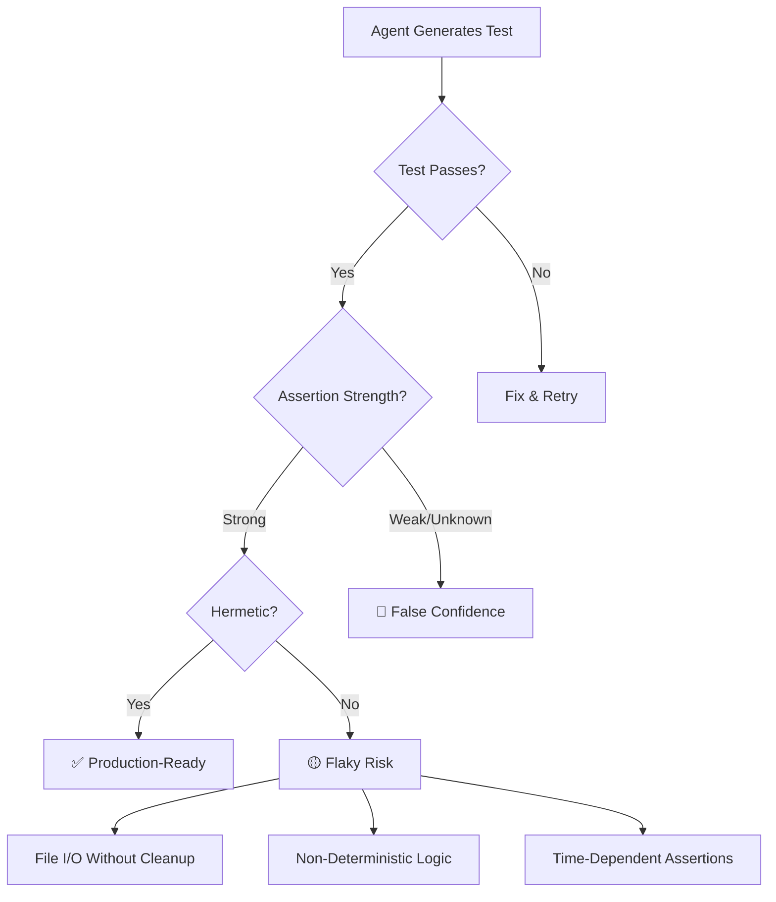
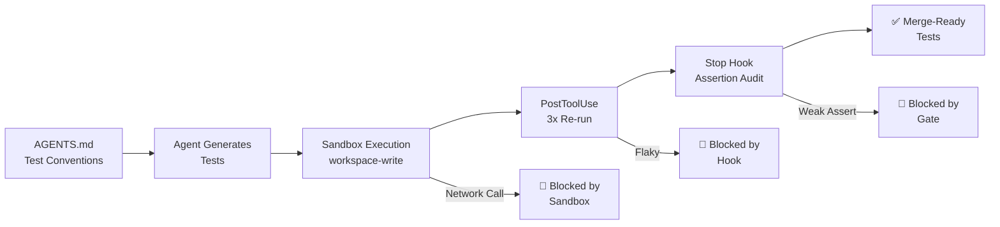

# Beyond Test Presence: What 204,000 Test Files Reveal About Agent-Generated Test Quality — and How to Harden Codex CLI's Testing Output


---

Your coding agent writes tests that pass. That is no longer the interesting question. The interesting question is whether those tests are *worth keeping* — whether they encode meaningful assertions, cover boundary conditions, and run reliably across environments. A new large-scale study of 204,673 test files suggests the answer is nuanced: agents outperform humans on edge-case breadth but introduce measurably more flakiness [^1]. For Codex CLI users, this has direct configuration implications.

## The Study: Beyond Test Presence

Jhanglani, Desai, Kansara, and AlOmar published "Beyond Test Presence: Assessing the Quality and Robustness of Agent-Generated Tests in Open-Source Projects" on 15 July 2026 [^1]. Drawing from the AIDev dataset of real-world open-source development activity, they performed white-box static analysis via AST parsing across 24,941 human-authored and 179,732 agent-generated test files spanning Python, TypeScript, Go, JavaScript, and C++ [^1].

The study examines three research questions that matter far more than pass rates: assertion strength, edge-case coverage, and flakiness potential.

## Assertion Strength: Agents Are Slightly Weaker

Human-authored tests achieved 88.1% strong assertions versus 85.4% for agent-generated tests [^1]. The gap itself is modest, but the unknown-assertion rate is the real concern: agents produced unrecognised assertion patterns at 11.6%, roughly eight times the human rate of 1.5% [^1]. This means agents frequently use non-standard or misspelt assertion methods — `assertEquel`, `assert_true_value`, and similar patterns that a test runner may silently treat as a no-op [^1].

For any production codebase, an assertion that does not assert is worse than a missing test: it provides false confidence.

## Edge-Case Coverage: Agents Win Convincingly

Agents demonstrated almost twice the variety of boundary checks, with a Variety Score of 0.62 versus 0.32 for human-written tests [^1]. The specific numbers are striking:

| Boundary Type | Human | Agent |
|---|---|---|
| Null input | 8.3% | 13.4% |
| Zero input | 11.2% | 27.7% |
| Empty collection | 8.1% | 14.9% |
| Variety Score | 0.32 | 0.62 |

Agents are particularly strong at zero-input testing (27.7% versus 11.2%) — the kind of defensive check that experienced developers know matters but often skip under delivery pressure [^1].

## Flakiness: The Reliability Tax

This is where agent-generated tests cause the most damage. The flakiness candidate rate for agent tests was 0.41 versus 0.30 for human tests — a 37% higher risk of intermittent failure [^1].

The specific anti-patterns driving this are well-defined:

| Flakiness Pattern | Human | Agent |
|---|---|---|
| Non-determinism (`random.random()`) | 3.1% | 5.2% |
| File I/O (`open()`) | 3.5% | 4.4% |
| Async wait (`time.sleep()`) | 1.9% | 1.4% |

Agents are "specifically bad at handling random values and file system access" without proper mocking or cleanup [^1]. They touch the disk without resource isolation, use random functions without seed control, and fail to write hermetic tests that run reliably in isolation [^1].



## The Rigour-Reliability Paradox

The paper identifies what might be called a rigour-reliability paradox: agents produce more thorough boundary testing but less stable test infrastructure [^1]. Greater rigour in coverage comes with reduced reliability. This is not a model problem — it is an environmental awareness problem. Agents do not understand the execution environment their tests will run in [^1].

The researchers recommend three directions: environment-aware agents that generate, execute, and refine in sandboxed environments; hybrid assertion generation using RAG to ground agent output in project-specific syntax; and automated dependency inference for mock generation [^1].

## Mapping to Codex CLI: Defence-in-Depth for Test Quality

Codex CLI provides several mechanisms to close the gaps this study identifies. None of them require switching tools — they require configuration.

### AGENTS.md: Encoding Test Conventions

The most direct lever is `AGENTS.md`. By declaring project-specific test conventions, you prevent the assertion-strength gap from manifesting [^2]. A well-configured `AGENTS.md` file encodes the patterns agents should follow rather than leaving them to guess:

```markdown
## Testing Conventions

- Use `pytest` with `assert` statements, never `unittest.TestCase` methods
- Every test function must contain at least one assertion comparing a concrete expected value
- Never use `assertTrue(result)` alone — assert against a specific expected value
- Use `tmp_path` fixture for all file I/O — never call `open()` with hardcoded paths
- Seed all random generators: `random.seed(42)` at the top of any test using randomness
- Use `freezegun.freeze_time()` for any test involving timestamps
- Mock all external services using `unittest.mock.patch` or `pytest-mock`
- Tests must be hermetic: no shared state between test functions
```

This addresses the two biggest findings from the study: the 11.6% unknown-assertion rate drops when you constrain assertion patterns, and the file I/O flakiness drops when you mandate `tmp_path` [^2].

### PostToolUse Hooks: Automated Flakiness Detection

Codex CLI's `PostToolUse` hook fires after every tool execution, including test runs [^3]. You can wire a flakiness detector that re-runs tests multiple times after generation:

```bash
#!/bin/bash
# .codex/hooks/post-tool-use-flaky-check.sh
# Runs generated tests 3 times to catch intermittent failures

EVENT=$(cat -)
TOOL=$(echo "$EVENT" | jq -r '.tool')

if [[ "$TOOL" == "bash" ]]; then
  CMD=$(echo "$EVENT" | jq -r '.input.command')
  if echo "$CMD" | grep -qE 'pytest|jest|go test'; then
    for i in 1 2 3; do
      eval "$CMD" > /dev/null 2>&1 || {
        echo '{"decision":"block","reason":"Test flaky on run '$i' of 3"}'
        exit 0
      }
    done
  fi
fi

echo '{"decision":"approve"}'
```

This is the "generate, execute, and refine" loop the paper recommends, implemented at the harness level [^1][^3].

### Stop Hook: Test Completeness Gate

The `Stop` hook fires before Codex CLI completes a turn, providing a final quality gate [^3]. You can enforce that test generation tasks meet minimum quality thresholds:

```bash
#!/bin/bash
# .codex/hooks/stop-test-quality-gate.sh
# Ensures generated tests have strong assertions

EVENT=$(cat -)

# Check for weak assertion patterns in recently modified test files
CHANGED_TESTS=$(git diff --name-only HEAD | grep -E '_test\.(py|ts|js|go)$')

for f in $CHANGED_TESTS; do
  if grep -qE 'assertTrue\([a-z_]+\)$|assert [a-z_]+$' "$f"; then
    echo '{"decision":"block","reason":"Weak assertion pattern detected in '"$f"'. Assert against a specific expected value."}'
    exit 0
  fi
done

echo '{"decision":"approve"}'
```

### Sandbox Isolation for Hermetic Testing

Codex CLI's `workspace-write` sandbox mode blocks network access and restricts file system writes to the project directory [^4]. This is precisely the hermetic environment the paper argues agents need. Tests that rely on external network calls or write to system paths will fail immediately in the sandbox rather than producing a flaky test that passes locally and fails in CI [^4].

```toml
# config.toml — enforce hermetic test execution
[sandbox]
mode = "workspace-write"
```

Running test generation within this sandbox mode provides an immediate signal when an agent produces a test with external dependencies that should be mocked [^4].

### Model Selection for Test Tasks

The study found that edge-case coverage is a strength of agent-generated tests, but assertion precision and environmental awareness lag behind [^1]. Codex CLI's named profiles allow you to route test generation to models with stronger reasoning, which can produce more environmentally aware tests [^5]:

```toml
# config.toml — dedicated test generation profile
[profiles.test-gen]
model = "o3"
reasoning_effort = "high"
```

Invoke with `codex --profile test-gen "Write tests for the payment module"` to apply higher reasoning effort specifically to test generation tasks where assertion quality matters most [^5].

## Practical Workflow: The Anti-Flakiness Pipeline

Combining these mechanisms produces a testing workflow that captures the edge-case breadth agents excel at whilst filtering out the flakiness they introduce:



This pipeline turns the rigour-reliability paradox into a rigour-reliability *advantage*: you get the 0.62 Variety Score edge-case coverage without the 0.41 flakiness rate.

## What This Means for Your Test Suite

The study's headline finding — that agent-generated tests are present but not always production-worthy — applies directly to anyone using Codex CLI for test generation. The paper demonstrates that pass rates are insufficient as a quality metric [^1]. Tests that pass but use unknown assertion patterns, touch the file system without cleanup, or rely on non-deterministic logic are technical debt that compounds silently.

The good news is that every failure mode the study identifies has a mechanical countermeasure in Codex CLI's configuration surface. The `AGENTS.md` file prevents assertion-pattern drift. `PostToolUse` hooks catch flakiness before it reaches your repository. The sandbox enforces hermeticity by default. And named profiles let you apply appropriate reasoning effort to the task [^2][^3][^4][^5].

Agent-generated tests are not uniformly good or bad. They are predictably strong and predictably weak in ways that are now empirically quantified. Configure accordingly.

## Citations

[^1]: Jhanglani, P., Desai, Z.K., Kansara, V., and AlOmar, E.A. "Beyond Test Presence: Assessing the Quality and Robustness of Agent-Generated Tests in Open-Source Projects." arXiv:2607.12068, 15 July 2026. [https://arxiv.org/abs/2607.12068](https://arxiv.org/abs/2607.12068)

[^2]: OpenAI. "AGENTS.md — Codex CLI Documentation." [https://developers.openai.com/codex/cli](https://developers.openai.com/codex/cli)

[^3]: OpenAI. "Hooks — Codex CLI Documentation." [https://developers.openai.com/codex/hooks](https://developers.openai.com/codex/hooks)

[^4]: OpenAI. "Codex CLI — Sandbox Modes." [https://github.com/openai/codex](https://github.com/openai/codex)

[^5]: OpenAI. "Codex Changelog — Named Profiles and Model Selection." [https://developers.openai.com/codex/changelog](https://developers.openai.com/codex/changelog)
