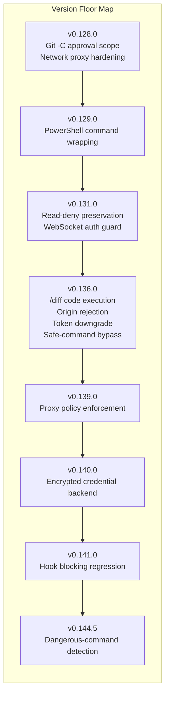
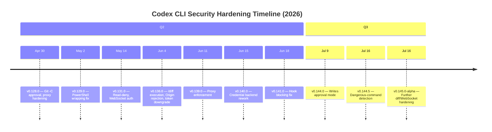

# Your Codex CLI Version Is a Security Boundary: What 12 Fixes in 7 Weeks Reveal About Agent Fleet Governance


---

When your coding agent can execute shell commands, manage credentials, and listen on local sockets, the version it runs is not a packaging detail — it is a security control. A team pinned to Codex CLI v0.135.0 is not merely "behind"; it is running with a trust model the maintainer has already repudiated.

In June 2026, Backslash Security's research team published a forensic analysis of Codex CLI's changelog, documenting twelve security-relevant fixes shipped across just seven weeks of stable releases (v0.128.0 through v0.141.0)[^1]. Every fix linked directly to a merged pull request, creating what the researchers termed a "security receipt" — a public, auditable trail of what was wrong and why it changed. This article examines those findings, maps them to the version-floor concept now emerging in agent governance, and shows how to enforce minimum versions across a Codex CLI fleet using `requirements.toml`, MDM payloads, and the `codex update` command.

## Twelve Fixes, Five Vulnerability Classes

The Backslash analysis groups the twelve fixes into five distinct vulnerability classes[^1][^2]. Understanding them matters because each class represents a different trust boundary, and each boundary has a different "floor" version below which the old behaviour persists.

### 1. Untrusted Repository Code Execution

The most severe finding: a cloned repository could execute arbitrary code simply by configuring a Git diff filter. A repo containing a `.gitattributes` entry pointing to a `diff.<driver>.textconv` helper would execute that helper the instant a user ran `/diff` — no model involvement, no approval prompt[^1]. Fixed in v0.136.0 (PR #24954, tracked as PSEC-4395)[^1].

### 2. Read-Deny Bypass

Administrator-configured `deny_read` paths could be silently overridden through two independent routes. First, "safe" commands like `cat` and `ls` ran outside the sandbox and could access denied paths (fixed v0.136.0, PR #23943)[^1]. Second, escalation paths and legacy policy overrides could rebuild the permission set without carrying forward admin denials (fixed v0.131.0, PR #15977)[^1].

### 3. Local WebSocket Exposure

The exec-server's TCP listener accepted WebSocket upgrades carrying browser `Origin` headers, enabling cross-site request forgery against the local agent. Backslash confirmed this experimentally: v0.135.0 returned `101 Switching Protocols` for an `Origin: http://evil.example` upgrade, while v0.136.0 returned `403 Forbidden`[^1]. A separate fix in v0.131.0 added authentication guards for non-loopback connections (PR #22404, #21843)[^1].

### 4. Long-Lived Credential Leakage

Remote-control sessions authenticated using the user's persistent ChatGPT access token rather than an ephemeral session token, broadening the blast radius if the token leaked. Downgraded to short-lived server tokens in v0.136.0 (PR #24141)[^1]. The credential-at-rest backend was then reworked entirely in v0.140.0, extending encryption to MCP OAuth tokens and addressing Windows keyring size limits (PRs #27504–#27541)[^1].

### 5. Hook Enforcement Failure

`PostToolUse` hooks — the mechanism teams rely on for post-execution audit and blocking — reported blocking a result while silently allowing it through in code mode. Fixed in v0.141.0 (PR #28365)[^1]. This is arguably the most insidious class: the control appeared to function while actually providing no enforcement.

## The Version-Floor Map

The Backslash analysis, extended by NHIMG's governance commentary[^2], establishes a clear mapping between security guarantees and minimum versions:



The practical minimum for any team handling untrusted repositories is **v0.136.0**. For teams relying on `PostToolUse` hooks for security enforcement, the floor rises to **v0.141.0**. The current stable release as of today is **v0.144.5**[^3].

## Why This Matters More for Agents Than for Traditional CLI Tools

A traditional CLI tool processes a command and exits. An agent persists. It accumulates context, maintains state across turns, and makes autonomous decisions about which commands to run next. This persistence amplifies every version-boundary gap:

- **Session longevity**: A developer who launched Codex CLI at v0.135.0 on Monday morning and kept the session running all week carries the old `/diff` vulnerability for the entire session, even if `codex update` was run in a separate terminal[^4].
- **Credential scope**: The agent holds API keys, Git tokens, and MCP OAuth tokens in memory. A credential-storage vulnerability is not theoretical when the agent routinely needs those credentials to function[^1].
- **Hook trust**: Teams writing `PostToolUse` hooks for compliance (test re-runs, lint gates, security scans) must trust that the hook actually blocks. The v0.141.0 regression showed that trust was misplaced for code-mode results[^1].

## Auditing Your Fleet

Codex CLI does not auto-update. It notifies when a newer version exists, but the update requires explicit action[^4]. Across a fleet — laptops, CI images, Docker containers, long-lived app-server sessions — a single `codex --version` check misses background sessions still running their launch version.

### Quick Inventory

```bash
# Check installed version
codex --version

# Check for available updates without applying
codex update --check

# Update to latest stable
codex update

# Force a specific version via npm
npm install -g @openai/codex@0.144.5
```

### CI/CD Version Gate

Add a version check to your pipeline entry point:

```bash
#!/usr/bin/env bash
MINIMUM_VERSION="0.141.0"
INSTALLED=$(codex --version | grep -oP '\d+\.\d+\.\d+')

if [ "$(printf '%s\n' "$MINIMUM_VERSION" "$INSTALLED" | sort -V | head -n1)" != "$MINIMUM_VERSION" ]; then
  echo "ERROR: Codex CLI $INSTALLED is below security floor $MINIMUM_VERSION"
  exit 1
fi
```

## Enforcing Version Floors with requirements.toml

For enterprise teams, `requirements.toml` provides the enforcement layer. This file sits at `/etc/codex/requirements.toml` on Unix systems or `%ProgramData%\OpenAI\Codex\requirements.toml` on Windows, and its constraints cannot be overridden by user-level configuration[^5][^6].

While `requirements.toml` does not directly enforce a minimum CLI version (the binary must already be running to read the file), it enforces the *policies* that each version introduced:

```toml
# /etc/codex/requirements.toml
# Enforce the security posture introduced across v0.128–v0.144

[approval_policy]
# Require approval for all write operations (v0.144.0+)
default = "on-writes"

[sandbox]
# Workspace-write minimum; never allow danger-full-access
allowed_modes = ["read-only", "workspace-write"]
default = "workspace-write"

[permissions]
# Block danger-full-access profile fleet-wide
allowed_permission_profiles = [":read-only", ":workspace"]

[experimental_network]
# Enforce proxy-only egress (v0.139.0+)
denied_domains = ["*"]
allowed_domains = ["api.openai.com", "github.com"]
```

Note that `allowed_permission_profiles` requires Codex CLI v0.138.0 or later; earlier versions silently ignore this key[^5].

## MDM Distribution

On macOS, `requirements.toml` can be distributed as a base64-encoded MDM payload under the `com.openai.codex` preference domain[^5]:

```bash
# Encode requirements for MDM distribution
base64 -i /etc/codex/requirements.toml | pbcopy
# Set via defaults for testing
defaults write com.openai.codex requirements_toml_base64 "$(base64 -i /etc/codex/requirements.toml)"
```

Two MDM preference keys control fleet policy[^5]:

| Key | Purpose |
|-----|---------|
| `config_toml_base64` | Managed defaults (reapplied at launch, user may modify during session) |
| `requirements_toml_base64` | Enforced constraints (user cannot override) |

Standard MDM tooling — Jamf Pro, Fleet, Kandji, Mosyle — can distribute these payloads as configuration profiles[^5]. Cloud-managed policies are also available through the ChatGPT workspace admin interface, where administrators create policies that the local client fetches upon sign-in[^5].

## The Continuing Story: v0.144.5 and Beyond

The security hardening has not stopped at v0.141.0. Version 0.144.5, released on 16 July 2026, expanded dangerous-command detection to catch more `rm` variations and provides clearer rejection reasons[^3]. The v0.145.0 alpha line, currently at alpha.16, adds further hardening: preventing `/diff` from executing repository-provided Git helpers on new code paths, blocking PowerShell parser execution on non-Windows hosts, and rejecting browser-origin exec-server WebSocket handshakes through additional validation layers[^7].



## Practical Recommendations

1. **Establish a version floor** for your organisation. If you handle untrusted repositories, v0.136.0 is the absolute minimum. If you rely on hook enforcement, v0.141.0. If you need writes-mode approval, v0.144.0. Target v0.144.5 as the current recommended floor.

2. **Inventory all execution environments**. Laptops, CI runners, Docker images, and persistent app-server sessions each carry their own installed version. A `codex --version` in one terminal does not cover the session running in another[^2].

3. **Treat release notes as security signals**. Codex CLI is open-source; every changelog entry links to the merged PR. When a release note mentions "hardening", "rejection", or "enforcement", read the PR diff[^1].

4. **Deploy `requirements.toml` fleet-wide**. Even without version pinning, enforcing the policies each version introduced (sandbox mode, approval policy, network restrictions) provides defence in depth[^5][^6].

5. **Restart sessions after updating**. The `codex update` command updates the binary, but running sessions continue with the old version until restarted[^4]. In CI, rebuild images; on developer machines, restart terminals.

6. **Monitor the alpha channel**. The v0.145.0 alpha releases ship security hardening alongside features. If your threat model includes untrusted repositories or browser-accessible local services, track the alpha changelog for early warning[^7].

## Conclusion

The Backslash analysis reframes a mundane operational task — keeping software up to date — as a security governance concern. For coding agents, the stakes are higher than for passive tools: the agent executes commands, holds credentials, and persists across sessions. Its version number encodes its trust boundaries. An organisation that tracks IAM policies but ignores agent versions has a gap in its control plane.

The tooling exists to close that gap: `codex update --check` for individual developers, `requirements.toml` for policy enforcement, MDM payloads for fleet distribution, and cloud-managed policies for organisations already using ChatGPT workspace administration. The question is whether your team treats the version as what it is — a security boundary — or continues to treat it as a packaging detail.

## Citations

[^1]: Rapoport, E. (2026, June 23). "Every Codex Release Note Is a Security Receipt: 12 Fixes in 7 Weeks." Backslash Security Blog. [https://www.backslash.security/blog/every-codex-release-note-is-a-security-receipt](https://www.backslash.security/blog/every-codex-release-note-is-a-security-receipt)

[^2]: NHIMG. (2026). "Codex release notes expose security floors for agent fleets." [https://nhimg.org/articles/codex-release-notes-expose-security-floors-for-agent-fleets/](https://nhimg.org/articles/codex-release-notes-expose-security-floors-for-agent-fleets/)

[^3]: OpenAI. (2026, July 16). "Release 0.144.5." GitHub Releases. [https://github.com/openai/codex/releases/tag/rust-v0.144.5](https://github.com/openai/codex/releases/tag/rust-v0.144.5)

[^4]: OpenAI. (2026). "Codex CLI — Getting Started." OpenAI Developers. [https://developers.openai.com/codex/cli](https://developers.openai.com/codex/cli)

[^5]: OpenAI. (2026). "Managed Configuration." OpenAI Developers. [https://developers.openai.com/codex/enterprise/managed-configuration](https://developers.openai.com/codex/enterprise/managed-configuration)

[^6]: OpenAI. (2026). "Configuration Reference." OpenAI Developers. [https://developers.openai.com/codex/config-reference](https://developers.openai.com/codex/config-reference)

[^7]: OpenAI. (2026). "Codex CLI Changelog." OpenAI Developers. [https://developers.openai.com/codex/changelog](https://developers.openai.com/codex/changelog)
