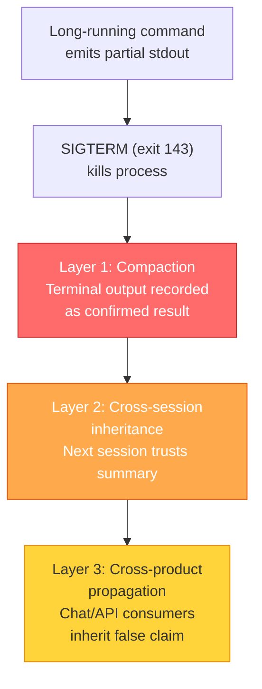
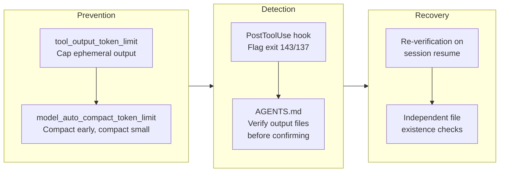

# Compaction as Epistemic Failure: How Coding Agents Fabricate Results from Killed Processes — and How to Defend Your Codex CLI Workflows


---

## The Problem You Did Not Know You Had

Every long-running coding agent session eventually hits its context window ceiling. When it does, the agent compacts — summarising thousands of lines of tool output, command results, and reasoning into a shorter narrative that subsequent turns treat as ground truth. This mechanism is essential for long-horizon work. It is also, as Tamba demonstrates in a July 2026 companion paper, an epistemic trapdoor [^1].

The failure is deceptively simple: a long-running script emits partial output to the terminal, the system kills it with SIGTERM (exit code 143) before it persists any results, and the compaction summary records those ephemeral terminal lines as confirmed outcomes. Downstream sessions inherit the summary, not the raw transcript, and the fabricated confirmation propagates without any mechanism to flag it as unverified [^1].

If you run Codex CLI for multi-step data pipelines, batch API calls, or any workflow where a single command can time out, this failure mode applies to you.

---

## Anatomy of the Failure

### Observation versus Persistence

The root cause is a conflation that Tamba calls the **observation-persistence gap** [^1]. A coding agent has access to two fundamentally different categories of evidence:

- **Observed**: output that appeared in the terminal during execution
- **Persisted**: output written to durable storage and independently verifiable

When a process is killed mid-flight, observed output exists only in the context window. If the agent (or its compaction mechanism) records "iterations A1 and A2 completed successfully" based on terminal lines, but the output file contains zero successful entries and eleven HTTP 400 errors, the summary has fabricated a result [^1].

### The Three-Layer Propagation Chain



**Layer 1 (Compaction)**: the compactor treats terminal output before SIGTERM as equivalent to persisted results. Exit code 143 is not recorded as a disqualifying condition [^1].

**Layer 2 (Cross-session inheritance)**: subsequent sessions receive the summary without metadata distinguishing "summary says X completed" from "X's results exist in the output file." In the documented case, a session on Opus 4.6 inherited a fabricated confirmation from a prior Opus 4.7 session [^1].

**Layer 3 (Cross-product propagation)**: the false claim migrates to other interfaces — chat UIs, API consumers, downstream automations — with no epistemic provenance attached [^1].

---

## Why Memory and Summaries Are Not Enough

This is not a hallucination problem. The agent is not inventing information from its training data. It is faithfully recording what it saw in the terminal — the failure is that "what it saw" and "what actually happened" diverge silently when a process is interrupted.

Tamba draws an analogy to laboratory methodology: the difference between "the instrument displayed a reading" and "the reading was saved to the data logger" [^1]. In a well-run lab, you verify the data logger. In a coding agent session, no such verification step exists by default.

### The Compaction Validation Gap

The broader compaction literature confirms this structural weakness. Chen et al.'s Slipstream framework identifies a fundamental **structural validation gap**: the compactor must condense context but is "fundamentally unaware of precisely what information the agent will need later" [^2]. Errors propagate through "coherent but incorrect behaviour" — the summary reads plausibly, so no alarm fires [^2].

Slipstream's solution — running compaction asynchronously in parallel with continued execution on the original context, then validating the summary against the agent's actual next steps — recovers up to 8.8 percentage points of task accuracy on SWE-bench Verified whilst cutting latency by 39.7% [^2]. The key insight: a compaction summary can only be validated against what the agent actually does next, not in isolation.

### Governance Decay Compounds the Risk

Chen's ConstraintRot benchmark shows that compaction does not just lose operational facts — it also silently erases safety constraints. Across 1,323 episodes and seven model families, violation rates rose from 0% with the policy in full context to 30% after compaction, reaching 59% for some models [^3]. Their Constraint Pinning defence — re-injecting ~47 pinned tokens (less than 0.5% of context) — restores violation to 0% [^3].

The implication for epistemic failure is clear: if compaction can erase "do not delete production databases," it can certainly erase "this process was killed before completion."

---

## How Codex CLI's Architecture Maps to the Problem

Codex CLI's compaction system is configurable, which gives you levers to mitigate this failure — but only if you know where to pull.

### Compaction Threshold Tuning

The `model_auto_compact_token_limit` setting controls when compaction fires [^4]. The default is approximately 200,000 tokens, or 85–90% of the model's context window [^4]. Lower values give the post-compaction cycle more headroom:

```toml
# config.toml — conservative compaction for data-pipeline workflows
model_context_window = 200000
model_auto_compact_token_limit = 160000   # fire at 80%, not 90%
```

Firing compaction earlier means shorter summaries with less accumulated ambiguity. For batch-processing workflows where commands produce large stdout, this reduces the volume of ephemeral output that enters the compaction window [^4].

### Tool Output Token Limits

The `tool_output_token_limit` setting caps the tokens retained from any single tool invocation [^5]. For commands that stream large volumes of incremental output before potentially being killed, this is a critical control:

```toml
# Limit retained tool output to reduce compaction surface area
tool_output_token_limit = 8000
```

Less retained output means less raw material for the compactor to misinterpret as confirmed results [^5].

### The PostToolUse Hook: Your Exit-Code Firewall

This is where Codex CLI's hook system provides the strongest defence. A PostToolUse hook receives the tool's exit code, stdout, and stderr after execution [^6]. You can build an **exit-code verification hook** that flags non-zero exits — particularly exit code 143 (SIGTERM) — before the result enters the agent's reasoning:

```bash
#!/usr/bin/env bash
# hooks/verify-exit-code.sh
# PostToolUse hook: flag killed processes as unverified

# Read hook input from stdin
INPUT=$(cat)
EXIT_CODE=$(echo "$INPUT" | jq -r '.tool_response.exit_code // empty')

if [ "$EXIT_CODE" = "143" ] || [ "$EXIT_CODE" = "137" ]; then
    # SIGTERM (143) or SIGKILL (137) — process was killed
    echo "EPISTEMIC WARNING: Process terminated by signal (exit $EXIT_CODE). " \
         "Any output before termination is UNVERIFIED. " \
         "Check output files before treating results as confirmed." >&2
    exit 2  # Block: replace tool result with this warning
fi

if [ -n "$EXIT_CODE" ] && [ "$EXIT_CODE" != "0" ]; then
    echo "WARNING: Command exited with non-zero status ($EXIT_CODE). " \
         "Results may be incomplete." >&2
    # Exit 0: warn but don't block
    exit 0
fi
```

Configure it in your project's hooks:

```toml
# config.toml
[[hooks.PostToolUse]]
matcher = "^Bash$"

[[hooks.PostToolUse.hooks]]
type = "command"
command = "bash hooks/verify-exit-code.sh"
timeout = 5
statusMessage = "Verifying process completion"
```

When exit code 2 fires from a PostToolUse hook, Codex CLI replaces the tool result the agent sees with your stderr feedback [^6]. The agent now receives "EPISTEMIC WARNING: Process terminated by signal" instead of the partial stdout — breaking the fabrication chain at Layer 1.

### AGENTS.md: Encoding Verification Discipline

Hooks enforce mechanical checks. AGENTS.md encodes the reasoning discipline:

```markdown
## Epistemic Hygiene for Long-Running Commands

- NEVER treat terminal output as confirmation that results were persisted
- After any command that runs longer than 30 seconds, verify output files exist
  and contain expected content before reporting success
- If a command exits with code 143 (SIGTERM) or 137 (SIGKILL), treat ALL
  output from that command as unverified
- When resuming from a compacted session, re-verify any claimed results by
  checking output files directly — do not trust inherited summaries
```

This creates a **belt-and-braces defence**: the PostToolUse hook catches the mechanical case (non-zero exit code), while AGENTS.md guides the model's reasoning for subtler cases where a process exits cleanly but writes incomplete data [^7].

---

## A Defence-in-Depth Configuration

Combining all the levers into a coherent defence:



```toml
# config.toml — epistemic hygiene profile
model_auto_compact_token_limit = 160000
tool_output_token_limit = 8000

[[hooks.PostToolUse]]
matcher = "^Bash$"
[[hooks.PostToolUse.hooks]]
type = "command"
command = "bash .codex/hooks/verify-exit-code.sh"
timeout = 5
statusMessage = "Checking process completion status"
```

For enterprise teams managing fleets via `requirements.toml`, the PostToolUse hook and compaction thresholds can be enforced centrally, preventing individual developers from inadvertently running unprotected long-horizon sessions [^8].

---

## What the Research Tells Us About the Future

Tamba's paper is deliberately modest in scope — four documented instances from a 48-hour workflow, with no statistical claims about fabrication rates across broader populations [^1]. But the structural argument is compelling: any agent that compacts without distinguishing observed from persisted evidence will exhibit this failure mode under the right conditions.

The Slipstream approach of asynchronous trajectory-grounded validation [^2] suggests a path forward: rather than validating compaction summaries in isolation, validate them against what the agent actually does next. If the summary claims "batch job completed" but the agent's next action is "read the output file and find it empty," the validation catches the discrepancy.

For Codex CLI users today, the practical defence is straightforward:

1. **Deploy a PostToolUse exit-code hook** — five minutes of configuration closes the most obvious gap
2. **Encode verification discipline in AGENTS.md** — guide the model to check files, not trust summaries
3. **Lower your compaction threshold** — less context entering compaction means less surface area for epistemic failure
4. **Treat session resumption as a trust boundary** — re-verify inherited claims from prior sessions

The compaction mechanism is not broken. It is doing exactly what it was designed to do: compress context to fit the window. The failure is in treating the compressed output as epistemically equivalent to the original — and that is a failure we can defend against with the tools already available.

---

## Citations

[^1]: Tamba, H. (2026). "Compaction as Epistemic Failure: How Agentic LLM Tools Fabricate Confirmed Results from Killed Processes." arXiv:2607.13071. [https://arxiv.org/abs/2607.13071](https://arxiv.org/abs/2607.13071)

[^2]: Chen, Z., Pan, R., Dai, Y., & Netravali, R. (2026). "Slipstream: Trajectory-Grounded Compaction Validation for Long-Horizon Agents." arXiv:2605.08580. [https://arxiv.org/abs/2605.08580](https://arxiv.org/abs/2605.08580)

[^3]: Chen, S. (2026). "Governance Decay: How Context Compaction Silently Erases Safety Constraints in Long-Horizon LLM Agents." arXiv:2606.22528. [https://arxiv.org/abs/2606.22528](https://arxiv.org/abs/2606.22528)

[^4]: OpenAI. (2026). "Codex CLI Configuration Reference — model_auto_compact_token_limit." [https://developers.openai.com/codex/cli/reference](https://developers.openai.com/codex/cli/reference)

[^5]: OpenAI. (2026). "Codex CLI Configuration Reference — tool_output_token_limit." [https://developers.openai.com/codex/cli/reference](https://developers.openai.com/codex/cli/reference)

[^6]: OpenAI. (2026). "Codex CLI Hooks Documentation — PostToolUse." [https://developers.openai.com/codex/hooks](https://developers.openai.com/codex/hooks)

[^7]: OpenAI. (2026). "AGENTS.md Documentation." [https://developers.openai.com/codex/cli/agents-md](https://developers.openai.com/codex/cli/agents-md)

[^8]: OpenAI. (2026). "Codex CLI Enterprise Configuration — requirements.toml." [https://developers.openai.com/codex/cli/reference](https://developers.openai.com/codex/cli/reference)
