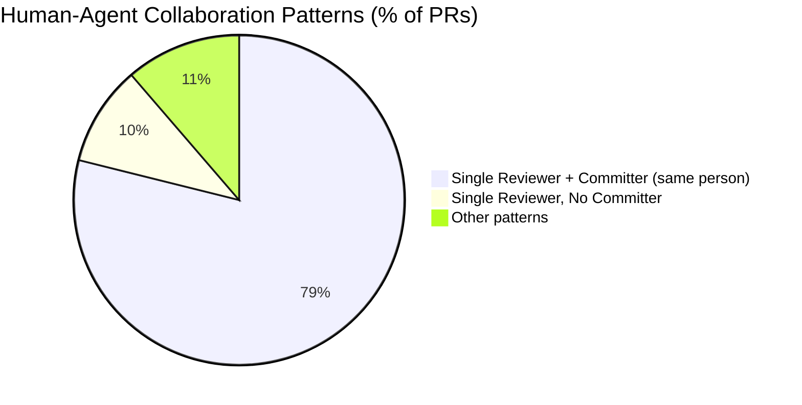
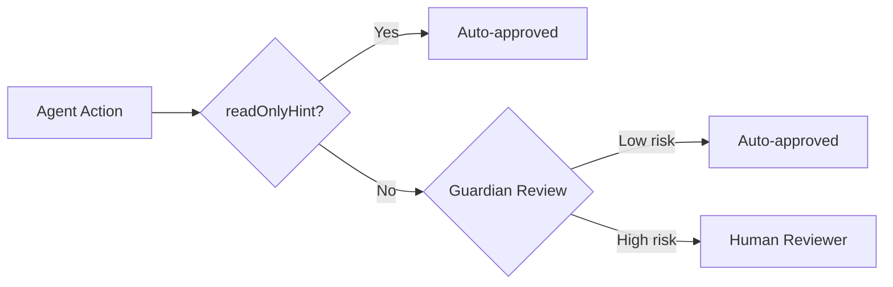

# The Single-Human Oversight Bottleneck: What 25,000 Agentic Pull Requests Reveal About Adoption — and How Codex CLI Teams Can Break Through It


---

A new empirical study from Raida and Hou, published on arXiv on 15 July 2026, analyses **25,264 agentic pull requests** across **2,361 GitHub repositories** and surfaces a pattern that should concern every team betting on agent-assisted development: the overwhelming majority of agentic PRs are overseen by a single human [^1]. Not a pair, not a rotating rota — one person reviewing, committing, and carrying the cognitive load of every agent contribution. For Codex CLI teams scaling beyond initial adoption, this bottleneck is the configuration problem hiding behind the productivity promise.

## The Study: Scale and Scope

Raida and Hou mined the AIDev-pop dataset, filtering for repositories with 100+ stars and analysing a three-month observation window (May–July 2025) [^1]. They stratified projects by contributor count:

| Project size | Repositories | Mean agentic PRs | Median agentic PRs |
|---|---|---|---|
| Small (1–5 contributors) | 343 | 50.2 | — |
| Medium (6–15 contributors) | 456 | 5.6 | — |
| Large (16+ contributors) | 1,562 | 6.7 | 1–2 |

The median repository generates just **one to two agentic PRs** in a three-month period [^1]. Small projects generate disproportionately more agent output per repository, but the participation ratio — the fraction of contributors engaging with agent-generated PRs — tells a starker story.

## The Participation Gap

**42.27%** of projects had participation ratios below 5%, and **70.18%** fell below 20% [^1]. In plain terms: in the majority of repositories using agentic tools, fewer than one in five contributors touch the agent's output at all. Kruskal-Wallis testing confirmed these differences across project sizes are statistically significant (H=1,211.79, p<0.001, η²=0.6157) [^1].

This is not a tooling problem. It is an organisational one. When only a handful of contributors interact with agent output, the team has not adopted an agent — a single person has, and the rest of the team inherits the consequences.

## The Five Collaboration Models

The study identifies five distinct human-agent collaboration patterns [^1]:



The dominant pattern — a single developer who both reviews and commits agent output — accounts for **78.9%** of all agentic PRs [^1]. Adding the "Single Reviewer, No Committer" pattern (where agent code is accepted without any modification) brings the single-human figure to **88.7%** [^1].

Multi-developer review, formal separation between reviewer and committer, and team-based oversight of agent output all remain marginal. This is the single-human oversight bottleneck.

## Why the Bottleneck Matters

The finding parallels Microsoft's internal study of their early 2026 rollout of Claude Code and GitHub Copilot CLI, where adopters merged roughly **24% more pull requests** than non-adopters [^2]. If that output flows through one person's review queue, the productivity gain becomes that person's burden. The Codex App's own usage data shows that more than **10% of users manage three or more concurrent agents each week** [^3] — a workload that compounds the review bottleneck when the team structure does not distribute oversight.

The governance implications are equally sharp. Davis et al.'s twelve-week case study of governable agentic software engineering found that agentic velocity surfaces failure classes — hallucinated validation, fake-passing tests, budget-pressure shortcuts — visible only during agentic work [^4]. A single reviewer is far more likely to miss these failure classes under throughput pressure than a team with distributed review responsibilities.

## Breaking the Bottleneck with Codex CLI

Codex CLI v0.144.5 [^5] ships with the mechanical infrastructure needed to distribute oversight beyond a single human. The challenge is configuration, not capability.

### 1. Guardian Auto-Review as the First Reviewer

Guardian (`approvals_reviewer = "auto_review"` in `config.toml`) acts as an independent LLM-based reviewer that evaluates every approval-eligible action before it reaches a human [^6]. It assigns risk levels (low, medium, high, critical), auto-approving low-risk actions and escalating anything above the configured threshold [^6].

```toml
# config.toml — enable Guardian as first-pass reviewer
approvals_reviewer = "auto_review"

# Enterprise override in requirements.toml
[auto_review]
guardian_policy_config = "team-policy-v2"
allowed_approvals_reviewers = ["auto_review"]
```

For teams stuck in the single-reviewer pattern, Guardian transforms the workflow from "one person reviews everything" to "one person reviews what Guardian escalates." In the Raida and Hou dataset, the 78.9% of PRs flowing through a single reviewer could be pre-filtered by Guardian, leaving the human to focus on genuinely novel or high-risk changes.

### 2. AGENTS.md as Distributed Review Policy

The single-reviewer pattern persists partly because review expectations are implicit. AGENTS.md makes them explicit and enforceable:

```markdown
# AGENTS.md — Review Guidelines section

## Review guidelines

- Every PR modifying `src/auth/` requires approval from a second reviewer
- All database migration files require `@db-team` review
- No PR merging without passing `make lint && make test`
- Agent-generated test files must include edge-case coverage
  for null inputs and boundary values
- Flag any `eval()` or `exec()` usage as P0 severity
```

Codex CLI discovers AGENTS.md files along the directory path from your git root to the current working directory, with closer files taking precedence [^7]. This means teams can encode review policies at the monorepo root and override them per service — distributing review responsibility structurally rather than relying on one person's vigilance.

### 3. The Writes Approval Mode for Graduated Trust

Codex CLI v0.144.0 introduced the `writes` approval mode, which allows declared read-only actions to proceed automatically while prompting for any write operation [^8]. For teams where the single reviewer is overwhelmed by the volume of agent actions, this mode provides mechanical separation:



Combined with MCP tool annotations (`readOnlyHint`, `destructiveHint`, `idempotentHint`) [^9], this creates a three-tier approval pipeline that ensures humans only see the actions that genuinely require judgment.

### 4. Distributing Oversight Across the Team

The Raida and Hou data shows that multi-developer review of agent output is rare [^1]. Codex CLI's configuration hierarchy offers a path to change this:

```toml
# Team-level config.toml
[features.network_proxy]
enabled = true
domains = { "api.openai.com" = "allow", "*.internal.corp" = "allow" }

# Sandbox constrains blast radius
sandbox_mode = "workspace-write"
approval_policy = "on-request"
```

By combining sandbox constraints (limiting what the agent *can* do) with approval policies (controlling what it *may* do without asking), teams can grant multiple developers the confidence to review agent output independently. The reviewer does not need to audit the agent's entire capability space — the sandbox has already constrained it.

### 5. OpenTelemetry for Review Load Visibility

You cannot distribute what you cannot measure. Codex CLI's opt-in OpenTelemetry integration [^6] exports conversation starts, API requests, tool decisions, and tool results. Piping these into Datadog, Grafana, or any OTLP-compatible backend lets teams visualise:

- Which reviewers are handling agent output
- How many approval escalations each person receives
- Whether Guardian is filtering effectively or rubber-stamping

```toml
[otel]
environment = "production"
exporter = "otlp"
log_user_prompt = false
```

This telemetry transforms the single-reviewer bottleneck from an invisible cultural pattern into a measurable metric that teams can act on.

## The Productivity Paradox

Raida and Hou note that only **25 projects (1%)** exceeded the industry benchmark of 36 PRs per developer per three-month period [^1]. The 99% falling short are not necessarily failing — the median of one to two agentic PRs suggests most teams are still experimenting. But for the small projects averaging 50.2 agentic PRs per repository, the single-reviewer pattern is already under strain.

The Microsoft study found that social networks drive adoption — peers, skip-level peers, and direct managers using CLI agents all predicted whether an engineer tried one [^2]. If adoption spreads socially but oversight remains individual, teams will hit the bottleneck precisely when agent usage becomes widespread enough to matter.

## Practical Recommendations

1. **Audit your review pattern.** If one person reviews >80% of agent-generated PRs, you have the bottleneck.
2. **Enable Guardian** as the first reviewer. Configure `approvals_reviewer = "auto_review"` at the team level.
3. **Encode review policy in AGENTS.md**, not in one person's head. Use the `## Review guidelines` section.
4. **Use the `writes` approval mode** (v0.144.0+) to separate read-only agent actions from those requiring human judgment.
5. **Deploy OpenTelemetry** to measure review load distribution and Guardian effectiveness.
6. **Rotate the reviewer role.** The study shows multi-developer review is rare [^1] — make it deliberate.

## Conclusion

The Raida and Hou study provides the first large-scale evidence that agentic coding tool adoption is not primarily a capability problem — it is an oversight distribution problem. Nearly nine in ten agentic PRs flow through a single human. Codex CLI's Guardian auto-review, cascading AGENTS.md policies, graduated approval modes, and telemetry infrastructure provide the mechanical tooling to break through this bottleneck. The remaining challenge is organisational: teams must choose to distribute review responsibility rather than letting it accumulate on whoever adopted the agent first.

---

## Citations

[^1]: Raida, M. N. and Hou, D. (2026) "Early Adoption of Agentic Coding Tools by GitHub Projects." arXiv:2607.14037, 15 July 2026. [https://arxiv.org/abs/2607.14037](https://arxiv.org/abs/2607.14037)

[^2]: arXiv:2607.01418 (2026) "Adoption and Impact of Command-Line AI Coding Agents: A Study of Microsoft's Early 2026 Rollout of Claude Code and GitHub Copilot CLI." [https://arxiv.org/abs/2607.01418](https://arxiv.org/abs/2607.01418)

[^3]: Johnston, D. and Holtz, D. (2026) "The Shift to Agentic AI: Evidence from Codex." arXiv:2606.26959. [https://arxiv.org/abs/2606.26959](https://arxiv.org/abs/2606.26959)

[^4]: Davis et al. (2026) "Cheap Code, Costly Judgment: A Case Study on Governable Agentic Software Engineering." arXiv:2607.01087. [https://arxiv.org/abs/2607.01087](https://arxiv.org/abs/2607.01087)

[^5]: OpenAI (2026) "Codex CLI Releases." GitHub. [https://github.com/openai/codex/releases](https://github.com/openai/codex/releases)

[^6]: OpenAI (2026) "Agent Approvals & Security." Codex CLI Documentation. [https://developers.openai.com/codex/agent-approvals-security](https://developers.openai.com/codex/agent-approvals-security)

[^7]: OpenAI (2026) "Best Practices." Codex CLI Documentation. [https://developers.openai.com/codex/learn/best-practices](https://developers.openai.com/codex/learn/best-practices)

[^8]: OpenAI (2026) "Add writes app approval mode." GitHub PR #30482. [https://github.com/openai/codex/pull/30482](https://github.com/openai/codex/pull/30482)

[^9]: OpenAI (2026) "Codex CLI Changelog — v0.144.0." [https://developers.openai.com/codex/changelog](https://developers.openai.com/codex/changelog)
