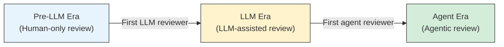
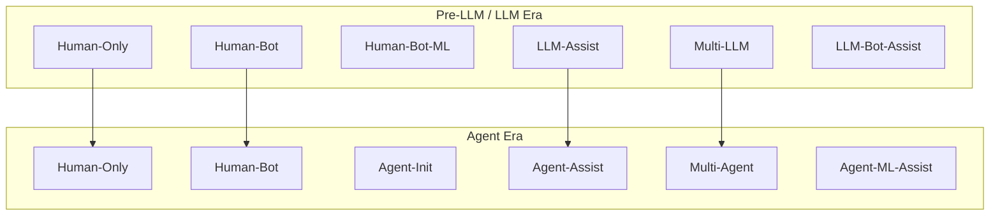

# From Human-Centric to Agentic Code Review: What 1.02 Million Pull Requests Reveal About the Efficiency–Quality Paradox — and How to Configure Codex CLI's Guardian to Avoid the Traps


---

AI-assisted code review is no longer a novelty — it is the default on a growing share of GitHub projects. But does faster review mean better review? A large-scale empirical study of 1.02 million pull requests across 207 GitHub projects says *no*, at least not automatically [^1]. The findings map directly onto Codex CLI's Guardian auto-review architecture and offer concrete configuration guidance for teams adopting agentic review workflows.

## The Study: Three Eras of Code Review

Zhong, Noei, Adams, and Zou tracked every reviewed PR across 207 actively maintained GitHub projects from May 2022 to February 2026 [^1]. They partitioned each project's history into three eras defined by the first appearance of AI reviewers:

- **Pre-LLM Era** — all reviewed PRs before any generative AI reviewer participates.
- **LLM Era** — begins with the first LLM-based reviewer involvement (e.g., ChatGPT-powered bots).
- **Agent Era** — begins with the first AI agent reviewer (agentic systems that plan, retrieve context, and invoke tools).



The researchers validated the "agentic" classification by sampling 384 agent-era PRs at a 95% confidence level: 93.75% (360/384) exhibited genuine agentic behaviours — planning, context retrieval, and tool invocation [^1].

## Three Adoption Practices, Three Outcomes

Not every project adopted AI reviewers the same way. K-means clustering on adoption timelines produced three distinct practices:

| Practice | Share of Projects | LLM-era AI Involvement | Agent-era AI Involvement |
|---|---|---|---|
| Gradual AI Adoption | 46% | 8% of PRs | 36% of PRs |
| Rapid LLM Adoption | 22% | 91% of PRs | 93% of PRs |
| Rapid AI Agent Adoption | 32% | 19% of PRs | 76% of PRs |

The efficiency payoff varied dramatically:

- **Gradual Adoption**: −2.5 days/KLOC improvement from pre-LLM to agent era.
- **Rapid Agent Adoption**: −4.5 days/KLOC improvement — the strongest gain.
- **Rapid LLM Adoption**: essentially flat (+0.6 to −0.1 days/KLOC).

The critical finding: rapid LLM adoption — blanketing every PR with an LLM reviewer — produced **no efficiency gain** and an **8 percentage point increase in review smells** [^1].

## The Six Review Smells

The study tracked six review pathologies across all three eras:

1. **Sleeping Review** — PR decision time exceeds 2 days.
2. **Review Buddies** — same reviewer handles ≥50% of an author's PRs.
3. **Large Changeset** — code churn exceeds 500 lines.
4. **Ping-Pong** — more than 3 change-request iterations.
5. **Missing Context** — empty PR description or no linked issues.
6. **Lack of Review** — no reviewer participation (excluding author).

The baseline smell prevalence was already high: 81–84% of PRs contained at least one smell even in the pre-LLM era [^1]. AI involvement made one smell dramatically worse.

### Review Buddies: The Dominant Failure Mode

Review Buddies — the concentration of reviews in a single reviewer — jumped from a pre-LLM baseline of 45.9–47.8% to as high as 72% in the rapid LLM adoption practice (+26 percentage points), with an additional +23.2 percentage points in the agent era [^1]. When a single AI bot handles every PR, you get consistency but lose the diversity of perspective that code review exists to provide.

The pattern extended to agent-init and multi-agent reviews: AI agents posted code summaries in 75–95% of cases, with humans responding with a single comment before merge [^1]. This is precisely the "rubber-stamping" failure mode that teams should guard against.

## Ten Collaboration Patterns

The researchers identified ten distinct human-AI collaboration patterns using Markov chain clustering:



The efficiency rankings (Scott-Knott ESD test) revealed a counterintuitive result: **Human-Only**, **Multi-LLM**, and **Multi-Agent** patterns all achieved R1 (top) rank for efficiency, whilst **LLM-Assist** and **Agent-Assist** patterns — where a single AI reviewer assists a human — fell to R2–R3 [^1]. Adding one AI reviewer to a human review produced *slower* reviews than either full human review or full multi-agent review.

No collaboration pattern consistently outperformed human-only in *both* efficiency and quality. Smell prevalence was 69–76% for human-only reviews versus 78–94% for AI-involved reviews [^1].

## What This Means for Codex CLI Configuration

These findings translate directly into Codex CLI's Guardian auto-review architecture. The Guardian is a structurally independent reviewer subagent that sits between the coding agent and boundary-crossing operations [^2]. Its configuration determines whether your team falls into the "rapid LLM adoption" trap or achieves the efficiency gains of the "gradual" and "rapid agent" practices.

### 1. Avoid the Single-Reviewer Bottleneck

The study's Review Buddies finding — review concentration producing worse quality — maps to Codex CLI's `approval_policy` configuration. Relying solely on `auto_review` without human oversight recreates the single-reviewer antipattern at machine speed.

```toml
# config.toml — graduated trust, not blanket delegation
[auto_review]
# Custom policy that escalates novel patterns to humans
policy = """
Approve routine operations (file reads, standard test runs, linting).
Escalate to human: new dependency additions, security-sensitive file
modifications, configuration changes, and any operation touching
production infrastructure paths.
"""
```

The Guardian's circuit-breaker logic — stopping after 3 consecutive denials or 10 denials in 50 reviews — provides a mechanical safeguard against runaway rejection loops [^2]. But the more important configuration is the *policy itself*: which operations deserve human eyes.

### 2. Use Graduated Approval Policies

The study found that gradual adoption (46% of projects) produced the best quality outcomes. In Codex CLI, this maps to granular `approval_policy` settings rather than a binary auto/manual switch [^3]:

```toml
# Graduated trust per operation type
approval_policy = "on-request"

# Combine with sandbox constraints
sandbox = "workspace-write"

# Network proxy limits blast radius
[network_proxy]
allow = ["api.github.com", "registry.npmjs.org"]
```

The `on-request` policy surfaces each boundary-crossing operation for review — by Guardian first, then escalating to the human when the policy dictates. This mirrors the gradual adoption practice that the study found most effective.

### 3. Encode Review Diversity in AGENTS.md

The Multi-Agent pattern achieved R1 efficiency *because* it introduced diverse review perspectives. Codex CLI's AGENTS.md layered discovery provides the mechanism [^4]:

```markdown
<!-- AGENTS.md at repo root -->
## Code Review Protocol

- Every PR modifying security-critical paths (`auth/`, `crypto/`, `config/`)
  MUST receive human review regardless of Guardian approval.
- Guardian auto-review handles: formatting, test additions, documentation
  updates, and dependency version bumps.
- Changes spanning more than 3 packages require a second human reviewer.
```

This encodes the study's finding that collaboration pattern — not just reviewer identity — determines both efficiency and quality.

### 4. Monitor for Review Smells via PostToolUse Hooks

The six review smells are detectable programmatically. Codex CLI's hook system can surface them before they compound [^5]:

```toml
# requirements.toml — managed hooks for review smell detection
[[hooks]]
event = "PostToolUse"
command = "python3 scripts/review-smell-audit.py"
timeout_ms = 5000
```

A PostToolUse hook can check whether the same Guardian instance has approved the last *N* consecutive operations without escalation (Review Buddies smell), whether the changeset exceeds 500 lines (Large Changeset smell), or whether the PR description is empty (Missing Context smell). The hook can then force human escalation.

### 5. Configure Enterprise Fleet Policy

For organisations managing multiple repositories, the study's finding that adoption *practice* matters more than raw AI capability translates to fleet-level policy via `requirements.toml` [^6]:

```toml
# requirements.toml — enterprise-managed
[auto_review]
# Organisation-wide policy overrides local settings
guardian_policy_config = "https://internal.example.com/review-policy.md"

# Prevent individual repos from disabling human escalation
[approval_policy]
min_human_review_ratio = 0.25
```

The `guardian_policy_config` key in managed requirements takes precedence over any local `[auto_review].policy` configuration, ensuring that fleet-wide review quality standards cannot be overridden by individual developers [^2].

## The Efficiency–Quality Paradox in Numbers

The paper's regression models (36 total, VIF < 5 across all variables) reveal that once AI agents join the review process, collaboration pattern becomes the **strongest explanatory factor** for efficiency — surpassing traditional factors like author experience, PR type, and changeset size [^1].

But author experience still matters: experienced authors correlated with 24% fewer Sleeping Reviews. The implication for Codex CLI: invest in `AGENTS.md` quality (the "experience" your agent brings) rather than simply enabling auto-review and walking away.

The Multi-Agent pattern produced a −50% efficiency impact in the gradual adoption practice [^1], but also a +200–605% increase in Review Buddies smell. The paradox is structural: the same mechanism that accelerates review (consistent automated decisions) undermines the diversity that makes review valuable.

## Practical Configuration Checklist

For teams deploying Codex CLI's Guardian auto-review, the study suggests:

| Study Finding | Codex CLI Configuration |
|---|---|
| Gradual adoption outperforms blanket deployment | Start with `approval_policy = "on-request"`, not `"never"` |
| Review Buddies is the dominant smell | Encode human escalation rules in `[auto_review].policy` |
| Multi-Agent achieves top efficiency | Use Guardian for routine ops; require human for novel patterns |
| No pattern beats human-only on quality | Keep `min_human_review_ratio` above zero in fleet policy |
| Collaboration pattern > individual reviewer | Define review protocols in AGENTS.md, not just tool config |
| Author experience reduces Sleeping Reviews | Invest in AGENTS.md instruction quality, not just automation |

## What the Study Does Not Cover

The study window ends in February 2026, before Codex CLI v0.144.2 restored the Guardian auto-review policy and before v0.144.5 improved dangerous-command detection [^7]. The circuit-breaker logic, escalation thresholds, and purpose-built `codex-auto-review` model are all post-study developments. Whether these architectural refinements shift the efficiency–quality balance remains an open question.

⚠️ The study also does not distinguish between different AI reviewer implementations — all agent-era reviewers are treated as a single category. Codex CLI's Guardian operates under a fundamentally different trust model (structurally independent, sandbox-inheriting, policy-constrained) than many of the repository-level bots in the study's dataset.

## Citations

[^1]: Zhong, S., Noei, S., Adams, B., and Zou, Y. "From Human-Centric to Agentic Code Review: The Impact of Different Generations of Generative AI Technology on Review Quality." arXiv:2607.13196, July 14, 2026. [https://arxiv.org/abs/2607.13196](https://arxiv.org/abs/2607.13196)

[^2]: OpenAI. "Auto-review — Codex CLI Documentation." [https://learn.chatgpt.com/docs/sandboxing/auto-review](https://learn.chatgpt.com/docs/sandboxing/auto-review)

[^3]: OpenAI. "Codex CLI Configuration — Approval Policies." [https://learn.chatgpt.com/docs/cli](https://learn.chatgpt.com/docs/cli)

[^4]: OpenAI. "AGENTS.md — Codex CLI Documentation." [https://learn.chatgpt.com/docs/agents-md](https://learn.chatgpt.com/docs/agents-md)

[^5]: OpenAI. "Hooks — Codex CLI Documentation." [https://learn.chatgpt.com/docs/hooks](https://learn.chatgpt.com/docs/hooks)

[^6]: OpenAI. "Managed Requirements — Codex CLI Documentation." [https://learn.chatgpt.com/docs/managed-requirements](https://learn.chatgpt.com/docs/managed-requirements)

[^7]: OpenAI. "Codex CLI Changelog — v0.144.5, July 16, 2026." [https://github.com/openai/codex/releases/tag/rust-v0.144.5](https://github.com/openai/codex/releases/tag/rust-v0.144.5)
