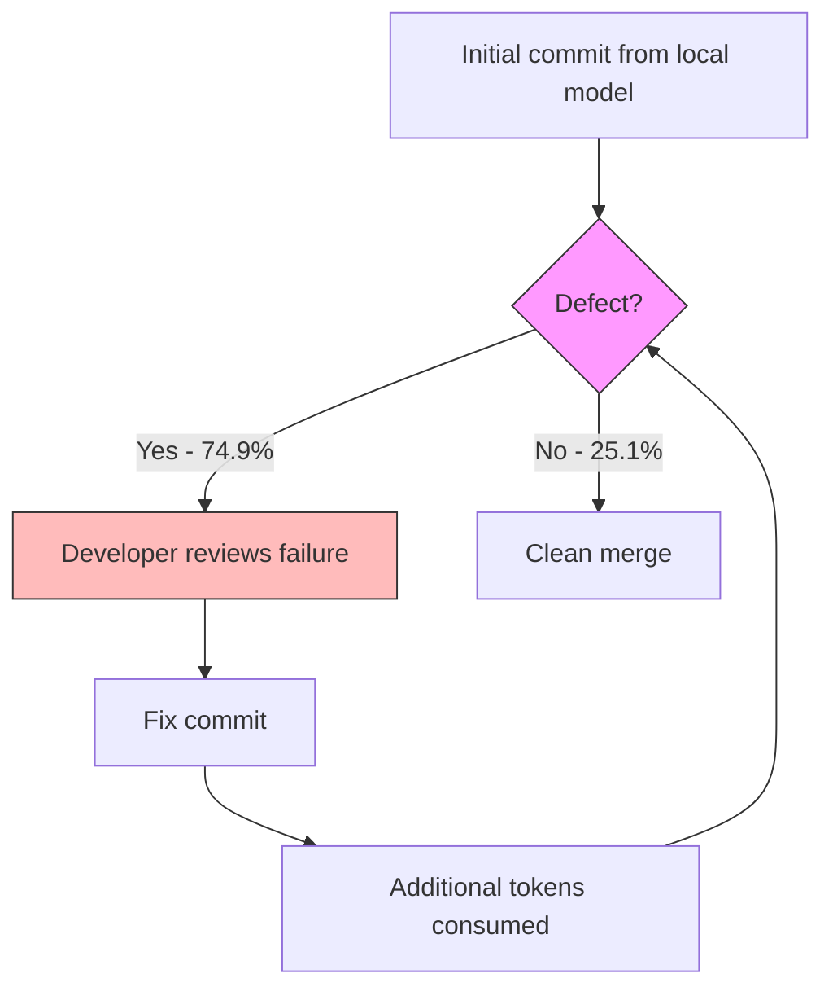

# Inference Economics of Enterprise Coding Agents: Cloud vs On-Premise LLMs and What the Numbers Mean for Codex CLI Deployments


---

## The Cost–Quality Tradeoff Nobody Wants to Measure

Every engineering leader deploying coding agents faces the same question: run against a frontier API and pay per token, or host quantised open-weights models on-premise and amortise hardware? Most teams make the decision on vibes. A longitudinal case study published on 13 July 2026 by Peng, Lin, and Lee — *Inference Economics of Enterprise Coding Agents* — finally puts controlled numbers on both sides of the ledger [^1].

The headline finding is counterintuitive: **prompt caching made the cloud option cheaper per token than self-hosted inference**, yet the on-premise configuration still saved 40.1% on total cost of ownership under shared GPU allocation. The catch? On-premise commits were 2.6–4.9 times more likely to be repairs, and developer cadence slowed measurably [^1].

This article unpacks the study, maps its findings to Codex CLI's provider architecture, and shows how teams can configure multi-provider profiles that capture the cost benefits of local inference without absorbing its quality penalties.

---

## What the Study Measured

Peng et al. compared two configurations over two consecutive 28-day periods in a Taiwanese enterprise environment [^1]:

| Dimension | Cloud (API) | On-Premise |
|---|---|---|
| **Model** | Claude Opus 4.7/4.8 via Claude Code | GLM-5.1/5.2 (Opencode), NVFP4 quantised |
| **Hardware** | — | NVIDIA Blackwell GPUs |
| **Effective cost/1M tokens** | \$0.57 (cached) | \$2.83 (amortised) |
| **Fix Commit Ratio** | 45.9% | 74.9% |
| **Defect odds ratio** | 1× (baseline) | 2.6–4.9× per difficulty tier |
| **TCO (shared GPU)** | Baseline | −40.1% |
| **TCO (dedicated GPU)** | Baseline | +43.8% |

The Fix Commit Ratio measures the proportion of commits that exist solely to repair a previous commit's defect. A ratio of 74.9% means three out of every four on-premise commits were fixing earlier mistakes [^1].

### Why Cloud Was Cheaper Per Token

The study recorded a **99.3% prompt-cache hit rate** on the API path [^1]. OpenAI's own documentation confirms that cached input tokens are billed at roughly 10% of the uncached rate — for example, 6.25 credits per million tokens versus 62.50 uncached for GPT-5.4 [^2]. Codex CLI's agent loop architecture naturally maximises cache hits because each turn extends the same conversation prefix [^3].

For the on-premise path, the \$2.83 per million tokens includes amortised GPU capital, power, cooling, and ops labour — costs that vanish from an API invoice but exist nonetheless [^1].

### Why On-Premise Was Cheaper Overall (Sometimes)

When GPUs were shared across multiple workloads (inference, training, batch jobs), the fixed hardware cost was distributed, producing a 40.1% TCO saving. When dedicated to coding-agent inference alone, utilisation dropped and TCO rose 43.8% above the cloud baseline [^1]. The lesson: on-premise economics only work when GPU utilisation is genuinely high.

---

## The Quality Gap Is the Hidden Cost

The defect multiplier is the study's most consequential finding. Within every difficulty tier — from routine refactors to complex feature implementations — on-premise commits were 2.6 to 4.9 times more likely to require a follow-up fix [^1].

This creates a compounding cost loop:



Each repair cycle burns additional tokens, developer attention, and calendar time. The study found that commit cadence — the rate at which developers ship clean, forward-progress commits — declined measurably under the on-premise configuration [^1]. This developer-experience penalty rarely appears in TCO spreadsheets but dominates real-world productivity.

---

## Mapping to Codex CLI's Provider Architecture

Codex CLI's `config.toml` already supports the multi-provider topology needed to exploit both configurations. The key abstraction is the **model provider** block [^4]:

```toml
# Cloud frontier provider (default)
[model_providers.cloud]
name = "OpenAI API"
base_url = "https://api.openai.com/v1"
env_key = "OPENAI_API_KEY"
wire_api = "responses"

# On-premise open-weights provider
[model_providers.local]
name = "Self-hosted GLM-5.2"
base_url = "http://inference.internal:8080/v1"
env_key = "LOCAL_API_KEY"
wire_api = "responses"
```

Each provider defines its own base URL, authentication method, and wire protocol. The `wire_api = "responses"` setting is now required; Chat Completions support is deprecated and will be removed [^4].

### Profile-Based Model Routing

Named profiles let teams switch between providers without editing the base configuration. Create `~/.codex/local.config.toml`:

```toml
model = "glm-5.2-coder"
model_provider = "local"
```

Then invoke with:

```bash
codex --profile local "Refactor the payment module"
```

For the default cloud path, no profile override is needed [^4].

### Enterprise Authentication

On-premise deployments behind corporate identity providers can use command-based token fetching rather than static environment variables [^4]:

```toml
[model_providers.local.auth]
command = "/usr/local/bin/fetch-inference-token"
args = ["--audience", "codex-local"]
timeout_ms = 5000
refresh_interval_ms = 300000
```

The auth command receives no stdin and must print the bearer token to stdout [^4].

---

## A Practical Hybrid Strategy

The study's numbers suggest a clear division of labour: use frontier API models for tasks where defect cost is high, and route low-risk, high-volume work to local models where the quality gap is tolerable.

### Task-Based Routing with AGENTS.md

Encode routing policy in your repository's `AGENTS.md` so that Codex CLI respects it across sessions [^5]:

```markdown
## Model Routing Policy

- **Architecture decisions, security-sensitive code, and public API surfaces:**
  Use the default cloud provider. Do not switch to local profiles.
- **Test generation, documentation updates, and internal tooling:**
  Use `--profile local` when available.
- **Code review and refactoring:**
  Use cloud provider. The 2.6–4.9× defect multiplier on local models
  makes refactoring with local inference a false economy.
```

### Rollout Token Budgets

Codex CLI's configurable rollout token budgets track usage across agent threads, provide remaining-budget reminders, and abort turns when exhausted [^6]. Combined with profile-based routing, teams can set separate budgets per provider:

```toml
# Base config: cloud budget
rollout_budget = 500000

# local.config.toml: higher budget for cheaper local inference
rollout_budget = 2000000
```

This prevents runaway spend on the cloud path whilst allowing longer sessions on cheaper local inference [^6].

### Prompt Caching Awareness

The study's 99.3% cache hit rate was achieved with Claude Code's conversation architecture [^1]. Codex CLI achieves similar rates through its agent loop, where each turn extends the same prefix [^3]. When routing to on-premise providers, ensure your inference server supports prefix caching — vLLM and TensorRT-LLM both offer this, but not all serving frameworks do. Without caching, the per-token cost advantage of local inference narrows or vanishes entirely.

---

## GLM-5.2: The Open-Weights Contender

The study used GLM-5.1 and 5.2 from Zhipu AI as its on-premise models. GLM-5.2, released on 13 June 2026, is a 744-billion-parameter Mixture-of-Experts model under the MIT licence [^7]. Key characteristics for coding-agent deployment:

- **One-million-token context window** with selectable High/Max reasoning modes [^7]
- **SWE-bench Verified coverage of 77.8%** on the earlier GLM-5, competitive with frontier closed models at time of release [^7]
- **OpenAI-compatible function-calling format**, allowing integration with Codex CLI's `wire_api = "responses"` endpoint via a translating gateway [^4][^7]
- **NVFP4 quantisation** on Blackwell hardware, as used in the study, reduces memory footprint but contributes to the observed quality degradation [^1]

Teams considering GLM-5.2 for on-premise coding agents should note that the study's defect multiplier was measured on quantised weights. Full-precision inference may narrow the quality gap but at higher hardware cost [^1].

---

## When On-Premise Makes Sense

The study does not argue that on-premise is universally wrong. Three scenarios favour self-hosted inference:

1. **Data residency requirements.** Regulated industries that cannot send source code to external APIs have no cloud option. Codex CLI supports data-residency endpoints (`base_url = "https://eu.api.openai.com/v1"`) for OpenAI's own regional offerings [^4], but some jurisdictions require fully air-gapped deployments.

2. **Shared GPU infrastructure.** The 40.1% TCO saving materialised only under shared allocation [^1]. If your organisation already runs training jobs, batch inference, or other GPU workloads, adding coding-agent inference to the same cluster amortises fixed costs effectively.

3. **High-volume, low-stakes tasks.** Test generation, boilerplate scaffolding, and documentation — tasks where a 74.9% Fix Commit Ratio is tolerable because repairs are cheap and fast [^1].

---

## What to Measure in Your Own Deployment

The study provides a measurement framework worth replicating internally:

| Metric | How to Capture in Codex CLI |
|---|---|
| **Fix Commit Ratio** | Parse git log for commits whose message matches fix/repair patterns within N commits of a Codex-authored commit |
| **Effective cost per 1M tokens** | Export from OpenAI usage dashboard or local inference server metrics |
| **Cache hit rate** | Available in Codex CLI's usage summary; for local providers, check vLLM's `/metrics` endpoint |
| **Commit cadence** | Commits per developer per day, filtered to Codex-assisted sessions |
| **Defect escape rate** | Post-merge bug reports traced to agent-authored code |

⚠️ The study's sample covers a single enterprise in Taiwan over 56 days. Generalisation to other team sizes, codebases, and model versions requires local validation.

---

## Key Takeaways

1. **Prompt caching inverts the naive cost comparison.** At a 99.3% hit rate, cloud API inference can be cheaper per token than amortised on-premise hardware.
2. **The quality gap is real and multiplicative.** On-premise quantised models produced 2.6–4.9× more defect-fixing commits across all difficulty tiers.
3. **TCO depends on utilisation.** Shared GPU allocation saved 40.1%; dedicated allocation cost 43.8% more than cloud.
4. **Codex CLI's provider profiles enable hybrid routing.** Use `model_provider` and named profiles to direct high-stakes work to frontier APIs and volume work to local inference.
5. **Measure Fix Commit Ratio, not just token cost.** The cheapest token is the one you never spend on a repair cycle.

---

## Citations

[^1]: Peng, S.-W., Lin, Y.-H., & Lee, Y.-P. (2026). *Inference Economics of Enterprise Coding Agents: A Case Study of Cloud vs. On-Premise LLMs*. arXiv:2607.13080. [https://arxiv.org/abs/2607.13080](https://arxiv.org/abs/2607.13080)

[^2]: OpenAI. (2026). *Codex CLI pricing and token rates*. [https://codex.danielvaughan.com/2026/04/10/codex-cli-complete-pricing-guide-subscription-tokens-cost-optimization/](https://codex.danielvaughan.com/2026/04/10/codex-cli-complete-pricing-guide-subscription-tokens-cost-optimization/)

[^3]: OpenAI. (2026). *Prompt Caching in Codex CLI: How the Agent Loop Stays Linear*. [https://codex.danielvaughan.com/2026/04/21/codex-cli-prompt-caching-maximise-cache-hits-cost-reduction/](https://codex.danielvaughan.com/2026/04/21/codex-cli-prompt-caching-maximise-cache-hits-cost-reduction/)

[^4]: OpenAI. (2026). *Codex CLI Advanced Configuration*. [https://learn.chatgpt.com/docs/config-file/config-advanced](https://learn.chatgpt.com/docs/config-file/config-advanced)

[^5]: OpenAI. (2026). *Codex CLI AGENTS.md documentation*. [https://learn.chatgpt.com/docs/codex-cli/agents-md](https://learn.chatgpt.com/docs/codex-cli/agents-md)

[^6]: OpenAI. (2026). *Codex CLI changelog — rollout token budgets*. [https://developers.openai.com/codex/changelog](https://developers.openai.com/codex/changelog)

[^7]: Zhipu AI. (2026). *GLM-5.2: 744B MoE open-source model*. [https://www.alphamatch.ai/blog/glm-5-2-open-source-ai-launch-2026](https://www.alphamatch.ai/blog/glm-5-2-open-source-ai-launch-2026)
