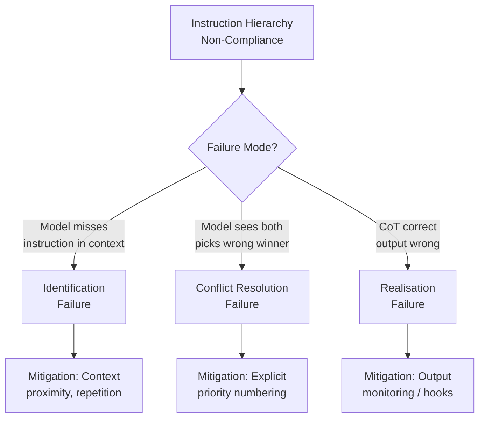
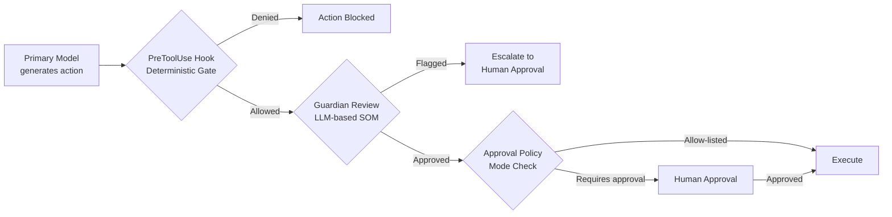

# Where Instruction Hierarchy Breaks: What Reasoning Model Failures Mean for Codex CLI's Defence Stack


---

Instruction hierarchy (IH) is the foundational assumption behind every coding agent's security model: system-level instructions outrank user messages, which outrank tool outputs. If the model reliably follows that hierarchy, injected instructions from untrusted code, web results, or repository files cannot override developer-set policy. If it does not, every downstream defence — from approval modes to sandbox constraints — sits on shaky ground.

Kariyappa and Suh's recent diagnostic study [^1] exposes exactly where that assumption fails, why reasoning models are not immune, and — crucially — which failure modes training-free self-monitoring can catch. For Codex CLI operators, the practical question is clear: given that instruction hierarchy is not watertight, how do you layer mechanical enforcement on top of probabilistic compliance?

## The Three Ways Instruction Hierarchy Fails

The study decomposes IH non-compliance into three mutually exclusive failure categories [^1]:

1. **Instruction Identification Failure** — the model's reasoning trace omits or misstates an instruction that belongs to the active set. The instruction is present in context but the model simply does not retrieve it.

2. **Conflict Resolution Failure** — the model identifies the conflicting instructions correctly but computes the wrong precedence. It knows the system says "never delete production data" and the user says "clean up the database", but picks the wrong winner.

3. **Response Realisation Failure** — the reasoning trace identifies conflicts and resolves them correctly, but the final response violates the hierarchy anyway. The model's chain-of-thought is right; its output is wrong.

This decomposition matters because each failure mode has a different mitigation strategy. Identification failures need better retrieval; conflict resolution failures need explicit precedence rules; realisation failures need output monitoring.



## The Numbers: Context Length Is the Enemy

The study evaluated Gemma-4-31B-IT, Qwen3.6-35B-A3B, and Claude Sonnet 4.6 across modified IHEval and IHChallenge benchmarks, inserting 0, 4, or 8 benign conversation turns between conflicting instructions [^1].

The results are sobering for long-session agent workflows:

- **Gemma-4-31B-IT** starts at roughly 4% non-compliance on rule-following tasks with zero inserted turns, but failure shifts towards identification errors as context grows — the model literally loses track of earlier instructions [^1].
- **Qwen3.6-35B-A3B** shows a qualitative shift from conflict-resolution failures at short context to identification-dominated failures at 8 inserted turns [^1].
- **Claude Sonnet 4.6** maintains strong safety compliance but exhibits modest degradation dominated by response realisation failures — the model knows the right answer but generates the wrong one [^1].

The pattern is consistent: **increasing the distance between conflicting instructions generally increases IH non-compliance**, especially on rule-following tasks where system instructions get pushed further back in context [^1]. For a Codex CLI session that runs for dozens of turns, this is not a theoretical concern — it is the operating environment.

## Self-Monitoring: Training-Free Defence That Works

Rather than retraining models, the researchers propose two self-monitoring mechanisms [^1]:

**Parallel Input Monitor (PIM):** Before the main response, a parallel inference pass checks the shared context for instruction conflicts. Latency overhead: 17% (median 46.8s to 54.8s). PIM reduces rule-following non-compliance by 81–99% across tested models and achieves 99.4–99.6% true-positive detection rates on known conflicts [^1].

**Sequential Output Monitor (SOM):** After drafting a response, a second pass reviews and repairs it. Latency overhead: 48% (median 46.8s to 69.4s). SOM covers all three failure modes including realisation failures that PIM cannot catch [^1].

On the AgentDojo benchmark — designed to test agentic tool-use under attack — both monitors reduce Gemma-4-31B-IT's 3.69% attack success rate to 0.00% whilst preserving 89.99% utility [^1]. Under adaptive PAIR attacks, GPT-5.3 saw 45% reduction with PIM and 86% reduction under static attacks [^1].

The unnecessary warning rate on aligned controls was negligible: 0.0–0.4% for most model-task pairs, meaning the monitors rarely interfere with legitimate instructions [^1].

## What This Means for Codex CLI

Codex CLI does not implement PIM or SOM natively — nor should it necessarily, given the latency cost. But the study's diagnostic framework maps directly onto Codex CLI's existing defence layers and reveals where each layer provides coverage.

### AGENTS.md as Identification Failure Mitigation

The primary risk for Codex CLI sessions is identification failure: as conversations grow long, the model loses track of AGENTS.md instructions injected at session start. Codex CLI's hierarchical AGENTS.md discovery — loading files from `~/.codex/` through the repository root to the current working directory [^2] — places instructions as user-role messages, with later directories overriding earlier ones [^3].

The study's finding that context distance drives identification failures suggests a practical AGENTS.md discipline:

```toml
# config.toml — keep context tight
[model]
model_auto_compact_token_limit = 60000  # compact before instructions drift too far back
```

When instructions conflict without explicit priority ordering, models skip verification and rush to code generation [^3]. Number your priorities explicitly:

```markdown
<!-- AGENTS.md -->
## Priority Rules
1. Security constraints are absolute — never disabled, never overridden
2. Tests must pass before any commit
3. Follow project style conventions
4. Optimise for readability over cleverness
```

### PreToolUse Hooks as Realisation Failure Backstop

Response realisation failures — where the model's reasoning is correct but its output violates the hierarchy — are the most insidious because they bypass any amount of prompt engineering. This is precisely where Codex CLI's mechanical hooks provide coverage that probabilistic IH compliance cannot [^4].

A PreToolUse hook fires before every tool call and can deny execution based on deterministic criteria, functioning as a lightweight Sequential Output Monitor with zero model-inference overhead:

```jsonc
// .codex/hooks/deny-production-ops.json
{
  "event": "PreToolUse",
  "match": {
    "tool_name": "shell"
  },
  "action": {
    "type": "deny",
    "message": "Production database operations require explicit approval"
  },
  "condition": "command_contains_any(['DROP TABLE', 'DELETE FROM', 'TRUNCATE', 'rm -rf /'])"
}
```

Unlike the paper's SOM, which requires a full inference pass, hooks execute deterministically in microseconds. The trade-off is that they can only match on syntactic patterns rather than semantic intent — but for the realisation failure class, where the model already knows the right answer, syntactic gates are often sufficient [^4].

### Approval Policy as Conflict Resolution Enforcement

Conflict resolution failures — where the model sees both instructions but picks the wrong winner — map to Codex CLI's `approval_policy` configuration [^5]. By requiring explicit human approval for categories of operations, the approval policy removes the model from the precedence decision entirely:

```toml
# config.toml
[security]
approval_policy = "unless-allow-listed"  # default: require approval
```

In `unless-allow-listed` mode, the model cannot resolve an instruction conflict in favour of a dangerous operation because the operation is gated by human approval regardless of what the model decides. This is the mechanical equivalent of the paper's PIM — checking for conflicts before execution — without any inference overhead [^5].

### Guardian Auto-Review as Sequential Monitor

Codex CLI's Guardian auto-review subagent, available since v0.144.2, functions as a purpose-built Sequential Output Monitor [^6]. Guardian reviews generated code and commands after the primary model produces them, checking against project policy before execution proceeds. The architectural parallel to SOM is direct: a second model pass that catches realisation failures the primary model's reasoning failed to prevent.



## The Defence Stack: Mapping Failure Modes to Layers

The paper's diagnostic framework provides a clean way to reason about which Codex CLI defence layer covers which failure mode:

| Failure Mode | Description | Codex CLI Layer | Coverage |
|---|---|---|---|
| Identification | Model forgets instruction | AGENTS.md proximity, compaction limits | Probabilistic |
| Conflict Resolution | Model picks wrong winner | `approval_policy`, explicit priority numbering | Mechanical (approval) + Probabilistic (numbering) |
| Realisation | CoT correct, output wrong | PreToolUse hooks, Guardian auto-review | Mechanical (hooks) + LLM-based (Guardian) |

The critical insight is that **no single layer provides complete coverage**. The paper itself concludes that "no single training-free mechanism uniformly fixes all hierarchy failures" [^1]. Codex CLI's layered architecture — combining probabilistic instruction compliance, deterministic hooks, LLM-based review, and human approval gates — provides defence in depth precisely because each layer compensates for a different failure mode.

### Fleet-Level Enforcement via requirements.toml

For organisations running Codex CLI across teams, `requirements.toml` provides immutable policy that the agent cannot override regardless of IH compliance [^7]:

```toml
# requirements.toml — fleet-level IH backstop
[hooks.pretooluse.deny-destructive]
event = "PreToolUse"
match_tool = "shell"
action = "deny"
pattern = "rm -rf|DROP TABLE|TRUNCATE"

[security]
approval_policy = "unless-allow-listed"
sandbox_mode = "workspace-write"
```

Because `requirements.toml` is enforced by the CLI runtime rather than by the model, it is immune to all three IH failure modes. The model cannot identify, resolve, or realise its way past a runtime-enforced deny rule.

## Practical Recommendations

1. **Keep AGENTS.md instructions close to the action.** Use directory-level AGENTS.md files near the code they govern rather than relying solely on root-level instructions. This reduces the context distance that drives identification failures.

2. **Number priorities explicitly.** The study shows conflict resolution failures spike when precedence is ambiguous. Explicit numbering in AGENTS.md removes the model's need to infer precedence.

3. **Tune compaction thresholds.** Set `model_auto_compact_token_limit` conservatively to prevent system instructions from drifting beyond the model's reliable retrieval window. The study's finding that 8 inserted turns significantly degrades compliance maps to roughly 4,000–8,000 tokens of conversational distance.

4. **Deploy hooks for critical invariants.** Any instruction that must never be violated — regardless of context, model capability, or prompt injection — belongs in a PreToolUse deny hook, not in AGENTS.md alone.

5. **Enable Guardian for high-stakes repositories.** Guardian's architectural role as a Sequential Output Monitor directly addresses the realisation failure class that no amount of prompt engineering can eliminate.

6. **Use `requirements.toml` for fleet invariants.** Organisation-wide security policies should be encoded in `requirements.toml` where they are enforced by the runtime, not by model compliance.

## Citations

[^1]: Kariyappa, S. and Suh, G.E. (2026) 'Where Instruction Hierarchy Breaks: Diagnosing and Repairing Failures in Reasoning Language Models', *arXiv preprint*, arXiv:2606.07808. Available at: [https://arxiv.org/abs/2606.07808](https://arxiv.org/abs/2606.07808)

[^2]: OpenAI (2026) 'Custom instructions with AGENTS.md', *OpenAI Developers*. Available at: [https://developers.openai.com/codex/guides/agents-md](https://developers.openai.com/codex/guides/agents-md)

[^3]: Crosley, B. (2026) 'AGENTS.md Patterns: What Actually Changes Agent Behavior'. Available at: [https://blakecrosley.com/blog/agents-md-patterns](https://blakecrosley.com/blog/agents-md-patterns)

[^4]: Vaughan, D. (2026) 'Codex CLI Hooks: Complete Guide to Events, Policy Engines and Production Patterns', *Codex Knowledge Base*. Available at: [https://codex.danielvaughan.com/2026/04/15/codex-cli-hooks-complete-guide-events-policy-patterns/](https://codex.danielvaughan.com/2026/04/15/codex-cli-hooks-complete-guide-events-policy-patterns/)

[^5]: OpenAI (2026) 'Codex CLI Features', *OpenAI Developers*. Available at: [https://developers.openai.com/codex/cli](https://developers.openai.com/codex/cli)

[^6]: OpenAI (2026) 'Codex CLI Changelog', *OpenAI Developers*. Available at: [https://developers.openai.com/codex/changelog](https://developers.openai.com/codex/changelog)

[^7]: OpenAI (2026) 'Codex CLI Configuration', *OpenAI Developers*. Available at: [https://developers.openai.com/codex/cli](https://developers.openai.com/codex/cli)
