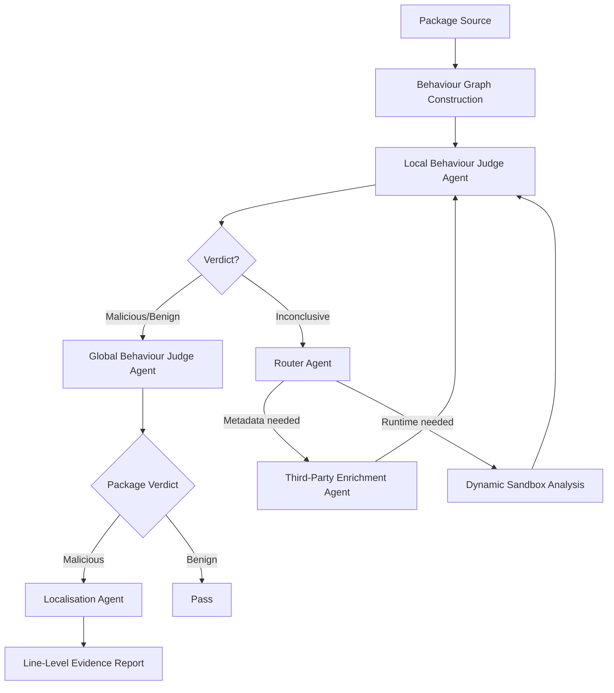
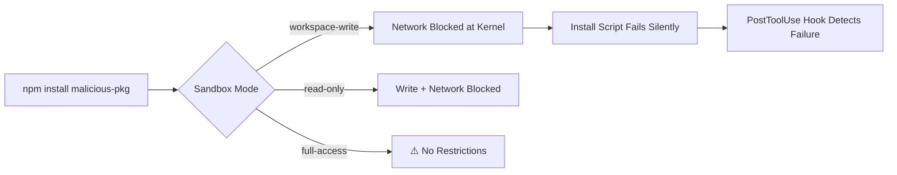
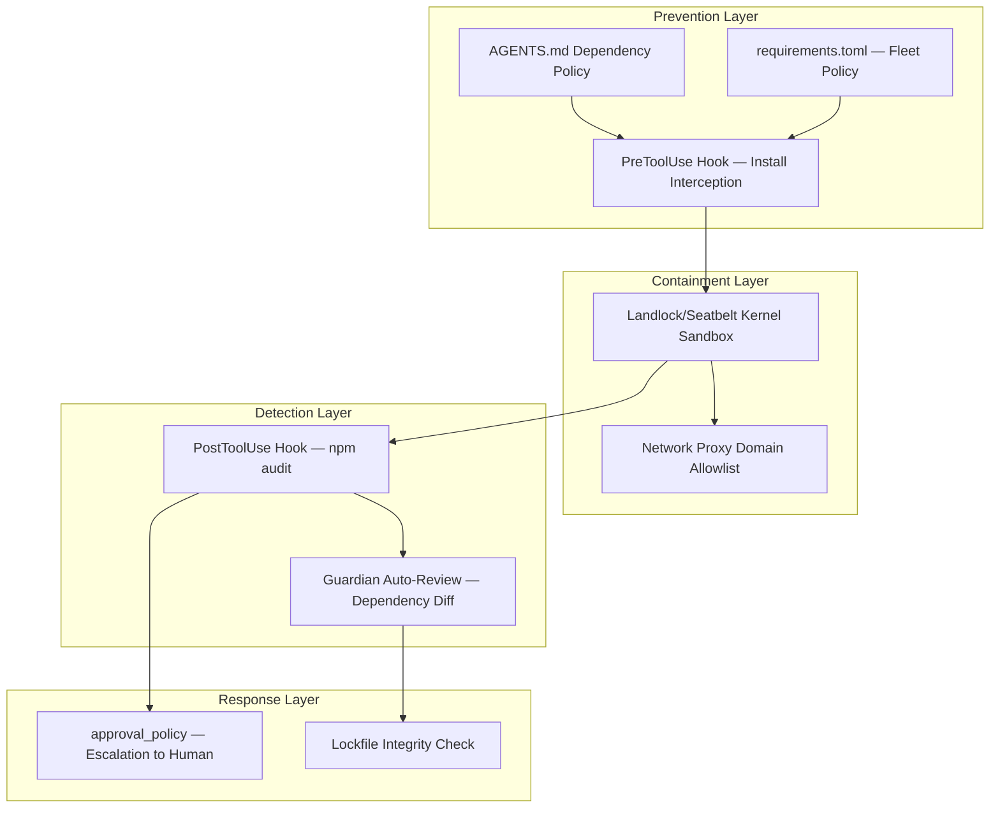

# ProfMalPlus and Agent-Coordinated Malicious Package Detection: What 597 Zero-Day NPM Threats Reveal About Supply Chain Defence — and How to Harden Codex CLI Workflows Against Dependency Poisoning


---

## The Scale of the Problem

The npm registry has become the primary battleground for software supply chain attacks. Sonatype's 2026 State of the Software Supply Chain report counted over 454,600 new malicious open-source packages in 2025 alone, pushing the cumulative total past 1.23 million — a 75% year-over-year increase [^1]. More than 99% of all open-source malware landed on npm, dwarfing PyPI, Maven Central, and every other registry combined [^1]. The first half of 2026 accelerated the trend further: 37 campaigns producing 497 indexed malicious packages, 4.5 times the volume of the preceding year [^2].

When a coding agent runs `npm install` on your behalf, it inherits this attack surface wholesale. ProfMalPlus, published on 16 July 2026 (arXiv:2607.13965), demonstrates that multi-agent coordination can detect malicious packages with a 98.1% F1-score — and in doing so, exposes the architectural patterns that Codex CLI operators should embed in their own dependency workflows [^3].

## What ProfMalPlus Does Differently

### Object-Sensitive Behaviour Graphs

Previous detectors relied on pattern matching against known malicious signatures or fed entire source files to LLMs for classification. ProfMalPlus takes a different approach: it constructs **object-sensitive behaviour graphs** by merging Control Flow Graphs (CFGs), Control Dependency Graphs (CDGs), and Data Dependency Graphs (DDGs) into a unified DDG+ representation [^3]. This captures qualified object paths — hierarchical property-access sequences like `require('child_process').exec(cmd)` — giving the system visibility into what code actually *does* rather than what it looks like.

Four statement types feed the graph: `Require`, `Property Access`, `Assignment`, and `Function Call`. Sensitive nodes are tagged: builtin API calls, third-party library calls, unresolved calls, `eval` expressions, and conditional branches [^3].

### Five Coordinated Agents

The detection pipeline deploys five specialised agents in sequence:



1. **Local Behaviour Judge** — analyses individual code slices for malicious, benign, or inconclusive signals. Self-consistency across repeated judgments reduces LLM variance [^3].
2. **Global Behaviour Judge** — synthesises slice-level verdicts following control-flow order to produce a package-level conclusion [^3].
3. **Router** — decides whether unresolved cases need third-party metadata enrichment or dynamic sandbox execution [^3].
4. **Third-Party Enrichment** — retrieves module and method semantics from registry metadata to clarify ambiguous library calls [^3].
5. **Localisation** — maps confirmed threats back to specific code lines with explanations, achieving an 88.9% line-level F1-score and high-quality explanations for 86.9% of cases [^3].

### Results That Matter

Against five state-of-the-art detectors (GuardDog, Cerebro, ProfMal, Malpacdetector, SocketAI), ProfMalPlus achieved a 98.1% F1-score — outperforming baselines by 3.5% to 52.6% with a 16.5% false-positive rate, the lowest among all compared systems [^3]. Over three months of continuous monitoring, the system identified **597 previously unknown malicious packages**, all subsequently confirmed and removed from the npm registry [^3].

The detected behaviours span the full threat taxonomy: data exfiltration via network requests, command execution through child processes, system information harvesting, obfuscated API calls, reverse shells, dropper payloads, and dynamic code generation through `eval` [^3].

## Why This Matters for Coding Agents

Coding agents routinely install dependencies. A single `npm install` in a Codex CLI session can pull hundreds of transitive packages, each a potential attack vector. The March 2026 axios compromise — where a hijacked maintainer account turned one of npm's most popular packages into a remote access trojan for three hours — demonstrated that even trusted, high-profile packages are vulnerable [^4]. Anyone who ran a fresh install during that window pulled malware directly into their build pipeline.

The ProfMalPlus architecture reveals three principles directly applicable to Codex CLI's defence stack:

1. **Pre-execution inspection beats post-incident forensics** — analyse before installing, not after compromising.
2. **Multi-perspective analysis reduces false negatives** — static analysis alone misses runtime-generated payloads; dynamic analysis alone misses conditional triggers.
3. **Agent coordination with explicit routing** — rather than one monolithic classifier, specialised agents with clear handoff protocols produce more reliable verdicts.

## Mapping ProfMalPlus Principles to Codex CLI Configuration

### PreToolUse Hooks: The First Line of Defence

Codex CLI's `PreToolUse` hooks fire before any tool execution, making them the natural interception point for dependency installation commands [^5]. A hook can intercept `npm install`, `yarn add`, `pnpm add`, and similar commands to enforce policy before packages reach the filesystem.

```toml
# .codex/config.toml — dependency installation gate
[[hooks.pre_tool_use]]
name = "dependency-install-gate"
match_commands = ["npm install", "npm i", "yarn add", "pnpm add", "npx"]
action = "require_approval"
message = "Dependency installation detected. Review package names before proceeding."
```

For organisations running ProfMalPlus or similar scanners as an MCP server, the hook can delegate to the scanner before approval:

```toml
[[hooks.pre_tool_use]]
name = "package-scanner"
match_commands = ["npm install", "yarn add"]
action = "run_check"
command = "npx @security/profmal-check --packages ${ARGS}"
fail_action = "deny"
```

### Sandbox Isolation: Containing Blast Radius

Codex CLI's default `workspace-write` sandbox mode disables network access entirely [^5]. This means that even if a malicious package's install script attempts data exfiltration, the Landlock (Linux) or Seatbelt (macOS) kernel-level enforcement blocks the outbound connection at the syscall layer — not at the application layer where bypasses are trivial [^6].



This architecture mirrors ProfMalPlus's dynamic sandbox analysis, where packages are executed in isolation to observe runtime behaviour. The critical difference: Codex CLI's sandbox operates as a *preventive* control rather than a *detective* one.

### PostToolUse Hooks: Verifying What Actually Changed

After a dependency installation completes, `PostToolUse` hooks can run verification checks [^5]:

```toml
[[hooks.post_tool_use]]
name = "dependency-audit"
match_commands = ["npm install", "yarn add"]
action = "run_check"
command = "npm audit --audit-level=high && npx lockfile-lint --path package-lock.json --type npm --allowed-hosts npm"
fail_action = "warn"
```

This parallels ProfMalPlus's Global Behaviour Judge — a second-pass assessment that considers the full package graph rather than individual slices.

### requirements.toml: Fleet-Level Supply Chain Policy

For enterprise deployments, `requirements.toml` enforces dependency policies across every Codex CLI instance in the fleet [^7]:

```toml
# requirements.toml — organisation-wide dependency governance
[dependencies]
allowed_registries = ["https://registry.npmjs.org", "https://npm.internal.corp"]
require_lockfile = true
block_install_scripts = true
max_transitive_depth = 5

[dependencies.approval]
new_packages_require_review = true
version_bump_major_requires_review = true
```

This maps to ProfMalPlus's continuous monitoring model — rather than scanning packages ad hoc, the policy ensures every installation across the fleet passes through the same governance gate.

### AGENTS.md: Encoding Dependency Discipline

The `AGENTS.md` file encodes advisory rules that shape how Codex CLI approaches dependency management [^5]:

```markdown
## Dependency Policy

- NEVER install packages from unpinned versions. Always specify exact versions.
- NEVER add dependencies without checking npm advisories first.
- Prefer packages with >1000 weekly downloads and >1 year of publish history.
- Run `npm audit` after every dependency change.
- Flag any package that requires install scripts for manual review.
- When adding new dependencies, verify the package name matches the intended
  project (typosquatting check).
```

### Network Proxy Domain Allowlisting

Codex CLI's `network_proxy` configuration restricts which domains the agent can reach [^5]. For dependency workflows, this can be narrowed to only the approved registries:

```toml
[network_proxy]
allowed_domains = [
    "registry.npmjs.org",
    "npm.internal.corp",
    "api.npms.io"  # for package metadata queries
]
```

This prevents exfiltration even in `full-access` sandbox mode by restricting the network surface to known-good destinations.

## The Defence-in-Depth Architecture

ProfMalPlus's five-agent coordination pattern maps naturally to Codex CLI's layered defence stack. Neither the ProfMalPlus approach nor any single Codex CLI mechanism is sufficient alone — the strength lies in the combination:



The key insight from ProfMalPlus is that **routing matters as much as detection**. Its Router Agent decides whether ambiguous cases need metadata enrichment or sandbox execution — a pattern that maps to Codex CLI's graduated `approval_policy`, where low-risk operations proceed automatically whilst high-risk actions (new dependencies, install scripts, major version bumps) escalate for human review [^5].

## Practical Recommendations

1. **Run in `workspace-write` mode by default.** Network isolation eliminates the exfiltration vector that makes most npm malware effective [^5].

2. **Gate dependency installations with PreToolUse hooks.** Do not let the agent add packages without explicit review or automated scanning [^5].

3. **Block install scripts.** The `--ignore-scripts` flag for npm prevents post-install script execution — the mechanism behind most npm malware payloads [^4].

4. **Pin exact versions in lockfiles.** Floating ranges (`^`, `~`) expose you to compromised patch releases [^8].

5. **Audit after every change.** PostToolUse hooks running `npm audit` catch known vulnerabilities before they ship [^5].

6. **Consider MCP-served package scanners.** Tools like ProfMalPlus can be exposed as MCP servers, enabling Codex CLI to query them directly during dependency resolution [^5].

## Conclusion

ProfMalPlus demonstrates that multi-agent coordination can detect malicious packages with production-grade accuracy. But detection alone is insufficient — the 597 zero-day packages it found had already been published and available for installation. For Codex CLI users, the lesson is clear: defence must be structural, not reactive. Kernel-level sandbox isolation, PreToolUse interception hooks, fleet-wide governance through `requirements.toml`, and network domain allowlisting create a defence-in-depth architecture that renders most npm supply chain attacks inert before they can execute — regardless of whether a scanner has flagged the package yet.

The npm threat landscape will continue to escalate. Your Codex CLI configuration should assume that every `npm install` is potentially hostile, and build defences accordingly.

---

## Citations

[^1]: Sonatype, "2026 State of the Software Supply Chain Report," 2026. [https://www.sonatype.com/state-of-the-software-supply-chain/2026](https://www.sonatype.com/state-of-the-software-supply-chain/2026)

[^2]: Singla, A. and Davis, C., "Dependency Regeneration for Supply Chain Defence," arXiv:2607.13021, July 2026. [https://arxiv.org/abs/2607.13021](https://arxiv.org/abs/2607.13021)

[^3]: Huang, Y., Zhao, Z., Chen, B., Wu, S., Zhou, Z., Cao, Y., Hu, K., Hu, X., and Peng, X., "ProfMalPlus: Agent-Coordinated Detection of Malicious NPM Packages via Static-Dynamic Analysis Synergy," arXiv:2607.13965, July 2026. [https://arxiv.org/abs/2607.13965](https://arxiv.org/abs/2607.13965)

[^4]: Palo Alto Networks Unit 42, "The npm Threat Landscape: Attack Surface and Mitigations," updated July 2026. [https://unit42.paloaltonetworks.com/monitoring-npm-supply-chain-attacks/](https://unit42.paloaltonetworks.com/monitoring-npm-supply-chain-attacks/)

[^5]: OpenAI, "Codex CLI Documentation — Hooks, Sandbox, and Configuration," 2026. [https://developers.openai.com/codex/cli/reference](https://developers.openai.com/codex/cli/reference)

[^6]: OpenAI, "Codex CLI Releases — v0.144.5," July 2026. [https://github.com/openai/codex/releases](https://github.com/openai/codex/releases)

[^7]: OpenAI, "Codex CLI — Enterprise Configuration with requirements.toml," 2026. [https://developers.openai.com/codex/cli/reference](https://developers.openai.com/codex/cli/reference)

[^8]: npm Documentation, "Package Lock Files," 2026. [https://docs.npmjs.com/cli/v10/configuring-npm/package-lock-json](https://docs.npmjs.com/cli/v10/configuring-npm/package-lock-json)
