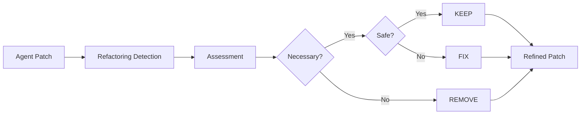
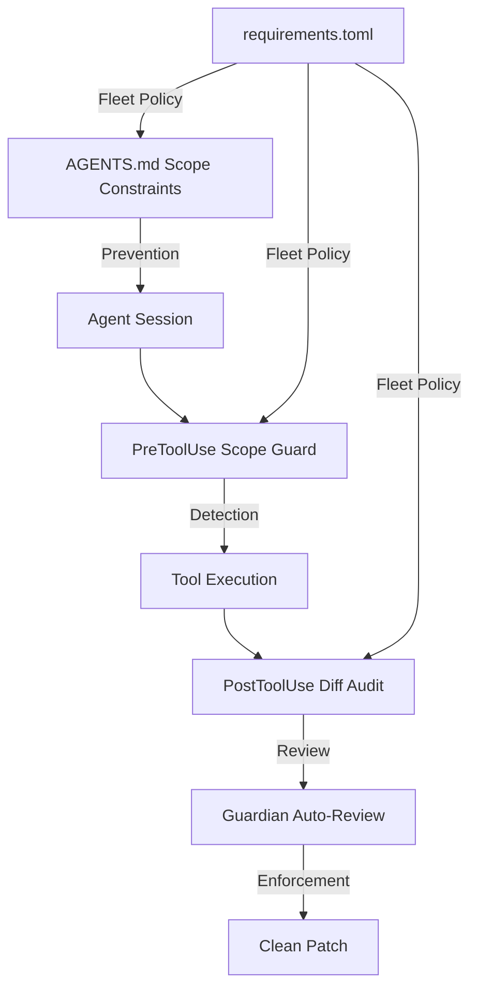

# Refactoring Runaway: What 3,691 Agent Patches Reveal About Tangled Refactorings — and How to Defend Your Codex CLI Workflows


---

Every senior developer knows the smell: you ask an agent to fix a null-pointer exception and it returns a patch that renames three variables, extracts two methods, and restructures a class hierarchy you never mentioned. The fix is in there somewhere, buried under unsolicited structural changes. A new empirical study — "Refactoring Runaway" by Tian, Zhang, Xiao, Wang, Kondo, Chen, and Kamei — puts hard numbers on this behaviour, analyses 3,691 agent-generated patches across 12 LLMs and three agent frameworks, and proposes RefUntangle, a refactoring-aware refinement pipeline that nearly doubles compilability rates [^1]. This article unpacks the findings and maps the defences directly onto Codex CLI's hook and configuration surface.

## The Scale of the Problem

The researchers mined Multi-SWE-bench, comparing agent patches against human-authored patches from the same repositories [^1]. The headline numbers:

| Metric | Agents | Humans |
|---|---|---|
| Tangled refactoring ratio | 21.43% | 36.72% |
| Refactoring density (ops/patch) | 0.66 | 1.75 |
| Distinct refactoring types | 73 | 46 |

Agents refactor *less often* than humans — but when they do, they reach for a broader and riskier palette of operations [^1]. Humans tend to stick to Extract Method and Rename Variable. Agents venture into Add Parameter, Move Class, and Remove Method Annotation territory — structural changes that propagate across call sites.

### Framework and Model Variation

Not all agents are equally susceptible. The study tested three frameworks — SWE-agent, Agentless, and OpenHands — and found significant variation [^1]:

| Framework | Tangled Ratio | Density | Types |
|---|---|---|---|
| SWE-agent | 25.85% | 1.19 | 73 |
| Agentless | 22.04% | 0.38 | 35 |
| OpenHands | 14.68% | 0.26 | 36 |

SWE-agent's exploratory, tool-heavy workflow produces the highest tangled ratio. Agentless's structured, two-phase approach constrains the damage. The takeaway: *scaffolding architecture matters more than raw model capability for controlling refactoring sprawl*.

Model-level variation is equally striking. Gemini-2.5-Pro (28.78%) and Claude-3.5-Sonnet (28.48%) sit at the top, while Doubao-1.5-pro (11.46%) sits at the bottom [^1]. This suggests that models with stronger "initiative" — those that proactively restructure code — need tighter guardrails.

## Why Tangled Refactorings Break Builds

The logistic regression results are sobering [^1]:

- **Compilability:** The presence of tangled refactorings reduces compilation odds by 58% (OR=0.42, p<0.001). Method-level refactorings are the worst offender (OR=0.23, p<0.001).
- **Correctness:** No statistically significant association overall (OR=1.09, p=0.543), but method-level refactorings are individually harmful (OR=0.22, p=0.003).
- **Removal-oriented refactorings** — deleting dead code, removing unused parameters — are the one bright spot: OR=2.50 for compilability, OR=4.56 for correctness (both significant) [^1].

The pattern is clear: agents that *add* structural complexity during issue resolution introduce compilation failures. Agents that *remove* unnecessary structure improve both compilability and correctness.

### The 16,881-Line Case Study

The paper's most striking example: a simple dead-code removal task that triggered a "refactoring runaway" producing 16,881 lines of modifications across 89 files [^1]. Another case: adjusting a timeout value triggered unnecessary defensive-coding refactorings that required explicit developer intervention to untangle. These are not edge cases — they represent the failure mode that every team using coding agents will eventually encounter.

## RefUntangle: Post-Processing as Defence

RefUntangle is a two-stage pipeline that operates on completed patches [^1]:



**Stage 1 — Assessment:** Each detected refactoring is evaluated on two axes: *necessity* (is it semantically required for the issue resolution?) and *safety* (does it preserve behavioural and structural consistency?). The distribution across 1,812 refactorings is telling [^1]:

- Necessary & Safe (KEEP): 32.17%
- Necessary & Unsafe (FIX): 21.85%
- Unnecessary & Safe (REMOVE): 11.53%
- Unnecessary & Unsafe (REMOVE): 34.44%

Over half of all agent refactorings are unnecessary. A third are both unnecessary and unsafe.

**Stage 2 — Refinement:** REMOVE-labelled refactorings are eliminated, FIX-labelled ones receive corrective modifications, and KEEP-labelled ones pass through unchanged. The refined patch is generated via LLM-guided diff generation at temperature 0 for deterministic output [^1].

### Results

| Model | Compilability Before | Compilability After | Improvement |
|---|---|---|---|
| DeepSeek-V3.2 | 19.75% | 29.62% | +50% relative |
| Gemini-2.5-Pro | 18.92% | 47.03% | +149% relative |
| Average | 19.34% | 38.33% | +98% relative |

Additionally, 2.79% of previously unresolved patches now pass all tests after refinement — issues that were blocked purely by tangled refactoring noise [^1].

## Mapping the Defences onto Codex CLI

RefUntangle operates as a post-hoc repair pipeline. Codex CLI (v0.144.5 as of 16 July 2026 [^2]) provides mechanisms to prevent tangled refactorings *before* they land, detect them *during* execution, and review them *after* completion.

### Prevention: AGENTS.md Scope Constraints

The first line of defence is declaring explicit scope constraints in your AGENTS.md file [^3]:

```markdown
## Scope Discipline

- Fix ONLY the issue described in the task prompt.
- Do NOT rename variables, extract methods, or restructure code
  unless the fix mechanically requires it.
- If a refactoring is necessary for the fix, state WHY before applying it.
- Maximum scope: one feature branch per session.
- Pause for approval after modifying more than 5 files.
```

This gives the model explicit instructions that discourage the "initiative" behaviour that drives tangled refactorings. Codex CLI's hierarchical AGENTS.md discovery means these constraints apply to every session in the repository [^3].

### Detection: PreToolUse Scope Guard

Codex CLI's PreToolUse hooks intercept tool calls before execution [^4]. A scope-guard hook can detect when the agent attempts to modify files outside the declared scope:

```bash
#!/usr/bin/env bash
# .codex/hooks/pre-tool-scope-guard.sh
# Blocks apply_patch calls to files not listed in the task spec

SPEC_FILES=$(grep -oP '(?<=modify: ).*' .task-spec.md 2>/dev/null)
TARGET_FILE=$(echo "$CODEX_TOOL_INPUT" | jq -r '.path // empty')

if [ -n "$SPEC_FILES" ] && [ -n "$TARGET_FILE" ]; then
  if ! echo "$SPEC_FILES" | grep -qF "$TARGET_FILE"; then
    echo '{"continue": false, "stopReason": "File outside declared scope: '"$TARGET_FILE"'"}' >&2
    exit 2
  fi
fi
```

Configure in `.codex/config.toml`:

```toml
[[hooks]]
event = "PreToolUse"
matcher = "apply_patch"
type = "command"
command = "bash .codex/hooks/pre-tool-scope-guard.sh"
statusMessage = "Checking scope..."
```

PreToolUse hooks now support both Bash and apply_patch matchers [^4], giving coverage over the two primary channels through which tangled refactorings land.

### Review: PostToolUse Diff Audit

PostToolUse hooks fire after tool completion and can inspect the results [^4]. A diff-audit hook can flag patches that introduce refactoring-pattern changes:

```bash
#!/usr/bin/env bash
# .codex/hooks/post-tool-refactor-audit.sh
# Warns when a patch contains method extraction or class moves

DIFF=$(git diff --cached --stat 2>/dev/null)
FILE_COUNT=$(echo "$DIFF" | grep -c "changed")

if [ "$FILE_COUNT" -gt 10 ]; then
  echo '{"continue": true, "systemMessage": "WARNING: Patch touches '"$FILE_COUNT"' files. Review for tangled refactorings before committing."}'
fi
```

This doesn't block execution — it injects a system message that makes the agent aware of potential scope creep, creating a feedback loop similar to RefUntangle's assessment stage.

### Fleet Enforcement: requirements.toml

For enterprise teams, `requirements.toml` enforces hook policies across all repositories [^5]:

```toml
[hooks.managed]
pre_tool_scope_guard = true
post_tool_refactor_audit = true

[model]
# Route complex tasks to models with lower tangled-refactoring rates
default_profile = "conservative"
```

Combined with Codex CLI's named profiles, teams can route tasks to models that the Refactoring Runaway data shows produce fewer tangled changes — selecting models with lower initiative for maintenance tasks where scope discipline matters most [^2].

### Guardian Auto-Review as RefUntangle Analogue

Codex CLI's Guardian auto-review subagent (available since v0.144.2 [^2]) can serve as a lightweight RefUntangle equivalent. Configure it to review patches for unnecessary structural changes before they're committed:

```markdown
## Guardian Review Policy (AGENTS.md)

When reviewing patches:
1. Flag any refactoring that is not mechanically required by the fix.
2. Check that method signatures have not changed unless the fix demands it.
3. Verify that file count is proportional to issue scope.
4. Reject patches where refactoring density exceeds 1.0 ops/file.
```

This mirrors RefUntangle's necessity-safety assessment, but operates within the agent loop rather than as a post-hoc pipeline.

## The Broader Lesson

The Refactoring Runaway study confirms what many practitioners have suspected: coding agents have a systematic tendency toward structural over-engineering during issue resolution. The 58% reduction in compilation odds from tangled refactorings is not a minor quality concern — it represents a fundamental reliability problem.

The defence-in-depth architecture maps naturally onto Codex CLI's layered configuration:



The study's most actionable finding: *removal-oriented refactorings are beneficial* (OR=4.56 for correctness). This suggests that AGENTS.md instructions should not blanket-ban all refactoring — they should encourage deletions and removals whilst constraining additions and restructurings. The distinction between "cleaning up" and "restructuring" is where the engineering judgement lies.

## Citations

[^1]: Tian, Z., Zhang, Z., Xiao, T., Wang, D., Kondo, M., Chen, J., & Kamei, Y. (2026). "Refactoring Runaway": Understanding and Mitigating Tangled Refactorings in Coding Agents for Issue Resolution. arXiv:2605.22526. [https://arxiv.org/abs/2605.22526](https://arxiv.org/abs/2605.22526)

[^2]: OpenAI. (2026). Codex CLI Changelog. [https://github.com/openai/codex/releases](https://github.com/openai/codex/releases)

[^3]: OpenAI. (2026). Custom instructions with AGENTS.md. [https://learn.chatgpt.com/docs/agents-md](https://learn.chatgpt.com/docs/agents-md)

[^4]: OpenAI. (2026). Hooks — Codex CLI Documentation. [https://learn.chatgpt.com/docs/hooks](https://learn.chatgpt.com/docs/hooks)

[^5]: OpenAI. (2026). Codex CLI Configuration — requirements.toml. [https://learn.chatgpt.com/docs/configuration](https://learn.chatgpt.com/docs/configuration)
