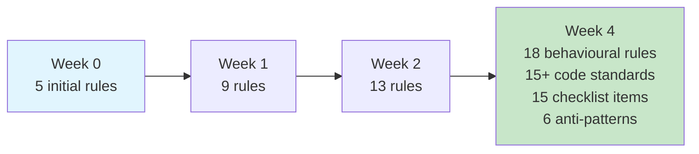
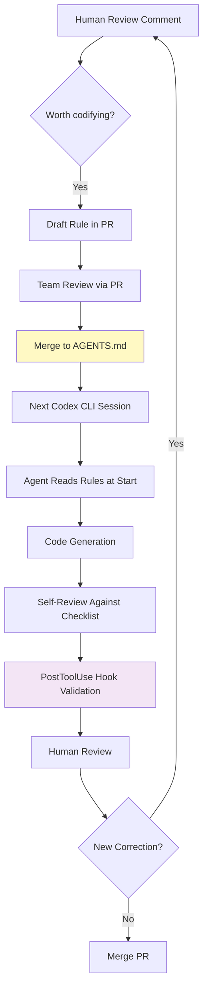

# Self-Improving Coding Agents Through Accumulated Behavioural Rules: What a Closed-Loop Framework Means for Your AGENTS.md


---

Most teams treat their AGENTS.md as a static document — written once during project setup, occasionally tweaked when someone remembers it exists. Aggarwal and Ghalaty's new paper, "Self-Improving AI Coding Agents Through Accumulated Behavioral Rules" [^1], presents evidence that this is backwards. Their closed-loop framework treats the instruction file as a living repository of organisational knowledge, accumulating rules from every code review interaction. Deployed across a 35+ microservices platform, the system achieved a 0% recurrence rate for ruled-against error classes over a four-week observation window.

The implications for Codex CLI users are direct: your AGENTS.md already provides the infrastructure for exactly this kind of accumulated learning. You just need the discipline to use it.

## The Core Problem: Agents That Repeat Themselves

Every senior developer has experienced the frustration of correcting the same agent mistake twice. You review a pull request, leave a comment about using message templates instead of string interpolation in structured logging, the agent fixes it — and then commits the identical anti-pattern three sessions later. The agent has no cross-session memory of your correction.

This is the fundamental gap the paper addresses. Existing approaches to agent learning — Reflexion [^2], ExpeL [^3], Voyager [^4] — each have structural limitations that prevent them from solving this problem in production:

| Approach | Memory Type | Limitation |
|----------|------------|------------|
| Reflexion | Episodic self-critique within sessions | No cross-session persistence; relies on model self-evaluation |
| ExpeL | Autonomous experience extraction | Vulnerable to confabulated rules [^5]; no human validation gate |
| Voyager | Executable skill library | Stores code, not declarative constraints; game-domain-specific |
| Fine-tuning | Weight updates | Freezes knowledge at training time; misses organisational conventions |

The accumulated behavioural rules framework sidesteps all four limitations by using human-validated, version-controlled, declarative natural language — precisely what AGENTS.md already is.

## The Five-Section Instruction File

The paper organises the instruction file into five sections [^1]:

1. **Behavioural rules** — operational guardrails with explicit trigger conditions
2. **Code standards** — language-specific guidelines (15+ accumulated during deployment)
3. **Self-review checklist** — a numbered pre-submission verification list (15 items)
4. **Anti-patterns** — prohibited patterns with corrected alternatives (6 rules)
5. **Workflow rules** — tool invocation triggers and process constraints

Each rule follows a structured schema: Rule ID, Category, Trigger Origin, Scope, Constraint, Rationale, Checklist Mapping, and Traceability back to the originating review comment.

This maps cleanly onto how Codex CLI's AGENTS.md file discovery works. Codex reads instruction files hierarchically — from `~/.codex/AGENTS.md` (global) through the project root down to the current working directory [^6]. A team-wide behavioural rules section belongs at the project root; language-specific standards can live in subdirectory-level files.

## Rule Accumulation in Practice

The framework's growth trajectory over four weeks is instructive [^1]:



Knowledge sources broke down as follows: human PR reviewers contributed 39% of rules, automated review bots 22%, self-discovered patterns 22%, and production errors 17% [^1]. The diversity of sources matters — it means the instruction file captures knowledge that no single contributor holds entirely.

### Concrete Rule Examples

The paper provides specific examples that illustrate the level of granularity required for effective rules [^1]:

```markdown
## Anti-Patterns

### AP-001: HttpClient Disposal
- **Trigger:** Factory-created HttpClient instances
- **Prohibited:** Disposing HttpClient in calling code
- **Required:** Let the factory manage lifetime
- **Origin:** PR-review (reviewer: senior-dev-A, 2026-06-15)

### AP-002: Structured Logging
- **Prohibited:** `logger.LogInformation($"User {userId} logged in")`
- **Required:** `logger.LogInformation("User {UserId} logged in", userId)`
- **Rationale:** String interpolation defeats structured log indexing
- **Origin:** Automated-bot (linting-rule-SL001)
```

Compare this with the typical AGENTS.md entry: "Use structured logging." The difference in specificity is the difference between a rule that changes agent behaviour and one that does not.

## The Self-Review Checklist as a PreToolUse Gate

The paper's self-review checklist functions as an internalised verification step — the agent checks its own output against accumulated rules before requesting human review. In Codex CLI terms, this maps to two complementary mechanisms.

First, encoding checklist items directly in AGENTS.md:

```markdown
## Self-Review Protocol

Before submitting any code change, verify:
1. No string interpolation in logging calls — use message templates
2. No direct HttpClient disposal — factory manages lifetime
3. All new HTTP registrations include SSRF allowlist entries
4. Boolean negation uses && not || for conjunctive conditions
5. Null checks use ?? throw, never null-forgiving operator
```

Second, enforcing critical items mechanically via PostToolUse hooks. The paper acknowledges that self-review is ultimately advisory — the agent may skip items under token pressure or context decay [^1]. Codex CLI's hook architecture provides a harder guarantee:

```toml
# .codex/config.toml — PostToolUse hook for structured logging enforcement
[[hooks.post_tool_use]]
command = "grep -rn '\\$\".*{.*}' --include='*.cs' $CODEX_CHANGED_FILES | grep -i 'log' && echo 'DENY: String interpolation in logging detected' && exit 1 || exit 0"
```

This creates a layered defence: the AGENTS.md self-review checklist catches most issues during generation, and the PostToolUse hook catches whatever slips through.

## The Zero-Recurrence Finding

The paper's headline metric is striking: across 9 tracked error classes with 74 cumulative post-rule exposures, zero recurrences were observed [^1]. This warrants careful interpretation.

The authors are transparent about limitations. The sample size (74 exposures across 36 PRs and 11 sessions) is insufficient for formal statistical significance claims. The observation window was four weeks. There was no controlled A/B baseline. And the deployment used a single typed language with strong framework conventions, which may inflate rule effectiveness compared to dynamically typed ecosystems.

Still, the qualitative shift is notable: reviewer comments moved from 86% mechanical correctness concerns to 66% architecture, API design, and performance discussions [^1]. The rules handled the repetitive corrections, freeing human reviewers for higher-value judgment.

## Mapping to Codex CLI's Architecture



Codex CLI provides several features that directly support this workflow:

**AGENTS.md file hierarchy** — Global rules in `~/.codex/AGENTS.md`, project rules at the root, and subdirectory overrides enable the scoped rule application the paper describes [^6]. The `project_doc_max_bytes` setting (default 32 KiB) imposes a healthy constraint against rule bloat.

**`--print-instructions` flag** — Available since April 2026, this dumps the merged AGENTS.md content for debugging, confirming which rules are active in a given session [^6].

**PreToolUse and PostToolUse hooks** — These provide mechanical enforcement for critical rules that must not be violated, complementing the advisory self-review checklist [^7].

**Guardian auto-review** — Since v0.144.2, Guardian functions as an automated review agent that can validate output against AGENTS.md conventions before the human reviewer sees the PR [^8].

**Memories** — Codex CLI's memory system (`~/.codex/memories/`) provides a complementary layer. While AGENTS.md holds curated, team-validated rules, memories capture session-specific context that may graduate to rules after human review [^9].

## Design Principles Worth Adopting

The paper articulates six design principles for rule accumulation [^1]. Three are immediately actionable for Codex CLI users:

### Monotonic Growth

Rules are added or refined, never deleted. This prevents the "someone cleaned up the AGENTS.md and removed that critical rule about SSRF allowlists" failure mode. In practice, deprecate rules by marking them as superseded rather than removing them:

```markdown
### R-003: SSRF Allowlist (Superseded by R-017)
~~New HttpClient registrations must include SSRF allowlist entries.~~
See R-017 for updated network security policy.
```

### Specificity Over Generality

The paper measures a specificity ratio that increased from 0.60 to 0.78 over time [^1]. "Write secure code" is useless. "All new `HttpClient` registrations must include an entry in `security/ssrf-allowlist.yaml` with justification comment" changes behaviour. Every rule should specify the trigger condition, the prohibited pattern, and the required alternative.

### Origin Tracking

Every rule traces back to its source event — a PR review comment, a production incident, a bot finding. This provides justification for the rule's existence and a path to revisiting it when circumstances change:

```markdown
- **Origin:** PR #847 review (2026-06-22) — production incident INC-2341
- **Reviewed by:** @senior-dev, @security-lead
```

## Limitations and Open Questions

The paper's single-deployment scope is a genuine constraint. Whether this approach works as well in dynamically typed languages (Python, JavaScript) where conventions are less rigid remains untested. The 35+ microservices environment with 50,000+ lines of infrastructure code is a specific context — smaller projects may not generate enough review volume to accumulate meaningful rules.

The scaling question is also unresolved. The paper acknowledges that multi-team deployments introduce potential rule contradictions [^1]. Codex CLI's hierarchical AGENTS.md discovery mitigates this somewhat — team-specific rules can override organisation-wide defaults — but governance of rule conflicts across teams remains an open problem.

The context efficiency finding is encouraging: the accumulated rules consumed approximately 6,250 tokens, under 5% of a 128K context window [^1]. This leaves ample room for project context, file content, and tool output. But as rules accumulate over months rather than weeks, the `project_doc_max_bytes` ceiling will force prioritisation. ⚠️ The paper does not address rule pruning or archiving strategies for long-lived projects.

## Getting Started

For teams using Codex CLI today, the minimum viable implementation requires three changes:

1. **Add a "Review-Driven Rules" section to your AGENTS.md** with the five-section structure (behavioural rules, code standards, self-review checklist, anti-patterns, workflow rules).

2. **Treat AGENTS.md changes as code** — require PR review for all rule additions, with the originating review comment linked in the rule's traceability field.

3. **Wire one PostToolUse hook** for your most frequently repeated review correction. Start with the single error class that costs you the most reviewer time, and expand from there.

The paper's evidence suggests this is not aspirational — it is mechanical. The agent does not need to "learn" in any sophisticated sense. It needs to be told, precisely, what not to do. And it needs to be told in a file that persists across sessions.

Your AGENTS.md is already that file. The question is whether you are writing rules into it after every review, or letting your corrections evaporate at the end of each session.

---

## Citations

[^1]: Aggarwal, A. and Ghalaty, N. F. (2026). "Self-Improving AI Coding Agents Through Accumulated Behavioral Rules: A Closed-Loop Framework." arXiv:2607.13091. [https://arxiv.org/abs/2607.13091](https://arxiv.org/abs/2607.13091)

[^2]: Shinn, N. et al. (2023). "Reflexion: Language Agents with Verbal Reinforcement Learning." NeurIPS 2023. [https://arxiv.org/abs/2303.11366](https://arxiv.org/abs/2303.11366)

[^3]: Zhao, A. et al. (2024). "ExpeL: LLM Agents Are Experiential Learners." AAAI 2024. [https://arxiv.org/abs/2308.10144](https://arxiv.org/abs/2308.10144)

[^4]: Wang, G. et al. (2023). "Voyager: An Open-Ended Embodied Agent with Large Language Models." NeurIPS 2023. [https://arxiv.org/abs/2305.16291](https://arxiv.org/abs/2305.16291)

[^5]: Modarressi, A. et al. (2026). "Honest Lying: Understanding Memory Confabulation in Reflexive Agents." arXiv:2605.29463. [https://arxiv.org/abs/2605.29463](https://arxiv.org/abs/2605.29463)

[^6]: OpenAI (2026). "Custom instructions with AGENTS.md." Codex CLI Documentation. [https://developers.openai.com/codex/guides/agents-md](https://developers.openai.com/codex/guides/agents-md)

[^7]: OpenAI (2026). "Codex CLI Hooks." Codex CLI Documentation. [https://developers.openai.com/codex/guides/hooks](https://developers.openai.com/codex/guides/hooks)

[^8]: OpenAI (2026). "Codex Changelog — v0.144.2 (July 13, 2026)." [https://learn.chatgpt.com/docs/changelog](https://learn.chatgpt.com/docs/changelog)

[^9]: Mem0 (2026). "Codex CLI Memory: How It Works." [https://mem0.ai/blog/how-memory-works-in-codex-cli](https://mem0.ai/blog/how-memory-works-in-codex-cli)
