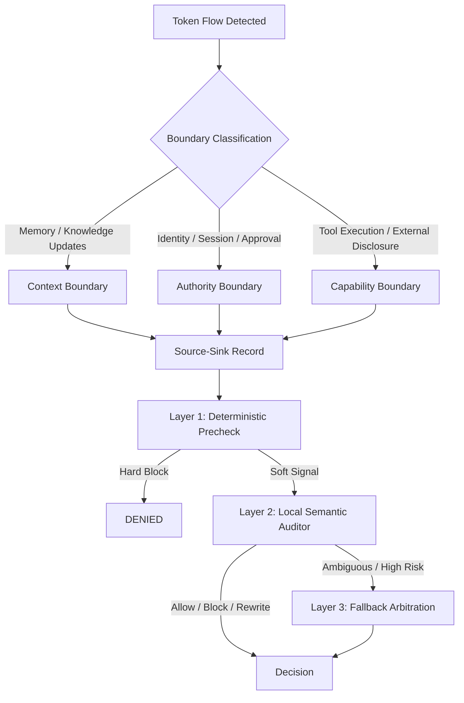
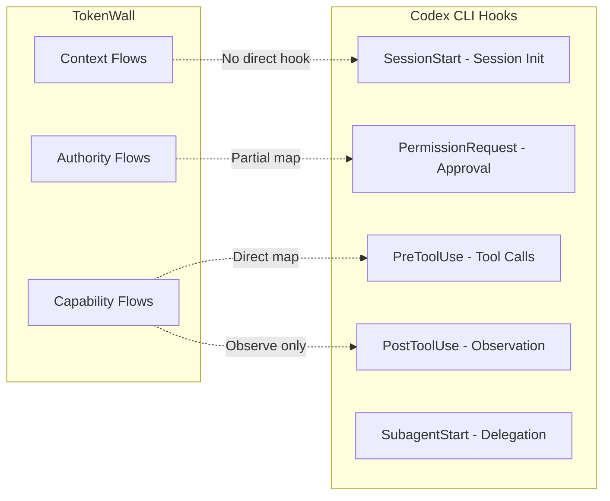

# Token-Flow Firewall and Semantic Runtime Auditing: Why Pre-Execution Boundary Inspection Matters for Persistent Coding Agents — and How to Build It with Codex CLI Hooks


---

## The Persistent Agent Attack Surface

Single-turn coding assistants have a narrow attack surface: one prompt in, one response out. Persistent agents — the kind you run with Codex CLI's goal mode, subagent delegation, or long-running remote sessions — are a different beast entirely. Unsafe content can propagate through persistent state, reusable skills, and tool-mediated interactions, creating what Wang et al. call "a substantially larger semantic attack surface" [^1].

Their paper, *Token-Flow Firewall: Semantic Runtime Auditing for Persistent AI Agents* (arXiv:2607.08395, July 2026), introduces **TokenWall**, a runtime defence framework that treats security-critical agent interactions as token flows crossing boundaries — and inspects them before they execute [^1]. The results are striking: attack success rate drops to 12.5% whilst maintaining a 97.4% benign pass rate, with just 0.69 seconds of added latency on clean operations [^1].

This article unpacks the TokenWall architecture, maps its three-layer inspection model to Codex CLI's hooks pipeline, and shows how to build boundary-aware semantic auditing into your own agent workflows today.

## TokenWall's Three Boundaries, Three Layers

TokenWall's core insight is that most security-critical interactions in persistent agents flow through natural language tokens — memory updates, tool arguments, retrieved files, and inter-component communications [^1]. Rather than treating these as a single undifferentiated stream, TokenWall classifies each flow into one of three boundary types:



Each flow is formalised as a tuple `f = (x, s, t, c, b)` — payload spans, source, sink, runtime metadata, and boundary type [^1]. The three inspection layers then operate in sequence:

1. **Deterministic precheck** — pattern-matching rules (13 categories including credential detection, destructive operations, prompt-control language) that produce either hard blocks or soft evidence signals forwarded to the next layer [^1].

2. **Local semantic auditor** — a lightweight model (Qwen3-4B in the paper) that receives the structured source-sink record and outputs a decision with risk, uncertainty, exploitability, and impact scores [^1]. It can allow, block, or rewrite the payload.

3. **Fallback arbitration** — a stronger model (Qwen3.6-Plus) that handles cases the local auditor flags as ambiguous or high-impact, triggered when exploitability exceeds 0.50 or residual risk exceeds 0.25 [^1].

## The Numbers That Matter

On CIK-Bench (88 attack cases across context manipulation, authority manipulation, and capability exploitation), TokenWall outperforms the strongest baseline (ClawKeeper) on every metric that matters for developer experience [^1]:

| Metric | TokenWall | ClawKeeper |
|--------|-----------|------------|
| Overall attack success rate | 12.5% | 14.7% |
| Context boundary ASR | 11.1% | 13.8% |
| Authority boundary ASR | 15.4% | 19.2% |
| Latency per case | 16.9s | 64.3s |
| Human intervention rate | 33.0% | 69.3% |

The human intervention rate is the standout figure. ClawKeeper requires human confirmation for nearly 70% of cases; TokenWall cuts that to a third, and on benign operations it drops to 0.0% [^1]. This is the difference between a security layer you leave running and one you disable in frustration.

Ablation studies confirm each component earns its place. Remove the local auditor and the large-model call rate jumps to 94.3% with latency ballooning to 74.7 seconds. Remove fallback arbitration and the attack success rate climbs to 20.4% [^1].

## Mapping TokenWall to Codex CLI's Hooks Architecture

Codex CLI's hooks system [^2] provides the runtime interception points needed to implement TokenWall-style auditing. The mapping is not one-to-one — there are genuine gaps — but the architectural alignment is closer than it first appears.

### Layer 1: Deterministic Precheck via PreToolUse

TokenWall's deterministic precheck maps directly to a `PreToolUse` hook with pattern-matching logic. Codex CLI's `PreToolUse` event fires before tool execution and receives JSON on stdin containing the tool name, arguments, and session metadata [^2]:

```toml
[[hooks.PreToolUse]]
matcher = ".*"

[[hooks.PreToolUse.hooks]]
type = "command"
command = "python3 ~/.codex/hooks/token_flow_precheck.py"
timeout = 10
statusMessage = "Boundary precheck"
```

The precheck script implements TokenWall's 13 rule categories — credential patterns, destructive operations, prompt-control injection markers — and returns a structured decision:

```python
#!/usr/bin/env python3
"""TokenWall-style deterministic precheck for Codex CLI."""
import json, sys, re

HARD_BLOCK_PATTERNS = [
    r"(?i)(aws_secret|github_token|api_key)\s*=",
    r"rm\s+-rf\s+/(?!tmp)",
    r"curl.*\|\s*(?:ba)?sh",
    r"(?i)ignore\s+(?:previous|all)\s+instructions",
]

SOFT_SIGNAL_PATTERNS = [
    r"(?i)(eval|exec)\s*\(",
    r"base64\s+--decode",
    r">\s*/etc/",
]

def classify_boundary(tool_name: str, args: dict) -> str:
    if tool_name in ("memory_update", "knowledge_write"):
        return "context"
    if "approval" in str(args) or "identity" in str(args):
        return "authority"
    return "capability"

event = json.load(sys.stdin)
tool_input = json.dumps(event.get("toolInput", {}))

for pattern in HARD_BLOCK_PATTERNS:
    if re.search(pattern, tool_input):
        json.dump({
            "hookSpecificOutput": {
                "hookEventName": "PreToolUse",
                "permissionDecision": "deny",
                "permissionDecisionReason":
                    f"Hard block: matched {pattern}"
            }
        }, sys.stdout)
        sys.exit(0)

# Soft signals: attach metadata for downstream auditor
signals = [p for p in SOFT_SIGNAL_PATTERNS if re.search(p, tool_input)]
if signals:
    json.dump({
        "hookSpecificOutput": {
            "hookEventName": "PreToolUse",
            "additionalContext": json.dumps({
                "soft_signals": signals,
                "boundary": classify_boundary(
                    event.get("toolName", ""), event.get("toolInput", {})
                )
            })
        }
    }, sys.stdout)
sys.exit(0)
```

This handles the "obvious cases" — the same role TokenWall's deterministic precheck fills. Hard blocks deny execution immediately; soft signals inject context that a downstream auditor can act on.

### Layer 2: Local Semantic Auditor via a Second PreToolUse Hook

Multiple matching hooks run concurrently in Codex CLI [^2], but you can chain inspection by having the first hook write soft signals to a shared file, and the second hook read them. Alternatively, a single hook script can implement both layers internally:

```toml
[[hooks.PreToolUse]]
matcher = "^Bash$"

[[hooks.PreToolUse.hooks]]
type = "command"
command = "python3 ~/.codex/hooks/semantic_auditor.py"
timeout = 30
statusMessage = "Semantic flow audit"
```

The semantic auditor invokes a local model (a quantised 4B-parameter model running via `llama.cpp` or `ollama`) to assess the source-sink record. TokenWall's structured output format translates well:

```json
{
  "decision": "allow|block|rewrite",
  "risk": 0.35,
  "uncertainty": 0.20,
  "exploitability": 0.15,
  "impact": 0.40,
  "residual_risk_types": ["data_exfiltration"],
  "escalate": false
}
```

When the local auditor recommends blocking, the hook returns `permissionDecision: "deny"`. When it flags escalation, the hook can invoke a stronger remote model before returning its verdict — implementing TokenWall's three-layer cascade within a single hook execution.

### Layer 3: PostToolUse Observation and Audit Trail

Codex CLI's `PostToolUse` hook fires after tool execution and receives the tool's output, exit code, and metadata [^2]. It cannot undo side effects or rewrite output — it is observe-only [^3]. This limits direct enforcement but aligns with TokenWall's audit record architecture:

```toml
[[hooks.PostToolUse]]
matcher = ".*"

[[hooks.PostToolUse.hooks]]
type = "command"
command = "python3 ~/.codex/hooks/audit_record.py"
timeout = 10
statusMessage = "Recording audit trail"
```

The audit script constructs TokenWall-style source-sink records and writes them to a structured log:

```python
#!/usr/bin/env python3
"""PostToolUse audit record in TokenWall source-sink format."""
import json, sys, datetime, pathlib

event = json.load(sys.stdin)
record = {
    "timestamp": datetime.datetime.utcnow().isoformat(),
    "turn_id": event.get("turn_id"),
    "tool": event.get("toolName"),
    "boundary": "capability",
    "source": event.get("toolInput", {}),
    "sink": {
        "exit_code": event.get("exitCode"),
        "output_preview": str(event.get("stdout", ""))[:500]
    },
    "session_id": event.get("session_id")
}

log_path = pathlib.Path.home() / ".codex" / "audit" / "token_flows.jsonl"
log_path.parent.mkdir(parents=True, exist_ok=True)
with open(log_path, "a") as f:
    f.write(json.dumps(record) + "\n")
```

These audit records serve the same purpose as TokenWall's structured source-sink logs — they provide the forensic trail needed to investigate incidents, tune detection thresholds, and train local auditor models on project-specific patterns.

## The Boundary-Awareness Gap



The honest assessment: Codex CLI hooks cover capability-boundary flows well (PreToolUse intercepts tool execution), partially cover authority flows (PermissionRequest fires before approval prompts), but have limited visibility into context-boundary flows — memory updates, knowledge writes, and cross-session state propagation are not directly hookable [^2].

TokenWall's authority-boundary ASR of 15.4% — the highest of the three boundaries — maps to the area where Codex CLI's coverage is thinnest. Identity bindings, session approval paths, and subagent delegation trust chains are not fully inspectable through the current hooks surface [^1].

Three concrete gaps remain:

1. **Output rewriting** — TokenWall's local auditor can rewrite payloads before they cross boundaries (achieving 66.7% risk removal on recoverable violations) [^1]. Codex CLI's PostToolUse cannot modify tool output [^3].

2. **Memory/state inspection** — TokenWall intercepts memory updates and knowledge writes. Codex CLI has no hook event for persistent state mutations or cross-session context propagation.

3. **MCP tool argument inspection** — PreToolUse fires for MCP tool calls [^2], but the granularity of argument inspection depends on how the MCP server exposes its schema. Tool arguments may be opaque JSON blobs that resist pattern-matching without schema awareness.

## Enterprise Configuration: Managed Hooks and requirements.toml

For teams deploying semantic auditing at scale, Codex CLI's managed hooks via `requirements.toml` [^2] provide the governance layer TokenWall assumes:

```toml
# requirements.toml - enforced by MDM/admin
allow_managed_hooks_only = true

[features]
hooks = true

[hooks]
managed_dir = "/enterprise/hooks/tokenwall"

[[hooks.PreToolUse]]
matcher = ".*"

[[hooks.PreToolUse.hooks]]
type = "command"
command = "/enterprise/hooks/tokenwall/precheck.py"
timeout = 15

[[hooks.PreToolUse.hooks]]
type = "command"
command = "/enterprise/hooks/tokenwall/semantic_auditor.py"
timeout = 30

[[hooks.PostToolUse]]
matcher = ".*"

[[hooks.PostToolUse.hooks]]
type = "command"
command = "/enterprise/hooks/tokenwall/audit_record.py"
timeout = 10
```

Setting `allow_managed_hooks_only = true` ensures developers cannot bypass the semantic firewall by adding their own hooks that run concurrently and potentially interfere [^2]. The managed hooks directory is controlled by IT, and the precheck and auditor scripts are versioned and deployed centrally.

## Escalation Thresholds for Codex CLI

TokenWall's fixed escalation thresholds [^1] translate directly to hook logic. Adapt these to your risk tolerance:

| Condition | Action |
|-----------|--------|
| `risk < 0.20 AND uncertainty < 0.25` | Allow without intervention |
| `risk > 0.75` | Hard block via `permissionDecision: "deny"` |
| `exploitability > 0.50 OR residual_risk > 0.25` | Escalate to stronger model |
| `rewrite completeness > 0.90 AND residual < 0.15` | Accept rewritten payload |

The key insight from TokenWall's ablation: removing the fallback arbitration layer (the stronger model) increases attack success rate from 12.5% to 20.4% [^1]. If you cannot run a local model for Layer 2, at least implement the deterministic precheck — it catches the obvious attacks and is pure pattern matching with zero model cost.

## What This Means for Your Workflow

TokenWall demonstrates that comprehensive pre-execution monitoring achieves a practical security-utility balance — the 97.4% benign pass rate with 0.0% human intervention on clean operations [^1] means the security layer stays invisible until it needs to act. This is the design target for any Codex CLI hooks-based security implementation.

The practical takeaway: start with the deterministic precheck (Layer 1), add PostToolUse audit logging immediately, and layer in a local semantic auditor as your threat model demands it. The TokenWall paper provides the escalation thresholds and structured output format to make each layer's decisions composable and auditable.

⚠️ TokenWall was evaluated on CIK-Bench against OpenClaw-specific attack patterns. Direct transferability of detection rates to Codex CLI workloads is unverified — the 12.5% ASR figure should be treated as indicative of the approach's potential rather than a guaranteed outcome.

## Citations

[^1]: Wang, P., Zhang, Y., Zhang, R., Guo, J., & Cheng, X. (2026). *Token-Flow Firewall: Semantic Runtime Auditing for Persistent AI Agents*. arXiv:2607.08395. [https://arxiv.org/abs/2607.08395](https://arxiv.org/abs/2607.08395)

[^2]: OpenAI. (2026). *Hooks — Codex CLI Documentation*. [https://developers.openai.com/codex/hooks](https://developers.openai.com/codex/hooks)

[^3]: OpenAI. (2026). *Agent Approvals & Security — Codex CLI Documentation*. [https://developers.openai.com/codex/agent-approvals-security](https://developers.openai.com/codex/agent-approvals-security)
