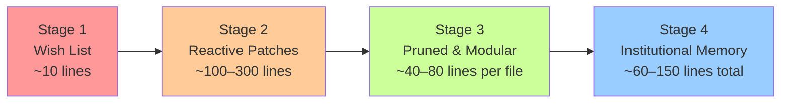
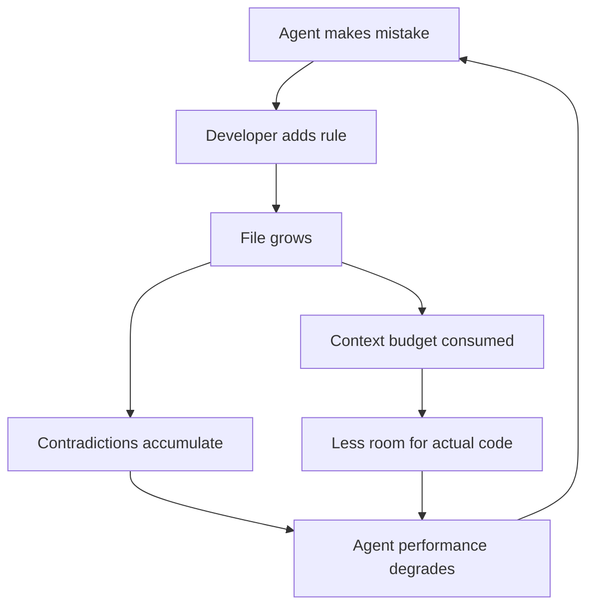

# The AGENTS.md Maturity Curve: How Project Configuration Files Evolve from Wish Lists to Battle-Tested Context


---

Most AGENTS.md files begin as a dumping ground for aspirational rules and end as bloated instruction manuals that actively harm agent performance. The trajectory between those two states — and the narrow path to a genuinely effective configuration — is what this article calls the AGENTS.md maturity curve.

Research published in early 2026 by Gloaguen et al. found that developer-written instruction files can reduce agent runtime by 28.64% and output token consumption by 16.58% [^1]. But the same body of work carries a sharp warning: LLM-generated context files *reduce* task success rates in 5 out of 8 tested settings whilst inflating inference costs by 20–23% [^2]. The difference between these outcomes is not whether you have an AGENTS.md — it is how mature that file is.

## The Four Stages



### Stage 1: The Wish List (Week 1)

Every AGENTS.md starts here. A developer installs Codex CLI, discovers the configuration mechanism, and writes something like:

```markdown
# AGENTS.md

- Use TypeScript
- Follow clean code principles
- Write tests for everything
- Use meaningful variable names
```

This file is harmless but nearly useless. Every instruction is either discoverable from the codebase itself (the `tsconfig.json` already tells the agent it is a TypeScript project) or too vague to constrain behaviour ("clean code principles" means nothing actionable to an LLM) [^3]. The agent processes these tokens on every invocation without changing its output.

**Diagnostic:** If removing your AGENTS.md produces identical agent behaviour, you are at Stage 1.

### Stage 2: Reactive Patches (Months 1–3)

This is where most teams get stuck — and where the damage begins.

Every time the agent makes a mistake, the instinct is to add a rule. The agent used `console.log` instead of the project logger? Add a rule. It created a file in the wrong directory? Add a rule. It forgot to run the formatter? Add another rule [^4].

```markdown
# AGENTS.md (Stage 2 — 247 lines)

## Code Style
- Always use the Winston logger, never console.log
- Use single quotes for strings
- Maximum line length is 120 characters
- Use arrow functions instead of function declarations
- Always destructure props in React components
...

## Testing
- Use Jest for unit tests
- Use Playwright for E2E tests
- Mock all external API calls
- Never use snapshot tests
- Test files must be co-located with source files
...

## Git
- Use conventional commits
- Never force push
- Squash merge feature branches
...
```

The file grows monotonically. Rules are rarely removed because nobody remembers why they were added. Contradictions accumulate silently — "always destructure props" conflicts with "follow existing patterns" when existing components do not destructure. Research across 2,500+ repositories found that files exceeding 150 lines deliver diminishing returns [^5], and Karhade's analysis argues that 80% of typical AGENTS.md content actively degrades performance by 3% whilst increasing costs by 20% [^6].

The mechanism is straightforward: every token of instruction consumes context window budget. At Codex CLI's default `project_doc_max_bytes` of 32 KiB [^7], a bloated AGENTS.md displaces actual code context. Worse, contradictory rules trigger expanded reasoning loops as the model attempts to reconcile them, burning output tokens on deliberation rather than code [^2].

**Diagnostic:** If your AGENTS.md has grown every month but never shrunk, you are at Stage 2.

### Stage 3: Pruned and Modular (Months 3–6)

The transition to Stage 3 requires a counterintuitive insight: **the goal is not to tell the agent everything it should do, but only what it cannot infer from the codebase itself** [^3].

A Stage 3 team applies three operations:

1. **Delete the discoverable.** If ESLint enforces single quotes, the AGENTS.md rule is redundant. If `tsconfig.json` sets `strict: true`, saying "use strict TypeScript" wastes tokens. The agent reads these files.

2. **Delete the enforceable.** Anything a linter, type checker, or CI gate catches should not be in AGENTS.md. Move enforcement to tooling; remove it from instructions.

3. **Split by directory.** Codex CLI concatenates AGENTS.md files from the repository root to the current working directory [^7]. A monorepo benefits from a lean root file (organisational constants) with service-specific overrides in subdirectories:

```
repo/
├── AGENTS.md              # 30 lines: org-wide conventions
├── services/
│   ├── api/
│   │   └── AGENTS.md      # 25 lines: API-specific patterns
│   └── frontend/
│       └── AGENTS.md      # 20 lines: React conventions
└── infrastructure/
    └── AGENTS.md           # 15 lines: Terraform constraints
```

Each file loads only when the agent works in that subtree. The combined budget stays well within 32 KiB, and each file contains only what is locally relevant [^8].

**Diagnostic:** If you have recently *deleted* more rules than you added, you are entering Stage 3.

### Stage 4: Institutional Memory (Month 6+)

A mature AGENTS.md encodes decisions that are genuinely non-obvious — the kind of knowledge that lives in senior engineers' heads and is lost when they leave the team:

```markdown
# AGENTS.md

## Architecture Decisions
- The payments service uses eventual consistency with a 30-second
  reconciliation window. Do NOT add synchronous validation calls
  to the payment flow — this was tried in Q2 2025 and caused
  cascade failures under load (see ADR-047).

## Landmines
- The `legacy_auth` module uses a custom JWT implementation that
  predates our move to Auth0. Do not refactor it — it handles
  3 enterprise clients with non-standard token formats. Migration
  is tracked in JIRA-4521.

## Non-Standard Tooling
- Database migrations use a custom wrapper around Flyway that
  expects migrations in `db/pending/` not `db/migrations/`.
  The wrapper auto-promotes on merge to main.

## Build Commands
- Run tests: `make test-unit` (not `npm test` — the Makefile
  sets required environment variables)
- Full CI locally: `make ci-local` (requires Docker)
```

Notice what is absent: no style rules (the linter handles those), no generic best practices (the agent already knows those), no testing philosophy (the test framework and existing tests demonstrate the pattern). Every line carries information the agent genuinely cannot discover from the code [^3].

The Augment Code guide captures this principle as targeting "non-discoverable info: team decisions, landmines, and non-obvious tooling" [^9].

## Measuring Where You Are

Codex CLI provides a practical diagnostic. Run the following to dump the merged instruction chain for your current working directory:

```bash
codex --print-instructions
```

This outputs every AGENTS.md file that would be loaded, in concatenation order [^7]. Review the output and ask:

1. **How many lines are discoverable from code?** Delete them.
2. **How many lines duplicate linter/CI rules?** Delete them.
3. **How many lines contradict each other?** Resolve or delete.
4. **How many lines encode genuine institutional knowledge?** Keep these.

If more than half the lines survive this audit, your file is already mature. If fewer than 20% survive, you have work to do — but that work is deletion, not addition.

## The Accumulation Trap in Practice

The maturity curve matters because AGENTS.md files are uniquely resistant to maintenance. Unlike code, they have no tests, no type checker, no linter, and no CI gate [^4]. A stale structural reference — documenting a directory layout that changed three months ago — actively misleads the agent into creating files in non-existent paths or following deprecated patterns.



This feedback loop is self-reinforcing. The agent performs worse because of bloated instructions, which triggers more mistakes, which triggers more rules. Breaking the cycle requires treating AGENTS.md as code: reviewing it in PRs, auditing it quarterly, and — critically — deleting rules that duplicate what tooling already enforces [^4].

## Practical Recommendations for Codex CLI Users

**Start lean.** A first AGENTS.md should be 40–60 lines covering build commands and genuine landmines [^9]. Resist the urge to front-load conventions the agent can infer.

**Audit monthly.** Run `codex --print-instructions` and count redundant lines. Target a net reduction each quarter.

**Use the override mechanism.** `AGENTS.override.md` at any level takes precedence over the standard file [^7]. Use it for temporary project-specific context (e.g., an ongoing migration) without polluting the base file. Remove it when the context expires.

**Respect the budget.** The default `project_doc_max_bytes` of 32 KiB is not a target — it is a ceiling. If you are hitting it, your files are almost certainly too long. Splitting by directory is more durable than raising the limit [^8].

**Measure impact.** Track PR merge velocity and review cycle counts before and after AGENTS.md changes [^10]. If a rule addition does not measurably improve outcomes within two weeks, revert it.

**Prefer tooling over instructions.** Every AGENTS.md rule that says "always format with Prettier" is an admission that your pre-commit hooks are misconfigured. Fix the hook; delete the rule.

## Conclusion

The AGENTS.md maturity curve is not a ladder to climb but a pruning exercise to master. The best configuration files are not the longest — they are the ones where every line encodes something the agent genuinely cannot discover on its own. For Codex CLI users running v0.144.5 [^11], the tooling to audit and modularise instruction files is already built in. The discipline to delete what does not earn its context-window budget is the harder part.

---

## Citations

[^1]: Lulla, J., Mohsenimofidi, S., Galster, M., Zhang, J. M., Baltes, S., & Treude, C. (2026). "On the Impact of AGENTS.md Files on the Efficiency of AI Coding Agents." arXiv:2601.20404. [https://arxiv.org/abs/2601.20404](https://arxiv.org/abs/2601.20404)

[^2]: ASDLC.io. (2026). "AGENTS.md Specification: A Research-Backed Guide." [https://asdlc.io/practices/agents-md-spec/](https://asdlc.io/practices/agents-md-spec/)

[^3]: Augment Code. (2026). "How to Build Your AGENTS.md (2026): The Context File That Makes AI Coding Agents Actually Work." [https://www.augmentcode.com/guides/how-to-build-agents-md](https://www.augmentcode.com/guides/how-to-build-agents-md)

[^4]: Allstacks. (2026). "AGENTS.md Files: The Research Says You're Probably Doing Them Wrong." [https://www.allstacks.com/blog/agents-md-files-the-research-says-youre-probably-doing-them-wrong](https://www.allstacks.com/blog/agents-md-files-the-research-says-youre-probably-doing-them-wrong)

[^5]: BetterClaw. (2026). "AGENTS.md Best Practices: Template and Guide (2026)." [https://www.betterclaw.io/blog/agents-md-best-practices](https://www.betterclaw.io/blog/agents-md-best-practices)

[^6]: Karhade, M. (2026). "Delete 80% of AGENTS.md. It is making LLM 3% Stupider and 20% Costlier." Level Up Coding / Medium. [https://levelup.gitconnected.com/delete-80-of-agents-md-it-is-making-llm-3-stupider-and-20-costlier-722a43244830](https://levelup.gitconnected.com/delete-80-of-agents-md-it-is-making-llm-3-stupider-and-20-costlier-722a43244830)

[^7]: OpenAI. (2026). "Custom instructions with AGENTS.md." Codex CLI Documentation. [https://learn.chatgpt.com/docs/agent-configuration/agents-md](https://learn.chatgpt.com/docs/agent-configuration/agents-md)

[^8]: CodeGateway. (2026). "AGENTS.md for Codex CLI (2026): Lookup Order, Limits & Monorepo Templates." [https://www.codegateway.dev/en/blog/agents-md-playbook-2026](https://www.codegateway.dev/en/blog/agents-md-playbook-2026)

[^9]: Crosley, B. (2026). "AGENTS.md Patterns: What Actually Changes Agent Behavior." [https://blakecrosley.com/blog/agents-md-patterns](https://blakecrosley.com/blog/agents-md-patterns)

[^10]: BuildBetter. (2026). "AGENTS.md Complete Guide for Engineering Teams (2026)." [https://blog.buildbetter.ai/agents-md-complete-guide-for-engineering-teams-in-2026/](https://blog.buildbetter.ai/agents-md-complete-guide-for-engineering-teams-in-2026/)

[^11]: OpenAI. (2026). "Codex Changelog — v0.144.5 (16 July 2026)." [https://learn.chatgpt.com/docs/changelog?type=codex-cli](https://learn.chatgpt.com/docs/changelog?type=codex-cli)
