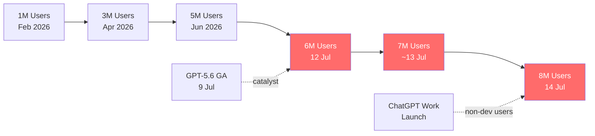
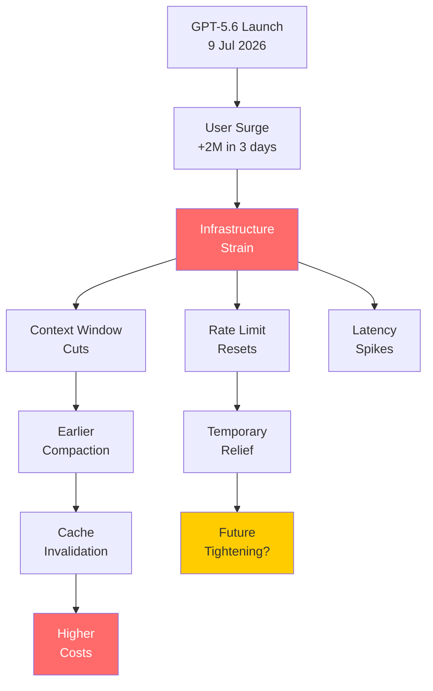

# The 8 Million User Surge: What Codex's Explosive Growth Means for Your CLI Workflows


---

In five months, Codex went from one million to eight million active users[^1]. The final two million arrived in three days[^2]. If you use Codex CLI daily, this is not a vanity metric — it is the explanation for every throttled session, every quietly reduced context window, and every surprise usage reset you have encountered since GPT-5.6 launched on 9 July 2026.

This article examines what changed, why it matters, and how to reconfigure your CLI workflows to stay productive as the platform scales under load.

## The Growth Timeline

The trajectory tells a story of compounding demand:

| Date | Active Users | Event |
|------|-------------|-------|
| February 2026 | ~1 million | Baseline after CLI rewrite and Codex app launch |
| April 2026 | 3 million | First major milestone; Sam Altman commits to resetting limits at each million-user increment[^3] |
| Early June 2026 | 5 million | Steady organic growth |
| 9 July 2026 | — | GPT-5.6 GA; Codex merged into ChatGPT desktop; ChatGPT Work launches |
| 12 July 2026 | 6 million | Announced by Tibo Sottiaux, Codex lead at OpenAI[^2] |
| ~13 July 2026 | 7 million | Roughly 24 hours later[^1] |
| 14 July 2026 | 8 million | Three days after 6 million[^2] |

The catalyst was not a single event but three simultaneous launches on 9 July: GPT-5.6 became the default model across all plan tiers, the standalone Codex desktop app merged into the unified ChatGPT desktop application, and ChatGPT Work launched as a multi-hour workflow agent for non-developers[^4]. Over one million of the eight million users employ Codex for work outside software development[^5].



Sam Altman described the growth as "insane" and warned of potential "inference scaling hiccups"[^5]. Within 48 hours of GPT-5.6 going live, traffic roughly doubled OpenAI's previous peak[^1].

## What Changed Under the Hood

The surge forced OpenAI into a series of infrastructure interventions that directly affect CLI users. Understanding these changes is essential for adjusting your workflows.

### Context Window Reductions

The most impactful change for power users: GPT-5.6 Sol's advertised 1.05 million token context window is not what Codex actually exposes. The platform caps the effective context at 353,400 tokens — roughly 33.7% of the published API specification[^6]. Worse, a further reduction to approximately 258,400 tokens (a 26.9% cut from the already restricted window) was observed around 13 July[^6].

The arithmetic behind the effective limit: the Codex model catalogue allocates 400,000 tokens total, split into 272,000 input and 128,000 reserved output, with the CLI keeping approximately 5% headroom — leaving roughly 258,000 usable input tokens[^6].

For CLI users working with large codebases, this means compaction kicks in earlier. Sessions that previously sustained 30–50 turns before compaction now hit the threshold sooner, invalidating prefix caches and inflating costs.

### Rate Limit Restructuring

OpenAI implemented four interventions within GPT-5.6's launch week[^2]:

1. **10–11 July:** Repeated 100% usage resets across all accounts
2. **12 July:** Removed the 5-hour rolling window; enabled full weekly reset
3. **13 July:** Banked resets rollout; approximately 10% additional quota via inference optimisations
4. **14 July:** Another full usage reset at the 8 million milestone

The 5-hour rate limit suspension is explicitly temporary — a demand-management measure, not a permanent policy change[^4]. When capacity stabilises, expect limits to return.

### Competitive Ripple Effects

Within hours of the 7 million milestone announcement, Anthropic extended Claude Fable 5 promotional pricing through 19 July and bumped Claude Code's weekly usage limits by 50%[^1]. This matters for CLI users running multi-provider workflows: the competitive dynamic creates a brief window of generous limits across both platforms.

## The CLI Developer's Survival Guide

The surge creates three categories of problem for CLI users: quota pressure, context budget pressure, and latency. Here is how to address each.

### 1. Maximise Cache Hits to Stretch Your Quota

Every cache miss costs you ten times more input tokens than a cache hit[^7]. Under quota pressure, cache discipline becomes your primary cost lever.

```toml
# config.toml — stable prefix configuration
[project]
model = "gpt-5.6-sol"
service_tier = "flex"               # 50% cheaper, stacks with cache discount

[project.context]
project_doc_max_bytes = 32768       # keep AGENTS.md under 32 KiB
```

The key principle: keep the early portion of your prompt stable. System instructions, tool definitions, and sandbox configuration must remain identical and consistently ordered between requests[^7]. Reordering tool definitions, changing sandbox configuration mid-session, or modifying AGENTS.md between turns all break the prefix match.

```bash
# Verify your cache hit rate in a codex exec pipeline
codex exec --json "Analyse this module" 2>/dev/null \
  | jq 'select(.type == "turn.completed") | {
      input: .input_tokens,
      cached: .cached_input_tokens,
      hit_rate: (.cached_input_tokens / .input_tokens * 100 | round)
    }'
```

Target 80–90% cache hit rates. Below 70%, audit your prompt structure[^7].

### 2. Manage the Reduced Context Window

With effective input tokens down to ~258,000, proactive context management is no longer optional.

```toml
# config.toml — compaction tuning for constrained windows
[project]
model_auto_compact_token_limit = 200000    # trigger compaction before the wall
model_auto_compact_token_limit_scope = "body_after_prefix"
tool_output_token_limit = 16000            # cap verbose tool output
```

The `body_after_prefix` scope ensures compaction preserves your cached prefix — the most expensive part to regenerate[^8]. Without this, compaction invalidates the entire prefix cache, causing a cost spike precisely when you can least afford one.

For large codebases, use directory-scoped AGENTS.md files to keep context lean:

```
project/
├── AGENTS.md              # global: 20 lines max
├── backend/
│   └── AGENTS.md          # service-specific context
└── frontend/
    └── AGENTS.md          # framework-specific rules
```

### 3. Use Named Profiles for Load-Aware Routing

When Sol is under load, routing non-critical work to cheaper tiers keeps you productive:

```toml
[profiles.heavy]
model = "gpt-5.6-sol"
reasoning_effort = "high"
service_tier = "standard"

[profiles.light]
model = "gpt-5.6-terra"
reasoning_effort = "medium"
service_tier = "flex"

[profiles.batch]
model = "gpt-5.6-luna"
reasoning_effort = "low"
service_tier = "flex"
```

```bash
# Route by task type
codex --profile heavy "Refactor the authentication module"
codex --profile light "Add docstrings to utils.py"
codex --profile batch "Update copyright headers across the repo"
```

GPT-5.6 Sol is 54% more token-efficient on coding tasks than GPT-5.5[^4], but that efficiency gain is irrelevant if you are queued behind eight million other users. Terra at `\$2.50/\$15` per million tokens handles routine tasks at half the cost and typically lower latency during peak hours[^4].

### 4. Schedule `codex exec` Pipelines Off-Peak

Agentic workloads consume resources far faster than interactive chat[^3]. A single `codex exec` pipeline can sustain dozens of sequential API calls, each with full context injection. During peak hours (roughly 09:00–18:00 US Pacific), expect throttling.

```bash
# Run batch analysis overnight
cat files_to_review.txt | while read f; do
  codex exec --profile batch --sandbox read-only \
    "Review $f for security issues" >> review_results.md
  sleep 2  # brief pause to reduce burst pressure
done
```

### 5. Monitor Your Consumption

The surge-era rate limit policy is opaque and subject to change. Track your own usage:

```bash
# Extract token consumption from a session
codex exec --json "Your task here" 2>/dev/null \
  | jq -s '[.[] | select(.type == "turn.completed")] |
    { turns: length,
      total_input: (map(.input_tokens) | add),
      total_cached: (map(.cached_input_tokens) | add),
      total_output: (map(.output_tokens) | add),
      effective_cost_ratio: ((map(.cached_input_tokens) | add) / (map(.input_tokens) | add) * 100 | round)
    }'
```

## The Structural Tension

The fundamental economic challenge is straightforward: automated workloads consume resources faster than humans can[^3]. A developer typing prompts is constrained by typing speed and thinking time — TraceLab data shows 92.3% of session time is human thinking[^9]. But `codex exec` pipelines, GitHub Actions workflows, and multi-agent orchestrations have no such constraint. They will consume whatever quota is available, as fast as infrastructure allows.

OpenAI's \$122 billion funding round (March 2026) enables significant adoption subsidies[^3], but the question of whether heavy agent usage can produce attractive margins remains open. The current rate limit policy — generous resets to drive adoption, with future tightening implied — is a deliberate strategy, not a permanent state[^3].



## What to Watch

Three indicators will signal how this plays out:

1. **Context window policy.** If the 258K effective limit persists or shrinks further, it signals sustained capacity constraints. If it creeps back towards the 1.05M spec, infrastructure has caught up.

2. **Rate limit permanence.** The 5-hour window removal is temporary[^4]. Watch for its return — and whether banked resets survive as a permanent mechanism.

3. **Competitive pricing.** Anthropic's reactive limit bumps and promotional extensions[^1] suggest the coding agent market is now a distribution war fought on usage economics, not just model quality. ⚠️ Whether this dynamic sustains through Q3 2026 is uncertain.

## Practical Recommendations

| Problem | CLI Solution |
|---------|-------------|
| Quota exhaustion | Switch to `flex` service tier; use Terra/Luna for routine tasks |
| Context window cuts | Set `model_auto_compact_token_limit` below 200K; scope compaction to `body_after_prefix` |
| Cache misses | Stabilise prompt prefix; avoid mid-session AGENTS.md edits |
| Peak-hour latency | Schedule `codex exec` pipelines off-peak; use `--json` for machine-readable output |
| Consumption opacity | Extract token metrics from `turn.completed` JSONL events |

The 8 million user milestone is a distribution achievement. For CLI developers, it is also a configuration problem. The same task can cost 5 credits or 40 credits depending on your profile, reasoning effort, and cache discipline[^7]. In a world where rate limits are the binding constraint, efficiency is not optional — it is your competitive advantage.

## Citations

[^1]: [OpenAI hits 8 million Codex users — what developers need to know](https://thenewstack.io/gpt-5-6-codex-user-surge/), The New Stack, July 2026
[^2]: [Codex 8M Users GPT-5.6 Sol — July 2026](https://explainx.ai/blog/openai-codex-chatgpt-work-8-million-users-gpt-5-6-sol-july-2026), ExplainX, July 2026
[^3]: [OpenAI's Codex limit reset shows coding agents are entering costly scale](https://startupfortune.com/openais-codex-limit-reset-shows-coding-agents-are-entering-costly-scale/), Startup Fortune, 2026
[^4]: [Codex Hits 8 Million Users: What the GPT-5.6 Surge Means for Developers](https://www.developersdigest.tech/blog/codex-8m-users-developer-guide-2026), Developers Digest, July 2026
[^5]: [OpenAI says Codex and ChatGPT Work reach 8 million active users](https://cryptobriefing.com/codex-8-million-users-daily-resets/), CryptoBriefing, July 2026
[^6]: [GPT-5.6 Sol context cut again: 353K → 258K despite advertised 1.05M (Issue #32806)](https://github.com/openai/codex/issues/32806), openai/codex, July 2026
[^7]: [Prompt Caching in Codex CLI: How the Agent Loop Stays Linear and How to Maximise Cache Hits](https://codex.danielvaughan.com/2026/04/21/codex-cli-prompt-caching-maximise-cache-hits-cost-reduction/), Codex Knowledge Base, April 2026
[^8]: [TraceLab and the Anatomy of a Coding Agent Workload](https://arxiv.org/abs/2606.30560), Zhu et al., arXiv:2606.30560, June 2026
[^9]: [TraceLab: first public trace of 4,265 coding-agent sessions](https://arxiv.org/abs/2606.30560), Zhu et al., arXiv:2606.30560, June 2026
