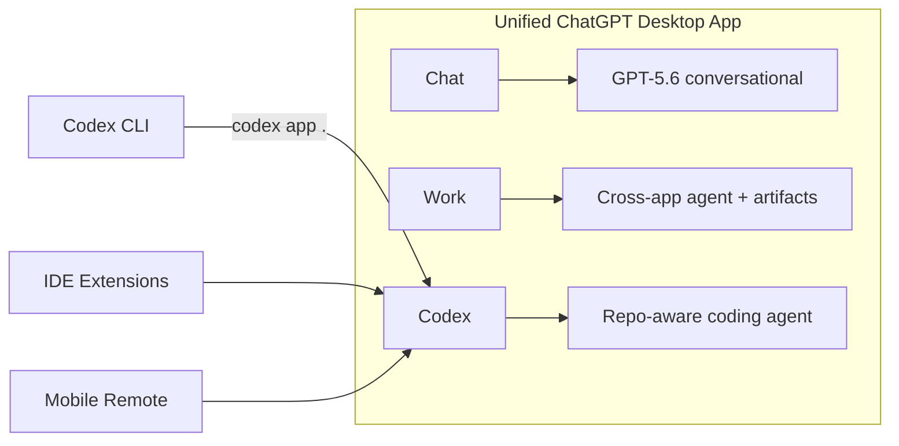
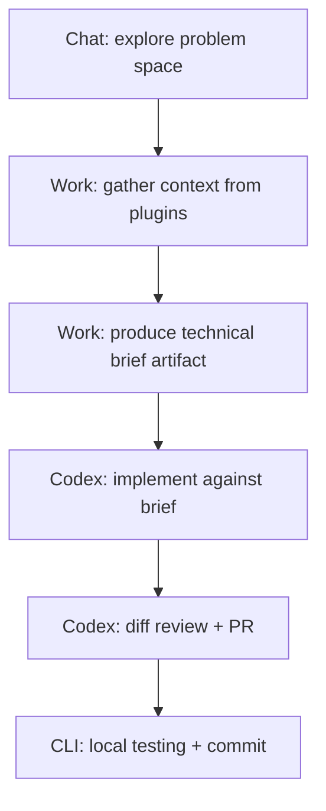

# After the Merger: Navigating the Codex-to-ChatGPT Desktop Unification from the CLI


---

## What Happened on 9 July 2026

On 9 July 2026 OpenAI shipped the most significant structural change to the Codex desktop experience since its February 2026 launch: the standalone Codex app was absorbed into the new unified ChatGPT desktop application for macOS and Windows [^1]. The update repackaged three distinct product surfaces — Chat, ChatGPT Work, and Codex — into a single desktop shell, available on every ChatGPT plan including Free [^2].

For most users the change was seamless: open the Codex app, accept the update, and the binary silently renamed itself to `ChatGPT.app` (macOS) or `ChatGPT.exe` (Windows). But for CLI-centric developers who rely on `codex app` to bridge terminal and GUI, the merger introduced a chain of small breakages that deserve attention.

## The Three-Mode Architecture

The unified app is not a merger of features — it is a distribution consolidation [^3]. Each mode retains its own execution context:



- **Chat** is the conversational interface, unchanged from the previous ChatGPT desktop app.
- **Work** (also launched 9 July) is an agent that gathers context from connected plugins — Slack, Google Drive, SharePoint, calendars — and produces long-running artifacts such as documents, slide decks, spreadsheets, and sites [^4]. It runs on GPT-5.6 and can work autonomously for hours.
- **Codex** retains its full coding surface: inline diff editing, side-panel pull request review, parallel threads with per-thread Git worktrees, and multi-repository project support [^1].

The critical detail for CLI users: **Codex still owns the implementation loop**. The app server protocol, WebSocket transport, and Unix socket connections are unchanged [^3]. Your `config.toml`, AGENTS.md, and project configuration all carry over without modification.

## The `codex app` Detection Bug

The first thing you will notice after updating is that `codex app .` no longer works as expected.

### Root Cause

The CLI binary (v0.144.1 and later) uses a hardcoded filesystem lookup for `Codex.app` on macOS [^5]. After the merger, the application lives at `/Applications/ChatGPT.app` with bundle ID `com.openai.codex`. The name-based lookup fails on every migrated system.

### Symptoms

```bash
$ codex app .
# Output: "Codex Desktop not found; downloading installer..."
```

The CLI then downloads the current ChatGPT installer, mounts it as `ChatGPT Installer`, but copies the contained bundle to `/Applications/Codex.app` — leaving you with two installed copies of effectively the same application [^5].

### The Workaround

Until the fix lands (the proposed solution is bundle-ID-based detection via `com.openai.codex` rather than filename matching), use the macOS `open` command directly:

```bash
# Open current directory in the unified ChatGPT app's Codex mode
open -a ChatGPT .

# Or with a specific project path
open -a ChatGPT /path/to/your/project
```

This works because `ChatGPT.app` declares folder support in its document types [^5]. On Windows, the equivalent is launching `ChatGPT.exe` with the workspace path argument.

If you have already ended up with a duplicate `Codex.app`, clean up is straightforward:

```bash
# Remove the duplicate (the unified app is the one you want)
rm -rf /Applications/Codex.app

# Verify the unified app is present
ls -la /Applications/ChatGPT.app
```

### Shell Alias for Muscle Memory

If `codex app .` is burned into your workflow, a shell alias bridges the gap until the CLI is patched:

```bash
# Add to ~/.zshrc or ~/.bashrc
codex-app() {
    local dir="${1:-.}"
    open -a ChatGPT "$dir"
}
alias codex-open='codex-app'
```

## What Changed for Your Daily Workflow

### Configuration Survives Intact

Your `~/.codex/config.toml` is read by the CLI binary, not the desktop app [^6]. The unified app reads the same project-level configuration (AGENTS.md, `.codex/` directory) as before. No configuration migration is necessary.

### Default View and Branding

If you prefer the Codex-first experience, the unified app allows you to set Codex as the default opening view and select the Codex logo as the app icon [^1]. This is purely cosmetic but reduces friction if you rarely use Chat or Work.

To set Codex as the default view: open the app, navigate to Settings, and under "Appearance" select "Codex" as the default mode.

### The Mode Handoff Pattern

The strongest workflow emerging from the unified app uses **mode handoff** [^3]:



1. **Chat** for exploratory conversation — understanding requirements, discussing architecture.
2. **Work** for context gathering — pulling data from Slack threads, Confluence pages, Jira tickets via plugins, and producing a structured brief.
3. **Codex** for implementation — writing code, reviewing diffs, opening PRs.
4. **CLI** for the final mile — local testing, commit signing, and push.

This pattern keeps each mode doing what it does best rather than forcing Codex to gather non-code context or Chat to produce implementation artifacts.

### Launchpad and Spotlight Considerations

A secondary issue reported post-migration is that the unified app may not appear in Launchpad on macOS despite being present in `/Applications/` [^7]. Rebuilding the Launchpad database resolves this:

```bash
defaults write com.apple.dock ResetLaunchPad -bool true && killall Dock
```

Spotlight typically reindexes within a few minutes of the rename, but you can force it:

```bash
mdutil -E /Applications/ChatGPT.app
```

## The `codex app-server` Path Is Unaffected

For developers running Codex in headless or remote configurations, the `codex app-server` command remains unchanged [^6]. It binds to a local Unix socket or WebSocket endpoint and speaks the same protocol regardless of whether the desktop consumer is called `Codex.app` or `ChatGPT.app`. If you are using `codex app-server` for CI/CD integration or remote development, the merger has zero impact on your setup.

## ChatGPT Classic: The Old App Is Not Dead Yet

The previous standalone ChatGPT desktop app has been renamed to **ChatGPT Classic** [^1]. It will continue to receive updates for a transition period but lacks access to Work mode and the new Codex features (inline diff editing, multi-repo projects). If you spot `ChatGPT Classic.app` in your Applications folder alongside `ChatGPT.app`, you can safely remove the Classic version once you have confirmed the unified app works correctly.

## Timeline for the CLI Fix

Issue #32631 on the Codex repository tracks the `codex app` detection bug [^5]. The proposed fix — switching from filesystem name matching to `com.openai.codex` bundle ID detection via `mdfind` or `lsregister` — is straightforward, and the issue has received triage attention. A related issue (#31944) covers the same symptom from a slightly different entry path [^8]. Expect a fix in an upcoming point release (likely v0.144.6 or v0.145.0), but in the meantime the `open -a ChatGPT` workaround is fully reliable.

## Practical Recommendations

1. **Update the Codex app normally** — the migration is automatic and preserves all projects and tasks.
2. **Use `open -a ChatGPT .` instead of `codex app .`** until the CLI detection bug is patched.
3. **Remove duplicate `Codex.app`** if the CLI created one before you applied the workaround.
4. **Set Codex as the default view** if you rarely use Chat or Work.
5. **Explore the mode handoff pattern** — let Work gather cross-tool context before handing scoped tasks to Codex.
6. **Do not touch your `config.toml` or AGENTS.md** — no configuration changes are needed.

---

## Citations

[^1]: OpenAI, "Codex Merged With ChatGPT App: What Changed & How to Access," Coursiv Blog, July 2026. [https://coursiv.io/blog/codex-merged-with-chatgpt-app](https://coursiv.io/blog/codex-merged-with-chatgpt-app)

[^2]: TechTimes, "ChatGPT Work Is Free on Every Plan: What OpenAI's Codex Merger Changes for You," July 2026. [https://www.techtimes.com/articles/320087/20260710/chatgpt-work-free-every-plan-what-openais-codex-merger-changes-you.htm](https://www.techtimes.com/articles/320087/20260710/chatgpt-work-free-every-plan-what-openais-codex-merger-changes-you.htm)

[^3]: Developers Digest, "ChatGPT Work and Codex Now Share One Desktop App: What Actually Changed," July 2026. [https://www.developersdigest.tech/blog/chatgpt-work-codex-desktop-app](https://www.developersdigest.tech/blog/chatgpt-work-codex-desktop-app)

[^4]: OpenAI, "ChatGPT is now a partner for your most ambitious work," July 2026. [https://openai.com/index/chatgpt-for-your-most-ambitious-work/](https://openai.com/index/chatgpt-for-your-most-ambitious-work/)

[^5]: GitHub Issue #32631, "`codex app` fails to detect the unified ChatGPT.app and downloads the installer," openai/codex, July 2026. [https://github.com/openai/codex/issues/32631](https://github.com/openai/codex/issues/32631)

[^6]: OpenAI, "Developer commands — Codex CLI Reference," ChatGPT Learn, 2026. [https://learn.chatgpt.com/docs/developer-commands?surface=cli](https://learn.chatgpt.com/docs/developer-commands?surface=cli)

[^7]: GitHub Issue #32022, "macOS: Codex to ChatGPT.app migration leaves unified app missing from Launchpad," openai/codex, July 2026. [https://github.com/openai/codex/issues/32022](https://github.com/openai/codex/issues/32022)

[^8]: GitHub Issue #31944, "macOS: `codex app` ignores installed ChatGPT," openai/codex, July 2026. [https://github.com/openai/codex/issues/31944](https://github.com/openai/codex/issues/31944)
