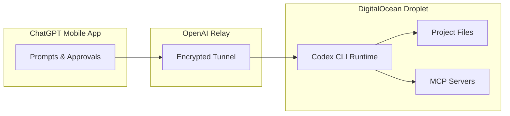
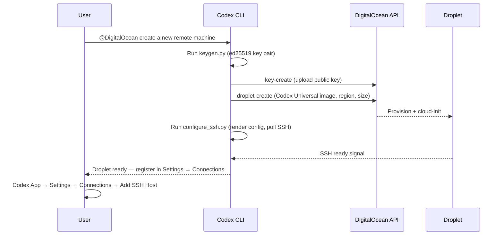

# From Prompt to Droplet: Using the DigitalOcean Plugin to Provision Cloud Workspaces for Codex Remote


---

Running Codex on your laptop works until your laptop sleeps, your Wi-Fi drops, or a four-hour refactoring session drains your battery to single digits. Codex Remote — which reached general availability on 25 June 2026 [^1] — solves the execution-continuity problem by moving the agent runtime to a persistent host and routing control through the ChatGPT mobile app. The DigitalOcean CodexPlugin takes this a step further: it provisions a cloud Droplet from conversation, wires up SSH, and hands the workspace back to Codex — no `doctl`, no API tokens, no manual infrastructure plumbing [^2].

This article walks through the plugin's architecture, the provisioning flow, workspace configuration, and the cost and security trade-offs that matter when you treat a Droplet as a disposable development environment.

## Why Cloud Workspaces for Codex?

Codex Remote decouples the agent's execution environment from the control surface. Your phone becomes the approval layer; the host — a Mac, a Windows machine, or a cloud VM — does the actual work [^3]. The architectural split looks like this:



What stays on the host: repository files, shell commands, credentials, plugins, and MCP servers. What travels to the phone: prompts, approvals, screenshots, terminal output, diffs, and test results [^3]. A DigitalOcean Droplet is attractive here because it runs independently of your laptop's power state — the entire point of provisioning one instead of SSH-ing into your desk machine.

## The Codex Universal Image

DigitalOcean publishes a marketplace image called **Codex Universal** (image ID `233103029`) built on Ubuntu 24.04 LTS [^4]. It ships with:

| Component | Default Version |
|-----------|----------------|
| Python | 3.12 |
| Node.js | 20 |
| Rust | 1.87 |
| Go | 1.23 |
| Docker + Compose | Latest stable |
| Additional runtimes | Ruby, PHP, Java, Swift, Bun, Bazelisk, Erlang, Elixir |

The image sources from `ghcr.io/openai/codex-universal`, pinned by digest for reproducible builds [^4]. A `systemd` service (`codex-universal.service`) keeps the container running, and UFW restricts inbound traffic to rate-limited SSH [^4].

### Sizing Recommendations

| Scenario | vCPU | RAM | Disk |
|----------|------|-----|------|
| Minimum viable | 2 | 4 GB | 50 GB |
| Recommended | 4 | 8 GB | 80 GB |

The recommended 4 vCPU / 8 GB configuration costs approximately \$48/month or \$0.071/hour on DigitalOcean's per-second billing (minimum charge \$0.01 or 60 seconds, whichever is higher) [^5]. For short-lived sessions — spin up, run a migration, tear down — costs can stay well under a dollar.

### Customising Language Versions

Every runtime version is overridable via `CODEX_ENV_*` environment variables, either at Droplet creation or by editing `/opt/codex-universal/.env` [^4]:

```bash
# Override at creation via user data
CODEX_ENV_PYTHON_VERSION=3.13
CODEX_ENV_NODE_VERSION=22
CODEX_ENV_RUST_VERSION=1.88
CODEX_ENV_GO_VERSION=1.24
```

## Plugin Architecture

The CodexPlugin repository [^2] follows a standard Codex plugin layout:

```
.codex-plugin/
  plugin.json          # Manifest: name, version, skill/app paths
.app.json              # Dependency binding to DigitalOcean OAuth app
skills/
  provision-droplet/
    SKILL.md           # Orchestration workflow
    keygen.py          # ed25519 SSH key generation
    configure_ssh.py   # SSH config rendering + connectivity polling
    ssh_config.tmpl    # Template for ~/.ssh/config entries
```

The plugin depends on an installed DigitalOcean app (bound via `.app.json`) that provides OAuth authentication — eliminating API token management entirely [^2]. All scripts use Python's standard library only, keeping the dependency surface minimal.

### Key Generation

`keygen.py` generates ed25519 key pairs with deterministic naming in `adjective-noun-hex4` format (e.g., `swift-falcon-a3b2`). The naming scheme makes it trivial to identify which key belongs to which ephemeral Droplet when you inevitably accumulate a few [^2].

### SSH Configuration

`configure_ssh.py` renders the `ssh_config.tmpl` template into `~/.ssh/config`, populating four variables [^2]:


```
Host {{ALIAS}}
  HostName {{IP}}
  User {{USER}}
  IdentityFile {{IDENTITY_FILE}}
  StrictHostKeyChecking accept-new
```


The script then polls SSH connectivity, waiting for cloud-init to complete before signalling `DROPLET READY`.

## The Provisioning Flow

The end-to-end sequence from conversation to connected workspace:



The interactive step — manually registering the SSH host in the Codex App — is a deliberate design choice. No CLI endpoint exists yet for programmatic registration, so the final handshake requires the desktop UI [^2].

### Step by Step

1. **Install the plugin** from the Codex plugin directory. Connect your DigitalOcean account via OAuth during installation [^2].
2. **Invoke the skill**: `@DigitalOcean create a new remote machine`. Codex prompts for region and Droplet size with sensible defaults [^2].
3. **Wait for provisioning** — typically 60–90 seconds. The plugin generates the SSH key, uploads it, creates the Droplet, and polls until cloud-init finishes.
4. **Register the host**: navigate to **Codex App → Settings → Connections → Add SSH Host** and select the newly configured alias [^3].
5. **Connect from mobile**: open the ChatGPT app, select the workspace, and approve the QR pairing if this is a new device [^1].

### Connecting an Existing Droplet

If you already have a running Droplet:

```
@DigitalOcean connect <droplet_id>
```

This skips provisioning and jumps straight to SSH key exchange and host registration [^2].

## QR Pairing and the Security Model

Codex Remote uses authenticated one-to-one QR pairing between each mobile device and each host [^1]. Connections established since 8 June 2026 survived the GA rollout; older inactive pairings require re-authentication [^1].

The CLI also exposes a manual pairing path for headless setups:

```bash
codex remote-control pair
```

This generates a pairing code that can be entered on the mobile app without scanning a QR code — useful when provisioning cloud workspaces from a terminal-only session [^1].

Trust flows through the ChatGPT account. There is no separate relay credential. This means account compromise grants full host access — a risk worth weighing when the host holds production credentials [^3]. For ephemeral Droplets this is somewhat mitigated: the workspace is disposable, and credentials should live in environment variables or secret managers rather than on disk.

## Workspace Persistence and Lifecycle

The Codex Universal image mounts a persistent workspace directory at `/root/workspace` on the host, mapped to `/workspace` inside the container [^4]. This survives container restarts but not Droplet deletion.

Droplets are billed per second until you delete them [^5] [^2]. There is no auto-shutdown. If you forget a Droplet running overnight at the recommended spec, that is roughly \$1.70 — not catastrophic, but it accumulates. Consider:

- **Tagging Droplets** with a `codex-ephemeral` tag and running a nightly cleanup script via the DigitalOcean API
- **Using the plugin's `droplet-delete` tool** from Codex itself: ask Codex to tear down the workspace when you are done
- **Setting a DigitalOcean alert** for Droplets exceeding a spending threshold

## Practical Patterns

### Pattern 1: The Overnight Migration

Spin up a Droplet, point Codex at a database migration suite, approve the initial plan from your phone, and let it run while you sleep. Review results over coffee from the ChatGPT app the next morning. Delete the Droplet.

### Pattern 2: The CI Debugging Sandbox

When a CI failure is hard to reproduce locally, provision a Droplet matching your CI runner's specs (Ubuntu 24.04, same language versions via `CODEX_ENV_*`). Clone the repo, reproduce the failure, and let Codex iterate on fixes with full write access.

### Pattern 3: The Multi-Cloud Agent

Combine the DigitalOcean plugin with MCP servers connected to AWS, GCP, or Azure. The Droplet becomes a neutral execution environment that can orchestrate across cloud providers without inheriting your laptop's credential sprawl.

## Current Limitations

- **No programmatic host registration**: the final Codex App step is manual [^2].
- **Single-user Droplets**: the Codex Universal image is designed for one developer. Team sharing requires separate Droplets per user.
- **No auto-shutdown**: Droplets run (and bill) until explicitly deleted [^5].
- **Region-specific availability**: the Codex Universal marketplace image may not be available in all DigitalOcean regions.

## Configuration Reference

A minimal `config.toml` snippet for routing Codex sessions to a remote workspace:

```toml
# Point Codex at a remote host
[remote]
default_host = "swift-falcon-a3b2"    # SSH alias from plugin
workspace_path = "/workspace"

# Recommended model settings for remote sessions
model = "o4-mini"
model_reasoning_effort = "medium"
```

## Conclusion

The DigitalOcean CodexPlugin collapses the gap between "I need a cloud dev environment" and having one. The provisioning flow is conversational, the image is batteries-included, and Codex Remote's QR pairing makes the phone-to-Droplet control loop surprisingly seamless. The main rough edge — manual host registration — is a solvable workflow friction, not a fundamental limitation. For developers already using Codex Remote, adding a cloud workspace is a single prompt away.

---

## Citations

[^1]: OpenAI, "Codex Changelog — Codex Remote GA, QR Pairing," *ChatGPT Learn*, 25 June 2026. [https://learn.chatgpt.com/docs/changelog](https://learn.chatgpt.com/docs/changelog)

[^2]: DigitalOcean, "CodexPlugin — GitHub Repository," *GitHub*, 2026. [https://github.com/digitalocean/CodexPlugin](https://github.com/digitalocean/CodexPlugin)

[^3]: MCP Directory, "Codex Remote: Control Codex From Your Phone," *MCP Directory Blog*, 2026. [https://mcp.directory/blog/codex-remote-guide-2026](https://mcp.directory/blog/codex-remote-guide-2026)

[^4]: DigitalOcean, "Codex Universal — Marketplace Catalog," *DigitalOcean Documentation*, 2026. [https://docs.digitalocean.com/products/marketplace/catalog/codex-universal/](https://docs.digitalocean.com/products/marketplace/catalog/codex-universal/)

[^5]: DigitalOcean, "Droplet Pricing," *DigitalOcean Documentation*, 2026. [https://docs.digitalocean.com/products/droplets/details/pricing/](https://docs.digitalocean.com/products/droplets/details/pricing/)
