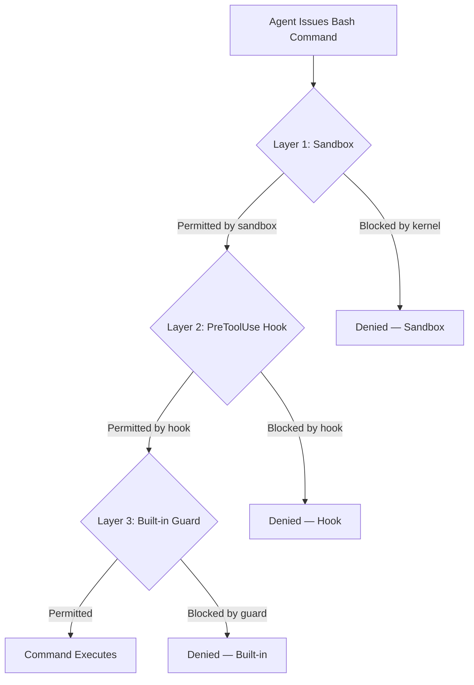
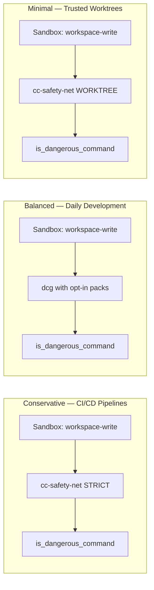

# Destructive Command Defence in Depth: Codex CLI's Built-In Guards, cc-safety-net, and the PreToolUse Hook Ecosystem


---

On 16 July 2026, Codex CLI v0.144.5 shipped an expanded `is_dangerous_command` function that catches additional forced `rm` variants and returns clearer rejection reasons when commands are denied [^1]. That same week, cc-safety-net — a cross-agent PreToolUse hook — crossed seven supported agent CLIs [^2], while the Rust-based Destructive Command Guard (dcg) reached fifty modular detection packs with SIMD-accelerated regex [^3]. A third project, codex-protect, takes a minimal two-layer approach targeting Codex CLI specifically [^4].

This convergence raises a practical question for senior engineers: how do these layers compose, and which combination delivers genuine defence in depth without drowning you in approval fatigue?

## The Three-Layer Model

Every coding agent safety architecture reduces to three complementary layers. None is sufficient alone; each covers blind spots the others miss.



**Layer 1 — Kernel sandbox.** Codex CLI's Landlock (Linux) and Seatbelt (macOS) sandbox restricts filesystem writes to the workspace directory and disables network by default [^5]. The sandbox is the blast-radius container: it prevents unknown-unknowns like writing to `~/.ssh` or exfiltrating data. But it intentionally permits destructive operations *within* the workspace — `rm -rf src/` is a valid workspace write.

**Layer 2 — PreToolUse hooks.** These intercept every tool call *before* it reaches the shell, applying semantic analysis to the command string. They catch known-destructive patterns that the sandbox permits. Community hooks like cc-safety-net, dcg, and codex-protect operate at this layer.

**Layer 3 — Built-in guards.** Codex CLI's `is_dangerous_command` function performs lightweight pattern matching and forces approval for commands it flags [^1]. This is the last line of defence before execution.

## Layer 3: Codex CLI's `is_dangerous_command`

The built-in guard has evolved across several releases:

| Version | Date | Change |
|---------|------|--------|
| 0.42.0 | March 2026 | Initial dangerous-command detection; `rm -f`, `git reset`, `sudo` forced to approval [^6] |
| 0.144.2 | July 2026 | Restored Guardian auto-review policy after prompting regression rollback [^1] |
| 0.144.5 | 16 July 2026 | Expanded `is_dangerous_command` for additional forced `rm` forms; clearer rejection reasons [^1] |

The guard is intentionally conservative. It catches the most common footguns — `rm -rf`, `git reset --hard`, `sudo` — but does not attempt deep semantic analysis, shell wrapper recursion, or interpreter one-liner scanning. That restraint is a design choice: false positives in the built-in layer cause approval fatigue that degrades the user experience for every Codex CLI user globally.

The implication: if your threat model extends beyond basic `rm` variants, you need a PreToolUse hook.

## Layer 2: The PreToolUse Hook Ecosystem

Three community projects have emerged to fill the semantic analysis gap. Each takes a different architectural approach.

### cc-safety-net

cc-safety-net is a Node.js-based PreToolUse hook supporting seven agent CLIs: Codex, Claude Code, Gemini CLI, GitHub Copilot CLI, Kimi Code, OpenCode, and Pi [^2].

**Key architectural decisions:**

- **Semantic parsing over string matching.** The hook understands command *intent*, so flag reordering (`rm -f -r` vs `rm -rf`) and shell wrapper nesting (`bash -c 'rm -rf /'`) cannot bypass detection [^2].
- **Recursive interpreter analysis.** Scans up to ten levels of `bash -c`, `sh -c`, `python -c`, `node -e`, `ruby -e`, and `perl -e` nesting for destructive operations [^2].
- **Fail-closed design** (in strict mode). Malformed input, unparseable commands, and invalid configuration trigger blocks rather than permitting execution [^2].

**Configuration for Codex CLI:**

```toml
# ~/.codex/config.toml — enable plugin hooks
[hooks]
enabled = true
```

After enabling hooks, install via the TUI:

```bash
# In Codex CLI TUI:
# /plugins → select [cc-marketplace] → install
# /hooks → select safety-net PreToolUse hook → press 't' to trust
```

**Operational modes** are controlled via environment variables:

```bash
# Standard mode — blocks known destructive patterns
export CC_SAFETY_NET_STRICT=0

# Strict mode — fail-closed on unparseable commands
export CC_SAFETY_NET_STRICT=1

# Paranoid mode — enhanced restrictions
export CC_SAFETY_NET_PARANOID=1

# Selective paranoid — rm-only or interpreter-only
export CC_SAFETY_NET_PARANOID_RM=1
export CC_SAFETY_NET_PARANOID_INTERPRETERS=1

# Worktree mode — relaxes git discards in verified linked worktrees
export CC_SAFETY_NET_WORKTREE=1
```

Every blocked command logs to `~/.cc-safety-net/logs/<session_id>.jsonl` with automatic secret redaction [^2]. The `npx cc-safety-net doctor` diagnostic and `npx cc-safety-net explain "git reset --hard"` step-by-step analysis tools are invaluable for debugging false positives.

### Destructive Command Guard (dcg)

dcg takes the opposite architectural bet: Rust for performance, modular detection packs for extensibility [^3].

**Key architectural decisions:**

- **SIMD-accelerated regex.** Sub-millisecond latency ensures the hook never becomes a bottleneck in rapid tool-call sequences [^3].
- **Fifty modular packs** organised by category: always-on (filesystem, git, disk), platform-specific (Windows), and opt-in (PostgreSQL, MySQL, MongoDB, Redis, Kubernetes, Docker, AWS/Azure/GCP, Terraform, DNS, CI/CD) [^3].
- **Fail-open design.** Timeouts and parsing errors permit execution rather than blocking — the inverse of cc-safety-net's strict mode [^3].
- **Agent-specific profiles.** Trust-based rule customisation via `disabled_packs`, `extra_packs`, and `additional_allowlist` per agent [^3].

```toml
# ~/.config/dcg/config.toml
[codex]
disabled_packs = ["docker"]
extra_packs = ["kubernetes", "terraform"]
additional_allowlist = ["rm -rf ./dist"]
```

dcg also scans heredocs and inline scripts for hidden destructive patterns — catching `cat <<EOF | bash` constructs that string-matching guards miss entirely [^3].

### codex-protect

codex-protect is a minimal, Codex-specific guard using Bun as its runtime [^4]. Its two-layer design combines native Codex prefix rules for direct command blocking with a PreToolUse hook for compound and wrapped commands. It uniquely blocks publishing actions — `git push`, `gh api` write operations, PR merges, and release mutations — making it suited to environments where agents should never touch the remote [^4].

## Composing the Layers

The three community hooks are not mutually exclusive, but running multiple PreToolUse hooks adds latency to every tool call. The practical composition depends on your threat model:



**Conservative (CI/CD, shared infrastructure):** cc-safety-net in strict mode. Fail-closed semantics mean unparseable commands never execute — essential when no human is watching. Pair with `sandbox_mode = "workspace-write"` and network disabled.

**Balanced (daily development):** dcg with opt-in packs matching your stack. The modular approach avoids false positives from irrelevant categories (no need for Kubernetes packs on a frontend project). Sub-millisecond latency keeps the workflow responsive.

**Minimal (feature branches in git worktrees):** cc-safety-net with `CC_SAFETY_NET_WORKTREE=1` relaxes git-discard blocking in verified linked worktrees, where the cost of losing uncommitted changes is low because `main` is untouched.

## Fleet Enforcement via requirements.toml

Individual developers can disable hooks. Fleet administrators cannot rely on voluntary adoption. Codex CLI's `requirements.toml` provides the enforcement mechanism [^7]:

```toml
# requirements.toml — admin-enforced, cannot be overridden
[sandbox]
mode = "workspace-write"
network = false

[hooks]
required_pretooluse = ["cc-safety-net"]

[approval_policy]
dangerous_commands = "always-approve"
```

When a developer's local `config.toml` conflicts with `requirements.toml`, Codex CLI falls back to the nearest allowed value and notifies the user [^7]. This ensures that the PreToolUse hook layer cannot be silently bypassed.

## The Fail-Open vs Fail-Closed Decision

The sharpest architectural divide in this ecosystem is between fail-open (dcg) and fail-closed (cc-safety-net strict mode). Neither is universally correct:

| Concern | Fail-Open (dcg) | Fail-Closed (cc-safety-net strict) |
|---------|-----------------|-------------------------------------|
| Unparseable commands | Execute | Block |
| Timeout behaviour | Execute | Block |
| False positive rate | Lower | Higher |
| False negative rate | Higher | Lower |
| Best for | Interactive development | Unattended automation |
| Worst case | Destructive command slips through | Legitimate workflow blocked |

For interactive sessions where a developer is watching the approval dialog, fail-open is pragmatic — the human is the final backstop. For `codex exec` pipelines and CI integration, fail-closed is the only defensible choice: there is no human to catch what the hook misses.

## Auditing and Diagnostics

All three layers produce audit signals:

- **Sandbox:** Kernel-level denial logs (Landlock `EACCES`, Seatbelt violations in Console.app)
- **cc-safety-net:** JSONL session logs at `~/.cc-safety-net/logs/` with secret redaction [^2]
- **dcg:** Structured logs via configurable output
- **is_dangerous_command:** Rejection reasons now included in CLI output as of v0.144.5 [^1]

For fleet-wide visibility, pipe hook logs to your existing observability stack. The JSONL format from cc-safety-net maps directly to structured log ingestion in Datadog, Grafana Loki, or CloudWatch Logs.

## Limitations and Open Gaps

⚠️ **No hook inspects tool calls other than Bash.** MCP tool invocations, file writes via the `Write` tool, and network requests via dedicated tools bypass the entire PreToolUse hook ecosystem. The sandbox remains the only defence for non-Bash operations.

⚠️ **Interpreter coverage is incomplete.** cc-safety-net scans six interpreters; dcg scans heredocs and inline scripts. Neither covers every possible code-execution vector (e.g., `lua -e`, `awk` with system calls, compiled binaries).

⚠️ **Approval fatigue is a real risk.** Overly aggressive hook configuration trains developers to approve without reading — the same failure mode documented in the 94% sabotage-detection study [^8]. Tune your packs and modes to your actual threat surface.

## Recommendations

1. **Always run the sandbox.** It is the only layer that covers unknown-unknowns and non-Bash operations.
2. **Add exactly one PreToolUse hook.** Pick cc-safety-net for cross-agent consistency or dcg for performance and modular packs. Running both adds latency with marginal detection gain.
3. **Match fail-open/fail-closed to your supervision model.** Interactive → fail-open. Unattended → fail-closed.
4. **Use `requirements.toml` for fleet enforcement.** Do not rely on developers opting in.
5. **Review your audit logs weekly.** Blocked commands reveal what your agents are attempting — and whether your AGENTS.md constraints need tightening.

---

## Citations

[^1]: OpenAI, "Codex CLI Releases — v0.144.5," GitHub, 16 July 2026. [https://github.com/openai/codex/releases](https://github.com/openai/codex/releases)

[^2]: kenryu42, "cc-safety-net: A coding agent CLI hook that acts as a safety net," GitHub, 2026. [https://github.com/kenryu42/cc-safety-net](https://github.com/kenryu42/cc-safety-net)

[^3]: Dicklesworthstone, "Destructive Command Guard (dcg)," GitHub, 2026. [https://github.com/Dicklesworthstone/destructive_command_guard](https://github.com/Dicklesworthstone/destructive_command_guard)

[^4]: vanzan01, "codex-protect: Destructive command guardrails for OpenAI Codex agents," GitHub, 2026. [https://github.com/vanzan01/codex-protect](https://github.com/vanzan01/codex-protect)

[^5]: OpenAI, "Codex CLI — Sandbox and Permissions," OpenAI Developers, 2026. [https://developers.openai.com/codex/cli](https://developers.openai.com/codex/cli)

[^6]: SmartScope, "Codex CLI 0.42+ Dangerous Command Automation Workflow Implementation Guide," 2026. [https://smartscope.blog/en/generative-ai/chatgpt/codex-cli-dangerous-command-automation-design/](https://smartscope.blog/en/generative-ai/chatgpt/codex-cli-dangerous-command-automation-design/)

[^7]: OpenAI, "Advanced Configuration — requirements.toml," OpenAI Developers, 2026. [https://developers.openai.com/codex/config-advanced](https://developers.openai.com/codex/config-advanced)

[^8]: Ye et al., "Coding with the Enemy: Human Sabotage Detection Failure," arXiv:2606.05647, June 2026. [https://arxiv.org/abs/2606.05647](https://arxiv.org/abs/2606.05647)
