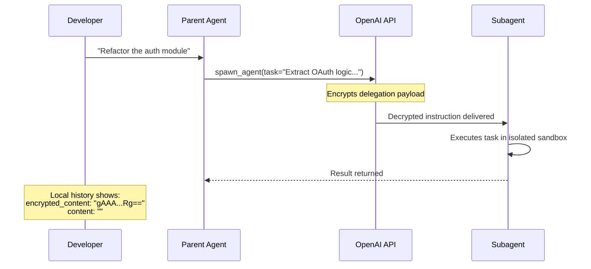
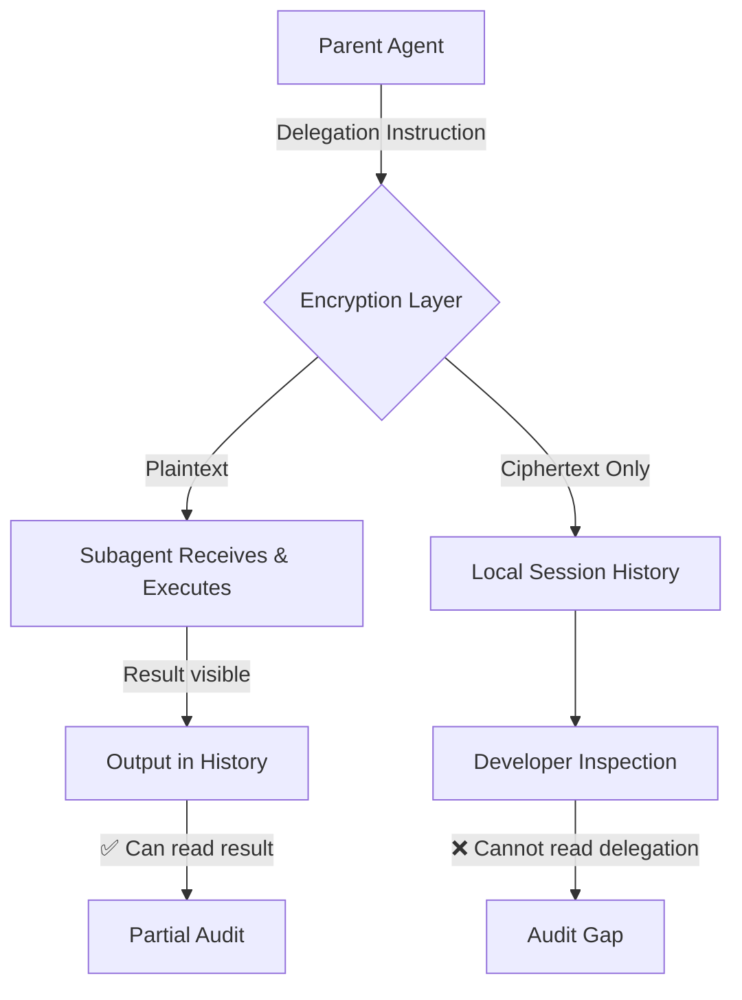

# Encrypted Subagent Delegation: What Codex CLI's MultiAgentV2 Opacity Means for Your Audit Trail


---

When Codex CLI 0.144.4 shipped on 14 July 2026, it bundled a model catalogue that quietly made GPT-5.6-Sol and GPT-5.6-Terra mandatory MultiAgentV2 users [^1]. The immediate consequence: every delegation instruction a parent agent sends to a subagent is now encrypted before it reaches local storage, and only OpenAI's servers hold the decryption key [^2]. If you have been relying on session history to understand *what* your agents delegate and *why*, that window just closed — unless you take deliberate countermeasures.

This article examines what changed, why it matters for enterprise audit requirements, and what practical options remain.

## What Changed

### The Encryption Mechanism

Pull request #26210, merged on 5 June 2026, introduced encryption for three inter-agent message types within the MultiAgentV2 protocol [^3]:

- **`spawn_agent`** — creating a new subagent with a task description
- **`send_message`** — ongoing communication between parent and child agents
- **`followup_task`** — continuation requests after partial completion

Previously, all three operations stored their payloads as plaintext in the local `InterAgentCommunication` record. After PR #26210, the `content` field is set to an empty string and the payload moves to `encrypted_content` — ciphertext that persists across history, rollouts, and compaction [^3].

A second change, PR #33030 (merged 14 July 2026), went further: it removed task content from the `list_agents` output entirely [^3].



### Which Models Are Affected

The encryption is tied to model-level configuration, not a global toggle [^2]:

| Model | Multi-Agent Version | Delegation Encrypted |
|-------|-------------------|---------------------|
| GPT-5.6-Sol | V2 (mandatory) | Yes |
| GPT-5.6-Terra | V2 (mandatory) | Yes |
| GPT-5.6-Luna | V1 | No |
| GPT-5.5 | V2 (forced) | Yes [^4] |

GPT-5.5 users discovered the encryption via a separate issue (#31097): the model forces MultiAgentV2 despite an explicit `disable` flag, and documented custom-agent controls stopped working [^4]. Luna, the smallest GPT-5.6 variant, remains on V1 with readable delegation payloads.

## Why This Matters

### The Audit Gap

Before this change, a developer could inspect any session's rollout files to reconstruct the full delegation chain: what the parent asked, what the subagent received, and how the work was divided. This was valuable for:

- **Debugging** — understanding why a subagent produced unexpected output
- **Compliance** — demonstrating that agent behaviour aligned with organisational policy
- **Cost attribution** — tracing token spend back to specific delegated tasks
- **Incident response** — reconstructing what happened when something went wrong

Now, the local record shows that a delegation *happened* but not *what was delegated* [^2]. The subagent's output remains readable, but the instruction that produced it is opaque.

### Enterprise Implications

For teams operating under regulatory frameworks that require audit trails of automated decision-making, encrypted delegation creates a gap. The session history proves an action occurred but cannot prove what instruction triggered it. Whether OpenAI's Compliance Platform retains plaintext copies for enterprise customers remains undisclosed [^3].



## The Suspected Motivation

OpenAI has not provided an official explanation [^2]. Community discussion on Hacker News (item 48905028) converged on **distillation prevention** as the primary driver: encrypted delegation payloads prevent competitors from training on OpenAI's internal reasoning traces and orchestration strategies [^2]. The timing aligns with reports of suspected distillation of GPT-5.5 reasoning patterns by third-party model providers [^2].

This framing positions the encryption as intellectual-property protection rather than a security feature — which explains why the change shipped without fanfare. From OpenAI's perspective, the delegation instructions contain proprietary orchestration logic. From the developer's perspective, they contain the context needed to understand and trust agent behaviour.

## Community Response and Proposed Fix

GitHub Issue #28058, opened on 13 June 2026, has accumulated 20+ thumbs-up reactions and remains open [^5]. The proposal is architecturally clean: **separate the transport envelope from the audit record**.

The suggested approach:

1. Keep the encrypted message field for model delivery (preserving whatever IP protection OpenAI seeks)
2. Add a separate, non-encrypted audit field containing the readable task text
3. Persist this audit field in rollout, history, and trace metadata
4. Apply the contract consistently across `spawn_agent`, `send_message`, and `followup_task`

A community fork has implemented this dual-field approach, demonstrating that the parent rollout can show readable text while the child model still receives only the encrypted delivery payload [^5].

## Practical Workarounds

Until OpenAI addresses Issue #28058, developers have several options depending on their tolerance for trade-offs.

### Option 1: Pin to Luna for Multi-Agent Workflows

GPT-5.6-Luna remains on V1 with unencrypted delegation. If your multi-agent workflows do not require Sol or Terra's reasoning depth, this is the simplest path:

```toml
# config.toml
model = "gpt-5.6-luna"
```

The trade-off is reduced reasoning capability — Luna is the smallest GPT-5.6 variant [^2].

### Option 2: Build Custom Orchestration via the App-Server RPC API

Rather than relying on Codex's built-in subagent spawning, you can orchestrate multiple Codex sessions externally. This bypasses MultiAgentV2 entirely:

```bash
# Parent session delegates via external orchestrator
codex --model gpt-5.6-sol \
  --prompt "Analyse the auth module and list extraction points" \
  --json > /tmp/analysis.json

# Second session receives the delegation as a direct prompt
codex --model gpt-5.6-sol \
  --prompt "$(jq -r '.recommendation' /tmp/analysis.json): Extract OAuth logic" \
  --json > /tmp/result.json
```

The delegation is now a file on your filesystem — fully auditable [^2].

### Option 3: PreToolUse Hook for Delegation Logging

If you want to continue using built-in subagents but capture delegation context before encryption, a PreToolUse hook can intercept `spawn_agent` calls:

```bash
#!/usr/bin/env bash
# hooks/pre-tool-use/log-delegation.sh
# Captures spawn_agent arguments before they reach the encryption layer

TOOL_NAME=$(echo "$1" | jq -r '.tool_name')

if [[ "$TOOL_NAME" == "spawn_agent" || "$TOOL_NAME" == "send_message" || "$TOOL_NAME" == "followup_task" ]]; then
  TIMESTAMP=$(date -u +"%Y-%m-%dT%H:%M:%SZ")
  echo "$1" | jq --arg ts "$TIMESTAMP" '{
    timestamp: $ts,
    tool: .tool_name,
    arguments: .arguments
  }' >> "$HOME/.codex/delegation-audit.jsonl"
fi

# Always approve — this is observation only
echo '{"decision": "approve"}'
```

⚠️ **Caveat**: Whether the hook receives the plaintext delegation content or the already-encrypted payload depends on when in the pipeline PreToolUse fires. This requires testing against your specific Codex CLI version and may not work if encryption occurs before hook invocation.

### Option 4: PostToolUse Logging of Subagent Results

Even without the delegation instruction, you can capture what subagents *produced*. Combined with the parent's original prompt, this often provides sufficient context for audit:

```bash
#!/usr/bin/env bash
# hooks/post-tool-use/log-subagent-result.sh

TOOL_NAME=$(echo "$1" | jq -r '.tool_name')

if [[ "$TOOL_NAME" == "spawn_agent" ]]; then
  TIMESTAMP=$(date -u +"%Y-%m-%dT%H:%M:%SZ")
  echo "$1" | jq --arg ts "$TIMESTAMP" '{
    timestamp: $ts,
    tool: .tool_name,
    result_summary: .result | tostring | .[0:2000]
  }' >> "$HOME/.codex/subagent-results.jsonl"
fi

echo '{"decision": "approve"}'
```

### Option 5: Fleet Enforcement via requirements.toml

For enterprise teams that need to prevent encrypted delegation entirely, `requirements.toml` can restrict which models and permission profiles are available [^6]:

```toml
# requirements.toml — block V2-only models
allowed_models = ["gpt-5.6-luna", "gpt-5.5-mini"]
```

This is a blunt instrument but guarantees no encrypted delegation reaches your fleet.

## The Broader Pattern

This is not the first time a coding agent platform has restricted observability in the name of IP protection. The tension between *provider-side model protection* and *user-side auditability* is structural and will recur as multi-agent orchestration becomes more sophisticated.

The pragmatic response is to treat agent delegation like any other external API call: log inputs and outputs at your boundary, do not depend on the provider's internal state for your audit trail, and design your workflows so that critical decisions are observable from the outside.

For Codex CLI specifically, the combination of external orchestration (Option 2), hook-based logging (Options 3–4), and fleet-level model restrictions (Option 5) provides a defence-in-depth approach that does not depend on OpenAI restoring plaintext delegation records.

## Key Takeaways

1. **PR #26210 encrypts all delegation payloads** for MultiAgentV2 models (Sol, Terra, and forcibly GPT-5.5), removing readable task descriptions from local session history
2. **The audit gap is real**: you can see that delegation happened and what it produced, but not what was asked
3. **Luna remains unencrypted** on V1 and is the simplest workaround for teams that need full observability
4. **Issue #28058 proposes a dual-field solution** — encrypted transport plus plaintext audit — and has community traction but no OpenAI response yet
5. **Hook-based logging and external orchestration** can restore partial or full auditability at the cost of additional workflow complexity

---

## Citations

[^1]: OpenAI, "Codex CLI v0.144.4 Release," GitHub Releases, 14 July 2026. [https://github.com/openai/codex/releases](https://github.com/openai/codex/releases)

[^2]: The Decoder, "OpenAI's Codex now encrypts instructions between AI agents, leaving developers blind to internal delegation," 15 July 2026. [https://the-decoder.com/openais-codex-now-encrypts-instructions-between-ai-agents-leaving-developers-blind-to-internal-delegation/](https://the-decoder.com/openais-codex-now-encrypts-instructions-between-ai-agents-leaving-developers-blind-to-internal-delegation/)

[^3]: XenoSpectrum, "OpenAI Codex Encrypts Sub-Agent Instructions, Delegation Content Vanishes from Local Audit," 15 July 2026. [https://xenospectrum.com/en/openai-codex-multiagent-encrypted-instructions-auditability/](https://xenospectrum.com/en/openai-codex-multiagent-encrypted-instructions-auditability/)

[^4]: GitHub Issue #31097, "[CLI] GPT-5.5 forces MultiAgentV2 despite disable and hides documented custom-agent controls," openai/codex. [https://github.com/openai/codex/issues/31097](https://github.com/openai/codex/issues/31097)

[^5]: GitHub Issue #28058, "Regression: encrypted MultiAgentV2 messages remove readable task audit trail," openai/codex, opened 13 June 2026. [https://github.com/openai/codex/issues/28058](https://github.com/openai/codex/issues/28058)

[^6]: Developers Digest, "Codex Now Encrypts Multi-Agent Prompts, Breaking Local Auditability," July 2026. [https://www.developersdigest.tech/blog/codex-encrypts-multi-agent-prompts](https://www.developersdigest.tech/blog/codex-encrypts-multi-agent-prompts)
