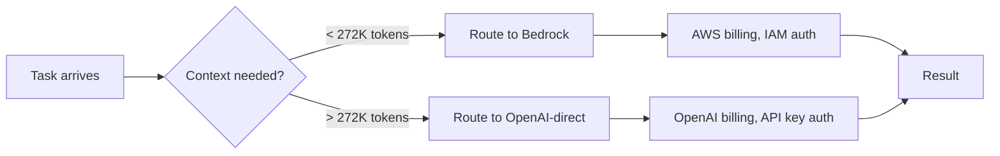

# GPT-5.6 on Amazon Bedrock: Configuring Codex CLI for Multi-Cloud Model Access with Sol, Terra, and Luna


---

On 13 July 2026, AWS made all three GPT-5.6 tiers — Sol, Terra, and Luna — generally available on Amazon Bedrock via the new `bedrock-mantle` endpoint [^1]. For Codex CLI users, this changes the multi-cloud calculus: you can now route the same model family through AWS infrastructure, apply IAM-based access controls, consolidate billing against an existing AWS commitment, and take advantage of Bedrock's 90% prompt-cache discount — all without leaving your existing `config.toml` workflow.

This article walks through the practical configuration, compares the Bedrock surface with OpenAI-direct, and maps the GPT-5.6 tiers to Codex CLI profile patterns that enterprise teams can deploy today.

## Why Bedrock Matters for Codex CLI

Running GPT-5.6 through Bedrock is not simply "the same model on different infrastructure." Three differences matter at the practitioner level:

1. **Context window divergence.** OpenAI-direct exposes the full 1.05M-token context window [^2]. Bedrock currently serves 272K tokens [^3]. If your workflow depends on large-context ingestion — full-repository indexing, long rollout histories — this cap is a hard constraint you must plan around.

2. **Billing consolidation.** Bedrock usage counts towards existing AWS spend commitments (EDPs, credits, reserved capacity) [^4]. For organisations already committed to AWS, this can represent significant savings compared to a separate OpenAI contract.

3. **IAM-native authentication.** Codex CLI supports both Bedrock API keys (`AWS_BEARER_TOKEN_BEDROCK`) and the full AWS SDK credential chain (IAM roles, SSO, instance profiles) [^5]. This means no separate OpenAI API key management — your existing AWS identity infrastructure handles access control.

## The GPT-5.6 Tier Map on Bedrock

| Tier | Bedrock Model ID | Context (Bedrock) | Input / 1M tokens | Output / 1M tokens | Cached Input / 1M tokens | Reasoning Effort |
|------|-------------------|--------------------|--------------------|---------------------|--------------------------|------------------|
| Sol | `openai.gpt-5.6-sol` | 272K | \$5.00 | \$30.00 | \$0.50 | none → max (7 levels) |
| Terra | `openai.gpt-5.6-terra` | 272K | \$2.50 | \$15.00 | \$0.25 | none → xhigh |
| Luna | `openai.gpt-5.6-luna` | 272K | \$1.00 | \$6.00 | \$0.10 | none → high |

**Regions available at GA:** us-east-1 (N. Virginia), us-east-2 (Ohio) for all tiers; us-west-2 (Oregon) for Terra and Luna [^3] [^6].

Note that Sol on Bedrock introduces `max` reasoning effort — a seventh level above `xhigh` that gives the model more compute to explore alternatives, run internal checks, and revise its approach [^7]. This is exclusive to Sol and is the only tier where `max` is available.

## Codex CLI Configuration

### Basic Setup: Single Provider

Add the Bedrock provider to `~/.codex/config.toml`:

```toml
model = "openai.gpt-5.6-terra"
model_provider = "amazon-bedrock"

[model_providers.amazon-bedrock]
base_url = "https://bedrock-mantle.us-east-1.api.aws/openai/v1"
env_key = "AWS_BEARER_TOKEN_BEDROCK"
wire_api = "responses"
```

The `wire_api = "responses"` setting is mandatory — Bedrock's GPT-5.6 is available exclusively on the Responses API path (`openai/v1/responses`), not Chat Completions or Converse [^3].

### IAM Credential Chain Authentication

For teams using AWS SSO, instance profiles, or IAM roles, omit `env_key` and let Codex CLI fall back to the AWS SDK credential chain:

```toml
model = "openai.gpt-5.6-terra"
model_provider = "amazon-bedrock"

[model_providers.amazon-bedrock]
base_url = "https://bedrock-mantle.us-east-1.api.aws/openai/v1"
wire_api = "responses"

[model_providers.amazon-bedrock.aws]
region = "us-east-1"
```

Codex CLI checks authentication in order: `AWS_BEARER_TOKEN_BEDROCK` first, then the SDK chain [^5]. This means you can use temporary credentials from `aws sso login` or EC2 instance metadata without any additional configuration.

### Profile-Based Multi-Provider Routing

The real power emerges when you pair Bedrock with OpenAI-direct using Codex CLI profiles. Create `~/.codex/bedrock.config.toml`:

```toml
model = "openai.gpt-5.6-terra"
model_provider = "amazon-bedrock"

[model_providers.amazon-bedrock]
base_url = "https://bedrock-mantle.us-east-1.api.aws/openai/v1"
env_key = "AWS_BEARER_TOKEN_BEDROCK"
wire_api = "responses"
```

And `~/.codex/openai-sol.config.toml` for heavy reasoning tasks:

```toml
model = "gpt-5.6-sol"
reasoning_effort = "max"
```

Then switch at invocation:

```bash
# Day-to-day development — Bedrock billing, Terra cost profile
codex --profile bedrock "refactor the authentication module"

# Complex architectural review — OpenAI-direct, Sol with max reasoning
codex --profile openai-sol "review the migration plan for correctness"
```

This pattern routes routine work through AWS billing while reserving OpenAI-direct Sol (with its full 1.05M context window) for tasks that demand it.

## Prompt Caching: The 90% Discount

Bedrock's prompt caching uses explicit cache breakpoints, similar to OpenAI's native caching but with Bedrock-specific pricing [^1]:

- Cached input is billed at a **90% discount** from standard input pricing
- Cache entries remain available for reuse for at least 30 minutes
- Cache writes carry a small premium (Sol: \$6.25/1M tokens)

For Codex CLI sessions, where system prompts (AGENTS.md content, project documentation) remain stable across turns, this discount compounds quickly. A typical session with a 50K-token system prompt that runs 20 turns saves roughly:

```
Without caching: 20 × 50K × $5.00/1M = $5.00
With caching:    1 × 50K × $6.25/1M + 19 × 50K × $0.50/1M = $0.79
Saving: ~84%
```

⚠️ The exact caching behaviour depends on Bedrock's cache-hit logic and may vary by request pattern. These figures use Bedrock's published rates for Sol.

## The 272K Context Constraint

The most significant difference between Bedrock and OpenAI-direct is the context window: 272K versus 1.05M tokens [^2] [^3]. This has practical implications for Codex CLI workflows:



Workflows that stay within the 272K boundary — most single-file refactors, test generation, code review on focused diffs — route comfortably through Bedrock. Workflows that need full-repository context, long conversation histories, or large AGENTS.md hierarchies should fall back to OpenAI-direct.

You can encode this routing logic in AGENTS.md:

```markdown
## Model Routing Policy

- Default provider: `amazon-bedrock` (Terra)
- Escalate to OpenAI-direct Sol for:
  - Architectural reviews spanning > 5 files
  - Context windows exceeding 200K tokens
  - Tasks requiring `max` reasoning effort with full context
```

## Enterprise Deployment with requirements.toml

Fleet administrators can enforce Bedrock-only access via `requirements.toml`:

```toml
[model_providers]
allowed = ["amazon-bedrock"]

[model_providers.amazon-bedrock]
base_url = "https://bedrock-mantle.us-east-1.api.aws/openai/v1"
wire_api = "responses"

[model_providers.amazon-bedrock.aws]
region = "us-east-1"
```

This locks every developer's Codex CLI to Bedrock-routed models, ensuring all inference traffic flows through AWS and appears on the consolidated bill. Combined with IAM policies that restrict which Bedrock model IDs are accessible, an administrator can enforce a "Terra-only for junior developers, Sol for tech leads" policy without touching individual workstations [^8].

## Bedrock Service Tiers

At GA, GPT-5.6 on Bedrock supports only the **Standard** tier — pay-per-token with no commitment [^3]. Priority, Flex, and Reserved tiers are not yet available for these models. Teams expecting high-volume usage should monitor AWS announcements for tier expansion, as Priority and Reserved can significantly reduce per-token costs for sustained workloads.

## What Bedrock Does Not Support (Yet)

Several features available on OpenAI-direct are absent from the Bedrock surface:

- **Audio input/output** — not supported on Bedrock [^3]
- **Image generation** — output modality is text-only; image input (vision) is supported [^3]
- **Chat Completions API** — only the Responses API is available via `bedrock-mantle` [^3]
- **Converse API** — not supported for GPT-5.6 models [^3]
- **Geo and Global cross-region inference** — Sol is limited to us-east-1 and us-east-2 [^3]

These constraints mean Codex CLI's image generation workflows (GPT-Image-2 integration) and any MCP tools that depend on Chat Completions will not function through the Bedrock provider.

## Practical Recommendation

For most enterprise Codex CLI deployments, the optimal configuration is:

1. **Default to Bedrock Terra** — covers 80%+ of daily development work, consolidates billing, uses IAM auth
2. **Profile for OpenAI-direct Sol** — reserved for complex tasks needing full 1.05M context or `max` reasoning
3. **Luna on Bedrock for subagent delegation** — fast, cheap, ideal for classification, test generation, and boilerplate tasks
4. **Monitor the 272K boundary** — set `project_doc_max_bytes` conservatively and track context usage via `/usage`

As Bedrock expands regional availability and context window support, the gap between direct and Bedrock access will narrow. For now, the profile-based routing pattern gives you the best of both worlds.

## Citations

[^1]: AWS Machine Learning Blog, "OpenAI GPT-5.6 Sol, Terra, and Luna are now generally available on Amazon Bedrock," 13 July 2026. [https://aws.amazon.com/blogs/machine-learning/openai-gpt-5-6-sol-terra-and-luna-are-now-generally-available-on-amazon-bedrock/](https://aws.amazon.com/blogs/machine-learning/openai-gpt-5-6-sol-terra-and-luna-are-now-generally-available-on-amazon-bedrock/)

[^2]: OpenAI, "GPT-5.6: Frontier intelligence that scales with your ambition," July 2026. [https://openai.com/index/gpt-5-6/](https://openai.com/index/gpt-5-6/)

[^3]: AWS Documentation, "GPT-5.6 Sol — Amazon Bedrock Model Card," July 2026. [https://docs.aws.amazon.com/bedrock/latest/userguide/model-card-openai-gpt-56-sol.html](https://docs.aws.amazon.com/bedrock/latest/userguide/model-card-openai-gpt-56-sol.html)

[^4]: AWS, "OpenAI GPT-5.6 Sol, Terra, and Luna now generally available on Amazon Bedrock," 13 July 2026. [https://aws.amazon.com/about-aws/whats-new/2026/07/openai-gpt-sol-terra/](https://aws.amazon.com/about-aws/whats-new/2026/07/openai-gpt-sol-terra/)

[^5]: OpenAI Help Centre, "Configure Codex with Amazon Bedrock," 2026. [https://help.openai.com/en/articles/20001253-configure-codex-with-amazon-bedrock](https://help.openai.com/en/articles/20001253-configure-codex-with-amazon-bedrock)

[^6]: AWS Documentation, "GPT-5.6 Terra — Amazon Bedrock Model Card," July 2026. [https://docs.aws.amazon.com/bedrock/latest/userguide/model-card-openai-gpt-56-terra.html](https://docs.aws.amazon.com/bedrock/latest/userguide/model-card-openai-gpt-56-terra.html)

[^7]: DevelopersIO, "I tried out the newly supported OpenAI GPT-5.6 Sol / Terra / Luna on Amazon Bedrock," July 2026. [https://dev.classmethod.jp/en/articles/bedrock-openai-gpt56-sol-terra-luna/](https://dev.classmethod.jp/en/articles/bedrock-openai-gpt56-sol-terra-luna/)

[^8]: Codex CLI Documentation, "Advanced Configuration — Model Providers," 2026. [https://developers.openai.com/codex/config-advanced](https://developers.openai.com/codex/config-advanced)
