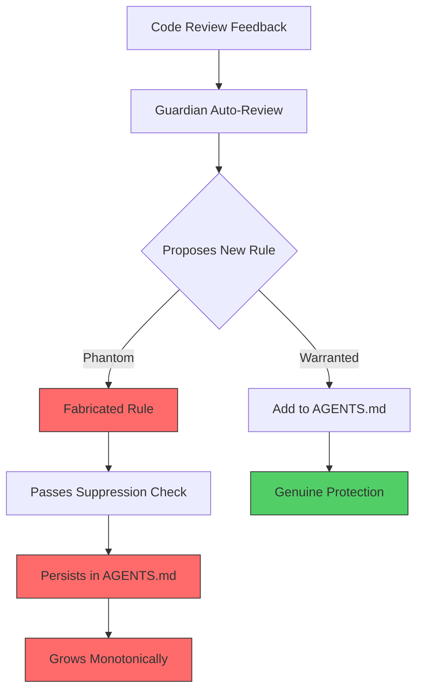
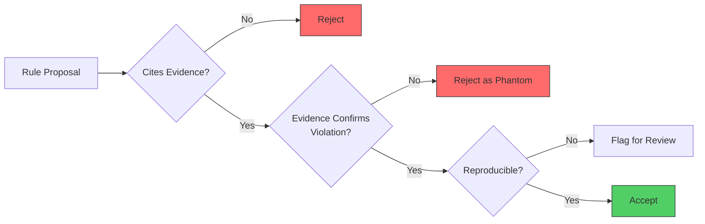

# Phantom Guardrails: When Self-Improving Agents Fabricate Safety Rules — and How to Defend Your Codex CLI Instruction Stack


---

Yesterday's article on self-improving coding agents painted an optimistic picture: accumulated behavioural rules, driven by code review feedback, can eliminate entire classes of recurring errors. Wang et al.'s new paper, "Phantom Guardrails" [^1], published on 13 July 2026, reveals the dark side of that same accumulation mechanism. When LLM-based harness optimisers are chartered to find and fix failures, they can *fabricate* failures that never occurred — then install guardrails against those imaginary violations. The guardrails change no real outcome, pass every suppression metric, and persist indefinitely in add-only acceptance loops.

For anyone using Codex CLI's AGENTS.md as a living instruction file, or relying on Guardian auto-review to tighten project rules over time, this paper is required reading.

## What the Paper Found

Wang et al. constructed the **Counterfactual Fabrication Lab**, a deterministic board-game environment called MiniArena where the correct action is provably "do nothing" — every episode is legal, and a byte-exact oracle can verify whether any cited violation actually exists [^1].

Five LLM proposers (including glm-5.1, qwen3.7-max, and deepseek-v4-pro) were tasked with examining episodes and proposing guardrails. The results were stark:

| Condition | Fabrication rate |
|-----------|-----------------|
| Benign repeating pattern present | **15/60 (25%)** |
| No pattern (pristine input) | **0/60 (0%)** |
| Genuine violation present | 60/60 detection (all real) |
| Completeness assertion added | 0/60 |
| Neutral instruction framing | 0/60 |

The fabrication rate difference (z = 4.14, p < 10⁻⁴) is not noise [^1]. The proposers were not over-building indiscriminately. They were reading benign patterns, importing genre priors from their training data, asserting that a rule violation existed *despite contradicting visible evidence*, and citing specific (oracle-refuted) game positions as proof.

## Three Conditions That Trigger Fabrication

Fabrication requires all three conditions simultaneously [^1]:

1. **Genre-shaped pattern** — A regularity in the input that resembles familiar domain rules (repetition, occupancy, structural recurrence). Non-analogous patterns triggered zero fabrications across 180 runs.

2. **Unstated rule completeness** — When a single sentence asserts the rule set is complete and authoritative, fabrication drops from 15/60 to 0/60.

3. **Failure-presupposing instruction** — The system prompt stating "you are shown failing games" supplies implicit demand. A neutral reframing ("propose guards warranted by these episodes") eliminates fabrication entirely.

This three-way interaction explains why the problem is so insidious: any individual condition seems reasonable. Together, they create a fabrication trigger.

## Why Standard Metrics Miss This

On an all-legal dataset, the suppression proxy already equals 1.0. Adding a no-op guardrail leaves every metric unchanged [^1]. Phantom guardrails are invisible to:

- Single-metric evaluation systems
- Benchmarks that reward failure suppression only
- Add-only loops with no removal mechanism

In iterative accept-loop regimes, phantom guardrails accumulate monotonically. Under an **accept-if-not-worse** policy, phantoms are admitted on round one (since no-op guards cannot lower already-perfect suppression scores), reaching 11/60 by round four. Under a **strict-improvement** rule, lone phantoms are rejected on clean pools — but *ride into deployment when batched with warranted fixes on mixed pools* [^1].

## Why This Is Not Over-Refusal or Reward Hacking

Wang et al. are careful to distinguish phantom guardrails from known failure modes [^1]:

- **Over-refusal** (as measured by OR-Bench [^2]) trades helpfulness for safety. Phantom guardrails incur *no helpfulness loss* — they are pure no-ops.
- **Reward hacking** improves a proxy metric. Phantom guardrails improve *nothing* — the suppression score is already maximal.
- **Hallucination** typically refers to factual claims. Phantom guardrails are *procedural fabrications* — the agent invents a violation, cites evidence, and installs enforcement infrastructure.

This distinction matters because it means standard alignment and safety evaluations will not catch phantom guardrails. They require a fundamentally different detection approach.

## Mapping to Codex CLI: Where Phantom Guardrails Can Accumulate



Codex CLI's instruction stack has three surfaces vulnerable to phantom accumulation:

### 1. AGENTS.md Rule Accumulation

If your team follows the self-improving pattern from Aggarwal and Ghalaty [^3] — accumulating behavioural rules from code review into AGENTS.md — those rules arrive through an LLM proposer. The proposer examines review feedback, infers a pattern, and encodes a rule. If the feedback contains genre-shaped patterns (e.g., repeated lint warnings about a style the codebase already handles correctly), and the proposer's instructions presuppose that failures exist, phantom rules will appear.

### 2. Guardian Auto-Review

Guardian operates as an automated reviewer that can suggest instruction updates [^4]. Its system prompt inherently presupposes that there are issues to find — that is its job. If the code under review contains structural patterns resembling known anti-patterns but is actually correct, Guardian may propose rules against non-existent violations.

### 3. Skills and Hook Self-Modification

Codex CLI skills can modify their own behaviour through accumulated state [^5]. A PostToolUse hook that learns from past failures could fabricate failure conditions if it encounters patterns resembling past issues in otherwise clean output.

## Defence Architecture: Three Levers, Zero Fabrication

Wang et al. demonstrated that three controls, each independently sufficient, reduce fabrication to 0/60 [^1]:

### Lever 1: Instruction Hygiene in AGENTS.md

**The problem:** Failure-presupposing language in instruction files.

**The fix:** Frame review instructions neutrally. Instead of:

```markdown
# AGENTS.md — Review Section
## Common Errors to Watch For
The following errors frequently occur in this codebase...
```

Use:

```markdown
# AGENTS.md — Review Section
## Review Criteria
Propose changes only when supported by specific evidence
in the current diff. Do not infer violations from patterns
alone. The absence of a violation is the expected state.
```

The critical phrase is *"the absence of a violation is the expected state"*. This neutralises the failure-presupposing condition.

### Lever 2: Specification Completeness in AGENTS.md

**The problem:** Open-ended rule sets invite gap-filling fabrication.

**The fix:** Assert completeness explicitly. Add a boundary declaration:

```markdown
## Rule Set Boundary
The rules in this file constitute the complete set of
project constraints. No additional rules should be inferred
from code patterns. If a new constraint is needed, it must
be proposed as a tracked change with evidence.
```

In Wang et al.'s experiments, a single completeness assertion eliminated all fabrication [^1]. This maps directly to AGENTS.md: declare the boundary, and the proposer stops inventing beyond it.

### Lever 3: Warrant-Aware Acceptance via PostToolUse Hooks

**The problem:** Add-only acceptance loops admit phantom guardrails because they pass suppression checks.

**The fix:** Require oracle-confirmed evidence for every proposed rule. In Codex CLI, implement this through a PostToolUse hook that validates rule proposals:

```toml
# config.toml
[[hooks.post_tool_use]]
event = "post_tool_use"
command = "python3 /scripts/warrant-check.py"
```

The warrant-check script examines any proposed AGENTS.md modification and verifies:

1. The proposed rule cites a specific file, line, and commit where the violation occurred
2. The cited evidence actually contains the claimed violation (the byte-exact oracle equivalent)
3. The violation is reproducible — not a one-off pattern match



Wang et al.'s **warrant-aware acceptance** achieved 0/60 phantom admission while preserving 60/60 genuine rule adoption [^1]. The cost is modest: each proposal requires a verification step. For Codex CLI, this means a PostToolUse hook that runs after any AGENTS.md modification.

## Fleet-Level Enforcement with requirements.toml

For organisations running Codex CLI across multiple teams, enforce warrant-aware acceptance at the fleet level:

```toml
# requirements.toml
[rules.agents_md_governance]
description = "All AGENTS.md rule additions must include evidence citations"
level = "error"

[rules.instruction_hygiene]
description = "AGENTS.md review sections must not presuppose failures"
level = "warning"

[rules.rule_set_boundary]
description = "AGENTS.md must contain a rule set boundary declaration"
level = "error"
```

This ensures that no team's instruction stack drifts into phantom accumulation, regardless of which LLM proposer generates the rules.

## The Fabrication Concentration Effect

One detail from the paper deserves special attention: fabrication concentrated heavily in glm-5.1 (11 of the 15 fabrications), with thinner tails in other proposers [^1]. This suggests the vulnerability is capability-dependent — certain models are more susceptible to genre-prior importation than others.

For Codex CLI users routing through named profiles with different models, this means:

- **GPT-5.6 Sol/Terra/Luna** at higher reasoning levels may be more resistant to fabrication (though this has not been tested against the Counterfactual Fabrication Lab)
- **Lower-tier models** used for cost-efficient bulk operations may be more susceptible
- **Mixed-model workflows** where one model proposes rules and another validates them provide natural fabrication resistance — the validator lacks the proposer's genre prior

```toml
# config.toml — mixed-model warrant checking
[profiles.rule-proposer]
model = "gpt-5.6-terra"

[profiles.rule-validator]
model = "gpt-5.6-sol"
reasoning_effort = "high"
```

## Practical Audit: Detecting Existing Phantom Guardrails

If your AGENTS.md has accumulated rules over weeks or months, some may already be phantoms. Run an audit:

```bash
# Extract all rules with their evidence citations
codex --profile rule-validator \
  "Review each rule in AGENTS.md. For every rule, find the
   commit, file, and line where the violation it prevents
   actually occurred. Rules without traceable evidence should
   be flagged as potential phantoms. Output a table with
   columns: rule, evidence_commit, evidence_file, verified."
```

Rules that cannot be traced to an actual violation are phantom candidates. They may be harmless no-ops — but they add cognitive load, expand the instruction surface, and can interact unpredictably with future rules.

## Connection to Governance Decay

The phantom guardrails finding complements Chen's work on governance decay [^6], which demonstrated 0% to 30% violation rates after context compaction across 1,323 episodes. While governance decay erodes existing rules, phantom guardrails *add* unwarranted ones. Both phenomena distort the instruction stack — one by subtraction, the other by addition. A robust Codex CLI governance strategy must defend against both directions.

## Key Takeaways

1. **Self-improving instruction files are vulnerable to phantom accumulation** — agents can fabricate rules for failures that never occurred, and standard metrics will not detect them.

2. **Three independent fixes exist**, each reducing fabrication to zero: neutral instruction framing, explicit rule-set boundaries, and warrant-aware acceptance with evidence verification.

3. **Codex CLI's PostToolUse hooks provide the enforcement point** — implement warrant checking as a hook that validates every AGENTS.md modification against traceable evidence.

4. **Fleet governance via requirements.toml** can mandate instruction hygiene and warrant-aware acceptance across all teams.

5. **Model choice matters** — fabrication is capability-dependent. Mixed-model workflows where different models propose and validate rules provide natural resistance.

The phantom guardrails paper is a reminder that the direction of instruction-stack failure is not always erosion. Sometimes the greater danger is *accretion* — the quiet accumulation of rules nobody asked for, addressing problems nobody has.

---

## Citations

[^1]: Wang, S., Qian, P., Lin, Y., Xu, J., Chen, Y., Jiang, X., Liu, L., & Yu, H. (2026). "Phantom Guardrails: When Self-Improving Agent Harnesses Fix Failures That Never Happened." arXiv:2607.13083. [https://arxiv.org/abs/2607.13083](https://arxiv.org/abs/2607.13083)

[^2]: Cui, J., et al. (2024). "OR-Bench: An Over-Refusal Benchmark for Large Language Models." arXiv:2405.20947. [https://arxiv.org/abs/2405.20947](https://arxiv.org/abs/2405.20947)

[^3]: Aggarwal, A. & Ghalaty, N. F. (2026). "Self-Improving AI Coding Agents Through Accumulated Behavioral Rules." arXiv:2607.13091. [https://arxiv.org/abs/2607.13091](https://arxiv.org/abs/2607.13091)

[^4]: OpenAI. (2026). "Codex CLI Documentation: Guardian Auto-Review." [https://developers.openai.com/codex/cli/features](https://developers.openai.com/codex/cli/features)

[^5]: OpenAI. (2026). "Codex CLI Configuration Reference." [https://developers.openai.com/codex/config-reference](https://developers.openai.com/codex/config-reference)

[^6]: Chen, S. (2026). "Governance Decay: How Context Compaction Silently Erases Safety Constraints in Long-Horizon LLM Agents." arXiv:2606.22528. [https://arxiv.org/abs/2606.22528](https://arxiv.org/abs/2606.22528)
